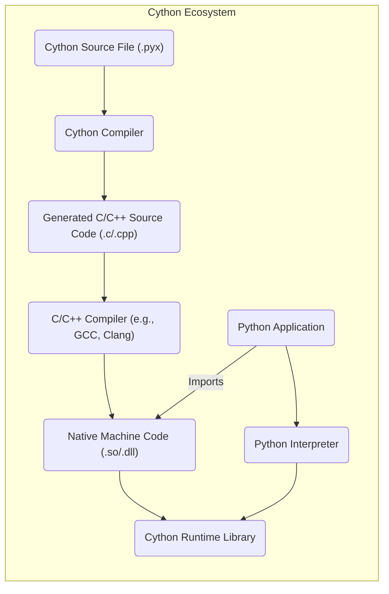
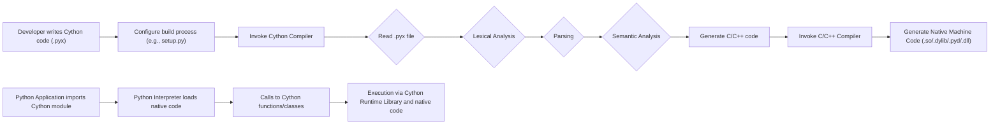

## Project Design Document: Cython (Improved)

**1. Introduction**

This document provides a detailed design overview of the Cython project. It outlines the architecture, key components, data flow, and security considerations relevant for understanding the system and subsequently performing threat modeling. This document aims to be comprehensive yet clear, facilitating a thorough understanding of Cython's inner workings.

**2. Project Overview**

Cython is a programming language that aims to be a superset of the Python language, designed to give C-like performance with code that is written mostly in Python. It achieves this by compiling Python-like code into optimized C or C++ code, which can then be compiled into native machine code. Cython is widely used to write C extensions for Python, improving the performance of Python code, especially for computationally intensive tasks.

**3. Goals and Objectives**

* **Primary Goal:** Enable writing high-performance Python extensions using a Python-like syntax.
* **Key Objectives:**
    * Provide a language that is largely compatible with standard Python.
    * Generate efficient C/C++ code from Cython source files (`.pyx`).
    * Facilitate seamless integration with existing Python code and libraries.
    * Offer mechanisms for interacting with native C/C++ libraries.
    * Maintain a robust and well-tested compiler and runtime environment.

**4. Architecture and Components**

The Cython project can be broadly divided into the following key components:

* **"Cython Compiler":** The core component responsible for parsing Cython source code (`.pyx` files) and generating equivalent C or C++ source code. This involves lexical analysis, parsing, semantic analysis, and code generation.
* **"Cython Language":** The specific syntax and semantics of the Cython language, which extends standard Python with static typing, declarations of C data types, and other features for performance optimization.
* **"Cython Runtime Library":** A set of C/C++ functions and data structures that support the execution of Cython-generated code. This library handles tasks like memory management for Cython objects, type conversions between Python and C types, exception handling, and interaction with the Python interpreter's C API.
* **"Setup Tools Integration":** Mechanisms and utilities, often leveraging the `setuptools` library in Python, to seamlessly integrate Cython compilation into the standard Python build process using `setup.py` or similar configuration files (e.g., `pyproject.toml`). This simplifies the process of building and distributing Python packages that include Cython code.
* **"Command-Line Interface (CLI)":** The `cython` command-line tool provides a direct interface to invoke the compiler with various options, allowing for manual compilation of `.pyx` files and management of Cython projects.

**5. Data Flow**

The typical data flow within the Cython compilation and execution process is as follows:

* **Development:**
    * A developer writes Cython code in `.pyx` files, leveraging Cython's extended syntax for performance.
    * The developer configures the build process, typically using a `setup.py` file that specifies how to compile the Cython code.
* **Compilation:**
    * The **"Cython Compiler"** is invoked, either directly via the CLI or as part of the package installation process.
    * The compiler reads the `.pyx` file.
    * The compiler performs lexical analysis to break the code into tokens.
    * The compiler parses the tokens to build an Abstract Syntax Tree (AST) representing the code structure.
    * The compiler performs semantic analysis, including type checking and resolving symbols.
    * The compiler generates equivalent, optimized C or C++ source code.
* **C/C++ Compilation:**
    * A standard C/C++ compiler (e.g., GCC, Clang, MSVC) is invoked by the build process.
    * The C/C++ compiler compiles the generated C/C++ code.
    * This compilation process produces native machine code (e.g., a shared library `.so` on Linux, `.dylib` on macOS, or a `.pyd` or `.dll` on Windows).
* **Execution:**
    * A Python application imports the compiled Cython module, just like any other Python module.
    * The Python interpreter loads the native machine code.
    * When the Python code calls functions or classes defined in the Cython module, the execution is handed off to the **"Cython Runtime Library"** and the native machine code, resulting in faster execution.

**6. Security Considerations**

Several security aspects are relevant to the Cython project. These can be categorized to better understand potential threats and mitigation strategies.

* **Compilation Phase Security:**

    * **Input Validation of `.pyx` Files:** The Cython compiler must robustly handle potentially malicious or malformed `.pyx` files to prevent vulnerabilities like:
        * **Compiler Crashes:** Crafted input could exploit parsing or semantic analysis bugs, leading to denial of service.
        * **Code Injection (Indirect):** While direct code injection into the compiler is less likely, vulnerabilities could lead to the generation of malicious C/C++ code.
    * **Secure Code Generation:** Bugs in the Cython compiler's code generation logic could lead to the creation of unsafe C/C++ code, introducing vulnerabilities in the compiled extensions:
        * **Buffer Overflows:** Incorrectly calculated buffer sizes in generated code.
        * **Format String Bugs:**  Improper handling of string formatting in generated C/C++ code.
        * **Memory Leaks:** Failure to properly manage memory in the generated code.

* **Runtime Environment Security:**

    * **Cython Runtime Library Vulnerabilities:** Bugs within the Cython runtime library itself can introduce security flaws:
        * **Memory Corruption:** Vulnerabilities in memory management routines.
        * **Type Confusion:** Errors in handling type conversions between Python and C types.
        * **Information Disclosure:**  Unintended exposure of sensitive data.
    * **Interaction with Native Code:** Cython's ability to interface with external C/C++ libraries introduces risks:
        * **Vulnerabilities in External Libraries:** Security flaws in linked C/C++ libraries can be exploited through Cython wrappers.
        * **Incorrect Usage of Native APIs:**  Improperly written Cython code interacting with native APIs can introduce vulnerabilities.

* **Supply Chain Security:**

    * **Compromised Distribution:**  Malicious actors could attempt to distribute tampered versions of Cython.
    * **Dependency Vulnerabilities:**  Cython relies on other Python packages and the C/C++ compiler toolchain. Vulnerabilities in these dependencies could indirectly affect Cython's security.

* **Developer Practices:**

    * **Insecure Coding Practices in `.pyx` Files:** Developers writing Cython code can introduce vulnerabilities:
        * **Incorrect Memory Management:** Manual memory management in Cython (using `malloc`, `free`, etc.) can lead to errors.
        * **Unsafe Interactions with C/C++:**  Improperly handling pointers or data passed to C/C++ functions.
        * **Lack of Input Validation:**  Failing to validate data received from Python or external sources within Cython code.

**7. Deployment and Integration**

Cython is typically deployed and integrated into Python projects in the following ways:

* **As a Build Dependency:** Projects that utilize Cython list it as a build dependency in their `setup.py`, `pyproject.toml`, or similar build configuration files. This ensures that Cython is available during the package installation process.
* **Compilation during Package Installation:** When a Python package containing Cython code is installed using `pip` or other package managers, the Cython compiler is automatically invoked as part of the installation process. This generates the necessary C/C++ code and compiles it into a shared library or extension module.
* **Direct Invocation of the Compiler:** Developers can directly use the `cython` command-line tool to compile individual `.pyx` files into C/C++ source code. This is useful for development and testing.
* **Integration with Build Systems:** Cython can be integrated with more complex build systems like CMake, Meson, or SCons, providing greater control over the build process and dependency management.

**8. Future Considerations**

* **Improved Static Analysis:** Enhancing the Cython compiler with more sophisticated static analysis capabilities could help detect potential security vulnerabilities in `.pyx` code and during code generation, before runtime.
* **Memory Safety Features:** Exploring ways to incorporate more memory safety features, potentially leveraging modern C++ features (if targeting C++ output) or exploring integration with memory safety tools.
* **Formal Verification:** Investigating the feasibility of applying formal verification techniques to critical parts of the Cython compiler and runtime library to provide stronger guarantees about their correctness and security.
* **Enhanced Security Documentation and Best Practices:** Providing more comprehensive documentation and guidelines for developers on writing secure Cython code, including common pitfalls and secure coding patterns.
* **Address Supply Chain Risks:**  Strengthening processes for verifying the integrity of Cython releases and dependencies.

This improved document provides a more detailed and structured understanding of the Cython project's design, which is essential for conducting thorough threat modeling. By understanding the components, data flow, and potential security considerations across different phases, security professionals can effectively identify and mitigate potential risks associated with the use of Cython.