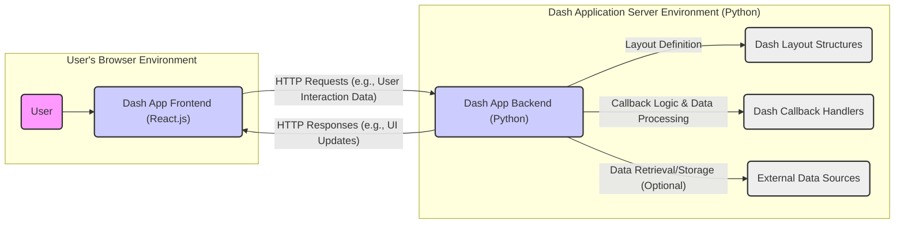

# Project Design Document: Plotly Dash

**Version:** 1.1
**Date:** October 26, 2023
**Author:** AI Software Architect

## 1. Introduction

This document provides a detailed architectural design of the Plotly Dash project, an open-source Python library for building interactive web applications. This document serves as a foundation for subsequent threat modeling activities, outlining the key components, data flows, and interactions within the Dash ecosystem. This revision aims to provide greater clarity and detail for security analysis.

### 1.1. Purpose

The primary purpose of this document is to provide a comprehensive and unambiguous understanding of the Dash architecture to facilitate effective threat modeling. It aims to clearly define the system boundaries, components, and their relationships, enabling security professionals to identify potential vulnerabilities and design appropriate mitigations. This document will be used as the basis for identifying attack surfaces and potential threat vectors.

### 1.2. Scope

This document covers the core architectural components of the Dash library, including the frontend, backend, and their interactions within a typical deployment scenario. It focuses on the logical architecture and data flow, highlighting key security-relevant aspects. It does not delve into the intricacies of individual Dash component implementations or the low-level details of the React.js framework, unless directly relevant to security considerations.

### 1.3. Target Audience

This document is intended for:

* Security engineers and architects responsible for threat modeling and security assessments of Dash applications.
* Developers building and maintaining Dash applications who require a detailed understanding of the underlying architecture and its security implications.
* DevOps engineers involved in deploying, configuring, and securing Dash application environments.

## 2. System Overview

Plotly Dash empowers developers to create interactive web applications using Python. It abstracts the complexities of traditional web development by offering a declarative approach to defining user interfaces and managing user interactions. A standard Dash application comprises a Python backend that defines the application's structure and logic, and a React.js frontend responsible for rendering the user interface in the web browser. Communication between the frontend and backend occurs via HTTP requests and responses.

### 2.1. Key Features

* **Declarative User Interface (UI) Definition:** Application layouts are defined using Python code and Dash components, simplifying UI creation.
* **Interactive Callbacks for Event Handling:** Python functions (callbacks) are used to handle user interactions and dynamically update the UI, enabling interactive applications.
* **Extensive Component Library (Dash Core Components):** A rich set of pre-built, interactive UI elements simplifies development.
* **Custom Component Creation:** Developers can extend Dash by creating custom components using React.js for specialized UI needs.
* **Seamless Integration with Python Data Science Ecosystem:**  Designed for easy integration with popular libraries like Pandas, NumPy, and Scikit-learn for data visualization and analysis.

## 3. Architectural Design

The following diagram illustrates the high-level architecture of a Dash application, emphasizing the interaction points relevant for security analysis:

### 3.1. Components

* **User:** The end-user who interacts with the Dash application through a web browser. This represents an untrusted entity from a security perspective.
* **Dash App Frontend (React.js):** The client-side component, executed within the user's browser. It is responsible for:
    * Rendering the user interface based on the layout provided by the backend.
    * Handling user interactions (e.g., clicks, form submissions).
    * Sending requests to the backend to trigger callbacks.
    * Applying updates received from the backend to the UI.
    * This component operates within the security context of the user's browser, subject to browser security policies.
* **Dash App Backend (Python):** The server-side component, typically running on a web server. It is responsible for:
    * Serving the initial application layout to the frontend.
    * Receiving and processing requests from the frontend (callback triggers).
    * Executing the defined callback functions.
    * Interacting with data sources (if necessary).
    * Managing the application's state.
    * Sending updates to the frontend to reflect changes in the application state.
    * This component is the primary target for many server-side attacks.
* **Dash Layout Structures:** Python code that defines the initial structure, components, and properties of the application's user interface. This code is executed on the backend and its output is sent to the frontend for rendering.
* **Dash Callback Handlers:** Python functions defined by the developer that are executed on the backend in response to user interactions in the frontend. These handlers contain the application's core logic and often involve data processing and state updates.
* **External Data Sources:** Optional external systems or databases that the Dash application may interact with to retrieve, store, or process data. These represent potential points of vulnerability depending on the access controls and security measures in place.

### 3.2. Data Flow

The typical data flow within a Dash application, highlighting potential security implications, can be described as follows:

1. **Initial Request and Response:** The user's browser sends an initial HTTP request to the Dash application server. The Python backend processes this request and renders the initial application layout based on the `Dash Layout Structures`. This layout, along with necessary JavaScript, is sent to the frontend as an HTTP response. **Security Note:** This initial response should be served over HTTPS to protect the initial application state and prevent man-in-the-middle attacks.
2. **Frontend Rendering:** The React.js frontend receives the initial layout and renders the user interface within the browser. **Security Note:** The frontend must be designed to prevent the execution of malicious scripts embedded in the initial layout (though Dash helps mitigate this).
3. **User Interaction and Callback Trigger:** The user interacts with the application in the browser. The frontend detects this interaction and sends an HTTP request to the backend. This request typically includes data related to the interaction and identifies the callback to be triggered. **Security Note:** This request is a potential point for tampering. Data integrity should be ensured, and the backend should validate the request.
4. **Backend Callback Execution:** The Python backend receives the callback request. It authenticates and authorizes the request (implicitly through the session or explicitly implemented mechanisms). It then executes the corresponding `Dash Callback Handler` function. This function may:
    * Process the input data received from the frontend. **Security Note:** Input validation is crucial here to prevent injection attacks and other vulnerabilities.
    * Interact with `External Data Sources`. **Security Note:** Secure connections and proper authorization are necessary when accessing external data.
    * Update the application's state.
    * Return updated component properties or data to the frontend.
5. **Backend Response and Frontend Update:** The backend sends an HTTP response containing the updated component properties or data. The React.js frontend receives these updates and re-renders the affected parts of the user interface. **Security Note:** The backend should sanitize any data sent to the frontend to prevent Cross-Site Scripting (XSS) vulnerabilities. The frontend should also be designed to handle updates securely.
6. **Repeat:** Steps 3-5 repeat as the user continues to interact with the application, driving the application's dynamic behavior.

## 4. Security Considerations

This section expands on the initial security considerations, providing more specific examples and context based on the architectural design.

* **Cross-Site Scripting (XSS):**
    * **Threat:** Malicious scripts can be injected into the application's output, potentially allowing attackers to steal user credentials, session tokens, or perform actions on behalf of the user.
    * **Attack Vectors:**
        * Backend not properly sanitizing data before rendering it in the layout or sending it in callback responses.
        * Vulnerabilities in custom components that allow for the rendering of unsanitized user input.
    * **Mitigation:** Implement robust input validation and output encoding/escaping on both the backend and frontend. Utilize Dash's built-in mechanisms for preventing XSS.
* **Cross-Site Request Forgery (CSRF):**
    * **Threat:** An attacker can trick a logged-in user into making unintended requests to the Dash application, potentially leading to unauthorized actions.
    * **Attack Vectors:** Exploiting the fact that the browser automatically sends cookies (including session cookies) with requests.
    * **Mitigation:** Implement anti-CSRF tokens or utilize the SameSite cookie attribute to protect against CSRF attacks.
* **Server-Side Vulnerabilities:**
    * **Threat:** Exploitable vulnerabilities in the Python backend code or its dependencies can allow attackers to gain unauthorized access, execute arbitrary code, or compromise the server.
    * **Attack Vectors:**
        * Injection attacks (e.g., SQL injection if interacting with databases without proper parameterization).
        * Insecure deserialization of data received from the frontend.
        * Authentication and authorization flaws in callback handlers.
        * Vulnerabilities in underlying frameworks like Flask or Werkzeug.
    * **Mitigation:** Follow secure coding practices, perform regular security audits, keep dependencies up-to-date, and implement robust authentication and authorization mechanisms.
* **Data Security:**
    * **Threat:** Sensitive data handled by the application can be exposed, modified, or deleted without authorization.
    * **Attack Vectors:**
        * Insecure storage of sensitive data in the backend or external data sources.
        * Lack of encryption for data in transit (e.g., not using HTTPS).
        * Insufficient access controls on data sources.
    * **Mitigation:** Encrypt sensitive data at rest and in transit. Implement strong authentication and authorization controls for accessing data sources. Follow the principle of least privilege.
* **Dependency Management:**
    * **Threat:** Vulnerabilities in third-party libraries used by the Dash application can be exploited by attackers.
    * **Attack Vectors:** Using outdated or vulnerable versions of dependencies.
    * **Mitigation:** Regularly audit and update dependencies to their latest secure versions. Utilize dependency scanning tools to identify known vulnerabilities.
* **State Management Security:**
    * **Threat:** If application state is not managed securely, attackers might be able to tamper with it, leading to unexpected behavior or unauthorized actions.
    * **Attack Vectors:** Manipulating data transmitted between the frontend and backend.
    * **Mitigation:** Avoid storing sensitive information directly in the frontend state if possible. Validate state updates on the backend. Use server-side sessions for sensitive state management.
* **Input Validation:**
    * **Threat:** Failure to properly validate user input can lead to various vulnerabilities, including injection attacks and denial of service.
    * **Attack Vectors:** Sending malicious or unexpected data to the backend through form submissions or other interactions.
    * **Mitigation:** Implement strict input validation on both the frontend and backend. Sanitize and validate all user-provided data before processing it.
* **Denial of Service (DoS):**
    * **Threat:** Attackers can overwhelm the application server with excessive requests, making it unavailable to legitimate users.
    * **Attack Vectors:** Sending a large number of requests to resource-intensive endpoints.
    * **Mitigation:** Implement rate limiting, request throttling, and other DoS prevention mechanisms. Ensure the application is deployed on infrastructure capable of handling expected traffic.

## 5. Dependencies

A typical Dash application relies on the following key dependencies, which should be considered during security assessments:

* **Python:** The core programming language for the backend. Security vulnerabilities in the Python interpreter itself could impact the application.
* **Flask:** A micro web framework used by Dash for routing and handling HTTP requests. Flask's security vulnerabilities could be inherited by Dash applications.
* **Werkzeug:** A WSGI utility library used by Flask. Similar to Flask, vulnerabilities in Werkzeug can pose a risk.
* **React.js:** A JavaScript library for building user interfaces, used for the frontend. Vulnerabilities in React.js could lead to frontend security issues.
* **ReactDOM:** Provides DOM-specific methods for React. Security considerations for React.js also apply here.
* **Dash Core Components:** A library of pre-built React components for Dash applications. Vulnerabilities in these components could be exploited.
* **Dash HTML Components:** Provides Python classes for all HTML tags. While generally safe, improper usage could lead to vulnerabilities.
* **Dash Renderer:** Handles communication between the Python backend and the React frontend. Security vulnerabilities in this component could compromise the communication channel.

## 6. Deployment Considerations

The security of a Dash application is significantly influenced by its deployment environment and configuration. Key considerations include:

* **HTTPS:**  Crucial for encrypting communication between the user's browser and the server, protecting against eavesdropping and man-in-the-middle attacks.
* **Web Server Configuration:** Proper configuration of the web server (e.g., Apache, Nginx, Gunicorn, uWSGI) is essential to prevent common web server vulnerabilities. This includes setting appropriate headers, disabling unnecessary features, and limiting access.
* **Operating System Security:** The security of the underlying operating system where the application is deployed is paramount. Keeping the OS patched and hardened is crucial.
* **Firewall Configuration:** Implementing firewalls to restrict network access to the application server can significantly reduce the attack surface.
* **Containerization (Docker):** When using Docker, ensure the Docker images are built securely and are regularly scanned for vulnerabilities. Follow Docker security best practices.
* **Platform as a Service (PaaS):** When deploying to PaaS platforms, understand the security responsibilities shared between the developer and the platform provider. Ensure the platform provides adequate security controls.
* **Secrets Management:** Securely manage API keys, database credentials, and other sensitive information used by the application. Avoid hardcoding secrets in the codebase.

## 7. Future Considerations

Potential future developments or extensions that could impact the architecture and security include:

* **Enhanced Authentication and Authorization Mechanisms:**  Integration of more robust authentication protocols (e.g., OAuth 2.0, OpenID Connect) and fine-grained authorization controls.
* **Improved State Management Solutions:** Exploration of more secure and scalable state management techniques, potentially involving server-side state management or secure client-side storage.
* **Serverless Deployments:**  Adapting Dash for serverless environments introduces new security considerations related to function security and access control.
* **Real-time Capabilities:**  Integrating technologies for real-time data updates and communication (e.g., WebSockets) requires careful consideration of security implications for persistent connections.

This document provides a comprehensive architectural overview of Plotly Dash, focusing on aspects relevant to security. This information is intended to serve as a valuable resource for conducting thorough threat modeling and implementing appropriate security measures to protect Dash applications.
