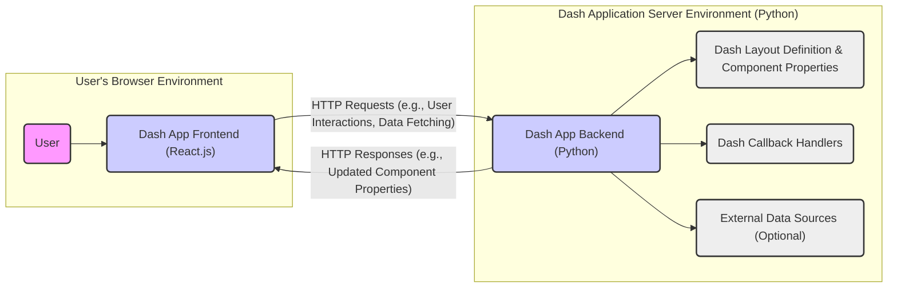

# Project Design Document: Plotly Dash

**Version:** 1.1
**Date:** October 26, 2023
**Author:** AI Software Architect

## 1. Introduction

This document provides an enhanced architectural design of the Plotly Dash project, an open-source Python library for building interactive web applications. This revised document aims to provide a more detailed and nuanced understanding of the Dash architecture, specifically tailored for effective threat modeling activities. It clearly defines system boundaries, components, their interactions, and potential security implications.

### 1.1. Purpose

The primary purpose of this document is to provide a comprehensive and improved understanding of the Dash architecture to facilitate more effective threat modeling. It aims to precisely define the system boundaries, components, and their relationships, enabling security professionals to identify a wider range of potential vulnerabilities and design more robust mitigations.

### 1.2. Scope

This document covers the core architectural components of the Dash library, including the frontend, backend, and their interactions, with a greater emphasis on security-relevant aspects. It focuses on the logical architecture and data flow within a typical Dash application deployment, including considerations for data handling and user interaction security. While it doesn't detail the implementation of individual Dash components, it provides sufficient context for understanding their role in the overall security landscape.

### 1.3. Target Audience

This document is intended for:

* Security engineers and architects involved in threat modeling, security assessments, and penetration testing of Dash applications.
* Developers working on Dash applications who require a deeper understanding of the underlying architecture and its security implications.
* DevOps engineers responsible for securely deploying, configuring, and maintaining Dash applications.

## 2. System Overview

Plotly Dash empowers developers to build web applications using Python, abstracting away many complexities of traditional web development. It offers a declarative approach to defining user interfaces and managing user interactions. A standard Dash application comprises a Python backend responsible for defining the application's structure and logic, and a React.js frontend that renders the user interface within a web browser. The communication between these layers is crucial for understanding potential attack vectors.

### 2.1. Key Features

* **Declarative User Interface (UI) Definition:** Application layouts are defined using Python code, promoting a clear and maintainable structure.
* **Interactive Callbacks for Event Handling:** Python functions (callbacks) are used to handle user interactions, enabling dynamic updates to the UI without full page reloads.
* **Extensive Component Library (Dash Core Components):** Provides a rich set of pre-built, interactive UI elements, simplifying the development process.
* **Custom Component Creation:** Developers can extend Dash's functionality by creating custom components using React.js, offering flexibility but also introducing potential security considerations.
* **Seamless Integration with Scientific Python Ecosystem:** Designed for easy integration with popular data science libraries like Pandas, NumPy, and Scikit-learn, making it suitable for data-driven applications.

## 3. Architectural Design

The following diagram illustrates the high-level architecture of a Dash application, highlighting the communication pathways:

### 3.1. Components

* **User:** The individual interacting with the Dash application through a standard web browser. Their actions are the primary triggers for application logic.
* **Dash App Frontend (React.js):** The client-side component, built using React.js, responsible for rendering the user interface elements and handling initial user interactions within the browser. It communicates with the backend via HTTP requests.
* **Dash App Backend (Python):** The server-side component, written in Python, which defines the application's structure (layout), manages application state, handles user interactions through callbacks, and potentially interacts with external data sources.
* **Dash Layout Definition & Component Properties:** Python code that declaratively defines the structure, initial state, and properties of the application's user interface components. This is crucial for the initial rendering and subsequent updates.
* **Dash Callback Handlers:** Python functions defined by the developer that are triggered by specific user interactions in the frontend. These functions process input data, potentially interact with data sources, update application state, and return updated component properties to the frontend.
* **External Data Sources (Optional):** External systems, databases, or APIs that the Dash application may interact with to retrieve, store, or process data. These interactions introduce potential security considerations related to data access and integrity.

### 3.2. Data Flow

The typical data flow within a Dash application, highlighting potential security touchpoints, can be described as follows:

1. **Initial HTTP Request:** The user's browser initiates an HTTP request to the Dash application server to access the application.
2. **Server-Side Rendering of Initial Layout:** The Python backend processes the request and dynamically renders the initial application layout based on the `Dash Layout Definition & Component Properties`. This layout, including HTML, CSS, and JavaScript, is sent to the frontend as an HTTP response.
3. **Frontend Rendering and Event Listener Setup:** The React.js frontend receives the initial layout and renders the user interface in the browser. It also sets up event listeners to detect user interactions with the UI components.
4. **User Interaction Triggers Frontend Event:** The user interacts with a UI element (e.g., clicks a button, enters text in an input field).
5. **Asynchronous HTTP Request to Backend:** The frontend detects the user interaction and sends an asynchronous HTTP request to the backend. This request includes information about the triggered callback and any relevant input data from the user interaction. This is a critical point for potential injection attacks if not handled properly.
6. **Backend Routing and Callback Execution:** The Python backend receives the HTTP request, routes it to the appropriate `Dash Callback Handler` based on the request parameters. The callback function is then executed.
7. **Data Processing and Interaction with External Sources:** The callback function may process the input data received from the frontend. It might also interact with `External Data Sources` to retrieve or update information. These interactions require secure data handling practices.
8. **State Update and Response Generation:** The callback function updates the application's state and determines the updated properties of the UI components that need to be re-rendered. The backend then constructs an HTTP response containing these updated component properties, often in JSON format.
9. **Frontend Update and Re-rendering:** The React.js frontend receives the HTTP response containing the updated component properties. It then efficiently updates the Document Object Model (DOM), re-rendering only the necessary parts of the user interface to reflect the changes.
10. **Continuous Interaction:** Steps 4-9 repeat as the user continues to interact with the application, creating a dynamic and interactive user experience.

## 4. Security Considerations (Detailed)

This section expands on the initial security considerations, providing more specific examples of potential threats and vulnerabilities based on the architectural design.

* **Cross-Site Scripting (XSS):**
    * **Threat:** Malicious scripts injected into the application's data or user input could be executed in other users' browsers.
    * **Attack Vectors:** Input fields, data retrieved from external sources, or dynamically generated content.
    * **Mitigation:** Implement robust input validation and sanitization on both the frontend and backend. Utilize Content Security Policy (CSP) to restrict the sources of executable content. Employ templating engines that automatically escape output.
* **Cross-Site Request Forgery (CSRF):**
    * **Threat:** An attacker could trick a logged-in user into making unintended requests to the Dash application.
    * **Attack Vectors:** Malicious websites or emails containing forged requests.
    * **Mitigation:** Implement anti-CSRF tokens for all state-changing requests. Utilize the `SameSite` attribute for cookies.
* **Server-Side Vulnerabilities:**
    * **Injection Attacks (e.g., SQL Injection, Command Injection):**
        * **Threat:** Attackers could inject malicious code into database queries or system commands.
        * **Attack Vectors:** User input used directly in database queries or system calls.
        * **Mitigation:** Use parameterized queries or Object-Relational Mappers (ORMs) to prevent SQL injection. Avoid executing arbitrary system commands based on user input.
    * **Insecure Deserialization:**
        * **Threat:** Deserializing untrusted data could lead to arbitrary code execution.
        * **Attack Vectors:** Receiving serialized data from untrusted sources.
        * **Mitigation:** Avoid deserializing untrusted data. If necessary, use secure serialization formats and validate the integrity of the data.
    * **Authentication and Authorization Flaws:**
        * **Threat:** Unauthorized access to application features or data.
        * **Attack Vectors:** Weak password policies, insecure session management, lack of proper access controls.
        * **Mitigation:** Implement strong authentication mechanisms (e.g., multi-factor authentication). Use secure session management techniques. Enforce the principle of least privilege for authorization.
* **Data Security:**
    * **Threat:** Unauthorized access, modification, or disclosure of sensitive data.
    * **Attack Vectors:** Insecure data storage, transmission over unencrypted channels, insufficient access controls.
    * **Mitigation:** Encrypt sensitive data at rest and in transit (HTTPS). Implement robust access control mechanisms. Regularly audit data access.
* **Dependency Management:**
    * **Threat:** Vulnerabilities in third-party libraries used by the Dash application.
    * **Attack Vectors:** Exploiting known vulnerabilities in dependencies.
    * **Mitigation:** Regularly update dependencies to their latest secure versions. Use dependency scanning tools to identify known vulnerabilities.
* **State Management Security:**
    * **Threat:** Tampering with application state to gain unauthorized access or manipulate application behavior.
    * **Attack Vectors:** Modifying state data transmitted between the frontend and backend.
    * **Mitigation:** Avoid storing sensitive information in the frontend state. Validate state updates on the backend. Use server-side session management for sensitive data.
* **Input Validation (Frontend and Backend):**
    * **Threat:** Processing invalid or malicious input can lead to unexpected behavior or security vulnerabilities.
    * **Attack Vectors:** Users providing unexpected input, attackers crafting malicious input.
    * **Mitigation:** Implement comprehensive input validation on both the frontend (for user experience) and the backend (for security). Sanitize input data before processing.
* **Denial of Service (DoS):**
    * **Threat:** Overwhelming the application with requests, making it unavailable to legitimate users.
    * **Attack Vectors:** Sending a large number of requests, exploiting resource-intensive operations.
    * **Mitigation:** Implement rate limiting, request throttling, and input validation to prevent resource exhaustion. Consider using a Content Delivery Network (CDN) to handle high traffic.

## 5. Dependencies

A typical Dash application relies on the following key dependencies, each with its own security considerations:

* **Python:** The core programming language for the backend. Security vulnerabilities in the Python interpreter itself could impact the application.
* **Flask:** A micro web framework used by Dash for routing and handling HTTP requests. Vulnerabilities in Flask could expose the application to attacks.
* **Werkzeug:** A WSGI utility library used by Flask. Security issues in Werkzeug can affect the underlying web server functionality.
* **React.js:** A JavaScript library for building user interfaces, used for the frontend. Vulnerabilities in React.js could lead to XSS or other frontend-related attacks.
* **ReactDOM:** Provides DOM-specific methods for React. Security issues here could impact how the UI is rendered and interacted with.
* **Dash Core Components:** A library of pre-built React components for Dash applications. Vulnerabilities in these components could introduce security flaws into the application's UI.
* **Dash HTML Components:** Provides Python classes for all HTML tags. While generally safe, improper usage could still lead to vulnerabilities.
* **Dash Renderer:** Handles communication between the Python backend and the React frontend. Security vulnerabilities in the renderer could compromise the communication channel.

It is crucial to regularly audit and update these dependencies to mitigate potential security risks.

## 6. Deployment Considerations

The security of a Dash application is significantly influenced by its deployment environment and configuration. Key considerations include:

* **Standalone Server (e.g., Gunicorn, uWSGI):** Requires careful configuration to ensure security best practices are followed, including setting appropriate user permissions, limiting network exposure, and enabling HTTPS.
* **Platform as a Service (PaaS) (e.g., Heroku, AWS Elastic Beanstalk):** While PaaS providers handle some infrastructure security, developers are still responsible for securing the application code and data. Understanding the security responsibilities shared with the PaaS provider is crucial.
* **Containerization (Docker):** Docker provides isolation but requires secure image creation and management. Vulnerabilities in the base image or misconfigurations in the Dockerfile can introduce security risks.
* **HTTPS Configuration:** Enforcing HTTPS is essential to encrypt communication between the user's browser and the server, protecting sensitive data from eavesdropping and man-in-the-middle attacks. Proper certificate management is also critical.
* **Web Server Configuration (e.g., Nginx, Apache):** If using a reverse proxy, its configuration is vital for security. This includes setting up appropriate headers (e.g., HSTS, X-Frame-Options), managing SSL/TLS certificates, and implementing security rules.
* **Firewall Configuration:** Properly configuring firewalls to restrict access to the application server to only necessary ports and IP addresses is essential for preventing unauthorized access.

## 7. Future Considerations

Potential future developments or extensions that could impact the architecture and security include:

* **Enhanced Authentication and Authorization Mechanisms:** Implementing more robust and flexible authentication and authorization solutions, potentially integrating with identity providers or using more granular permission models.
* **Improved State Management Techniques:** Exploring alternative state management solutions that offer better security or performance characteristics.
* **Serverless Deployment Options:** Adapting Dash for serverless environments could introduce new security challenges and considerations related to function security and data access.
* **Real-time Communication Features:** Integrating technologies for real-time data updates and communication (e.g., WebSockets) would require careful consideration of security implications for these new communication channels.

This enhanced document provides a more detailed and security-focused understanding of the Plotly Dash architecture. The information presented here is intended to be a valuable resource for conducting thorough threat modeling and implementing appropriate security measures.
