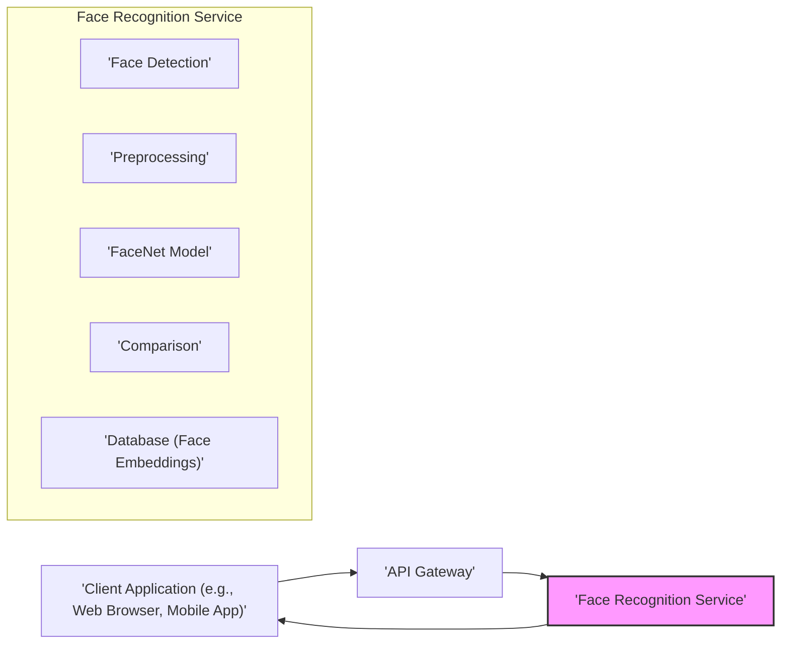
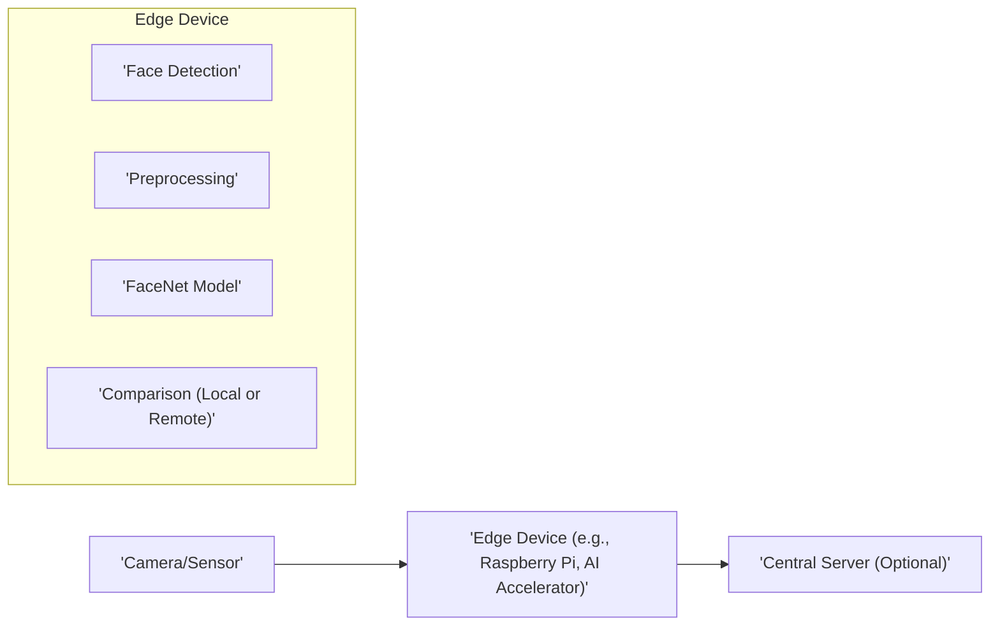

## Project Design Document: FaceNet Implementation - Enhanced

**Project Name:** FaceNet Implementation Analysis

**Version:** 1.1

**Date:** October 26, 2023

**Author:** AI Architecture Expert

**1. Introduction**

This document provides an enhanced design overview of a system built upon the FaceNet model, as exemplified by the implementation found in the GitHub repository ([https://github.com/davidsandberg/facenet](https://github.com/davidsandberg/facenet)). This detailed design serves as a crucial artifact for subsequent threat modeling exercises, enabling a thorough understanding of the system's architecture, individual components, and the flow of data.

**1.1. Project Overview**

The core objective of the FaceNet project is to achieve robust face recognition by learning a transformation that maps face images into a compact Euclidean space. In this space, the distance between two face embeddings directly reflects the similarity between the corresponding faces. This capability facilitates tasks such as verifying if two face images belong to the same individual and identifying an unknown face from a database of known faces. The linked repository offers code for both training new FaceNet models and utilizing pre-trained models for practical face recognition applications.

**1.2. Goals of this Document**

*   To deliver a more granular and comprehensive description of the FaceNet implementation's architecture and its constituent components.
*   To meticulously detail the data flow within the system, highlighting key transformation points.
*   To explicitly identify the core technologies, libraries, and dependencies that underpin the system.
*   To illustrate various potential deployment architectures, considering different use cases and environments.
*   To establish a robust and unambiguous understanding of the system's intricacies, specifically tailored for effective threat modeling.

**1.3. Scope**

This document focuses on the architectural blueprint of a system leveraging the FaceNet model, drawing inspiration from the provided repository. It encompasses the fundamental functionalities: face detection, the generation of face embeddings, and the comparison of these embeddings. While it references the Python implementation, it avoids delving into fine-grained code details unless they are essential for comprehending the overarching architecture and data movement.

**2. System Architecture**

The FaceNet system operates through a series of well-defined stages. The specific implementation nuances can differ based on the intended application, such as training a novel model versus employing a pre-existing model for recognition.

**2.1. High-Level Architecture**

**2.2. Components**

*   **Input Module:**
    *   Function: Responsible for acquiring face images that will be processed by the system.
    *   Potential Sources:
        *   Local file system (reading images from disk).
        *   Real-time capture from a webcam or other camera devices.
        *   Receiving image streams over a network (e.g., RTSP).
        *   Retrieving images from a database or object storage.
*   **Face Detection Module:**
    *   Function: Locates and identifies the bounding boxes of faces present within an input image.
    *   Implementation Details:
        *   Often utilizes libraries like `cv2` (OpenCV) which provides pre-trained models and algorithms for face detection.
        *   May employ specific face detection models such as MTCNN (Multi-task Cascaded Convolutional Networks) known for its accuracy.
        *   Configuration parameters (e.g., confidence thresholds) influence detection sensitivity.
*   **Face Alignment & Preprocessing Module:**
    *   Function: Standardizes the detected faces to improve the consistency and accuracy of subsequent feature extraction.
    *   Key Operations:
        *   **Cropping:** Isolating the detected face region from the original image.
        *   **Alignment:** Transforming the face to a canonical pose (e.g., frontal view) using techniques like eye landmark detection and affine transformations.
        *   **Resizing:** Scaling the face image to a fixed size expected by the FaceNet model.
        *   **Normalization:** Adjusting pixel values (e.g., scaling to a specific range or zero-mean normalization) to optimize model performance. Libraries like `PIL` (Pillow) and `cv2` are commonly used.
*   **Feature Extraction (FaceNet Model) Module:**
    *   Function: The core component responsible for generating the unique numerical representation (embedding) of a face.
    *   Implementation Details:
        *   Leverages a deep convolutional neural network (CNN) architecture, typically pre-trained on a massive dataset of face images.
        *   The repository uses TensorFlow or Keras to load and execute the pre-trained FaceNet model.
        *   The model takes the preprocessed face image as input and outputs a high-dimensional vector (the face embedding).
        *   The dimensionality of the embedding is a key parameter (e.g., 128-dimensional embedding).
*   **Output Module (Face Embeddings):**
    *   Function: Represents the numerical output from the FaceNet model, capturing the distinctive features of the input face.
    *   Format: Typically a vector of floating-point numbers.
    *   Usage: These embeddings are used for comparison in subsequent stages.
*   **Comparison/Matching Module:**
    *   Function: Determines the similarity between two face embeddings.
    *   Methods:
        *   **Distance Calculation:** Computing the distance between embeddings, such as Euclidean distance or cosine distance. Lower distance generally indicates higher similarity.
        *   **Similarity Score:** Calculating a similarity score based on the distance (e.g., the inverse of the distance or a normalized similarity measure).
    *   Tasks:
        *   **Face Verification:** Comparing the embedding of a probe face with the embedding of a claimed identity to confirm if they belong to the same person.
        *   **Face Identification:** Comparing the embedding of an unknown face against a database of embeddings of known individuals to identify the person.
    *   Thresholding: A predefined threshold is used to determine if a match is considered valid.
*   **Result Module:**
    *   Function: Presents the outcome of the face recognition process to the user or another system.
    *   Output Examples:
        *   For verification: A boolean value ("Match" or "No Match") or a confidence score.
        *   For identification: The identified person's name or ID, along with a confidence score, or an indication that no match was found.
*   **Training Module (If applicable):**
    *   Function: Used to train a new FaceNet model from scratch or to fine-tune an existing pre-trained model on a specific dataset.
    *   Key Aspects:
        *   Requires a large, labeled dataset of face images.
        *   Utilizes TensorFlow or Keras for defining the model architecture, loss function (e.g., triplet loss), and optimizer.
        *   Involves iterative training over the dataset to adjust model weights.
        *   This module is typically separate from the deployment scenario focused solely on recognition.
*   **Database (Optional):**
    *   Function: Stores face embeddings of known individuals along with their corresponding identities for face identification tasks.
    *   Types:
        *   Simple file storage (e.g., CSV, JSON).
        *   Relational databases (e.g., PostgreSQL, MySQL).
        *   NoSQL databases (e.g., MongoDB).
        *   Vector databases (e.g., Faiss, Annoy) optimized for efficient similarity search of high-dimensional vectors.

**2.3. Data Flow**

1. **Image Acquisition:** The system initiates by acquiring one or more face images through the input module from various sources.
2. **Face Detection:** The face detection module analyzes the input image(s) to precisely locate the boundaries of any faces present.
3. **Face Preprocessing:** Each detected face undergoes preprocessing steps, including cropping to isolate the face, alignment to a standard pose, and normalization of pixel values.
4. **Embedding Generation:** The preprocessed face image is then fed into the FaceNet model, which computes a high-dimensional embedding that encapsulates the unique facial features.
5. **Embedding Storage (Optional):** In scenarios involving face identification, the generated embeddings of known individuals are stored in a database, linked to their respective identities.
6. **Comparison:** The embedding of the input face is compared against existing embeddings. This might involve comparing against a single embedding for verification or against multiple embeddings in a database for identification.
7. **Similarity Calculation:** The distance or similarity score between the compared embeddings is calculated using a chosen metric.
8. **Decision Making:** Based on a predefined similarity threshold, the system makes a decision. For verification, it determines if the faces match. For identification, it identifies the closest matching identity (if any).
9. **Result Output:** Finally, the system outputs the result of the face recognition process, such as a verification confirmation or the identified person's identity.

**3. Technology Stack**

*   **Primary Programming Language:** Python
*   **Deep Learning Frameworks:**
    *   TensorFlow
    *   Keras (often used as a high-level API on top of TensorFlow)
*   **Essential Image Processing Libraries:**
    *   OpenCV (`cv2`): For fundamental image manipulation, reading, and writing.
    *   Pillow (`PIL`): Another widely used library for image processing tasks.
    *   Scikit-image: Offers a collection of algorithms for image processing and analysis.
*   **Specialized Face Detection Libraries/Models:**
    *   MTCNN (Multi-task Cascaded Convolutional Networks): A popular and accurate face detection model.
    *   Dlib: Provides various machine learning algorithms, including face detection and landmark prediction.
    *   OpenCV's DNN module: Allows loading and running pre-trained deep learning models for tasks like face detection.
*   **Core Numerical Computation Library:** NumPy: Essential for efficient array operations and numerical computations.
*   **Target Operating Systems:** Platform independent, with support for Linux, Windows, and macOS.
*   **Potential Database Technologies (for identification):**
    *   Lightweight Options: SQLite
    *   Robust Relational Databases: PostgreSQL, MySQL
    *   Scalable NoSQL Databases: MongoDB
    *   Optimized Vector Databases: Faiss (Facebook AI Similarity Search), Annoy (Approximate Nearest Neighbors Oh Yeah)

**4. Deployment Architecture**

The architecture for deploying a FaceNet-based system can vary considerably depending on the specific application requirements and the intended scale of operation.

**4.1. Local Machine/Desktop Application Deployment**

*   Characteristics: The entire face recognition pipeline operates directly on the user's local computer.
*   Use Cases: Suitable for individual use, development environments, or small-scale applications where data privacy is a primary concern.

**4.2. Server-Based Application Deployment**

*   Characteristics: The core face recognition logic is hosted on a central server. Client applications interact with this service through an API.
*   Use Cases: Ideal for applications requiring centralized processing, shared access to face recognition capabilities, and scalability to handle multiple users.

**4.3. Cloud-Based Deployment**

*   Characteristics: Leverages cloud infrastructure for enhanced scalability, reliability, and availability. Face recognition services are often containerized for easier deployment and management.
*   Use Cases: Suitable for large-scale applications, applications with fluctuating demand, and those requiring high availability and disaster recovery capabilities.

**4.4. Edge Deployment**

*   Characteristics: Face recognition processing is performed directly on edge devices, closer to the data source. This reduces latency and bandwidth consumption.
*   Use Cases: Suitable for real-time applications like security surveillance, access control, and scenarios where network connectivity is limited or unreliable. May involve specialized hardware accelerators for efficient processing.

**5. Security Considerations (Detailed)**

*   **Data Privacy and Security:**
    *   **Biometric Data Handling:** Facial images and their embeddings constitute sensitive biometric data, necessitating strict adherence to privacy regulations (e.g., GDPR, CCPA).
    *   **Storage Security:** Secure storage of facial images and embeddings, employing encryption at rest and access controls.
    *   **Data Transmission Security:** Encrypting data in transit using protocols like TLS/HTTPS.
    *   **Anonymization/Pseudonymization:** Exploring techniques to minimize the direct identifiability of facial data where possible.
*   **Model Security:**
    *   **Adversarial Attacks:** Vulnerability to crafted input images designed to intentionally mislead the FaceNet model, leading to incorrect classifications. Mitigation strategies include adversarial training and input validation.
    *   **Model Extraction/Inversion Attacks:** The risk of malicious actors attempting to steal or reverse-engineer the trained FaceNet model to gain insights into its parameters or training data. Protecting model files and restricting access are crucial.
    *   **Model Poisoning:** If the system allows for retraining or fine-tuning, there's a risk of attackers injecting malicious data into the training process to degrade model performance or introduce biases.
*   **Access Control and Authentication:**
    *   **Authentication of Users/Applications:** Securely verifying the identity of users or applications accessing the FaceNet system or its APIs.
    *   **Authorization and Role-Based Access Control:** Implementing mechanisms to control access to specific functionalities and data based on user roles and permissions.
*   **Input Validation and Sanitization:**
    *   Thoroughly validating and sanitizing input images to prevent injection attacks or denial-of-service attempts.
    *   Limiting file sizes and types for image uploads.
*   **Communication Security:**
    *   Ensuring secure communication channels between different components of the system, especially in client-server or distributed deployments.
    *   Protecting API endpoints with authentication and authorization.
*   **Dependency Management:**
    *   Maintaining an up-to-date inventory of all software dependencies (libraries, frameworks).
    *   Regularly scanning dependencies for known vulnerabilities and applying necessary patches.
*   **Physical Security:**
    *   Protecting the physical infrastructure where the FaceNet system is deployed, including servers and edge devices, against unauthorized access and tampering.
*   **Logging and Monitoring:**
    *   Implementing comprehensive logging of system activities, including access attempts, errors, and significant events.
    *   Setting up monitoring systems to detect anomalies and potential security breaches.

**6. Assumptions and Constraints**

*   Assumption: The availability of pre-trained FaceNet models or the capability to train a model using a sufficiently large and representative dataset.
*   Assumption: The performance and accuracy of the system are directly influenced by the quality of the input images (resolution, lighting, pose).
*   Constraint: The accuracy of face recognition can be affected by factors such as occlusions (e.g., masks, sunglasses), significant pose variations, and changes in appearance (e.g., aging, facial hair).
*   Constraint: Computational resources available will impact the processing speed and scalability of the system. Edge deployments may have significant resource constraints.
*   Assumption: The provided GitHub repository serves as a representative reference implementation for the FaceNet model's core functionalities.

**7. Future Considerations**

*   Exploration of integration with other security systems, such as physical access control systems or surveillance platforms.
*   Implementation of liveness detection techniques to mitigate spoofing attacks where an attacker presents a photograph or video of a person's face.
*   Optimization of the FaceNet model for improved performance and reduced resource consumption on specific hardware targets.
*   Development of a well-defined and secure API for seamless interaction with the face recognition service from various client applications.
*   Ongoing evaluation and mitigation of potential ethical implications and biases that may be present in the FaceNet model or its training data.
*   Consideration of federated learning approaches for training models while preserving data privacy.

This enhanced design document provides a more in-depth understanding of the FaceNet implementation, crucial for effective threat modeling. The detailed architecture, component descriptions, and data flow analysis serve as a robust foundation for identifying potential security vulnerabilities and devising appropriate mitigation strategies.
