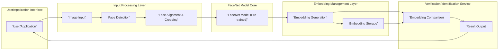

## Project Design Document: FaceNet Implementation (Improved)

**Project Name:** FaceNet Implementation for Face Recognition

**Project Repository:** [https://github.com/davidsandberg/facenet](https://github.com/davidsandberg/facenet)

**Document Version:** 1.1

**Date:** October 26, 2023

**Author:** AI Architecture Expert

---

### 1. Project Overview

This document details the design of a system leveraging the FaceNet model for face recognition. FaceNet, a deep learning model, learns a mapping from face images to a compact Euclidean space where distances directly correlate with face similarity. This design focuses on the core components and data flow involved in utilizing a pre-trained FaceNet model for tasks such as face verification and identification. This document is intended to serve as the foundation for subsequent threat modeling activities, providing a clear understanding of the system's architecture and potential vulnerabilities.

### 2. System Architecture

The system architecture comprises several key components interacting to perform face recognition.

### 3. Component Details

*   **User/Application:** Represents the external entity (e.g., a web application, a mobile app, a command-line tool, an API consumer) that initiates the face recognition process. It provides the input image and receives the recognition results.
    *   **Security Considerations:** Authentication and authorization of users/applications accessing the service. Input validation to prevent malicious payloads. Rate limiting to mitigate DoS attacks.
*   **Image Input:** Handles the acquisition of the face image. This can involve:
    *   Uploading an image file (e.g., JPEG, PNG).
    *   Capturing an image stream from a camera.
    *   Receiving an image payload from another service.
    *   **Security Considerations:** Input validation to ensure correct image formats and prevent injection attacks (e.g., malformed image headers). Secure transfer protocols (HTTPS) for image uploads. Storage of images (if any) should be secure.
*   **Face Detection:** Responsible for identifying the presence and location of faces within the input image. Common algorithms include:
    *   MTCNN (Multi-task Cascaded Convolutional Networks).
    *   Haar cascades.
    *   Other object detection models (e.g., YOLO, SSD).
    The output is the bounding box coordinates of the detected faces.
    *   **Security Considerations:** Potential for adversarial attacks that could cause the detector to fail or identify false positives. Resource consumption if processing very large or complex images.
*   **Face Alignment & Cropping:** Once a face is detected, this component aligns and crops the face region to a standard size and orientation. This ensures consistent input to the FaceNet model and improves accuracy. Alignment techniques may involve:
    *   Eye detection and rotation correction.
    *   Landmark detection and affine transformation.
    *   Standardized cropping to a fixed size (e.g., 160x160 pixels).
    *   **Security Considerations:** Vulnerabilities in alignment algorithms could be exploited. Resource consumption for complex alignment procedures.
*   **FaceNet Model (Pre-trained):** The core component, a pre-trained deep learning model (typically a Convolutional Neural Network - CNN) trained on a large dataset of face images. It takes the aligned and cropped face image as input and outputs a high-dimensional embedding (a vector of numbers) representing the unique features of the face.
    *   **Security Considerations:** Risk of model poisoning if the pre-trained model is compromised or replaced with a malicious one. Intellectual property concerns regarding the model itself. Potential for model inversion attacks (though generally difficult for FaceNet).
*   **Embedding Generation:** Executes the FaceNet model on the processed face image to generate the embedding vector.
    *   **Security Considerations:** Resource consumption during embedding generation. Potential for timing attacks to infer information about the input.
*   **Embedding Storage:** Responsible for securely storing the generated face embeddings. This storage could be:
    *   A relational database (e.g., PostgreSQL, MySQL) with vector extensions.
    *   A dedicated vector database (e.g., FAISS, Annoy, Milvus).
    *   A secure file system with appropriate access controls.
    Each stored embedding is typically associated with an identity or label.
    *   **Security Considerations:**  Critical component for data security. Requires strong access controls, encryption at rest and in transit. Vulnerable to data breaches.
*   **Embedding Comparison:** Compares the newly generated embedding with the embeddings stored in the `Embedding Storage`. The comparison uses distance metrics like:
    *   Cosine similarity.
    *   Euclidean distance.
    A configurable threshold determines if two embeddings belong to the same person.
    *   **Security Considerations:**  Potential for timing attacks to infer information about stored embeddings. Threshold configuration needs careful management to balance accuracy and security (e.g., preventing easy impersonation).
*   **Result Output:** Provides the result of the face recognition process to the `User/Application`. This could be:
    *   Verification: A boolean indicating whether the input face matches a claimed identity.
    *   Identification: The identity of the person whose stored embedding is most similar to the input face's embedding (within a defined threshold).
    *   A confidence score associated with the result.
    *   **Security Considerations:** Secure transmission of results back to the user/application. Preventing information leakage through overly detailed error messages.

### 4. Data Flow

The typical data flow for a face recognition request is as follows, highlighting potential security considerations at each stage:

*   **Image Submission:** The `User/Application` sends an image containing a face to the system.
    *   **Security:** Ensure secure transmission (HTTPS). Validate image format and size.
*   **Image Reception:** The `Image Input` component receives the image.
    *   **Security:** Further validation of image integrity.
*   **Face Detection:** The `Face Detection` component identifies the location of faces within the image.
    *   **Security:** Guard against adversarial inputs designed to mislead the detector.
*   **Face Processing:** For each detected face, the `Face Alignment & Cropping` component processes the face region.
    *   **Security:** Protect against vulnerabilities in alignment algorithms.
*   **Embedding Generation:** The processed face image is fed into the `FaceNet Model (Pre-trained)`, and the `Embedding Generation` component extracts the face embedding.
    *   **Security:** Ensure the integrity of the FaceNet model. Protect against timing attacks.
*   **Embedding Storage (Registration):** If it's a new face being registered, the embedding is stored in the `Embedding Storage`.
    *   **Security:** Secure storage with encryption and access controls.
*   **Embedding Retrieval and Comparison (Verification/Identification):** If it's a verification or identification request, the `Embedding Comparison` component retrieves relevant embeddings from the `Embedding Storage` and compares them with the generated embedding.
    *   **Security:** Secure retrieval of embeddings. Protect against timing attacks during comparison.
*   **Result Delivery:** The `Result Output` component sends the recognition result back to the `User/Application`.
    *   **Security:** Secure transmission of results. Avoid exposing sensitive information in error messages.

### 5. Key Technologies

*   **Primary Programming Language:** Python (commonly used with FaceNet).
*   **Deep Learning Frameworks:** TensorFlow or PyTorch (FaceNet implementations exist in both).
*   **Face Detection Libraries:** `mtcnn`, OpenCV's DNN module, `dlib`.
*   **Image Processing Libraries:** Pillow (PIL), OpenCV.
*   **Database Technologies (for Embedding Storage):**
    *   Relational Databases: PostgreSQL with `pgvector`, MySQL with vector extensions.
    *   Vector Databases: FAISS, Annoy, Milvus, Weaviate.
*   **API Frameworks (if applicable):** Flask, FastAPI, Django REST Framework.
*   **Cloud Platforms (for deployment):** AWS, Azure, Google Cloud Platform.

### 6. Deployment Considerations

The FaceNet implementation can be deployed in various environments, each with its own security implications:

*   **Cloud-based Deployment:** Utilizing cloud platforms like AWS, Azure, or GCP offers scalability and managed services but introduces cloud-specific security concerns (e.g., IAM roles, network configurations, data residency).
*   **On-premise Deployment:** Deployed on local servers or infrastructure, providing more control over the environment but requiring robust internal security measures.
*   **Edge Device Deployment:** Running directly on devices with limited resources (e.g., security cameras, embedded systems). This necessitates model optimization and careful consideration of device security.

### 7. Potential Attack Surfaces

Based on the system architecture, the following are potential attack surfaces:

*   **User/Application Interface:** Vulnerable to attacks targeting authentication, authorization, and input validation.
*   **Image Input:** Susceptible to malicious image uploads or camera stream manipulation.
*   **Face Detection Component:** Potential for adversarial attacks to cause misdetections.
*   **Face Alignment & Cropping Component:** Vulnerabilities in alignment algorithms could be exploited.
*   **FaceNet Model (Pre-trained):** Risk of model poisoning or unauthorized access to the model.
*   **Embedding Generation Process:** Potential for timing attacks.
*   **Embedding Storage:** A prime target for data breaches if not properly secured.
*   **Embedding Comparison Process:** Susceptible to timing attacks to infer information about stored embeddings.
*   **Communication Channels:**  Vulnerable to eavesdropping or man-in-the-middle attacks if not encrypted.

### 8. Security Considerations (Detailed)

This section provides a more structured overview of security concerns, categorized for clarity:

*   **Authentication and Authorization:**
    *   Implement strong authentication mechanisms for users and applications accessing the system.
    *   Enforce role-based access control (RBAC) to limit access to sensitive components and data.
    *   Secure API keys or tokens used for authentication.
*   **Data Security and Privacy:**
    *   Encrypt facial images and embeddings both in transit and at rest.
    *   Implement data masking or anonymization techniques where appropriate.
    *   Comply with relevant data privacy regulations (e.g., GDPR, CCPA).
    *   Establish secure data retention and deletion policies.
*   **Input Validation and Sanitization:**
    *   Thoroughly validate all input data, including images, to prevent injection attacks and other malicious payloads.
    *   Sanitize input data to remove potentially harmful content.
*   **Model Security:**
    *   Verify the integrity of the pre-trained FaceNet model.
    *   Implement measures to prevent unauthorized access or modification of the model.
    *   Consider techniques for detecting and mitigating model poisoning attacks.
*   **API Security:**
    *   Secure API endpoints using HTTPS.
    *   Implement rate limiting to prevent DoS attacks.
    *   Validate API requests and responses.
*   **Network Security:**
    *   Segment the network to isolate sensitive components.
    *   Use firewalls and intrusion detection/prevention systems.
    *   Secure communication channels between components using TLS/SSL.
*   **Logging and Monitoring:**
    *   Implement comprehensive logging of system activity.
    *   Monitor system performance and security events for anomalies.
    *   Establish alerting mechanisms for suspicious activity.
*   **Dependency Management:**
    *   Keep all software dependencies up-to-date to patch known vulnerabilities.
    *   Use dependency scanning tools to identify potential security risks in third-party libraries.

This improved design document provides a more detailed and structured overview of the FaceNet implementation, explicitly highlighting potential attack surfaces and elaborating on security considerations. This enhanced document will be more effective for conducting a thorough threat modeling exercise.