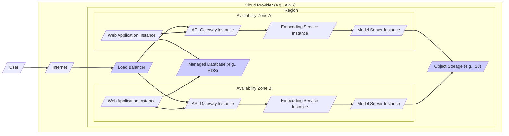

# BUSINESS POSTURE

This project, Facenet, provides a face recognition model and related tools.  From a business perspective, integrating face recognition capabilities can address various needs, depending on the specific business goals and priorities.

Potential business priorities and goals for using Facenet could include:

*   Enhancing security systems: Implementing face recognition for access control, surveillance, or identity verification.
*   Improving user experience:  Using face recognition for faster and more convenient login or personalization features in applications.
*   Automating processes:  Employing face recognition for tasks like attendance tracking, customer identification, or image tagging.
*   Data analysis and insights:  Analyzing facial features in images or videos for demographic studies, marketing research, or social behavior analysis (with ethical considerations).

Most important business risks associated with these priorities and goals include:

*   Privacy violations:  Misuse or unauthorized access to facial recognition data, leading to breaches of personal privacy and regulatory non-compliance (e.g., GDPR, CCPA).
*   Bias and discrimination:  Facial recognition models can exhibit biases based on race, gender, or age, leading to unfair or discriminatory outcomes.
*   Accuracy and reliability:  The model's accuracy might be insufficient for critical applications, leading to false positives or false negatives with significant consequences.
*   Security vulnerabilities:  Exploitation of vulnerabilities in the face recognition system could compromise security and privacy.
*   Reputational damage:  Negative publicity due to privacy breaches, biased outcomes, or system failures can harm the business's reputation.
*   Legal and regulatory risks:  Failure to comply with evolving data privacy regulations and laws related to biometric data can result in fines and legal action.

# SECURITY POSTURE

Based on the nature of an open-source project like Facenet and typical software development practices, we can infer the existing and recommended security posture.

Existing security controls:

*   security control: Code repository hosted on GitHub, providing version control and transparency. (Implemented: GitHub)
*   security control: Open-source licensing, allowing community review and contribution. (Implemented: LICENSE file in repository)
*   security control:  Basic input validation might be present in the code to handle image processing and model inputs. (Implemented: Within the Python code, needs review)

Accepted risks:

*   accepted risk:  Lack of formal security audits or penetration testing.
*   accepted risk:  Potential vulnerabilities in dependencies (Python libraries, TensorFlow/PyTorch).
*   accepted risk:  Limited security focus in the development process, as it's primarily a research-oriented project.
*   accepted risk:  No dedicated security team or incident response plan for the project itself.
*   accepted risk:  Reliance on community contributions for security fixes.

Recommended security controls (high priority):

*   security control: Implement automated security scanning (SAST/DAST) in the CI/CD pipeline to detect vulnerabilities in code and dependencies.
*   security control:  Conduct regular vulnerability assessments and penetration testing of deployed systems using Facenet.
*   security control:  Establish a process for secure handling of facial recognition data, including encryption at rest and in transit.
*   security control:  Implement robust input validation and sanitization to prevent injection attacks and data manipulation.
*   security control:  Apply the principle of least privilege for access control to data and system resources.
*   security control:  Implement logging and monitoring to detect and respond to security incidents.
*   security control:  Develop and enforce secure coding practices throughout the development lifecycle.
*   security control:  Implement a process for managing and patching dependencies to address known vulnerabilities.

Security requirements:

*   Authentication:
    *   Requirement: Securely authenticate users or systems accessing the Facenet API or services.
    *   Considerations: API keys, OAuth 2.0, mutual TLS, depending on the deployment context.
*   Authorization:
    *   Requirement: Implement fine-grained authorization to control access to specific functionalities and data based on roles or permissions.
    *   Considerations: Role-Based Access Control (RBAC), Attribute-Based Access Control (ABAC).
*   Input Validation:
    *   Requirement:  Thoroughly validate all inputs, including images, API requests, and configuration parameters, to prevent injection attacks and data corruption.
    *   Considerations:  Input type validation, format validation, range checks, sanitization of special characters.
*   Cryptography:
    *   Requirement:  Encrypt sensitive data at rest (e.g., facial embeddings, user data) and in transit (e.g., API communication, data transfer).
    *   Considerations:  AES-256 encryption for data at rest, TLS 1.3 for data in transit, secure key management practices.
    *   Requirement:  Use cryptographic hashing for integrity checks of models and code.

# DESIGN

## C4 CONTEXT

```mermaid
graph LR
    subgraph "Organization System"
        Facenet["Facenet Project"]
    end
    User[/"Application Developer"/]
    ImageDB[/"Image Database"/]
    App[/"Face Recognition Application"/]
    UserManagement[/"User Management System"/]

    User --> Facenet: Integrates Facenet model
    Facenet --> ImageDB: Accesses training data
    Facenet --> App: Provides face embeddings
    App --> Facenet: Sends face images for embedding
    App --> UserManagement: Authenticates users
    User --> App: Uses face recognition features

    linkStyle 0,1,2,3,4,5 stroke:#333,stroke-width:2px;
```

Context Diagram Elements:

*   Element:
    *   Name: Facenet Project
    *   Type: Software System
    *   Description:  The Facenet project itself, encompassing the face recognition model, training scripts, and related utilities. It's the core component providing face embedding capabilities.
    *   Responsibilities:
        *   Training face recognition models.
        *   Providing pre-trained face recognition models.
        *   Offering tools and scripts for face detection and embedding generation.
    *   Security controls:
        *   security control: Code repository access control (GitHub permissions).
        *   security control:  Vulnerability scanning of dependencies (recommended).
        *   security control:  Code review process for contributions (recommended).

*   Element:
    *   Name: Application Developer
    *   Type: Person
    *   Description:  Software developers who integrate the Facenet model and tools into their applications or systems.
    *   Responsibilities:
        *   Integrating the Facenet model into applications.
        *   Developing applications that utilize face recognition features.
        *   Ensuring secure and responsible use of face recognition technology.
    *   Security controls:
        *   security control: Secure development practices.
        *   security control:  Following organization's security policies.

*   Element:
    *   Name: Image Database
    *   Type: External System
    *   Description:  A database or storage system containing images used for training the Facenet model. This could be a publicly available dataset or a private dataset.
    *   Responsibilities:
        *   Storing and providing access to image data for model training.
        *   Maintaining data integrity and availability.
    *   Security controls:
        *   security control: Access control to the database.
        *   security control:  Data encryption at rest (recommended).
        *   security control:  Data integrity checks.

*   Element:
    *   Name: Face Recognition Application
    *   Type: Software System
    *   Description:  An application that utilizes the Facenet model to provide face recognition features to end-users. This could be a web application, mobile app, or desktop software.
    *   Responsibilities:
        *   Providing face recognition functionality to users.
        *   Handling user authentication and authorization.
        *   Managing user data and privacy.
    *   Security controls:
        *   security control: Authentication and authorization mechanisms.
        *   security control:  Input validation and sanitization.
        *   security control:  Secure data storage and transmission.
        *   security control:  Application-level security controls (e.g., session management, CSRF protection).

*   Element:
    *   Name: User Management System
    *   Type: External System
    *   Description:  A system responsible for managing user accounts, authentication, and authorization within the application environment.
    *   Responsibilities:
        *   User registration and login.
        *   Password management.
        *   User role and permission management.
    *   Security controls:
        *   security control: Secure authentication protocols.
        *   security control:  Strong password policies.
        *   security control:  Multi-factor authentication (recommended).
        *   security control:  Account lockout mechanisms.

## C4 CONTAINER

```mermaid
graph LR
    subgraph "Face Recognition Application"
        API[/"API Gateway"/]
        WebApp[/"Web Application"/]
    end
    subgraph "Facenet Project"
        ModelServer[/"Model Server"/]
        EmbeddingService[/"Embedding Service"/]
        ModelStorage[/"Model Storage"/]
    end
    ImageDB[/"Image Database"/]
    UserManagement[/"User Management System"/]
    User[/"User"/]

    User --> WebApp: Uses application
    WebApp --> API: API requests
    API --> EmbeddingService: Face embedding requests
    EmbeddingService --> ModelServer: Model inference
    ModelServer --> ModelStorage: Model loading
    EmbeddingService --> ImageDB: Accesses images (for training/verification)
    WebApp --> UserManagement: Authentication/Authorization

    linkStyle 0,1,2,3,4,5,6 stroke:#333,stroke-width:2px;
```

Container Diagram Elements:

*   Element:
    *   Name: API Gateway
    *   Type: Container - Web Server
    *   Description:  An API Gateway acts as a single entry point for all API requests to the Facenet services. It handles routing, authentication, authorization, and potentially rate limiting and request transformation.
    *   Responsibilities:
        *   API request routing.
        *   Authentication and authorization of API requests.
        *   Rate limiting and traffic management.
        *   Request and response transformation.
    *   Security controls:
        *   security control: Authentication and authorization mechanisms (e.g., API keys, OAuth 2.0).
        *   security control:  Input validation and sanitization.
        *   security control:  TLS encryption for API communication.
        *   security control:  Web Application Firewall (WAF) (recommended).
        *   security control:  Rate limiting and DDoS protection.

*   Element:
    *   Name: Web Application
    *   Type: Container - Web Application
    *   Description:  The front-end web application that provides user interface for interacting with face recognition features. It communicates with the API Gateway to access Facenet services.
    *   Responsibilities:
        *   User interface for face recognition features.
        *   Handling user interactions and requests.
        *   Displaying results and information to users.
    *   Security controls:
        *   security control: Secure coding practices (OWASP guidelines).
        *   security control:  Input validation and output encoding.
        *   security control:  Session management and CSRF protection.
        *   security control:  Content Security Policy (CSP).

*   Element:
    *   Name: Embedding Service
    *   Type: Container - Application Service
    *   Description:  A service responsible for receiving face images, preprocessing them, and generating face embeddings using the Facenet model.
    *   Responsibilities:
        *   Receiving face images from the API Gateway.
        *   Preprocessing images for model input.
        *   Generating face embeddings using the Model Server.
        *   Potentially performing face detection.
    *   Security controls:
        *   security control: Input validation of images.
        *   security control:  Secure communication with Model Server (e.g., mutual TLS).
        *   security control:  Resource limits and rate limiting.

*   Element:
    *   Name: Model Server
    *   Type: Container - Application Service
    *   Description:  A service that hosts the trained Facenet model and performs inference to generate face embeddings. It loads the model from Model Storage and provides embedding generation capabilities to the Embedding Service.
    *   Responsibilities:
        *   Loading the Facenet model from Model Storage.
        *   Performing model inference to generate face embeddings.
        *   Managing model versions and updates.
    *   Security controls:
        *   security control: Access control to model files in Model Storage.
        *   security control:  Secure loading and execution of the model.
        *   security control:  Resource limits and monitoring.

*   Element:
    *   Name: Model Storage
    *   Type: Container - Data Store
    *   Description:  A storage system (e.g., object storage, file system) that stores the trained Facenet models.
    *   Responsibilities:
        *   Storing trained Facenet models.
        *   Providing access to models for the Model Server.
        *   Ensuring model integrity and availability.
    *   Security controls:
        *   security control: Access control to model files.
        *   security control:  Data encryption at rest (recommended).
        *   security control:  Integrity checks for model files (e.g., cryptographic hashing).

## DEPLOYMENT

Deployment Architecture Option: Cloud-based API Service (AWS, GCP, Azure)



Deployment Diagram Elements (Cloud-based API Service):

*   Element:
    *   Name: Load Balancer
    *   Type: Infrastructure - Load Balancer
    *   Description:  Distributes incoming traffic across multiple API Gateway instances for high availability and scalability.
    *   Responsibilities:
        *   Traffic distribution.
        *   Health checks of backend instances.
        *   SSL termination (optional).
    *   Security controls:
        *   security control: DDoS protection.
        *   security control:  SSL/TLS encryption.
        *   security control:  Access control lists (ACLs).

*   Element:
    *   Name: API Gateway Instance (A & B)
    *   Type: Infrastructure - Compute Instance (e.g., EC2, VM)
    *   Description:  Instances of the API Gateway container running in separate Availability Zones for redundancy.
    *   Responsibilities:
        *   API request routing, authentication, authorization, etc. (as described in Container Diagram).
    *   Security controls:
        *   security control: Instance-level firewall.
        *   security control:  Operating system hardening.
        *   security control:  Regular security patching.

*   Element:
    *   Name: Web Application Instance (A & B)
    *   Type: Infrastructure - Compute Instance (e.g., EC2, VM)
    *   Description:  Instances of the Web Application container running in separate Availability Zones for redundancy.
    *   Responsibilities:
        *   Serving the web application frontend.
    *   Security controls:
        *   security control: Instance-level firewall.
        *   security control:  Operating system hardening.
        *   security control:  Regular security patching.

*   Element:
    *   Name: Embedding Service Instance (A & B)
    *   Type: Infrastructure - Compute Instance (e.g., EC2, VM)
    *   Description:  Instances of the Embedding Service container running in separate Availability Zones for redundancy.
    *   Responsibilities:
        *   Generating face embeddings (as described in Container Diagram).
    *   Security controls:
        *   security control: Instance-level firewall.
        *   security control:  Operating system hardening.
        *   security control:  Regular security patching.

*   Element:
    *   Name: Model Server Instance (A & B)
    *   Type: Infrastructure - Compute Instance (e.g., EC2, VM)
    *   Description:  Instances of the Model Server container running in separate Availability Zones for redundancy.
    *   Responsibilities:
        *   Model inference (as described in Container Diagram).
    *   Security controls:
        *   security control: Instance-level firewall.
        *   security control:  Operating system hardening.
        *   security control:  Regular security patching.

*   Element:
    *   Name: Model Storage Service (e.g., S3)
    *   Type: Infrastructure - Managed Storage Service
    *   Description:  Managed object storage service for storing Facenet models.
    *   Responsibilities:
        *   Secure and scalable storage for models.
        *   Data durability and availability.
    *   Security controls:
        *   security control: Access control policies (IAM).
        *   security control:  Data encryption at rest and in transit.
        *   security control:  Versioning and backup.

*   Element:
    *   Name: Database Service (e.g., RDS)
    *   Type: Infrastructure - Managed Database Service
    *   Description:  Managed database service for storing application data (e.g., user profiles, application settings).
    *   Responsibilities:
        *   Storing application data.
        *   Data persistence and availability.
    *   Security controls:
        *   security control: Access control policies.
        *   security control:  Data encryption at rest and in transit.
        *   security control:  Database backups and recovery.
        *   security control:  Database auditing.

## BUILD

```mermaid
graph LR
    Developer[/"Developer"/] --> CodeRepo[/"Code Repository (GitHub)"/]
    CodeRepo --> CI[/"CI/CD Pipeline (GitHub Actions)"/]
    CI --> BuildArtifacts[/"Build Artifacts (Container Images, Models)"/]
    BuildArtifacts --> ContainerRegistry[/"Container Registry (e.g., Docker Hub, ECR)"/]
    ContainerRegistry --> DeploymentEnv[/"Deployment Environment"/]

    subgraph "CI/CD Pipeline"
        Build[/"Build Stage"/]
        Test[/"Test Stage (Unit, Integration, Security Scans)"/]
        Publish[/"Publish Stage"/]
    end
    CI --> Build
    Build --> Test
    Test --> Publish
    Publish --> BuildArtifacts

    linkStyle 0,1,2,3,4,5,6,7,8,9 stroke:#333,stroke-width:2px;
```

Build Process Description:

The build process for Facenet, when deployed as a cloud service, would typically involve a CI/CD pipeline to automate the build, test, and deployment stages.

*   Developer: Developers write code, train models, and commit changes to the Code Repository.
*   Code Repository (GitHub):  The source code and model training scripts are stored in a Git repository hosted on GitHub.
*   CI/CD Pipeline (GitHub Actions):  GitHub Actions or a similar CI/CD system is used to automate the build process whenever changes are pushed to the repository.
    *   Build Stage: This stage compiles code, packages dependencies, and potentially trains or prepares the Facenet model. It also includes steps to build container images (e.g., Docker images) for the services.
    *   Test Stage:  Automated tests are executed, including unit tests, integration tests, and security scans (SAST, DAST, dependency scanning).
    *   Publish Stage:  Build artifacts, such as container images and trained models, are published to a Container Registry.
*   Build Artifacts (Container Images, Models):  These are the packaged outputs of the build process, ready for deployment.
*   Container Registry (e.g., Docker Hub, ECR):  A registry for storing and managing container images.
*   Deployment Environment:  The target environment where the application is deployed (e.g., cloud infrastructure).

Security Controls in Build Process:

*   security control:  Secure coding practices enforced through linters and static analysis tools in the CI pipeline.
*   security control:  Automated security scanning (SAST/DAST) integrated into the CI pipeline to detect vulnerabilities in code and dependencies.
*   security control:  Dependency scanning to identify and manage vulnerable dependencies.
*   security control:  Container image scanning for vulnerabilities before publishing to the registry.
*   security control:  Code review process for all code changes before merging to the main branch.
*   security control:  Access control to the CI/CD pipeline and build artifacts.
*   security control:  Immutable infrastructure principles for deployment (deploying container images as build artifacts).
*   security control:  Supply chain security measures, such as verifying the integrity of dependencies and build tools.

# RISK ASSESSMENT

Critical business processes we are trying to protect (assuming a face recognition access control system):

*   Physical access control: Ensuring only authorized individuals can access restricted areas.
*   Data security: Protecting sensitive data related to user identities and access logs.
*   System availability: Maintaining the availability of the access control system to ensure continuous operation.
*   User privacy: Protecting the privacy of individuals whose facial data is processed by the system.

Data we are trying to protect and their sensitivity:

*   Facial images: Highly sensitive biometric data. If compromised, can lead to identity theft, privacy violations, and potential misuse.
*   Facial embeddings:  Derived biometric data, still sensitive as they represent facial features. Compromise can lead to similar risks as facial images.
*   User identity data:  Names, employee IDs, access privileges linked to facial data. Sensitive personal information that needs protection.
*   Access logs: Records of access events, potentially containing timestamps, user IDs, and location data. Sensitive information that can reveal user activity patterns.
*   System configuration and credentials:  Sensitive data required for system operation and management. Compromise can lead to complete system takeover.

# QUESTIONS & ASSUMPTIONS

Questions:

*   What is the specific business use case for Facenet? (Access control, user authentication, surveillance, etc.)
*   What are the data privacy regulations that need to be complied with? (GDPR, CCPA, etc.)
*   What is the expected scale and performance requirements for the system?
*   What is the organization's risk appetite and security maturity level?
*   Are there any existing security policies or standards that need to be followed?
*   What is the budget and timeline for implementing security controls?

Assumptions:

*   The project is intended for a business application, not just research.
*   Data privacy and security are important considerations.
*   The system will be deployed in a cloud environment.
*   A CI/CD pipeline will be used for build and deployment automation.
*   The organization has some level of security awareness and is willing to invest in security controls.
*   The focus is on securing a deployed application using Facenet, rather than securing the Facenet project repository itself (although repository security is also important).