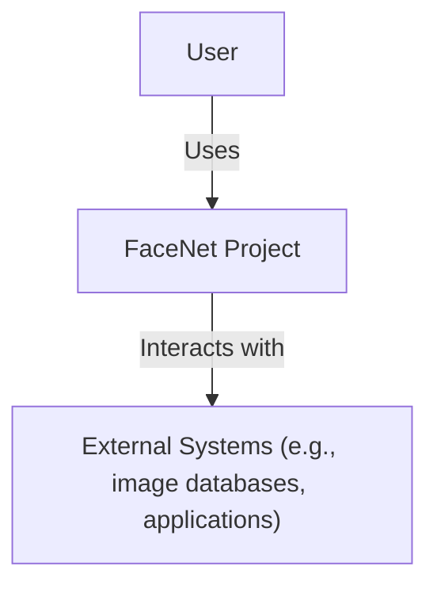
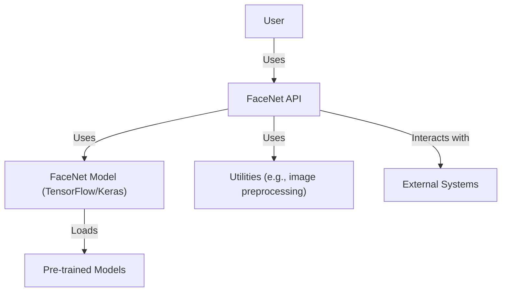
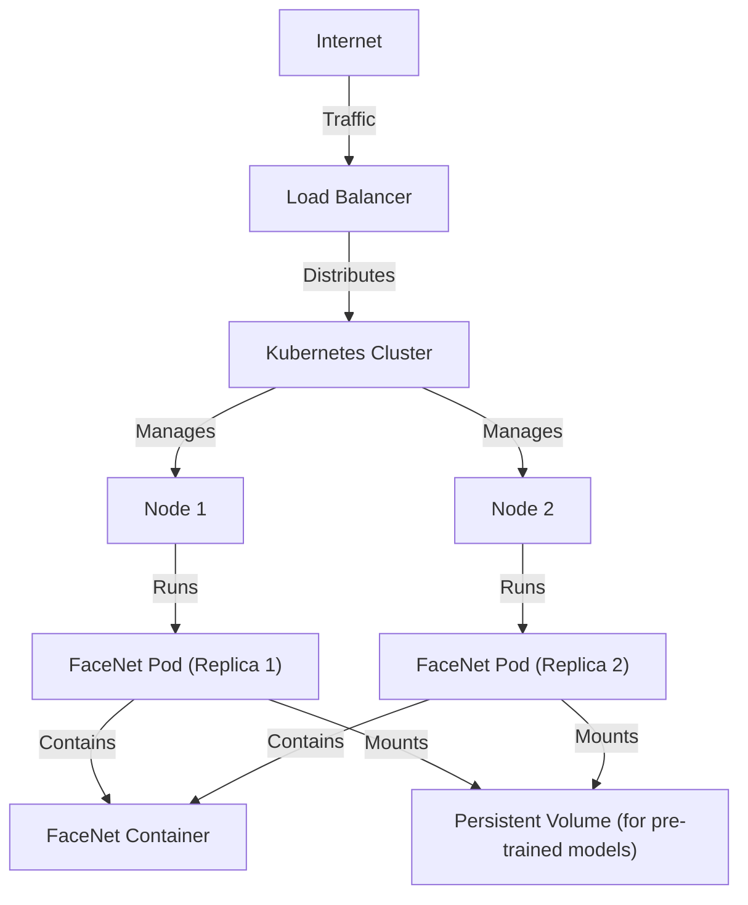
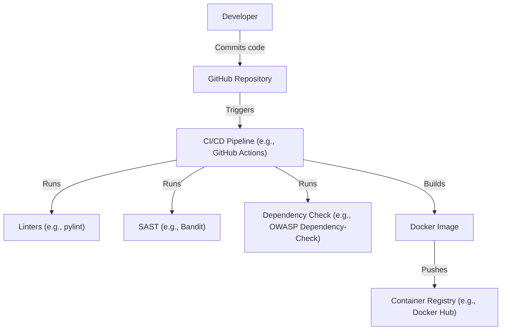

# BUSINESS POSTURE

Business Priorities and Goals:

*   Provide a functional and accessible implementation of FaceNet for facial recognition and verification.
*   Enable users to easily integrate the FaceNet model into their own projects.
*   Offer pre-trained models and tools for common facial recognition tasks.
*   Maintain a well-documented and understandable codebase.
*   Facilitate research and development in the field of facial recognition.

Business Risks:

*   Misuse of facial recognition technology for unethical or illegal purposes (e.g., mass surveillance, discriminatory profiling).
*   Privacy violations due to unauthorized access or storage of facial data.
*   Vulnerabilities in the model or code that could be exploited by attackers.
*   Lack of robustness against adversarial attacks, leading to incorrect identification or verification.
*   Legal and regulatory challenges related to the use of facial recognition technology.
*   Reputational damage due to ethical concerns or security breaches.

# SECURITY POSTURE

Existing Security Controls:

*   security control: The project is open-source, allowing for community review and contributions to identify and address potential security issues. (Described in the GitHub repository's README and contribution guidelines).
*   security control: The project uses pre-trained models, which reduces the need for users to handle large datasets of sensitive facial data. (Described in the GitHub repository's documentation).
*   security control: The project provides examples and guidelines for using the FaceNet model, which can help users implement it securely. (Described in the GitHub repository's documentation and examples).

Accepted Risks:

*   accepted risk: The project does not provide explicit guarantees about the accuracy or robustness of the FaceNet model, and users are responsible for evaluating its suitability for their specific use cases.
*   accepted risk: The project does not implement specific security measures to prevent misuse or privacy violations, and users are responsible for complying with relevant laws and regulations.
*   accepted risk: The project is primarily focused on research and development, and may not have undergone extensive security testing or hardening.

Recommended Security Controls:

*   security control: Implement input validation to ensure that the data processed by the FaceNet model is in the expected format and range.
*   security control: Provide guidance on secure storage and handling of facial data, including encryption and access control.
*   security control: Conduct regular security audits and penetration testing to identify and address potential vulnerabilities.
*   security control: Develop a clear policy on responsible use and disclosure of the technology.
*   security control: Implement mechanisms to detect and mitigate adversarial attacks.
*   security control: Consider adding differential privacy mechanisms to protect individual privacy while still allowing for model training and use.

Security Requirements:

*   Authentication: Not directly applicable to the FaceNet model itself, but relevant for any applications or systems that use the model. Authentication mechanisms should be implemented to control access to the model and its outputs.
*   Authorization: Not directly applicable to the FaceNet model itself, but relevant for any applications or systems that use the model. Authorization mechanisms should be implemented to restrict access to sensitive facial data or model functionalities based on user roles and permissions.
*   Input Validation: The FaceNet model should validate the input images to ensure they are in the expected format, size, and color depth. Invalid inputs should be rejected to prevent unexpected behavior or vulnerabilities.
*   Cryptography: Not directly applicable to the FaceNet model itself, but relevant for any applications or systems that use the model. Cryptographic techniques should be used to protect sensitive facial data at rest and in transit, such as encryption and secure communication protocols.

# DESIGN

## C4 CONTEXT

Element Descriptions:

*   Element:
    *   Name: User
    *   Type: Person
    *   Description: Represents a person who interacts with the FaceNet project, either directly or indirectly through an application.
    *   Responsibilities: Provides input data (e.g., images), uses the FaceNet model for facial recognition or verification, and interprets the results.
    *   Security controls: Authentication and authorization mechanisms should be implemented in applications that use the FaceNet model to control user access.

*   Element:
    *   Name: FaceNet Project
    *   Type: Software System
    *   Description: The FaceNet project, as represented by the GitHub repository.
    *   Responsibilities: Provides the FaceNet model, pre-trained models, tools, and documentation for facial recognition and verification.
    *   Security controls: Input validation, secure coding practices, and regular security audits.

*   Element:
    *   Name: External Systems
    *   Type: Software System
    *   Description: External systems or applications that interact with the FaceNet project, such as image databases, facial recognition applications, or other research projects.
    *   Responsibilities: Provide input data to the FaceNet model, consume the model's outputs, or integrate the model into larger systems.
    *   Security controls: Secure communication protocols, data encryption, and access control mechanisms should be implemented when interacting with external systems.

## C4 CONTAINER

Element Descriptions:

*   Element:
    *   Name: User
    *   Type: Person
    *   Description: Represents a person who interacts with the FaceNet project.
    *   Responsibilities: Provides input data, uses the FaceNet API.
    *   Security controls: Authentication and authorization in applications using FaceNet.

*   Element:
    *   Name: FaceNet API
    *   Type: API
    *   Description: Provides an interface for users and applications to interact with the FaceNet model.
    *   Responsibilities: Handles input validation, calls the FaceNet model, and returns the results.
    *   Security controls: Input validation, rate limiting, and API key management (if applicable).

*   Element:
    *   Name: FaceNet Model
    *   Type: Application
    *   Description: The core FaceNet model implemented using TensorFlow/Keras.
    *   Responsibilities: Performs facial recognition and verification calculations.
    *   Security controls: Secure coding practices, regular security audits.

*   Element:
    *   Name: Pre-trained Models
    *   Type: Data
    *   Description: Pre-trained weights and configurations for the FaceNet model.
    *   Responsibilities: Provide a starting point for the FaceNet model, reducing the need for training from scratch.
    *   Security controls: Integrity checks to ensure the pre-trained models have not been tampered with.

*   Element:
    *   Name: Utilities
    *   Type: Library
    *   Description: Helper functions for tasks such as image preprocessing, data loading, and visualization.
    *   Responsibilities: Support the main FaceNet model and API.
    *   Security controls: Secure coding practices.

*   Element:
    *   Name: External Systems
    *   Type: Software System
    *   Description: External systems that interact with the FaceNet project.
    *   Responsibilities: Provide input or consume output.
    *   Security controls: Secure communication, data encryption, access control.

## DEPLOYMENT

Possible deployment solutions:

1.  Local machine: Users can clone the repository and run the code locally using Python and TensorFlow/Keras.
2.  Cloud-based virtual machine (VM): Users can deploy the code on a VM in a cloud environment like AWS, Google Cloud, or Azure.
3.  Containerized deployment: Users can use Docker to containerize the FaceNet application and deploy it on platforms like Kubernetes or Docker Swarm.
4.  Serverless deployment: Users can deploy parts of the FaceNet application as serverless functions (e.g., using AWS Lambda or Google Cloud Functions).

Chosen solution (Containerized deployment with Kubernetes):

Element Descriptions:

*   Element:
    *   Name: Internet
    *   Type: External
    *   Description: The public internet.
    *   Responsibilities: Provides access to the deployed FaceNet application.
    *   Security controls: Firewall, intrusion detection/prevention systems.

*   Element:
    *   Name: Load Balancer
    *   Type: Infrastructure
    *   Description: Distributes incoming traffic across multiple instances of the FaceNet application.
    *   Responsibilities: Ensures high availability and scalability.
    *   Security controls: SSL/TLS termination, DDoS protection.

*   Element:
    *   Name: Kubernetes Cluster
    *   Type: Infrastructure
    *   Description: Manages the deployment and scaling of the FaceNet application.
    *   Responsibilities: Orchestrates containers, manages resources, and ensures application health.
    *   Security controls: Role-based access control (RBAC), network policies, pod security policies.

*   Element:
    *   Name: Node 1, Node 2
    *   Type: Infrastructure
    *   Description: Worker nodes in the Kubernetes cluster.
    *   Responsibilities: Run the FaceNet pods.
    *   Security controls: Operating system hardening, regular security updates.

*   Element:
    *   Name: FaceNet Pod 1, FaceNet Pod 2
    *   Type: Container
    *   Description: Instances of the FaceNet application running in containers.
    *   Responsibilities: Handle requests for facial recognition and verification.
    *   Security controls: Container image security scanning, resource limits.

*   Element:
    *   Name: FaceNet Container
    *   Type: Container
    *   Description: The Docker container containing the FaceNet application and its dependencies.
    *   Responsibilities: Provides a consistent and isolated environment for the FaceNet application.
    *   Security controls: Minimal base image, non-root user, regular security updates.

*   Element:
    *   Name: Persistent Volume
    *   Type: Infrastructure
    *   Description: Storage for pre-trained models that persists across pod restarts.
    *   Responsibilities: Ensures that the pre-trained models are available to the FaceNet application.
    *   Security controls: Access control, encryption at rest.

## BUILD

Build Process Description:

1.  Developer commits code changes to the GitHub repository.
2.  The commit triggers the CI/CD pipeline (e.g., GitHub Actions).
3.  The CI/CD pipeline runs linters (e.g., pylint) to check code style and quality.
4.  The CI/CD pipeline runs SAST tools (e.g., Bandit) to identify potential security vulnerabilities in the code.
5.  The CI/CD pipeline runs dependency checks (e.g., OWASP Dependency-Check) to identify known vulnerabilities in project dependencies.
6.  If all checks pass, the CI/CD pipeline builds a Docker image containing the FaceNet application and its dependencies.
7.  The Docker image is pushed to a container registry (e.g., Docker Hub).

Security Controls:

*   security control: Linters enforce coding standards and help prevent common coding errors.
*   security control: SAST tools identify potential security vulnerabilities in the code before deployment.
*   security control: Dependency checks identify known vulnerabilities in project dependencies.
*   security control: The CI/CD pipeline automates the build process, ensuring consistency and reducing the risk of manual errors.
*   security control: Containerization provides a consistent and isolated environment for the application, reducing the risk of conflicts and vulnerabilities.
*   security control: The container registry provides a secure and controlled environment for storing and distributing the Docker image.

# RISK ASSESSMENT

Critical Business Processes:

*   Facial recognition and verification: The core functionality of the FaceNet project.
*   Model training and deployment: The ability to train and deploy new FaceNet models.
*   Research and development: The ongoing improvement and extension of the FaceNet technology.

Data Sensitivity:

*   Facial images: Highly sensitive personal data that requires strong protection.
*   Facial embeddings: Numerical representations of faces that can be used to identify individuals. Also considered sensitive data.
*   Pre-trained models: Potentially sensitive, as they may contain information about the data they were trained on.
*   Model training data: If the project involves training models on new data, the training data itself would be highly sensitive.

# QUESTIONS & ASSUMPTIONS

Questions:

*   What specific legal and regulatory requirements apply to the use of FaceNet in the intended deployment environments?
*   What level of accuracy and robustness is required for the FaceNet model in the intended use cases?
*   What are the specific threats and attack vectors that are most relevant to the FaceNet project?
*   What resources are available for security testing and auditing?
*   What is the process for handling security vulnerabilities and incidents?
*   Are there any specific ethical guidelines or principles that should be followed in the development and deployment of FaceNet?

Assumptions:

*   BUSINESS POSTURE: The primary goal of the project is research and development, and commercial use is secondary.
*   SECURITY POSTURE: Users are responsible for implementing appropriate security measures when using the FaceNet model in their own applications.
*   DESIGN: The project will be deployed using a containerized approach with Kubernetes.
*   DESIGN: The project will use a CI/CD pipeline for automated builds and testing.
*   DESIGN: The project will rely on pre-trained models, and users will not typically train models from scratch.