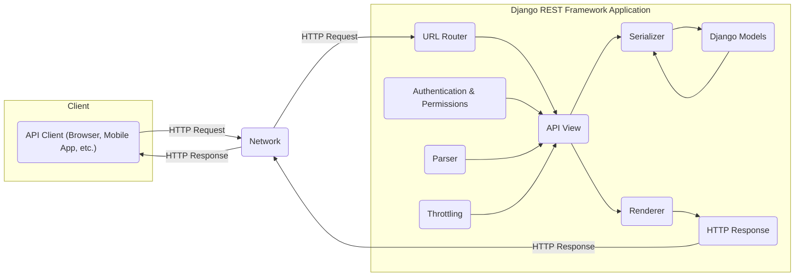
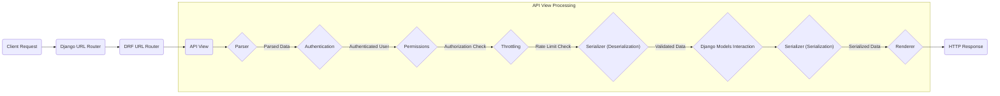

# Project Design Document: Django REST Framework

**Version:** 1.1
**Date:** October 26, 2023
**Author:** AI Software Architect

## 1. Introduction

This document provides a detailed architectural design of the Django REST Framework (DRF), a powerful and flexible toolkit for building Web APIs. This document aims to provide a comprehensive understanding of DRF's components, their interactions, and data flow, which will serve as the foundation for subsequent threat modeling activities.

## 2. Goals and Objectives

The primary goals of this design document are to:

*   Clearly articulate the architecture of the Django REST Framework.
*   Identify key components and their responsibilities.
*   Describe the flow of data through the framework.
*   Highlight security-relevant aspects of the design.
*   Provide a basis for identifying potential threats and vulnerabilities.

## 3. High-Level Architecture

Django REST Framework builds upon the foundation of Django, a high-level Python web framework. It introduces a set of components and abstractions specifically designed for building RESTful APIs.

**Key Architectural Layers:**

*   Client Layer: Represents any application or system that consumes the API.
*   Network Layer: The communication channel over which requests and responses are transmitted.
*   Django REST Framework Application Layer: The core of the API, built using DRF components.

## 4. Key Components

This section details the major components within the Django REST Framework and their functionalities.

*   URL Router:
    *   Responsible for mapping incoming HTTP requests to specific API views based on the URL path.
    *   Uses regular expressions or path converters to match URLs.
    *   Can be configured to automatically generate API endpoints based on viewsets.

*   Parser:
    *   Handles the parsing of incoming request data based on the `Content-Type` header.
    *   Supports various data formats like JSON, XML, and form data.
    *   Transforms raw request data into Python data structures.

*   Authentication:
    *   Determines the identity of the client making the request.
    *   Provides pluggable authentication schemes (e.g., Basic Authentication, Token Authentication, Session Authentication, OAuth).
    *   Associates the authenticated user with the request.

*   Permissions:
    *   Controls access to API endpoints based on the authenticated user and the requested action.
    *   Defines rules for who can access specific resources or perform certain operations.
    *   Provides a flexible system for defining custom permission classes.

*   Throttling:
    *   Limits the rate at which clients can make requests to the API.
    *   Protects the API from abuse and denial-of-service attacks.
    *   Can be configured based on user identity or IP address.

*   API View:
    *   The core building block for handling API requests.
    *   Receives the parsed request data and the authenticated user.
    *   Orchestrates the processing of the request, often involving serializers and interacting with Django models.
    *   Returns a `Response` object.

*   Serializer:
    *   Responsible for converting Python data (e.g., Django model instances) into a format suitable for rendering in the API response (serialization).
    *   Also handles the reverse process of converting incoming request data into Python data (deserialization).
    *   Provides data validation capabilities.

*   Renderer:
    *   Takes the data from the API view and converts it into a specific output format based on the `Accept` header of the request.
    *   Supports various formats like JSON, XML, HTML.

*   Response:
    *   Represents the HTTP response that will be sent back to the client.
    *   Contains the rendered data, status code, and headers.

*   Django Models:
    *   The data access layer of the Django application.
    *   Defines the structure of the data stored in the database.
    *   API views often interact with models to retrieve, create, update, or delete data.

## 5. Data Flow

The following outlines the typical flow of an API request through the Django REST Framework:

**Detailed Steps:**

1. Client Request: The client application initiates a request to a specific API endpoint.
2. Django URL Router: Django's main URL router receives the request.
3. DRF URL Router: If the URL matches an API endpoint defined using DRF, the request is passed to the DRF URL router.
4. API View: The DRF URL router maps the request to the appropriate API view.
5. Parser: The API view utilizes a parser based on the `Content-Type` header to convert the raw request body into Python data.
6. Authentication: The configured authentication backend attempts to identify the user making the request.
7. Permissions: The configured permission classes determine if the authenticated user is authorized to access the requested resource and perform the requested action.
8. Throttling: The throttling mechanism verifies if the client has exceeded the allowed request rate.
9. Serializer (Deserialization): If the request includes data (e.g., for creating or updating resources), the serializer is used to validate and convert the incoming data into Python objects.
10. Django Models Interaction: The API view interacts with Django models to retrieve, create, update, or delete data in the database based on the validated data.
11. Serializer (Serialization): The serializer converts the data (e.g., model instances) into a format suitable for the API response.
12. Renderer: The renderer converts the serialized data into the desired output format (e.g., JSON, XML) based on the `Accept` header.
13. HTTP Response: The rendered data, along with the appropriate status code and headers, is packaged into an HTTP response and sent back to the client.

## 6. Security Considerations

Several components within DRF play a crucial role in ensuring the security of the API:

*   Authentication:
    *   Properly configured authentication is essential for verifying the identity of API clients. Weak or misconfigured authentication can lead to unauthorized access.
    *   Supported methods: Session-based authentication, Token-based authentication (various types including JWT), OAuth 2.0.
    *   Considerations: Secure storage of credentials, protection against brute-force attacks, proper session management, secure token handling (e.g., using HTTPS-only cookies for session tokens).

*   Permissions:
    *   Authorization mechanisms ensure that authenticated users can only access resources and perform actions they are allowed to.
    *   Granularity: Permissions can be defined at the view level or object level, allowing for fine-grained access control.
    *   Considerations: Principle of least privilege, clear definition of roles and permissions, regular review of permission configurations.

*   Throttling:
    *   Rate limiting helps prevent denial-of-service attacks and abuse by limiting the number of requests from a single client within a given timeframe.
    *   Configuration: Throttling can be applied globally or per view, and can be based on factors like IP address or user ID.
    *   Considerations: Appropriate rate limits based on API usage patterns, consideration of authenticated vs. unauthenticated users.

*   Input Validation (via Serializers):
    *   Serializers provide a robust mechanism for validating incoming request data, preventing injection attacks (e.g., SQL injection, command injection) and ensuring data integrity.
    *   Validation Rules: Define data types, required fields, constraints (e.g., maximum length, regular expressions), and custom validation logic.
    *   Considerations: Thorough validation of all input data, proper handling and reporting of validation errors, protection against mass assignment vulnerabilities.

*   Output Encoding (via Renderers):
    *   Renderers ensure that data is properly encoded for the response format, mitigating potential cross-site scripting (XSS) vulnerabilities.
    *   Default Encoding: DRF typically handles encoding appropriately for common formats like JSON and XML. When using HTML rendering, ensure proper escaping of user-generated content.
    *   Considerations: Be mindful of custom renderers and ensure they handle encoding correctly, especially when dealing with user-generated content.

*   HTTPS:
    *   Enforcing HTTPS is crucial for encrypting communication between the client and the server, protecting sensitive data in transit from eavesdropping and man-in-the-middle attacks.
    *   Configuration: This is typically configured at the web server level (e.g., Nginx, Apache).
    *   Considerations: Ensure proper SSL/TLS certificate configuration and enforcement of HTTPS.

## 7. Deployment Considerations

The deployment environment can significantly impact the security and performance of a DRF application.

*   Web Server: Choosing a secure and performant web server (e.g., Nginx, Apache) is important. Configure security headers (e.g., HSTS, Content-Security-Policy, X-Frame-Options).
*   WSGI Server: A production-ready WSGI server (e.g., Gunicorn, uWSGI) is necessary to handle requests efficiently. Ensure it's configured with appropriate security settings.
*   Database: The security of the underlying database is critical. Use strong passwords, restrict access, and keep the database software up to date.
*   Containerization (Docker): Containerizing the application can improve consistency and security by isolating the application environment. Use minimal base images and follow security best practices for container images.
*   Cloud Platforms (AWS, Azure, GCP): Utilizing cloud platforms provides scalability and security features. Leverage services like firewalls, load balancers, and managed security services.

## 8. Future Considerations

Potential future enhancements or changes that could impact the design include:

*   GraphQL Integration: Exploring native support or improved integration with GraphQL to offer alternative API paradigms.
*   WebSockets Support: Adding features for real-time communication capabilities, which would introduce new security considerations related to WebSocket connections.
*   Improved OpenAPI Schema Generation: Enhancements to automatically generate comprehensive and accurate OpenAPI specifications for better API documentation and client generation.
*   Enhanced Asynchronous Support: Further integration with asynchronous frameworks to improve performance for I/O-bound operations.

This document provides a foundational understanding of the Django REST Framework's architecture. This information will be crucial for conducting a thorough threat modeling exercise to identify potential security vulnerabilities and design appropriate mitigations.
