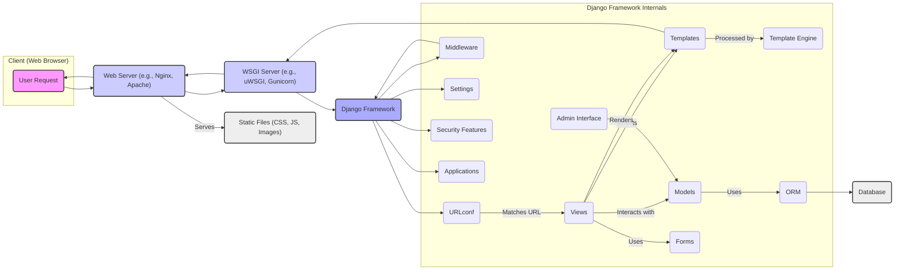

# Project Design Document: Django Web Framework

**Version:** 1.1
**Date:** October 26, 2023
**Author:** AI Software Architect

## 1. Introduction

This document provides a detailed architectural design of the Django web framework, intended to facilitate thorough threat modeling. It outlines the key components, their interactions, and the overall structure of the framework. This document serves as the foundation for identifying potential security vulnerabilities and designing appropriate mitigation strategies. The target project is the open-source Django framework, specifically the codebase found at [https://github.com/django/django](https://github.com/django/django).

## 2. Project Overview

Django is a high-level, open-source Python web framework that promotes rapid development and a clean, pragmatic design philosophy. It abstracts away many common web development tasks, allowing developers to focus on building application-specific features rather than reinventing core functionalities. Its mature ecosystem and active community contribute to its robustness and continuous improvement.

Key features of Django include:

*   **Object-Relational Mapper (ORM):**  Provides a Pythonic way to interact with databases, abstracting away the complexities of SQL.
*   **Automatic Admin Interface:**  Dynamically generates a user-friendly interface for managing application data based on defined models.
*   **Flexible URL Routing:**  A powerful system for mapping URL patterns to specific view functions, enabling clean and organized URLs.
*   **Extensible Template Engine:**  Allows for the creation of dynamic HTML content, supporting template inheritance and custom tags.
*   **Comprehensive Form Handling:**  Simplifies the creation, validation, and processing of HTML forms.
*   **Built-in Security Features:**  Includes mechanisms to protect against common web vulnerabilities, such as XSS and CSRF.
*   **Middleware Framework:**  A hook system for processing requests and responses, enabling global modifications and functionalities.
*   **Reusable Applications:**  Encourages modular design through the concept of self-contained applications that can be reused across projects.

## 3. Architectural Design

Django adheres to the Model-Template-Views (MTV) architectural pattern, a variation of the Model-View-Controller (MVC) pattern adapted for web development.

### 3.1. High-Level Components

The core components of Django can be broadly categorized as follows:

*   **Models:** Python classes that define the structure of data and provide an interface for interacting with the database. They represent the application's data layer.
*   **Views:** Python functions or classes that contain the application's logic. They receive web requests, interact with models to retrieve or manipulate data, and determine which template to render for the response.
*   **Templates:** Text-based files (typically HTML) that define the structure and presentation of the user interface. They contain placeholders for dynamic content that are filled in by the template engine.
*   **URLconf (URL Configuration):** A set of patterns that map incoming URLs to specific view functions. It acts as the request dispatcher.
*   **Forms:** Python classes that encapsulate the logic for creating, validating, and processing user input from HTML forms.
*   **Admin Interface:** An automatically generated web interface that allows administrators to manage the application's data through CRUD operations.
*   **Middleware:** A chain of components that intercept and process requests and responses at various stages of the Django request/response cycle.
*   **Template Engine:** The component responsible for parsing template files and rendering them with dynamic data. Django supports multiple template engines.
*   **ORM (Object-Relational Mapper):**  Provides an abstraction layer for interacting with databases, allowing developers to work with Python objects instead of writing raw SQL.
*   **Security Features:** Built-in mechanisms and tools designed to protect against common web security vulnerabilities.
*   **Applications (Apps):** Reusable and self-contained modules that encapsulate specific functionalities within a Django project.
*   **Settings:** A Python module containing configuration parameters for the Django project, such as database settings, installed applications, and middleware.
*   **WSGI (Web Server Gateway Interface):** A standard interface between web servers and Python web applications, enabling Django to run on various web servers.

### 3.2. Component Interaction Diagram

### 3.3. Data Flow

A typical HTTP request-response cycle within a Django application proceeds as follows:

1. **User Initiates Request:** A user interacts with the web application, triggering an HTTP request from their web browser (e.g., clicking a link, submitting a form).
2. **Web Server Receives Request:** The web server (e.g., Nginx, Apache) receives the incoming HTTP request.
3. **WSGI Server Handling:** The web server passes the request to the WSGI server (e.g., uWSGI, Gunicorn), which acts as an interface between the web server and the Django application.
4. **Django Framework Entry:** The WSGI server forwards the request to the Django framework's entry point.
5. **Middleware Processing (Request Phase):** Django's middleware components process the incoming request in a predefined order. This can involve tasks such as session management, authentication checks, request logging, and modifying the request object.
6. **URL Resolution:** The `URLconf` examines the requested URL and matches it against defined URL patterns.
7. **View Selection:** Based on the matched URL pattern, the corresponding view function or class is identified.
8. **View Execution:** The selected view is executed. This is where the core application logic resides. The view may:
    *   Interact with `Models` to retrieve or modify data from the database using the `ORM`.
    *   Process data submitted through `Forms`.
    *   Perform business logic.
    *   Select a `Template` to render the response.
9. **Template Rendering:** If a template is selected, the `Template Engine` processes the template, combining it with data passed from the view to generate the HTML response.
10. **Middleware Processing (Response Phase):** Django's middleware components process the outgoing response in reverse order of the request phase. This can involve tasks such as adding security headers, compressing the response, and logging the response.
11. **Response to WSGI Server:** Django returns the generated HTTP response to the WSGI server.
12. **Response to Web Server:** The WSGI server sends the response back to the web server.
13. **Response to Client:** The web server sends the HTTP response (typically HTML, JSON, etc.) back to the user's web browser.
14. **Static File Handling (Optional):** If the request is for static files (CSS, JavaScript, images), the web server is typically configured to serve these files directly without involving the Django application for performance reasons.

### 3.4. Key Components Details

*   **Models:** Defined using Python classes that inherit from `django.db.models.Model`. Each model represents a database table, and its attributes correspond to table columns. The ORM provides methods for querying, creating, updating, and deleting data.
*   **Views:** Can be either function-based views (FBVs) or class-based views (CBVs). They handle the business logic of the application, receiving requests and returning responses. Views interact with models to access and manipulate data.
*   **Templates:** Typically HTML files that use Django's template language to embed dynamic content. Templates support features like template inheritance, filters, and tags for controlling the presentation of data.
*   **URLconf:** Defined in a `urls.py` file, it contains a list of `path()` or `re_path()` objects that map URL patterns to specific view functions or class-based views.
*   **Forms:** Defined using Python classes that inherit from `django.forms.Form` or `django.forms.ModelForm`. They simplify the process of creating HTML forms, validating user input, and cleaning data before it's used in the application.
*   **Admin Interface:** Automatically generated by Django based on the defined models. It provides a user-friendly interface for administrators to perform CRUD operations on the application's data. It can be customized and extended.
*   **Middleware:** A series of components that process requests and responses. Middleware can perform tasks like authentication, session management, request logging, security checks, and modifying request or response objects.
*   **Template Engine:** Responsible for parsing and rendering templates. Django's default template engine supports a variety of template tags and filters. Django also supports other template engines like Jinja2.
*   **ORM:** Provides an abstraction layer over different database systems (e.g., PostgreSQL, MySQL, SQLite). It allows developers to interact with the database using Python code instead of writing raw SQL queries, improving portability and security.
*   **Security Features:** Django includes several built-in security features:
    *   **Cross-Site Scripting (XSS) Protection:** Automatic escaping of template variables to prevent the injection of malicious scripts.
    *   **Cross-Site Request Forgery (CSRF) Protection:** Middleware that helps prevent CSRF attacks by requiring a unique token in POST requests.
    *   **SQL Injection Prevention:** The ORM uses parameterized queries to prevent SQL injection vulnerabilities.
    *   **Clickjacking Protection:** Middleware that can set the `X-Frame-Options` header to prevent the application from being embedded in a frame on another site.
    *   **HTTP Strict Transport Security (HSTS):** Support for setting the `Strict-Transport-Security` header to enforce HTTPS connections.
*   **Applications (Apps):**  Modular and reusable components that encapsulate specific functionalities. A Django project can consist of multiple apps working together.
*   **Settings:**  A Python module (typically `settings.py`) that contains configuration parameters for the Django project, such as database connection details, installed apps, middleware settings, and security configurations.
*   **WSGI:**  A standard interface defined in Python PEP 3333 that allows web servers to communicate with Python web applications like Django.

## 4. Key Security Considerations

Based on the architecture and data flow, the following areas are critical for security considerations and will be the focus of subsequent threat modeling activities:

*   **Input Validation and Sanitization:** Ensuring all user-provided data, including form submissions, URL parameters, and headers, is rigorously validated and sanitized to prevent injection attacks such as:
    *   **SQL Injection:** Malicious SQL code injected into database queries.
    *   **Cross-Site Scripting (XSS):**  Malicious scripts injected into web pages viewed by other users.
    *   **Command Injection:**  Malicious commands injected into system calls.
    *   **LDAP Injection:**  Malicious code injected into LDAP queries.
*   **Authentication and Authorization:** Securely managing user identities and controlling access to resources. This includes:
    *   **Authentication:** Verifying the identity of users (e.g., login mechanisms, multi-factor authentication).
    *   **Authorization:** Determining what actions authenticated users are permitted to perform (e.g., role-based access control, permissions).
    *   **Session Management:** Securely handling user sessions to prevent session hijacking and fixation attacks.
*   **Cross-Site Request Forgery (CSRF):** Protecting against unauthorized actions performed on behalf of an authenticated user without their knowledge. This involves ensuring proper implementation and use of Django's CSRF protection mechanisms.
*   **Security Misconfiguration:**  Ensuring that the Django application, web server, and related infrastructure are securely configured. This includes:
    *   **Secure Deployment Practices:**  Avoiding default credentials, disabling unnecessary features, and keeping software up-to-date.
    *   **Proper Permissions:**  Setting appropriate file system and database permissions.
    *   **Secure Headers:**  Configuring security-related HTTP headers (e.g., `Strict-Transport-Security`, `X-Content-Type-Options`, `X-Frame-Options`).
*   **Insecure Dependencies:**  Assessing and managing the security of third-party packages and libraries used by the Django project. Vulnerabilities in dependencies can introduce significant security risks.
*   **Cryptographic Issues:**  Ensuring proper use of cryptography for sensitive data, including:
    *   **Secure Password Hashing:** Using strong hashing algorithms and salting techniques.
    *   **Encryption of Sensitive Data:** Encrypting data at rest and in transit.
    *   **Secure Random Number Generation:** Using cryptographically secure random number generators for security-sensitive operations.
*   **Error Handling and Logging:** Implementing robust error handling and logging mechanisms to prevent information leakage and aid in security monitoring and incident response. Sensitive information should not be included in error messages.
*   **Data Exposure:** Preventing the unintentional disclosure of sensitive information through:
    *   **Insecure Direct Object References (IDOR):**  Ensuring that users can only access resources they are authorized to access.
    *   **Information Disclosure in URLs or Headers:** Avoiding the inclusion of sensitive data in URLs or HTTP headers.
*   **File Upload Vulnerabilities:** Securely handling file uploads to prevent malicious files from being uploaded and potentially executed on the server. This includes validating file types and sizes, and storing uploaded files securely.

## 5. Assumptions and Limitations

*   This document provides a general architectural overview of the Django framework. Specific projects built with Django may have custom components and variations in their architecture.
*   The focus is primarily on the core framework components and their interactions. Detailed designs of specific Django applications or third-party packages are not covered in depth.
*   It is assumed that Django is deployed using standard and recommended web server and WSGI server configurations. Deviations from these configurations may introduce additional security considerations.
*   The security considerations outlined are high-level and will be further explored and detailed during the threat modeling process. This document serves as a starting point for identifying potential threats.

## 6. Future Considerations

*   Detailed design specifications for individual Django components (e.g., the ORM query execution process, the template rendering pipeline).
*   Considerations for integrating Django with external services and APIs, including security implications.
*   Detailed exploration of various deployment architectures for Django applications and their respective security considerations.
*   Performance and scalability aspects of the Django architecture and their potential impact on security.

This document provides a comprehensive architectural design of the Django web framework, serving as a crucial foundation for effective threat modeling. The identified components, their interactions, and the highlighted security considerations will be instrumental in identifying potential vulnerabilities and designing appropriate security controls to mitigate those risks.
