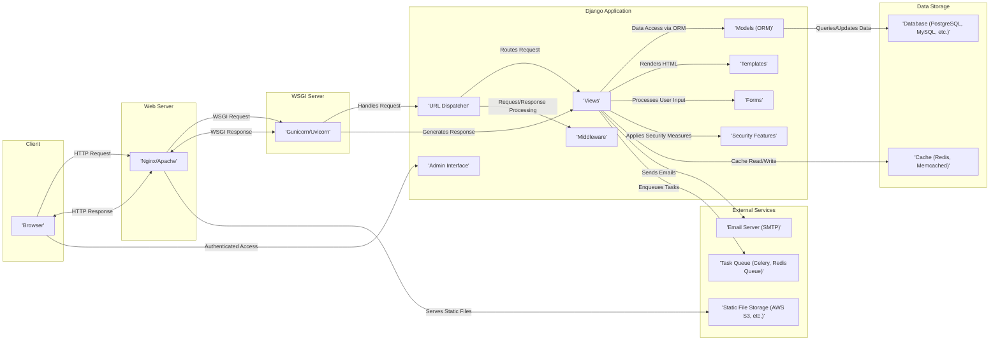

## Project Design Document: Django Web Framework (Improved)

**1. Introduction**

This document provides an enhanced architectural overview of the Django web framework, specifically tailored for threat modeling activities. It outlines the key components, data flows, and external dependencies of the framework with a focus on security implications. This document concentrates on the core Django framework itself, rather than specific applications built using it. The goal is to provide a clear and detailed understanding of Django's architecture to facilitate the identification of potential security vulnerabilities.

**2. Goals**

* To provide a precise and security-focused description of Django's architecture.
* To clearly identify key components and their interactions, highlighting potential security boundaries.
* To detail the typical data flow within a Django application, pinpointing stages where security controls are crucial.
* To explicitly list external dependencies and integration points, emphasizing potential risks associated with them.
* To serve as a comprehensive and actionable input for a detailed threat model.

**3. Target Audience**

* Security architects and engineers responsible for threat modeling and security assessments.
* Development teams involved in building and maintaining Django applications, requiring a security-focused architectural understanding.
* Anyone seeking a deep understanding of Django's architecture from a security perspective.

**4. System Architecture**

Django adheres to the Model-Template-Views (MTV) architectural pattern. The core components and their interactions, relevant for security analysis, are visualized below:

**5. Key Components (Security Perspective)**

* **URL Dispatcher:**  Maps URLs to view functions. Security considerations include potential for denial-of-service through crafted URLs and the importance of secure URL design to prevent information disclosure.
* **Views:** Handle application logic. Vulnerabilities can arise from improper input validation, insecure data handling, and insufficient authorization checks.
* **Models (ORM):**  Provides an interface to the database. Security risks include SQL Injection if raw SQL queries are used improperly or if input is not sanitized before database interaction.
* **Templates:**  Render dynamic content. A primary security concern is Cross-Site Scripting (XSS) if user-provided data is not properly escaped before being included in the rendered HTML.
* **Forms:**  Handle user input. Crucial for security is robust validation to prevent injection attacks and ensure data integrity.
* **Middleware:**  Processes requests and responses. Provides opportunities for implementing security features like authentication, authorization, and setting security headers. Misconfigured middleware can introduce vulnerabilities.
* **Admin Interface:**  A powerful tool for managing data. Requires strong authentication and authorization to prevent unauthorized access and data manipulation.
* **Security Features:** Django provides built-in protections against common web vulnerabilities. Understanding how these features are implemented and configured is essential for effective threat modeling.

**6. Data Flow (Security Checkpoints)**

A typical HTTP request to a Django application, highlighting security-relevant stages:

1. **Client Request:** A user's browser sends an HTTP request. Potential threats: Maliciously crafted requests attempting to exploit vulnerabilities.
2. **Web Server Handling:** The web server receives the request. Security considerations:  Web server configuration (e.g., handling of TLS, security headers).
3. **WSGI Server Routing:** The WSGI server forwards the request. Security considerations:  Ensuring secure communication channels.
4. **Middleware Processing (Request):**  Middleware functions process the incoming request. Security checkpoints: Authentication, authorization, request filtering, CSRF token verification.
5. **URL Dispatching:** Django maps the URL to a view. Security considerations:  Exposure of sensitive information through predictable URL patterns.
6. **View Execution:** The corresponding view function is executed. Security checkpoints: Input validation, authorization checks before accessing resources or data.
7. **Model Interaction (ORM):** The view interacts with the database via the ORM. Security checkpoints:  Ensuring proper use of the ORM to prevent SQL Injection, data access controls.
8. **Template Rendering:** The view renders a template with data. Security checkpoints:  Output escaping to prevent XSS vulnerabilities.
9. **Response Generation:** The view generates an HTTP response. Security considerations:  Avoiding the inclusion of sensitive information in the response.
10. **Middleware Processing (Response):** Middleware functions process the outgoing response. Security checkpoints: Setting security headers (e.g., Content-Security-Policy, X-Frame-Options).
11. **WSGI Server Response:** The WSGI server sends the response back to the web server. Security considerations: Secure communication.
12. **Web Server Response:** The web server sends the HTTP response back to the client's browser. Security considerations: Secure delivery of content.

**7. External Dependencies and Integrations (Security Implications)**

Django applications often integrate with external components, each presenting potential security risks:

* **Web Servers (Nginx, Apache):** Vulnerabilities in the web server software can expose the application. Misconfigurations can lead to information disclosure or other attacks.
* **WSGI Servers (Gunicorn, Uvicorn):**  Security vulnerabilities in the WSGI server can impact the application's security.
* **Databases (PostgreSQL, MySQL, etc.):**  Database security is critical. Weak credentials, unpatched vulnerabilities, and improper access controls can lead to data breaches.
* **Caching Systems (Redis, Memcached):**  If not properly secured, caching systems can be exploited to access sensitive data or inject malicious content.
* **Email Servers (SMTP):**  Compromised email credentials can be used for phishing or sending malicious emails. Ensure secure SMTP configuration.
* **Task Queues (Celery, Redis Queue):**  If not secured, attackers might be able to inject malicious tasks.
* **Static File Storage (AWS S3, Google Cloud Storage, Azure Blob Storage):**  Incorrectly configured permissions on storage buckets can lead to unauthorized access to static files.
* **Authentication Providers (OAuth 2.0, Social Login):**  Trusting external authentication providers introduces dependencies on their security. Ensure proper OAuth configuration and validation.
* **Logging Services (Sentry, ELK stack):**  Sensitive information should be excluded from logs. Secure access to logging infrastructure is important.

**8. Security Considerations (Detailed)**

Django's built-in security features and recommended practices:

* **Cross-Site Scripting (XSS) Protection:** Django's template engine automatically escapes output by default. Developers should be mindful of when to mark content as safe and the risks involved.
* **Cross-Site Request Forgery (CSRF) Protection:** Django provides middleware to protect against CSRF attacks by requiring a secret token in POST requests. This middleware must be enabled and used correctly.
* **SQL Injection Protection:** Django's ORM helps prevent SQL Injection by parameterizing queries. Developers should avoid using raw SQL queries where possible and sanitize input if they are necessary.
* **Password Management:** Django provides utilities for securely hashing passwords. Developers should use these utilities and avoid storing passwords in plaintext.
* **Session Security:** Django uses signed cookies for session management. Configuration options exist for secure session storage and cookie attributes (e.g., `HttpOnly`, `Secure`).
* **Clickjacking Protection:** Django's `X-Frame-Options` middleware can be used to prevent clickjacking attacks.
* **HTTPS Enforcement:** Django provides guidance and settings to enforce HTTPS connections, ensuring data is encrypted in transit.
* **Security Headers:** Django allows setting various security-related HTTP headers through middleware, such as `Strict-Transport-Security`, `Content-Security-Policy`, and `X-Content-Type-Options`.
* **Authentication and Authorization:** Django provides a robust authentication and authorization framework. Developers should implement proper access controls and permissions.

**9. Threat Modeling Focus Areas (Categorized)**

Based on the architecture and security considerations, threat modeling efforts should focus on the following categories:

* **Input Validation and Data Handling:**
    * Injection Attacks (SQL, Command, Template)
    * Cross-Site Scripting (XSS)
    * Insecure Deserialization
    * Data Integrity Violations
* **Authentication and Authorization:**
    * Broken Authentication (Weak passwords, credential stuffing)
    * Broken Authorization (Privilege escalation, insecure direct object references)
    * Session Management Vulnerabilities
* **Cross-Site Request Forgery (CSRF):**
    * Absence or misconfiguration of CSRF protection.
* **Security Misconfiguration:**
    * Improperly configured web servers, databases, or Django settings.
    * Exposed sensitive information through error messages or debugging tools.
    * Default credentials.
* **Vulnerable and Outdated Components:**
    * Security vulnerabilities in Django itself or in third-party libraries.
* **Information Disclosure:**
    * Exposure of sensitive data through logs, URLs, or error messages.
* **Denial of Service (DoS):**
    * Resource exhaustion attacks targeting the application or its dependencies.
* **External Dependencies:**
    * Security vulnerabilities in external services or libraries.
    * Insecure integration with external services.

**10. Conclusion**

This improved design document provides a more detailed and security-focused overview of the Django web framework's architecture. It highlights key components, data flows, and external dependencies, emphasizing potential security vulnerabilities and areas that require careful consideration during threat modeling. This document serves as a valuable resource for security professionals and developers to proactively identify and mitigate security risks in Django applications.