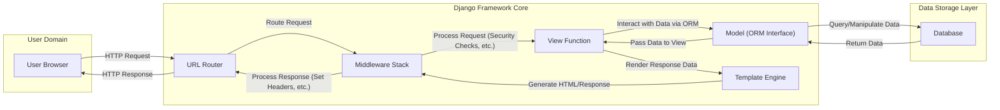

## Project Design Document: Django Web Framework (Improved)

**Project Link:** https://github.com/django/django

**Document Version:** 1.1
**Date:** October 26, 2023
**Author:** AI Software Architect

### 1. Project Overview

Django is a high-level Python web framework designed for rapid development and a clean, pragmatic approach. It provides a robust set of tools and conventions to streamline the creation of web applications, handling many common web development tasks out of the box. Being open-source, Django benefits from community scrutiny and contributions, which aids in identifying and addressing potential security vulnerabilities.

This document details the architectural design of the Django framework, specifically tailored for threat modeling exercises. It focuses on the core components, data flow pathways, and critical interactions within the framework that are relevant to security considerations.

### 2. Architectural Overview

Django adheres to the Model-Template-Views (MTV) architectural pattern, a variation of the Model-View-Controller (MVC) pattern. This structure promotes separation of concerns, making the codebase more maintainable and understandable. Key architectural elements include:

*   **Models:** Define the structure of data, representing database tables and providing an interface for data access and manipulation.
*   **Views:** Contain the application's logic, receiving requests, processing data (often interacting with models), and preparing data for the template.
*   **Templates:** Define the presentation layer, using a template language to dynamically generate HTML and other output formats.

Beyond the core MTV pattern, Django incorporates several essential components that contribute to its functionality and security posture:

*   **URL Router:**  Maps incoming HTTP requests to specific view functions based on URL patterns.
*   **Middleware Stack:** A series of interceptors that process requests and responses globally, providing hooks for authentication, security checks, and other cross-cutting concerns.
*   **Template Engine:**  Renders templates by substituting variables with data, ensuring proper escaping to prevent XSS.
*   **Object-Relational Mapper (ORM):**  Provides an abstraction layer for database interactions, allowing developers to work with Python objects instead of writing raw SQL, which helps mitigate SQL injection risks.
*   **Admin Interface:** An automatically generated, customizable interface for managing data models, requiring robust authentication and authorization.
*   **Forms:**  Handles user input, data validation, and data cleaning, crucial for preventing malicious input.
*   **Authentication and Authorization System:** Manages user accounts, login/logout functionality, and permissions to control access to resources.
*   **Sessions and Cookies Framework:**  Manages user session data, typically using cookies to maintain state between requests.
*   **Built-in Security Features:** Includes default protections against common web vulnerabilities like CSRF, XSS, and clickjacking.

### 3. Data Flow Analysis

Understanding the flow of data through a Django application is crucial for identifying potential attack vectors. The typical request-response lifecycle involves these key stages:

*   **User Initiates Request:** A user interacts with the application through their browser, sending an HTTP request (e.g., clicking a link, submitting a form).
*   **Request Routing:** The **URL Router** receives the request and matches the URL against defined patterns to determine the appropriate **view function** to handle it.
*   **Middleware Processing:** The request passes through the **Middleware Stack**. Each middleware component can inspect or modify the request before it reaches the view. This is where security checks like CSRF verification and session handling often occur.
*   **View Execution:** The designated **view function** is executed. This function typically performs the core application logic, which may involve:
    *   Interacting with **Models** through the **ORM** to retrieve, create, update, or delete data in the **Database**.
    *   Performing business logic and data processing.
    *   Preparing data to be passed to a **Template**.
*   **Template Rendering:** The **Template Engine** takes a **Template** and the data provided by the view to generate the final response, usually HTML. Crucially, the template engine performs automatic escaping of variables to prevent XSS.
*   **Response Middleware:** The generated response passes back through the **Middleware Stack**, allowing middleware components to modify the response (e.g., setting security headers).
*   **Response Delivery:** Django sends the HTTP response back to the user's browser.

### 4. Key Components and Threat Vectors

This section details key Django components and potential threat vectors associated with them:

*   **URL Router:**
    *   Functionality: Maps URLs to views. Incorrect configuration can lead to unintended access or denial of service.
    *   Threat Vectors:
        *   **Insecure Direct Object References:**  Exposing internal object IDs in URLs without proper authorization checks.
        *   **Path Traversal:**  Manipulating URLs to access files or directories outside the intended scope.
        *   **Denial of Service (DoS):**  Crafting URLs that consume excessive server resources.

*   **Middleware Stack:**
    *   Functionality: Processes requests and responses globally. Improperly implemented or ordered middleware can introduce vulnerabilities or bypass security measures.
    *   Threat Vectors:
        *   **Bypassing Security Checks:**  Incorrect middleware ordering can allow requests to bypass authentication or authorization.
        *   **Information Disclosure:**  Middleware logging sensitive information in an insecure manner.
        *   **Man-in-the-Middle (MitM) Attacks:**  Middleware failing to enforce HTTPS or other secure protocols.

*   **View Functions:**
    *   Functionality: Handles application logic. Susceptible to various injection attacks and business logic flaws.
    *   Threat Vectors:
        *   **SQL Injection:**  Directly embedding user input into SQL queries (though the ORM mitigates this, raw SQL usage is still a risk).
        *   **Command Injection:**  Executing arbitrary system commands based on user input.
        *   **Cross-Site Scripting (XSS):**  Passing unescaped user input to templates (mitigated by Django's template engine, but developer errors can still occur).
        *   **Business Logic Flaws:**  Errors in the application's logic that can be exploited for unauthorized actions.

*   **Models (ORM):**
    *   Functionality: Provides an interface for database interaction. While it helps prevent SQL injection, misuse can still lead to vulnerabilities.
    *   Threat Vectors:
        *   **Mass Assignment Vulnerabilities:**  Allowing users to modify unintended model fields through request data.
        *   **Insecure Query Construction:**  Using `extra()` or raw SQL without proper sanitization.
        *   **Denial of Service (DoS):**  Crafting complex queries that overload the database.

*   **Template Engine:**
    *   Functionality: Renders dynamic HTML. While it automatically escapes variables, developers need to be aware of contexts where manual escaping is required.
    *   Threat Vectors:
        *   **Cross-Site Scripting (XSS):**  Using the `safe` filter inappropriately or rendering untrusted HTML.
        *   **Server-Side Template Injection (SSTI):**  Less common in Django due to its design, but potential if developers use custom template tags or filters insecurely.

*   **Admin Interface:**
    *   Functionality: Provides a powerful interface for managing data. If not properly secured, it can be a prime target for attackers.
    *   Threat Vectors:
        *   **Brute-Force Attacks:**  Attempting to guess admin credentials.
        *   **Default Credentials:**  Using default or weak passwords.
        *   **Insufficient Authorization:**  Granting excessive permissions to admin users.
        *   **Session Hijacking:**  Compromising admin user sessions.

*   **Forms:**
    *   Functionality: Handles user input and validation. Improper validation can lead to data integrity issues and vulnerabilities.
    *   Threat Vectors:
        *   **Bypassing Validation:**  Submitting data that bypasses client-side or server-side validation.
        *   **Mass Assignment Vulnerabilities:**  Failing to specify which fields are allowed for user input.

*   **Authentication and Authorization System:**
    *   Functionality: Manages user accounts and access control. Weaknesses in this system can have severe security implications.
    *   Threat Vectors:
        *   **Weak Password Policies:**  Allowing users to create easily guessable passwords.
        *   **Credential Stuffing:**  Using compromised credentials from other breaches.
        *   **Insecure Password Storage:**  Storing passwords in plaintext or using weak hashing algorithms.
        *   **Insufficient Authorization Checks:**  Allowing users to access resources they shouldn't.

*   **Sessions and Cookies Framework:**
    *   Functionality: Maintains user state. Vulnerabilities can lead to unauthorized access.
    *   Threat Vectors:
        *   **Session Hijacking:**  Stealing a user's session ID.
        *   **Session Fixation:**  Forcing a user to use a known session ID.
        *   **Insecure Cookie Attributes:**  Not setting `HttpOnly`, `Secure`, or `SameSite` flags appropriately.

*   **Built-in Security Features:**
    *   Functionality: Provides default protections. Developers must ensure they are enabled and configured correctly.
    *   Threat Vectors:
        *   **Misconfiguration:**  Disabling or incorrectly configuring security middleware (e.g., CSRF protection).
        *   **Outdated Dependencies:**  Using older versions of Django with known vulnerabilities.

### 5. Security Considerations and Best Practices

To mitigate the identified threats, consider the following security best practices when developing Django applications:

*   **Strict Input Validation:**  Validate all user input on the server-side, using Django Forms for structured validation and sanitization.
*   **Secure Output Encoding:**  Rely on Django's template engine for automatic escaping of variables. Be mindful of contexts where manual escaping might be necessary.
*   **Robust Authentication and Authorization:** Implement strong password policies, enforce multi-factor authentication where appropriate, and use Django's permission system to control access.
*   **Secure Session Management:**  Use secure cookie settings (`HttpOnly`, `Secure`, `SameSite`), regenerate session IDs after login, and implement session timeouts.
*   **CSRF Protection:**  Ensure CSRF protection is enabled globally and correctly implemented in all forms and AJAX requests.
*   **Parameterized Queries:**  Avoid constructing SQL queries directly. Utilize the ORM's query methods or parameterized queries for raw SQL.
*   **Security Headers:**  Configure security headers like `Content-Security-Policy`, `X-Content-Type-Options`, and `Strict-Transport-Security` using Django middleware or web server configuration.
*   **Dependency Management:**  Keep Django and all its dependencies up-to-date to patch known security vulnerabilities. Use tools like `pip freeze` and `pip-audit` to manage dependencies.
*   **Secure Secret Key Management:**  Store the `SECRET_KEY` securely and rotate it periodically. Avoid committing it to version control.
*   **Error Handling and Logging:**  Implement proper error handling to prevent information disclosure. Log errors securely for debugging and auditing.
*   **Secure File Uploads:**  Validate file types, sizes, and content. Store uploaded files outside the web server's document root.
*   **Regular Security Audits and Penetration Testing:**  Conduct regular security assessments to identify potential vulnerabilities.

### 6. Deployment Security Considerations

The security of a Django application is also heavily influenced by its deployment environment. Consider these points:

*   **HTTPS Enforcement:**  Always deploy Django applications over HTTPS to encrypt communication.
*   **Web Server Security:**  Securely configure the web server (e.g., Nginx, Apache) handling requests for the Django application. This includes proper handling of static files and proxy settings.
*   **Operating System Security:**  Harden the underlying operating system by applying security patches and disabling unnecessary services.
*   **Network Security:**  Implement firewall rules and network segmentation to restrict access to the application server.
*   **Platform-as-a-Service (PaaS) Security:**  Leverage the security features provided by the PaaS platform and understand the shared responsibility model.
*   **Container Security:**  If using containers (Docker, Kubernetes), secure the container images and the orchestration platform. Follow container security best practices.
*   **Secrets Management:**  Securely manage sensitive configuration data like database credentials and API keys, using tools like HashiCorp Vault or environment variables.
*   **Monitoring and Logging:**  Implement comprehensive monitoring and logging to detect and respond to security incidents. Use a centralized logging system.
*   **Regular Security Updates:**  Keep all components of the deployment environment up-to-date with the latest security patches.

This improved design document provides a more detailed and threat-modeling-focused overview of the Django framework. It highlights potential vulnerabilities within each component and offers actionable security considerations for developers and security professionals. Remember that a thorough threat model will also require analysis of the specific application code built using Django.