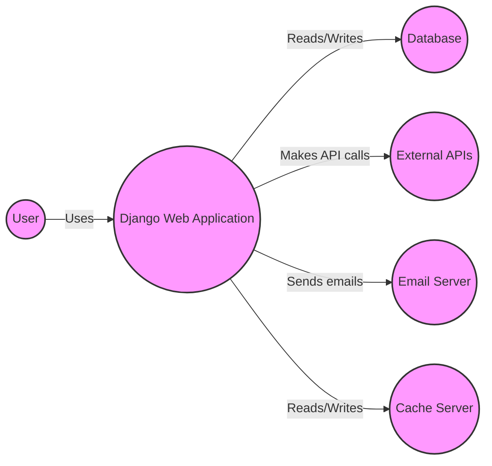
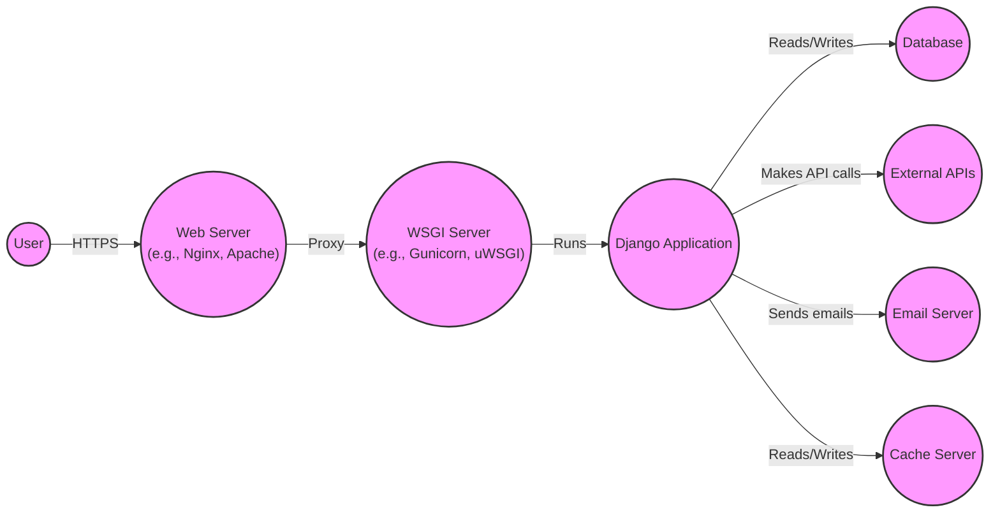
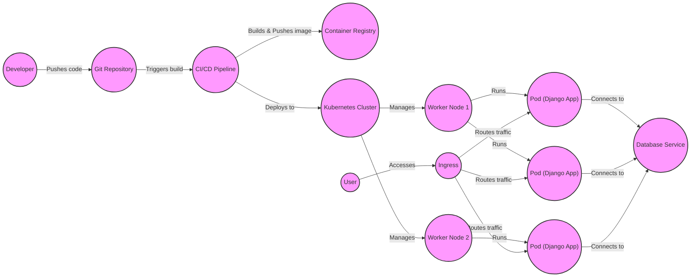
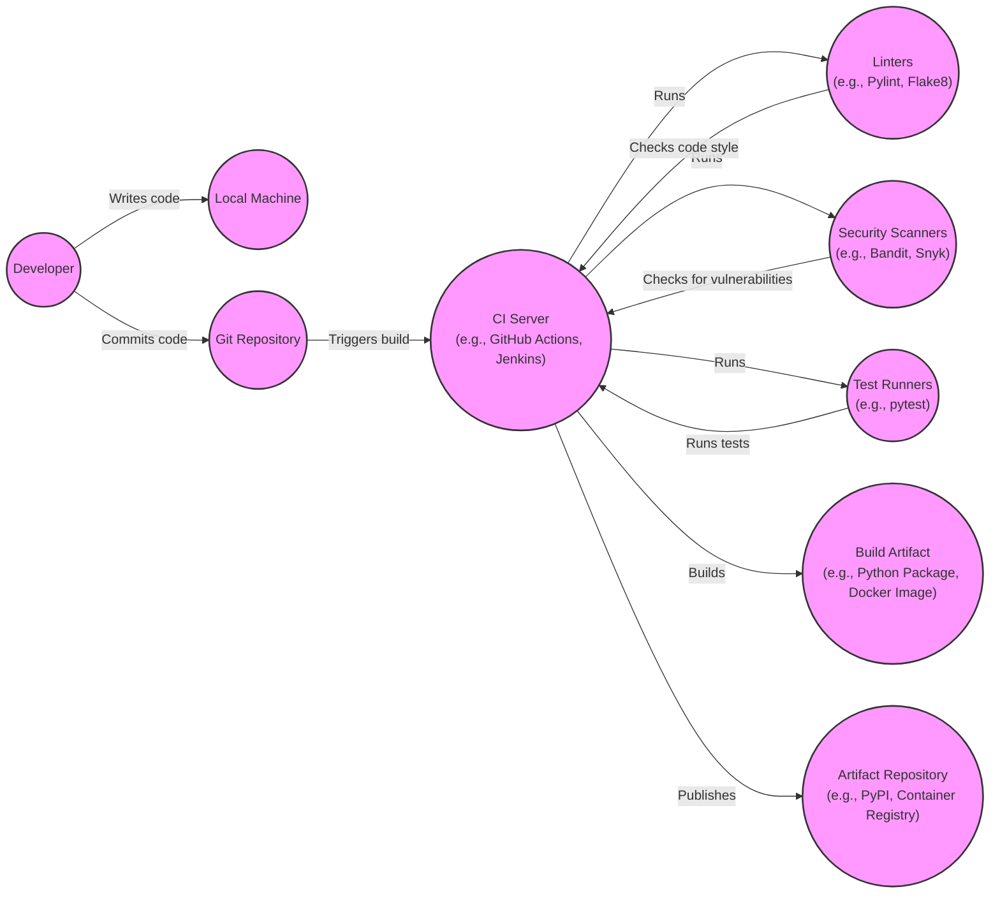

Okay, let's create a design document for the Django project, focusing on aspects relevant for threat modeling.

# BUSINESS POSTURE

Django is a high-level Python web framework that encourages rapid development and clean, pragmatic design.  It's used by startups and large enterprises alike, but its core value proposition is enabling fast, secure development of web applications.  The business priorities are:

*   Rapid Development:  Enable developers to build and deploy web applications quickly.
*   Maintainability:  Create a codebase that is easy to understand, modify, and maintain over time.
*   Security:  Provide built-in protections against common web vulnerabilities.
*   Scalability:  Allow applications built with Django to scale to handle large amounts of traffic and data.
*   Community: Foster a large and active community of developers to contribute to the framework and provide support.
*   Extensibility: Allow developers to easily extend and customize the framework to meet their specific needs.

Business risks that need to be addressed, based on these priorities:

*   Security Vulnerabilities:  Any security flaws in Django itself could expose a vast number of applications to attack. This is the most critical risk.
*   Breaking Changes:  Major updates that introduce incompatibilities could disrupt existing applications, hindering maintainability and rapid development.
*   Performance Bottlenecks:  Performance issues within the framework could limit the scalability of applications built with it.
*   Community Fragmentation:  A decline in community engagement could slow down development and reduce the availability of support.
*   Lack of Adoption of Security Features: Even if Django provides security features, developers might not use them correctly, leading to vulnerabilities in their applications.

# SECURITY POSTURE

Django has a strong emphasis on security and incorporates numerous built-in controls. It also acknowledges certain inherent risks.

*   security control: Cross-Site Scripting (XSS) protection: Django's templating system automatically escapes output, mitigating XSS risks. (Implemented in: Templating engine)
*   security control: Cross-Site Request Forgery (CSRF) protection: Django includes middleware and template tags to generate and verify CSRF tokens. (Implemented in: Middleware, template tags)
*   security control: SQL Injection protection: Django's ORM (Object-Relational Mapper) constructs SQL queries in a way that prevents SQL injection vulnerabilities. (Implemented in: ORM)
*   security control: Clickjacking protection: Django provides middleware to set the `X-Frame-Options` header, mitigating clickjacking attacks. (Implemented in: Middleware)
*   security control: Host Header validation: Django validates the `Host` header to prevent certain types of attacks. (Implemented in: HTTP handling)
*   security control: Session management: Django provides secure session management features, including options for HTTPS-only cookies and secure session storage. (Implemented in: Session middleware)
*   security control: User authentication: Django includes a robust user authentication system with password hashing (using strong, configurable hashing algorithms like PBKDF2 by default) and password reset functionality. (Implemented in: `django.contrib.auth`)
*   security control: File upload handling: Django provides mechanisms for safely handling file uploads, including validation of file types and sizes. (Implemented in: File upload handling)
*   security control: Security Middleware: Includes several middleware components that add security-related HTTP headers and behaviors. (Implemented in: Middleware)
*   security control: Regular Security Releases: The Django team releases security updates promptly to address discovered vulnerabilities. (Implemented in: Release process)

*   accepted risk: Third-party packages: Django applications often rely on third-party packages, which may introduce their own security vulnerabilities. Django's security guarantees do not extend to these packages.
*   accepted risk: Developer errors: While Django provides security features, developers can still make mistakes that introduce vulnerabilities (e.g., disabling CSRF protection, writing custom SQL queries without proper escaping).
*   accepted risk: Deployment environment: The security of a Django application also depends on the security of the deployment environment (e.g., web server, database server, operating system).
*   accepted risk: Supply chain attacks: Compromise of the Django project's build or distribution infrastructure could lead to the distribution of malicious code.

Recommended security controls (high priority):

*   security control: Implement a robust Content Security Policy (CSP) to further mitigate XSS and other code injection attacks. This is often configured at the web server level (e.g., Nginx, Apache) but can also be managed within Django using middleware.
*   security control: Integrate with security linters and static analysis tools (e.g., Bandit, Semgrep) to automatically detect potential security issues in the codebase.
*   security control: Implement dependency checking to identify and update vulnerable third-party packages. Tools like Dependabot (for GitHub) or Snyk can be used.
*   security control: Regularly conduct penetration testing and security audits to identify and address vulnerabilities.

Security Requirements:

*   Authentication:
    *   Strong password hashing must be used (PBKDF2, Argon2).
    *   Multi-factor authentication (MFA) should be supported as an option.
    *   Account lockout mechanisms should be implemented to prevent brute-force attacks.
    *   Secure password reset functionality must be provided.

*   Authorization:
    *   A robust role-based access control (RBAC) system should be used to restrict access to sensitive data and functionality.
    *   Object-level permissions should be supported where necessary.

*   Input Validation:
    *   All user input must be validated on the server-side.
    *   Input validation should be based on a whitelist approach (i.e., explicitly defining what is allowed) rather than a blacklist approach.
    *   Data should be validated against the expected data type, length, and format.

*   Cryptography:
    *   Sensitive data (e.g., passwords, API keys) must be encrypted at rest and in transit.
    *   Strong, industry-standard cryptographic algorithms must be used.
    *   Cryptographic keys must be managed securely.

# DESIGN

## C4 CONTEXT

C4 Context Element Descriptions:

*   Element:
    *   Name: User
    *   Type: Person
    *   Description: A user interacting with the Django Web Application through a web browser or other client.
    *   Responsibilities: Accessing the application, providing input, viewing output.
    *   Security controls: Browser-based security controls (e.g., same-origin policy), user-provided credentials.

*   Element:
    *   Name: Django Web Application
    *   Type: Software System
    *   Description: The web application built using the Django framework.
    *   Responsibilities: Handling user requests, processing data, interacting with other systems, rendering responses.
    *   Security controls: XSS protection, CSRF protection, SQL injection protection, session management, user authentication, input validation, etc. (as described in the Security Posture section).

*   Element:
    *   Name: Database
    *   Type: Software System
    *   Description: The database used to store the application's data (e.g., PostgreSQL, MySQL, SQLite).
    *   Responsibilities: Storing and retrieving data.
    *   Security controls: Database access controls, encryption at rest, regular backups.

*   Element:
    *   Name: External APIs
    *   Type: Software System
    *   Description: External APIs that the Django application interacts with (e.g., payment gateways, social media APIs).
    *   Responsibilities: Providing specific services to the Django application.
    *   Security controls: API keys, OAuth, rate limiting, input validation.

*   Element:
    *   Name: Email Server
    *   Type: Software System
    *   Description: The email server used to send emails from the Django application (e.g., SMTP server).
    *   Responsibilities: Sending emails.
    *   Security controls: TLS encryption, sender authentication (SPF, DKIM, DMARC).

*   Element:
    *   Name: Cache Server
    *   Type: Software System
    *   Description: A cache server used to improve performance (e.g., Redis, Memcached).
    *   Responsibilities: Storing frequently accessed data in memory for faster retrieval.
    *   Security controls: Access controls, data validation.

## C4 CONTAINER

C4 Container Element Descriptions:

*   Element:
    *   Name: User
    *   Type: Person
    *   Description: Same as in the Context diagram.
    *   Responsibilities: Same as in the Context diagram.
    *   Security controls: Same as in the Context diagram.

*   Element:
    *   Name: Web Server (e.g., Nginx, Apache)
    *   Type: Container
    *   Description: The web server that handles incoming requests and serves static files.
    *   Responsibilities: Handling HTTPS connections, serving static files, proxying requests to the WSGI server.
    *   Security controls: TLS configuration, access controls, request filtering, rate limiting.

*   Element:
    *   Name: WSGI Server (e.g., Gunicorn, uWSGI)
    *   Type: Container
    *   Description: The WSGI server that runs the Django application.
    *   Responsibilities: Running the Django application, handling requests from the web server, managing worker processes.
    *   Security controls: Process isolation, resource limits.

*   Element:
    *   Name: Django Application
    *   Type: Container
    *   Description: The Django application code, including views, models, templates, and other components.
    *   Responsibilities: Handling application logic, interacting with the database and other systems.
    *   Security controls: Same as in the Context diagram (Django's built-in security features).

*   Element:
    *   Name: Database
    *   Type: Container
    *   Description: Same as in the Context diagram.
    *   Responsibilities: Same as in the Context diagram.
    *   Security controls: Same as in the Context diagram.

*   Element:
    *   Name: External APIs
    *   Type: Container
    *   Description: Same as in the Context diagram.
    *   Responsibilities: Same as in the Context diagram.
    *   Security controls: Same as in the Context diagram.

*   Element:
    *   Name: Email Server
    *   Type: Container
    *   Description: Same as in the Context diagram.
    *   Responsibilities: Same as in the Context diagram.
    *   Security controls: Same as in the Context diagram.

*   Element:
    *   Name: Cache Server
    *   Type: Container
    *   Description: Same as in the Context diagram.
    *   Responsibilities: Same as in the Context diagram.
    *   Security controls: Same as in the Context diagram.

## DEPLOYMENT

Possible deployment solutions:

1.  Traditional server deployment (e.g., virtual machines, bare metal servers).
2.  Platform as a Service (PaaS) deployment (e.g., Heroku, AWS Elastic Beanstalk, Google App Engine).
3.  Containerized deployment (e.g., Docker, Kubernetes).
4.  Serverless deployment (e.g., AWS Lambda, Google Cloud Functions).

Chosen solution for detailed description: Containerized deployment using Docker and Kubernetes.

Deployment Element Descriptions:

*   Element:
    *   Name: Developer
    *   Type: Person
    *   Description: A developer working on the Django application.
    *   Responsibilities: Writing code, committing changes to the Git repository.
    *   Security controls: Code review, secure coding practices.

*   Element:
    *   Name: Git Repository
    *   Type: Software System
    *   Description: The Git repository storing the application's source code.
    *   Responsibilities: Version control, code storage.
    *   Security controls: Access controls, branch protection rules.

*   Element:
    *   Name: CI/CD Pipeline
    *   Type: Software System
    *   Description: The CI/CD pipeline that automates the build, test, and deployment process.
    *   Responsibilities: Building Docker images, running tests, deploying to Kubernetes.
    *   Security controls: Secure build environment, vulnerability scanning, secrets management.

*   Element:
    *   Name: Container Registry
    *   Type: Software System
    *   Description: The container registry storing the Docker images.
    *   Responsibilities: Storing and distributing Docker images.
    *   Security controls: Access controls, image scanning.

*   Element:
    *   Name: Kubernetes Cluster
    *   Type: Software System
    *   Description: The Kubernetes cluster managing the deployment of the application.
    *   Responsibilities: Orchestrating containers, managing resources, scaling.
    *   Security controls: Role-based access control (RBAC), network policies, pod security policies.

*   Element:
    *   Name: Worker Node 1
    *   Type: Node
    *   Description: A worker node in the Kubernetes cluster.
    *   Responsibilities: Running pods.
    *   Security controls: Operating system hardening, regular security updates.

*   Element:
    *   Name: Worker Node 2
    *   Type: Node
    *   Description: A worker node in the Kubernetes cluster.
    *   Responsibilities: Running pods.
    *   Security controls: Operating system hardening, regular security updates.

*   Element:
    *   Name: Pod (Django App)
    *   Type: Container
    *   Description: A pod running the Django application container.
    *   Responsibilities: Handling user requests.
    *   Security controls: Django's built-in security features, container security best practices.

*   Element:
    *   Name: Database Service
    *   Type: Software System/Container
    *   Description: The database service used by the application (e.g., a managed database service like AWS RDS, or a database running in a separate pod).
    *   Responsibilities: Storing and retrieving data.
    *   Security controls: Database access controls, encryption at rest, regular backups.

*   Element:
    *   Name: Ingress
    *   Type: Software System
    *   Description: The Kubernetes Ingress controller that manages external access to the application.
    *   Responsibilities: Routing traffic to the appropriate pods.
    *   Security controls: TLS termination, access controls, request filtering.

*   Element:
    *   Name: User
    *   Type: Person
    *   Description: Same as in previous diagrams.
    *   Responsibilities: Same as in previous diagrams.
    *   Security controls: Same as in previous diagrams.

## BUILD

Build Process Description:

1.  Developer writes code on their local machine.
2.  Developer commits code to the Git repository.
3.  The commit triggers a build on the CI server (e.g., GitHub Actions, Jenkins).
4.  The CI server runs linters (e.g., Pylint, Flake8) to check code style and identify potential errors.
5.  The CI server runs security scanners (e.g., Bandit, Snyk) to check for security vulnerabilities.
6.  The CI server runs test runners (e.g., pytest) to execute unit tests, integration tests, and other tests.
7.  If all checks and tests pass, the CI server builds the build artifact (e.g., Python package, Docker image).
8.  The CI server publishes the build artifact to an artifact repository (e.g., PyPI for Python packages, a container registry for Docker images).

Security Controls in the Build Process:

*   Code review: All code changes should be reviewed by another developer before being merged.
*   Linters: Linters help enforce coding standards and identify potential errors.
*   Security scanners: Security scanners automatically detect potential security vulnerabilities in the code and its dependencies.
*   Automated testing: Automated tests help ensure that the code functions correctly and that security controls are working as expected.
*   Secure build environment: The CI server should be configured securely, with limited access and appropriate security measures in place.
*   Secrets management: Sensitive data (e.g., API keys, passwords) should be managed securely and not hardcoded in the codebase or build scripts.
*   Dependency management: Dependencies should be managed carefully, and vulnerable dependencies should be updated promptly.
*   Signed Commits: Developers should sign their Git commits to ensure authenticity and prevent tampering.

# RISK ASSESSMENT

*   Critical Business Processes:
    *   User authentication and authorization.
    *   Data storage and retrieval.
    *   Handling of user input.
    *   Interaction with external APIs.
    *   Email sending.
    *   Serving web pages.

*   Data to Protect and Sensitivity:
    *   User data (e.g., usernames, passwords, email addresses, personal information): High sensitivity.
    *   Application data (depending on the specific application): Variable sensitivity, ranging from low to high.
    *   Session data: High sensitivity.
    *   API keys and other credentials: High sensitivity.
    *   Configuration data: Medium sensitivity.
    *   Logs: Low to medium sensitivity (depending on what is logged).

# QUESTIONS & ASSUMPTIONS

*   Questions:
    *   What specific external APIs does Django interact with?  This will influence the threat model related to API security.
    *   What is the expected scale of a typical Django application (users, requests per second, data volume)? This helps assess performance and scalability risks.
    *   What are the specific regulatory requirements (e.g., GDPR, CCPA) that apply to Django applications? This informs data privacy and security requirements.
    *   What is the process for reporting and addressing security vulnerabilities in Django itself?
    *   What level of support is provided for older versions of Django?

*   Assumptions:
    *   BUSINESS POSTURE: We assume a moderate risk appetite, balancing rapid development with the need for robust security.  Django is used in a wide variety of contexts, so we can't assume a startup's high risk tolerance or a Fortune 500's extreme risk aversion.
    *   SECURITY POSTURE: We assume that developers using Django are aware of basic web security principles but may not be security experts. We assume that the deployment environment is reasonably secure but not perfectly hardened.
    *   DESIGN: We assume a standard deployment architecture using a web server, WSGI server, and a relational database. We assume that the application uses common Django features like the ORM, templating system, and authentication framework. We assume the use of a CI/CD pipeline for building and deploying the application.