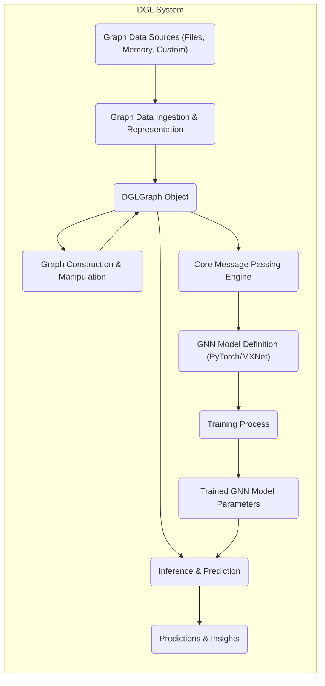

## Project Design Document: Deep Graph Library (DGL) - Improved

**1. Introduction**

This document provides an enhanced architectural overview of the Deep Graph Library (DGL) project, an open-source Python package specifically designed for implementing graph neural networks (GNNs). This detailed design serves as a crucial foundation for subsequent threat modeling activities, offering a clear and comprehensive understanding of DGL's internal components, data flow mechanisms, and inter-module interactions. The intended audience includes security engineers, software developers, system architects, and anyone involved in evaluating and securing systems that leverage DGL.

**2. Project Overview**

DGL is a high-performance, message-passing centric framework built upon established deep learning platforms such as PyTorch and Apache MXNet. It significantly simplifies the development of GNNs by offering a high-level, intuitive API for defining complex graph structures, implementing custom message passing logic, and managing the intricacies of the training process. DGL prioritizes both flexibility and efficiency, accommodating a wide range of graph types (homogeneous and heterogeneous) and supporting diverse GNN architectures. Its core strength lies in abstracting away the complexities of graph operations, allowing researchers and developers to focus on the design and implementation of novel GNN models.

**3. System Architecture**

DGL's architecture is modular and can be dissected into the following key functional components:

*   **Graph Data Ingestion and Representation Layer:** This initial layer is responsible for acquiring graph data from various sources and transforming it into DGL's internal representation.
    *   **Data Sources:**
        *   In-memory Python data structures: This includes standard Python lists, dictionaries, NumPy arrays, and SciPy sparse matrices, providing flexibility for direct data input.
        *   Disk-based file formats: DGL supports reading graph data from common file formats like CSV (Comma Separated Values) and JSON (JavaScript Object Notation), facilitating data persistence and exchange.
        *   Custom Data Loaders: DGL allows developers to implement custom data loading logic to integrate with specialized data storage systems or APIs, extending its data source capabilities.
    *   **Graph Representation:**
        *   `DGLGraph` Object: At the heart of DGL lies the `DGLGraph` object, an efficient data structure optimized for storing graph topology (nodes and edges) and associated feature data.
        *   Heterogeneous Graph Support: DGL natively supports heterogeneous graphs, where nodes and edges can have different types and associated feature schemas, enabling the modeling of more complex real-world relationships.

*   **Graph Construction and Manipulation Module:** This module focuses on the creation and modification of `DGLGraph` objects.
    *   **Graph Construction Methods:**
        *   Adjacency List Input: Construct graphs directly from adjacency lists, specifying the neighbors of each node.
        *   Edge List Input: Build graphs from lists of edges, defining the connections between nodes.
        *   From External Libraries:  Integration with libraries like NetworkX allows for seamless conversion of existing graph representations.
    *   **Feature Assignment:**  This includes the ability to assign attributes (features) to both nodes and edges, enriching the graph representation with relevant information.
    *   **Graph Mutability:** DGL provides functions to dynamically add or remove nodes and edges, enabling the manipulation of graph structures during runtime.

*   **Core Message Passing Engine:** This is the central processing unit of DGL, implementing the fundamental message passing paradigm used in GNNs.
    *   **Message and Reduce Functions:**
        *   Built-in Functions: DGL offers a library of pre-defined message and reduce functions (e.g., sum, mean, max) for common aggregation operations.
        *   User-Defined Functions (UDFs): Developers can define custom message and reduce functions to implement specific GNN algorithms, providing flexibility and extensibility.
    *   **Optimization Techniques:** DGL employs various optimization strategies to enhance the performance of message passing operations, including techniques for handling sparse graphs and parallel computation.

*   **GNN Model Definition and Training Integration:** This component bridges DGL with deep learning frameworks for model development and training.
    *   **Framework Integration:** Seamless integration with PyTorch and Apache MXNet allows developers to leverage the existing ecosystem of neural network layers and training utilities.
    *   **DGL Modules:** DGL provides specialized modules and functions that can be incorporated into PyTorch/MXNet model definitions to facilitate graph-aware computations.
    *   **Training Loop Management:** While the core training loop is typically managed by the underlying deep learning framework, DGL provides utilities for handling graph data within these loops.

*   **Inference and Prediction Module:** This module handles the deployment of trained GNN models for making predictions on new or existing graph data.
    *   **Model Loading:**  Loading trained model parameters from saved files (e.g., `.pth` for PyTorch).
    *   **Forward Pass:** Executing the trained GNN model on input graph data to generate predictions.
    *   **Output Interpretation:**  Processing the model's output to extract meaningful insights or classifications.

*   **Utility and Extension Modules:** This encompasses a collection of helper functions and extension points.
    *   **Graph Manipulation Utilities:** Functions for common graph operations like subgraph extraction, neighbor sampling, and graph isomorphism checking.
    *   **Large Graph Handling:** Techniques for efficiently processing large graphs that may not fit into memory, such as graph partitioning and sampling methods.
    *   **Integration with External Tools:**  Interfaces for interacting with other graph processing libraries and visualization tools.

**4. Enhanced Data Flow Diagram**

**5. Detailed Data Handling Processes**

*   **Data Acquisition from Sources:**
    *   **File Parsing:** Reading and parsing graph data from files, potentially involving handling different file formats and data schemas.
    *   **In-Memory Data Conversion:** Transforming in-memory data structures into a format suitable for DGL.
    *   **Custom Loader Execution:** Invoking user-defined data loading logic to retrieve data from external systems.

*   **Graph Object Construction:**
    *   **Topology Definition:** Creating the graph structure by defining nodes and edges based on the input data.
    *   **Feature Assignment:**  Associating node and edge features with the corresponding elements in the `DGLGraph` object.
    *   **Data Validation:**  Potentially performing checks to ensure the integrity and validity of the input graph data.

*   **Message Passing Operations:**
    *   **Message Computation:**  Applying message functions to the features of neighboring nodes and edges.
    *   **Message Aggregation (Reduce):** Combining the received messages at each node using reduce functions.
    *   **Feature Update:** Updating node or edge features based on the aggregated messages.

*   **Model Training Workflow:**
    *   **Data Loading and Batching:** Preparing graph data in batches for efficient training.
    *   **Forward Propagation:**  Passing graph data through the GNN model, involving message passing operations.
    *   **Loss Calculation:** Computing the difference between the model's predictions and the ground truth.
    *   **Backpropagation:**  Calculating gradients to update the model's parameters.
    *   **Parameter Optimization:** Adjusting model parameters based on the calculated gradients.

*   **Inference Execution:**
    *   **Graph Input:** Providing the graph data to the trained model.
    *   **Forward Pass:** Executing the message passing operations within the trained model.
    *   **Prediction Generation:**  Producing the final output or predictions from the model.

**6. Enhanced Security Considerations for Threat Modeling**

This section expands on the initial security considerations, providing more specific examples of potential threats and vulnerabilities within DGL's architecture.

*   **Malicious Graph Data Injection:**
    *   **Exploitable Graph Structures:**  Crafted graphs with excessively large degrees or unusual connectivity patterns could lead to performance degradation or denial-of-service.
    *   **Feature Poisoning:**  Introducing malicious or misleading features into the graph data could bias the training process or lead to incorrect inferences.
    *   **Serialization/Deserialization Vulnerabilities:**  If graph data is loaded from untrusted sources, vulnerabilities in the deserialization process could be exploited.

*   **GNN Model Poisoning:**
    *   **Compromised Training Data Sources:** If the data used to train the GNN model is compromised, attackers could inject malicious data to manipulate the model's behavior.
    *   **Adversarial Training:**  Intentionally crafting training examples to cause the model to misclassify specific inputs during inference.

*   **Dependency Chain Vulnerabilities:**
    *   **Outdated Dependencies:**  Using older versions of PyTorch, MXNet, or other dependencies with known security vulnerabilities.
    *   **Supply Chain Attacks:**  Compromised dependencies could introduce malicious code into the DGL environment.

*   **Code Injection through User-Defined Functions:**
    *   **Unsanitized UDFs:** If user-provided message or reduce functions are not properly sanitized, attackers could inject malicious code that gets executed during message passing.
    *   **Exploiting Framework Interactions:**  Vulnerabilities in how DGL interacts with the underlying deep learning frameworks could be exploited through malicious UDFs.

*   **Access Control and Data Security:**
    *   **Unauthorized Data Access:**  Lack of proper access controls could allow unauthorized users to access or modify sensitive graph data or trained models.
    *   **Model Exfiltration:**  Trained GNN models might contain sensitive information and need to be protected from unauthorized copying or access.

*   **Denial of Service (DoS) Attacks:**
    *   **Resource Exhaustion:**  Providing extremely large or complex graphs as input could overwhelm the system's memory or processing capabilities.
    *   **Algorithmic Complexity Exploitation:**  Crafting specific graph structures that exploit the computational complexity of certain DGL operations.

*   **Information Disclosure:**
    *   **Leaking Sensitive Features:**  Graph features might contain personally identifiable information or other sensitive data that could be exposed.
    *   **Model Inversion Attacks:**  Techniques to infer information about the training data from the trained GNN model.

**7. Deployment Landscape**

DGL's versatility allows for deployment in a wide array of environments:

*   **Local Development Environments:**  For individual developers and researchers experimenting with GNNs.
*   **Cloud-Based Platforms:**  Utilizing cloud services like AWS, Azure, or GCP for scalable training and inference.
*   **High-Performance Computing (HPC) Clusters:**  Leveraging distributed computing resources for training large-scale GNN models on massive datasets.
*   **Edge Computing Devices:**  Deploying trained GNN models on resource-constrained edge devices for real-time inference.
*   **Containerized Environments (Docker, Kubernetes):**  Packaging DGL applications in containers for consistent and reproducible deployments.

**8. Core Dependencies**

DGL relies on the following fundamental libraries:

*   **Python (>= 3.7):** The primary programming language for DGL.
*   **PyTorch (>= 1.9) or Apache MXNet (>= 1.7):** The foundational deep learning frameworks providing tensor operations and neural network building blocks.
*   **NumPy (>= 1.16):**  Essential for numerical computations and array manipulation.
*   **SciPy (>= 1.5):**  Used for scientific and technical computing, particularly for sparse matrix operations relevant to graph data.
*   **NetworkX (>= 2.3):**  An optional dependency providing tools for graph creation, manipulation, and analysis.
*   **Backend-Specific Libraries (e.g., CUDA, cuDNN):** For leveraging GPU acceleration, significantly improving performance for computationally intensive tasks.

**9. Future Development Directions**

*   **Expanding Framework Integrations:**  Potentially supporting other emerging deep learning frameworks.
*   **Enhanced Scalability for Billion-Scale Graphs:**  Developing more efficient techniques for handling extremely large graphs.
*   **Novel GNN Algorithm Implementations:**  Adding support for cutting-edge GNN architectures and training methodologies.
*   **Improved Debugging and Profiling Tools:**  Providing better tools for understanding and optimizing GNN model performance.
*   **Strengthening Security Features:**  Incorporating mechanisms to mitigate potential security risks identified through threat modeling.

This improved design document provides a more in-depth understanding of the DGL project, offering a solid foundation for conducting comprehensive threat modeling activities. The detailed descriptions of components, data flows, and enhanced security considerations will enable a more thorough analysis of potential vulnerabilities and the development of effective security measures.
