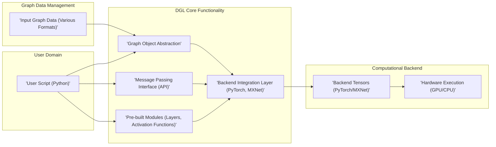
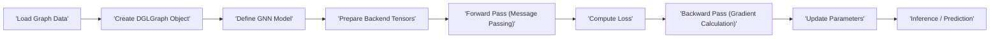

# Project Design Document: Deep Graph Library (DGL)

**Version:** 1.1
**Date:** October 26, 2023
**Author:** AI Software Architect

## 1. Introduction

This document provides an enhanced design overview of the Deep Graph Library (DGL), an open-source Python library tailored for implementing graph neural networks (GNNs). It aims to deliver a refined understanding of DGL's architecture, components, and data flow, serving as a robust foundation for subsequent threat modeling activities.

DGL streamlines the development and deployment of GNNs by offering a high-level, intuitive interface for defining and training graph-based models. It accommodates a diverse range of GNN architectures and empowers users to harness the computational capabilities of leading deep learning frameworks such as PyTorch and Apache MXNet.

## 2. Goals and Objectives

The core goals driving the development of DGL are:

*   **Enhanced Usability:**  Provide an even more intuitive and user-friendly API, minimizing the learning curve for building and training GNNs.
*   **Optimized Performance:** Deliver highly efficient implementations that effectively leverage the underlying backend deep learning frameworks for speed and resource utilization.
*   **Broadened Flexibility:**  Support an extensive array of GNN models, including both established and emerging architectures, and accommodate diverse graph data formats.
*   **Improved Scalability:** Facilitate training on increasingly large and complex graphs, addressing the needs of real-world applications.
*   **Greater Extensibility:**  Empower users to customize and extend DGL's functionalities through well-defined interfaces and extension points.

## 3. High-Level Architecture

DGL's architecture is logically organized into the following key components, illustrating the flow of data and control:

**Component Descriptions:**

*   **User Script (Python):** The primary point of interaction where users write Python code to define GNN models, load and manipulate graph data, and initiate training or inference procedures.
*   **Graph Object Abstraction:**  Provides a consistent and high-level representation of a graph, abstracting away the underlying storage and manipulation details. This includes the `DGLGraph` object.
*   **Message Passing Interface (API):** The central mechanism for implementing the core operations of GNNs, enabling the definition of how information is propagated and aggregated across the graph's structure.
*   **Pre-built Modules (Layers, Activation Functions):** A collection of ready-to-use GNN layers, activation functions, normalization techniques, and other essential building blocks for constructing GNN models.
*   **Backend Integration Layer (PyTorch, MXNet):**  Handles the crucial interaction with the chosen deep learning framework (PyTorch or MXNet), managing tensor operations, automatic differentiation, and computation execution.
*   **Input Graph Data (Various Formats):** The source of the graph's structural and feature information, which can be provided in diverse formats such as CSV files, adjacency lists, or through programmatic generation.
*   **Backend Tensors (PyTorch/MXNet):** The fundamental data structures used by the underlying deep learning frameworks for efficient numerical computations on CPUs or GPUs.
*   **Hardware Execution (GPU/CPU):** The physical hardware where the computationally intensive tasks of GNN training and inference are performed.

## 4. Component Details

This section provides a more in-depth look at the key components within DGL.

### 4.1. Graph Object Abstraction

*   **Description:** The `DGLGraph` object serves as the fundamental abstraction for representing graphs within DGL. It encapsulates the graph's topology (nodes and edges) and manages associated node and edge feature data.
*   **Functionality:**
    *   Stores the graph's structural information, including the connections between nodes (adjacency).
    *   Manages feature data associated with nodes and edges, such as node attributes, edge weights, and other relevant information.
    *   Offers methods for programmatically accessing, modifying, and querying the graph's structure and features.
    *   Supports both homogeneous graphs (where all nodes and edges are of the same type) and heterogeneous graphs (with different types of nodes and edges).
*   **Internal Representation:**  Internally, the graph structure may be represented using various data structures optimized for different graph sizes and operations, such as adjacency lists, compressed sparse row (CSR) matrices, or other specialized formats, often leveraging the backend framework's tensor capabilities. Feature data is typically stored as tensors managed by the chosen backend framework.

### 4.2. Message Passing Interface (API)

*   **Description:** DGL's message passing API provides a highly flexible and efficient paradigm for implementing the core computations within GNNs: the process of sending, receiving, and aggregating information between connected nodes.
*   **Functionality:**
    *   **`send` function:** Allows users to define how messages are generated from source nodes or edges based on their features.
    *   **`recv` function:** Enables users to specify how messages arriving at a destination node are aggregated (e.g., sum, mean, max).
    *   **User-Defined Functions:**  Provides the ability to define custom message and reduce functions, allowing for the implementation of a wide range of GNN algorithms.
    *   **Optimized Implementations:** Includes highly optimized implementations for common message passing patterns, improving performance.
*   **Workflow:** The message passing process typically involves iterating over the edges of the graph. For each edge, a message is computed based on the source node's features and potentially the edge's features. These messages are then aggregated at the destination node, and this aggregated information is used to update the destination node's representation.

### 4.3. Pre-built Modules

*   **Description:** DGL offers a rich collection of pre-built modules that encapsulate common GNN layers and functions, simplifying the construction of GNN models.
*   **Examples:**
    *   `dgl.nn.pytorch.conv.GraphConv`: Implements the Graph Convolutional Network (GCN) layer.
    *   `dgl.nn.pytorch.conv.GATConv`: Implements the Graph Attention Network (GAT) layer.
    *   Various activation functions (e.g., `torch.nn.ReLU`, `torch.nn.Sigmoid`).
    *   Normalization layers (e.g., `torch.nn.BatchNorm1d`).
    *   Pooling layers for graph-level representations.
*   **Benefits:** Significantly reduces the amount of code users need to write, promotes code reusability, and leverages optimized implementations for common GNN operations.

### 4.4. Backend Integration Layer

*   **Description:** DGL is intentionally designed to integrate seamlessly with leading deep learning frameworks, primarily PyTorch and Apache MXNet, allowing users to leverage their established ecosystems and functionalities.
*   **Functionality:**
    *   Utilizes the tensor manipulation and automatic differentiation capabilities provided by the backend frameworks.
    *   Allows users to define GNN models using the familiar syntax and conventions of their chosen backend.
    *   Manages the efficient transfer of data between DGL's graph objects and the backend's tensor representations.
    *   Provides backend-specific optimizations to maximize performance and resource utilization.
*   **Abstraction:** DGL effectively abstracts away many of the low-level complexities of interacting directly with the backend framework, allowing users to focus on the higher-level logic of their GNN models.

### 4.5. Data Loading and Preprocessing Utilities

*   **Description:** DGL provides a set of utilities to facilitate the process of loading graph data from various sources and preprocessing it into a format suitable for GNN training.
*   **Functionality:**
    *   Supports reading graph data from common file formats, such as CSV files, adjacency list files, and other graph-specific formats.
    *   Offers functions for programmatically constructing `DGLGraph` objects from raw data or existing data structures.
    *   Includes tools for partitioning large graphs into smaller subgraphs for distributed training scenarios.
    *   Provides utilities for adding node and edge features to the graph object, including techniques for feature normalization and encoding.

## 5. Data Flow

The typical data flow within a DGL-based project follows these key stages:

1. **Graph Data Ingestion:** The user loads graph data from its source, which could be a file, a database, or programmatically generated data.
2. **DGLGraph Object Creation:** The ingested data is transformed into a `DGLGraph` object, representing the graph's structure and initial node/edge features.
3. **GNN Model Definition:** The user defines the architecture of their GNN model, typically by composing pre-built DGL modules or implementing custom message passing logic.
4. **Backend Tensor Preparation:** DGL internally converts the `DGLGraph` object and its associated feature data into backend-specific tensor representations (e.g., PyTorch tensors).
5. **Forward Propagation (Message Passing):** The input graph and features are fed into the GNN model. The message passing API orchestrates the exchange and aggregation of information between connected nodes, updating node representations layer by layer.
6. **Loss Computation:** The model's output is compared against the ground truth labels or target values using a defined loss function to quantify the prediction error.
7. **Backward Propagation (Gradient Calculation):** The gradients of the loss function with respect to the model's parameters are calculated automatically by the backend framework's automatic differentiation engine.
8. **Parameter Update:** The model's trainable parameters are adjusted based on the computed gradients using an optimization algorithm (e.g., stochastic gradient descent).
9. **Inference and Prediction:** After training, the model can be used to make predictions on unseen graphs or nodes within existing graphs by performing the forward propagation step.

## 6. Security Considerations (Pre-Threat Modeling)

This section outlines potential security considerations that warrant further investigation during the threat modeling process.

*   **Malicious Graph Data Injection:**  The library must be robust against maliciously crafted or malformed graph data that could exploit parsing vulnerabilities, cause unexpected behavior, or lead to denial-of-service conditions. Input validation and sanitization are critical.
*   **Dependency Vulnerabilities:** DGL relies on external libraries, including the backend frameworks. Security vulnerabilities in these dependencies could be inherited by DGL, necessitating careful dependency management and regular security audits.
*   **Code Injection Risks:** If the API allows users to inject arbitrary code snippets (e.g., through custom message passing functions or data loading mechanisms), it could create significant security vulnerabilities. Secure coding practices and sandboxing (where applicable) are essential.
*   **Data Privacy Concerns:** When processing graphs containing sensitive information, appropriate data anonymization, encryption, and access control mechanisms must be considered to protect user privacy.
*   **Resource Exhaustion Attacks:** Maliciously designed graphs or model configurations could potentially consume excessive computational resources (CPU, memory, GPU), leading to denial-of-service. Resource limits and monitoring are important countermeasures.
*   **Model Poisoning Attacks:** In scenarios where the training data source is untrusted, there's a risk of attackers injecting malicious data to manipulate the trained model's behavior. Robust data validation and provenance tracking can help mitigate this.
*   **Adversarial Attacks on GNNs:** GNNs are known to be susceptible to adversarial attacks where subtle perturbations to the input graph structure or features can cause the model to make incorrect predictions. Research into robust GNN architectures and adversarial training techniques is crucial.
*   **Serialization and Deserialization Vulnerabilities:**  If graph objects or models are serialized and deserialized, vulnerabilities in these processes could be exploited to inject malicious code or data. Secure serialization practices should be employed.
*   **Side-Channel Attacks:**  Consider potential side-channel attacks that could leak sensitive information based on timing variations or resource consumption during GNN execution.

## 7. Dependencies

DGL has the following primary dependencies:

*   **Python (>= 3.7):** The core programming language for DGL.
*   **NumPy:**  Essential for numerical computations and array manipulation.
*   **SciPy:**  Provides fundamental algorithms for scientific and technical computing.
*   **Backend Framework (Choose One):**
    *   **PyTorch (>= 1.9.0):** A widely adopted deep learning framework.
    *   **Apache MXNet (>= 1.7.0):** Another prominent deep learning framework.
*   **Optional Dependencies (for specific functionalities):**
    *   `networkx`: For advanced graph manipulation and analysis.
    *   `scikit-learn`: For machine learning utilities.
    *   Specific data loading libraries depending on the input data format.

## 8. Deployment

DGL can be deployed in various environments, depending on the application requirements:

*   **Local Development Environment:** For initial development, experimentation, and prototyping on individual machines.
*   **Cloud-Based Virtual Machines (VMs):** Utilizing cloud providers like AWS EC2, Google Cloud Compute Engine, or Azure VMs for scalable training and deployment.
*   **Containerized Environments (e.g., Docker, Kubernetes):**  Packaging DGL applications into containers for consistent and reproducible deployments across different environments.
*   **Managed Machine Learning Platforms:** Leveraging cloud-based ML platforms such as Amazon SageMaker, Google Cloud Vertex AI, or Azure Machine Learning for streamlined deployment and management.
*   **Edge Devices:** In certain scenarios, DGL models can be deployed on edge devices with sufficient computational resources.

## 9. Future Considerations

Potential future enhancements and directions for DGL include:

*   **Enhanced Heterogeneous Graph Support:** Further development and refinement of functionalities for handling complex heterogeneous graphs with diverse node and edge types.
*   **Improved Scalability and Distributed Training Capabilities:**  Exploring and implementing advanced techniques for training GNNs on extremely large graphs using distributed computing frameworks.
*   **Incorporation of Novel GNN Architectures:**  Continuously adding support for state-of-the-art and emerging GNN model architectures.
*   **Broader Backend Framework Integration:**  Investigating potential integration with additional deep learning frameworks to expand user choice.
*   **Advanced Graph Manipulation and Analysis Tools:**  Expanding the library's capabilities for graph data manipulation, analysis, and visualization.
*   **Strengthened Security Features:**  Proactive measures to address potential security vulnerabilities, such as built-in input validation and secure serialization mechanisms.

This improved design document provides a more detailed and refined overview of the Deep Graph Library (DGL). It aims to facilitate a more comprehensive and effective threat modeling process by providing a clear understanding of DGL's architecture, components, data flow, and potential security considerations.