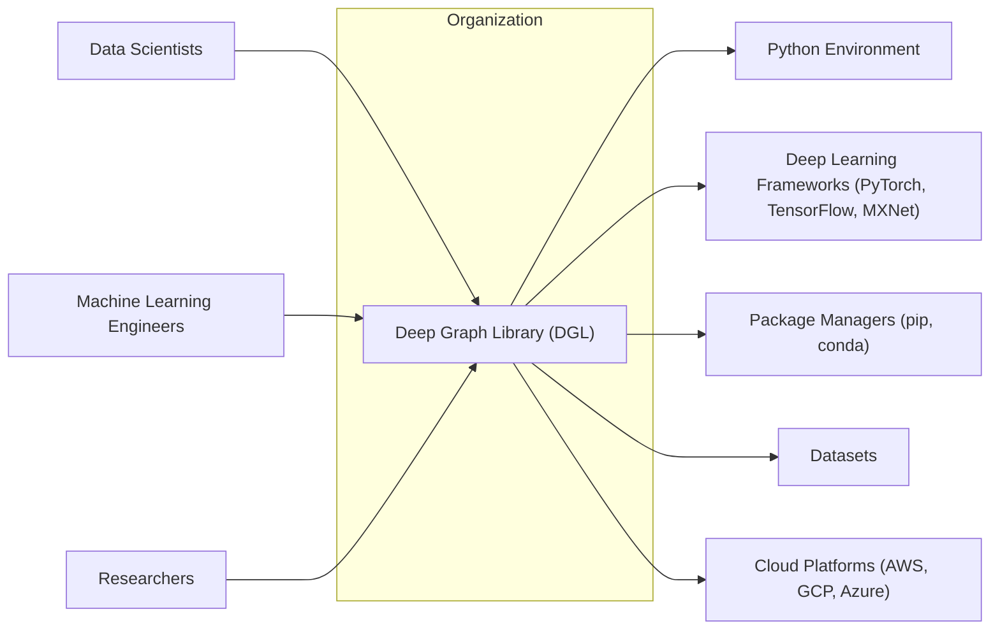
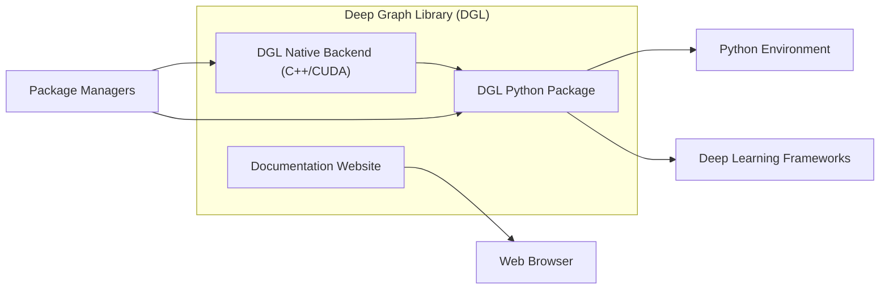
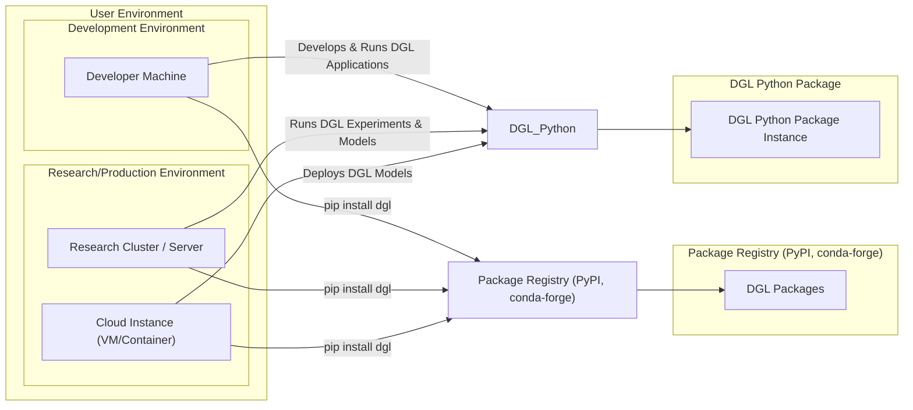

# BUSINESS POSTURE

- Business Priorities and Goals:
  - Facilitate and accelerate research and development in the field of graph neural networks.
  - Promote widespread adoption of Deep Graph Library (DGL) as a leading framework for graph-based deep learning.
  - Foster a vibrant and active community around DGL, encouraging contributions and support.
  - Ensure the reliability, stability, and performance of DGL for diverse applications.
  - Maintain the integrity and security of DGL to build and sustain user trust.
- Business Risks:
  - Security vulnerabilities in DGL could lead to misuse, data breaches in user applications, and reputational damage, hindering adoption.
  - Lack of community engagement and contributions could slow down development and limit the library's growth and capabilities.
  - Performance bottlenecks or instability could discourage users and lead to the adoption of alternative frameworks.
  - Supply chain attacks targeting DGL's dependencies could compromise the library and its users.
  - Poor documentation or usability could create a barrier to entry and limit adoption by a wider audience.

# SECURITY POSTURE

- Existing Security Controls:
  - security control: Code hosted on GitHub, providing version control and transparency. Implemented in: GitHub repository.
  - security control: Open-source nature allows for community review and scrutiny of the code. Implemented in: Open Source License.
- Accepted Risks:
  - accepted risk: Potential vulnerabilities in third-party dependencies used by DGL.
  - accepted risk: Risk of undiscovered security vulnerabilities within the DGL codebase itself.
  - accepted risk: Reliance on community contributions, which may introduce unforeseen security issues if not properly vetted.
- Recommended Security Controls:
  - security control: Implement automated dependency scanning to identify and manage vulnerabilities in third-party libraries.
  - security control: Integrate static code analysis (SAST) tools into the development pipeline to proactively detect potential security flaws in the code.
  - security control: Establish a process for regular security audits, potentially through community contributions or dedicated security reviews.
  - security control: Define and enforce a secure release process, including code signing and checksum generation for released artifacts.
  - security control: Create a clear vulnerability disclosure policy to facilitate responsible reporting and timely patching of security issues.
- Security Requirements:
  - Authentication: Not directly applicable to the DGL library itself, as it is a software library and not a service requiring user authentication. However, authentication might be relevant for any associated services like documentation websites or community forums.
  - Authorization: Authorization is not a primary concern for the core DGL library. Access control is typically managed by the user's environment where DGL is deployed and used.
  - Input Validation: DGL must implement robust input validation for all user-provided data, such as graph structures, node features, and model parameters. This is crucial to prevent various vulnerabilities, including injection attacks and denial-of-service. Input validation should be applied at API boundaries and internal function calls where user-controlled data is processed.
  - Cryptography: While DGL itself may not directly implement cryptographic algorithms, it might rely on underlying libraries that use cryptography. If DGL handles or processes any sensitive data (e.g., in example code or utilities), ensure appropriate cryptographic measures are used for data protection in transit and at rest, according to the sensitivity of the data.

# DESIGN

## C4 CONTEXT



- Context Diagram Elements:
  - - Name: Deep Graph Library (DGL)
    - Type: Software System
    - Description: A Python package that makes it easy to implement graph neural networks (GNNs) in frameworks like PyTorch, TensorFlow, and MXNet.
    - Responsibilities: Provides APIs and functionalities for building, training, and evaluating graph neural network models. Handles graph data structures and operations efficiently.
    - Security controls: Input validation, dependency management, secure build process.
  - - Name: Data Scientists
    - Type: User
    - Description: Professionals who use DGL to develop and apply graph-based machine learning models for data analysis and insights.
    - Responsibilities: Utilize DGL to build models, analyze data, and interpret results. Responsible for the secure usage of DGL in their applications.
    - Security controls: Secure coding practices when using DGL, responsible data handling.
  - - Name: Machine Learning Engineers
    - Type: User
    - Description: Engineers who integrate DGL into larger systems and applications, deploying graph neural network models in production environments.
    - Responsibilities: Deploy and maintain DGL-based applications, ensuring performance, scalability, and security in production.
    - Security controls: Secure deployment practices, monitoring and logging of DGL-based applications.
  - - Name: Researchers
    - Type: User
    - Description: Academic and industry researchers who use DGL to explore new graph neural network architectures and advance the field of graph-based deep learning.
    - Responsibilities: Conduct research using DGL, contribute to the DGL community, and potentially identify and report security vulnerabilities.
    - Security controls: Responsible use of DGL in research environments, ethical considerations in research applications.
  - - Name: Python Environment
    - Type: Technology
    - Description: The runtime environment where DGL and user applications are executed. Includes Python interpreter and standard libraries.
    - Responsibilities: Provides the necessary environment for DGL to run. Security of the Python environment is crucial for DGL's operation.
    - Security controls: Keeping Python environment up-to-date with security patches, using virtual environments to isolate dependencies.
  - - Name: Deep Learning Frameworks (PyTorch, TensorFlow, MXNet)
    - Type: Software System
    - Description: Popular deep learning frameworks that DGL integrates with, allowing users to leverage their functionalities for GNN development.
    - Responsibilities: Provide the underlying computational framework for DGL models. Security of these frameworks impacts DGL's security.
    - Security controls: Rely on the security controls of the underlying deep learning frameworks.
  - - Name: Package Managers (pip, conda)
    - Type: Software System
    - Description: Tools used to install and manage DGL and its dependencies.
    - Responsibilities: Facilitate the installation and updates of DGL. Security of package managers is crucial for supply chain security.
    - Security controls: Using trusted package repositories, verifying package integrity (checksums).
  - - Name: Datasets
    - Type: Data Store
    - Description: Graph datasets used as input for training and evaluating DGL models.
    - Responsibilities: Provide data for DGL models. Data security and integrity are important for model accuracy and security.
    - Security controls: Access control to datasets, data validation and sanitization before use in DGL.
  - - Name: Cloud Platforms (AWS, GCP, Azure)
    - Type: Infrastructure
    - Description: Cloud computing platforms where DGL models can be trained and deployed, offering scalable resources.
    - Responsibilities: Provide infrastructure for running DGL workloads. Cloud platform security is essential for DGL deployments in the cloud.
    - Security controls: Cloud platform security controls (IAM, network security groups, etc.).

## C4 CONTAINER



- Container Diagram Elements:
  - - Name: DGL Python Package
    - Type: Software Container
    - Description: The primary Python package of DGL, providing the user-facing API and core functionalities. Implemented in Python.
    - Responsibilities: Exposes Python APIs for graph manipulation, model building, and training. Orchestrates operations with the native backend. Manages dependencies.
    - Security controls: Input validation in Python APIs, dependency scanning, secure package distribution.
  - - Name: DGL Native Backend (C++/CUDA)
    - Type: Software Container
    - Description: Performance-critical components of DGL implemented in C++ and CUDA for efficient graph operations and GPU acceleration.
    - Responsibilities: Executes computationally intensive graph operations, leveraging CPU and GPU resources. Provides optimized performance.
    - Security controls: Secure coding practices in C++, memory safety, input validation at the interface with Python package.
  - - Name: Documentation Website
    - Type: Web Application
    - Description: Website hosting DGL documentation, tutorials, and examples.
    - Responsibilities: Provides user documentation and learning resources.
    - Security controls: Standard web application security practices, access control for website management, protection against common web vulnerabilities (XSS, CSRF).

## DEPLOYMENT



- Deployment Diagram Elements:
  - - Name: Developer Machine
    - Type: Infrastructure
    - Description: Local machine used by developers to develop, test, and debug DGL applications.
    - Responsibilities: Provides environment for DGL development.
    - Security controls: Developer machine security practices, local firewalls, endpoint protection.
  - - Name: Research Cluster / Server
    - Type: Infrastructure
    - Description: On-premises or hosted server infrastructure used for running large-scale DGL experiments and models in research or production settings.
    - Responsibilities: Provides computational resources for DGL workloads.
    - Security controls: Server hardening, network segmentation, access control, monitoring and logging.
  - - Name: Cloud Instance (VM/Container)
    - Type: Infrastructure
    - Description: Virtual machines or containers in cloud environments (AWS, GCP, Azure) used to deploy and run DGL applications in the cloud.
    - Responsibilities: Provides scalable and elastic infrastructure for DGL deployments in the cloud.
    - Security controls: Cloud provider security controls (IAM, security groups), container security, instance hardening.
  - - Name: Package Registry (PyPI, conda-forge)
    - Type: Infrastructure
    - Description: Public package registries where DGL packages are published and distributed.
    - Responsibilities: Host and distribute DGL packages to users.
    - Security controls: Package registry security controls, package signing, malware scanning.
  - - Name: DGL Packages
    - Type: Software Artifact
    - Description: Released and packaged versions of DGL, available for download from package registries.
    - Responsibilities: Provide installable DGL software.
    - Security controls: Secure build process, package signing, checksums.
  - - Name: DGL Python Package Instance
    - Type: Software Runtime
    - Description: Running instance of the DGL Python package within a user's environment.
    - Responsibilities: Execute DGL code and provide graph neural network functionalities.
    - Security controls: Inherits security controls from the deployment environment, input validation, secure coding practices in user applications.

## BUILD

```mermaid
flowchart LR
    subgraph "Developer"
        Developer["Developer"]
    end
    subgraph "GitHub Repository"
        CodeRepository["Code Repository (GitHub)"]
    end
    subgraph "CI/CD System (GitHub Actions)"
        BuildAutomation["Build Automation (GitHub Actions)"]
        SAST["SAST Scanner"]
        DependencyCheck["Dependency Check"]
        UnitTests["Unit Tests"]
        IntegrationTests["Integration Tests"]
        PackageBuild["Package Build"]
        Signing["Signing & Checksum"]
    end
    subgraph "Package Registry (PyPI, conda-forge)"
        PackageRegistry_Build["Package Registry"]
    end
    subgraph "User Environment"
        User["User"]
    end

    Developer --> CodeRepository
    CodeRepository --> BuildAutomation
    BuildAutomation --> SAST
    BuildAutomation --> DependencyCheck
    BuildAutomation --> UnitTests
    BuildAutomation --> IntegrationTests
    BuildAutomation --> PackageBuild
    BuildAutomation --> Signing
    PackageBuild --> PackageRegistry_Build
    Signing --> PackageRegistry_Build
    PackageRegistry_Build --> User

    style Signing fill:#ccf,stroke:#ccf,stroke-width:2px
    style SAST fill:#ccf,stroke:#ccf,stroke-width:2px
    style DependencyCheck fill:#ccf,stroke:#ccf,stroke-width:2px
```

- Build Process Elements:
  - - Name: Developer
    - Type: Human Role
    - Description: Software developers who write and contribute code to the DGL project.
    - Responsibilities: Develop and maintain DGL code, fix bugs, and implement new features.
    - Security controls: Secure coding practices, code review, access control to code repository.
  - - Name: Code Repository (GitHub)
    - Type: Software System
    - Description: GitHub repository hosting the DGL source code, issue tracking, and collaboration tools.
    - Responsibilities: Version control, code storage, collaboration platform.
    - Security controls: Access control, branch protection, audit logs.
  - - Name: Build Automation (GitHub Actions)
    - Type: Software System
    - Description: Automated CI/CD pipeline using GitHub Actions to build, test, and publish DGL packages.
    - Responsibilities: Automate build, test, and release processes. Enforce build security checks.
    - Security controls: Secure CI/CD configuration, secret management, build environment security.
  - - Name: SAST Scanner
    - Type: Security Tool
    - Description: Static Application Security Testing tool integrated into the CI/CD pipeline to automatically scan code for potential security vulnerabilities.
    - Responsibilities: Proactively identify security flaws in the code.
    - Security controls: SAST tool configuration, vulnerability reporting and remediation process.
  - - Name: Dependency Check
    - Type: Security Tool
    - Description: Tool to analyze project dependencies and identify known vulnerabilities in third-party libraries.
    - Responsibilities: Manage and mitigate risks from vulnerable dependencies.
    - Security controls: Dependency vulnerability database updates, reporting and remediation process.
  - - Name: Unit Tests
    - Type: Software System
    - Description: Automated unit tests to verify the functionality of individual code components.
    - Responsibilities: Ensure code quality and correctness. Indirectly contribute to security by reducing bugs.
    - Security controls: Test coverage, test environment security.
  - - Name: Integration Tests
    - Type: Software System
    - Description: Automated integration tests to verify the interaction between different components of DGL.
    - Responsibilities: Ensure correct integration of components. Indirectly contribute to security by finding integration issues.
    - Security controls: Test environment security, realistic test scenarios.
  - - Name: Package Build
    - Type: Software System
    - Description: Process of packaging DGL code into distributable packages (e.g., Python wheels, conda packages).
    - Responsibilities: Create installable DGL packages.
    - Security controls: Secure build environment, build process integrity.
  - - Name: Signing & Checksum
    - Type: Security Process
    - Description: Signing DGL packages with digital signatures and generating checksums to ensure package integrity and authenticity.
    - Responsibilities: Protect package integrity and verify origin.
    - Security controls: Secure key management, signing process integrity.
  - - Name: Package Registry
    - Type: Infrastructure
    - Description: Public package registries (PyPI, conda-forge) where built and signed DGL packages are published.
    - Responsibilities: Distribute DGL packages to users.
    - Security controls: Package registry security controls, malware scanning, package verification.
  - - Name: User
    - Type: Human Role
    - Description: Users who download and install DGL packages from package registries.
    - Responsibilities: Use DGL in their applications.
    - Security controls: Verify package integrity (checksums, signatures), secure installation practices.

# RISK ASSESSMENT

- Critical Business Processes:
  - Maintaining the integrity and trustworthiness of the DGL library.
  - Ensuring the availability and reliability of DGL for users.
  - Protecting the reputation of the DGL project and community.
- Data Sensitivity:
  - DGL itself does not directly handle sensitive user data. However, user applications built with DGL may process sensitive data. The integrity of DGL is crucial to prevent potential data breaches or manipulation in user applications. Compromised DGL library could lead to indirect data security risks for its users. The sensitivity of data handled by user applications depends on their specific use cases and is outside the direct control of the DGL project itself.

# QUESTIONS & ASSUMPTIONS

- Questions:
  - What is the current process for managing and patching vulnerabilities in DGL dependencies?
  - Are there any existing security audits or penetration testing performed on DGL?
  - What is the process for users to report security vulnerabilities in DGL?
  - Are there any specific security certifications or compliance requirements for DGL?
- Assumptions:
  - DGL is primarily used as an open-source library and not as a hosted service.
  - Security is a growing concern for the DGL project, and there is a willingness to improve security posture.
  - The DGL community is open to adopting recommended security controls and practices.
  - The primary deployment model for DGL is through package managers like pip and conda.