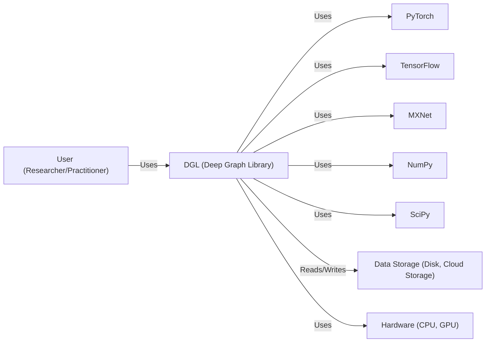
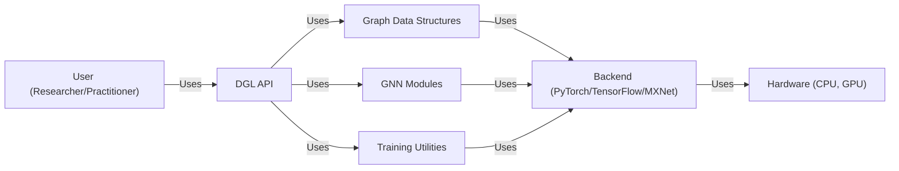
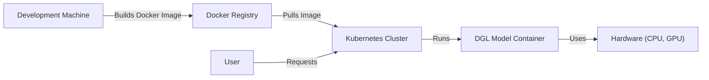
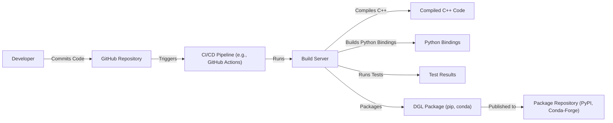

Okay, let's create a design document for the Deep Graph Library (DGL) project, focusing on aspects relevant for threat modeling.

# BUSINESS POSTURE

DGL is an open-source project aiming to provide a user-friendly and efficient framework for implementing Graph Neural Networks (GNNs).  It's designed to be flexible, supporting various deep learning frameworks (like PyTorch and TensorFlow) and scaling to large datasets.  The project's success hinges on adoption by researchers and practitioners in the machine learning community.

Business Priorities:

*   Ease of Use:  Make it simple for users with varying levels of expertise to define, train, and deploy GNN models.
*   Performance:  Provide highly optimized computations for graph operations, leveraging hardware acceleration (GPUs) where possible.
*   Flexibility:  Support a wide range of GNN architectures and be compatible with popular deep learning frameworks.
*   Scalability:  Handle large graphs and datasets efficiently.
*   Community Growth:  Foster a vibrant community of users and contributors.
*   Integration: Seamlessly integrate with existing ML pipelines and workflows.

Business Goals:

*   Become a leading library for GNN research and development.
*   Enable the application of GNNs to a wide range of real-world problems.
*   Attract and retain a strong community of contributors.

Most Important Business Risks:

*   Vulnerabilities that could lead to incorrect model outputs or compromise the integrity of the learning process. This is particularly critical if DGL is used in sensitive applications (e.g., fraud detection, medical diagnosis).
*   Performance bottlenecks that limit the scalability of the library, hindering its use with large, real-world datasets.
*   Lack of adoption due to complexity or incompatibility with existing tools.
*   Supply chain attacks that introduce malicious code into the library or its dependencies.
*   Intellectual property risks, such as unintentional license violations.

# SECURITY POSTURE

Existing Security Controls:

*   security control: Code Reviews: The project uses GitHub's pull request system, which inherently includes code review before merging changes. (Described in contribution guidelines on GitHub).
*   security control: Community Vetting: Being open-source, the codebase is subject to scrutiny by a large community of users and contributors, increasing the likelihood of identifying and reporting vulnerabilities. (Implicit in the open-source nature).
*   security control: Dependency Management: Dependencies are managed through standard package managers (e.g., pip, conda), which provide some level of version control and dependency resolution. (Visible in setup.py and environment.yml files).
*   security control: Testing: The project includes unit tests and integration tests to verify the correctness of the code. (Visible in the tests/ directory).
*   security control: Static Analysis: Some level of static analysis is likely performed by linters and code quality tools, although the specifics are not detailed in the readily available documentation. (Assumed based on common practice).

Accepted Risks:

*   accepted risk: Reliance on Third-Party Libraries: DGL depends on numerous third-party libraries (e.g., PyTorch, TensorFlow, NumPy), inheriting any vulnerabilities present in those dependencies.
*   accepted risk: Limited Formal Security Audits: While community vetting is valuable, there's no indication of regular, formal security audits by dedicated security professionals.
*   accepted risk: Potential for User-Introduced Vulnerabilities: Users can implement custom GNN models and operations, which may contain vulnerabilities that DGL itself cannot prevent.
*   accepted risk: Focus on Functionality over Hardening: As a research-oriented project, the primary focus is on functionality and performance, potentially leading to a less hardened security posture compared to commercial software.

Recommended Security Controls:

*   Implement a comprehensive Software Bill of Materials (SBOM) management system.
*   Integrate Static Application Security Testing (SAST) tools into the CI/CD pipeline.
*   Integrate Dynamic Application Security Testing (DAST) for runtime security analysis.
*   Conduct regular penetration testing to identify vulnerabilities.
*   Establish a clear vulnerability disclosure and response process.
*   Provide security best practices documentation for users implementing custom models and operations.

Security Requirements:

*   Authentication: Not directly applicable to the core DGL library, as it's a framework, not a service. Authentication would be relevant for any applications built *using* DGL.
*   Authorization: Similarly, authorization is not a primary concern for the library itself. Authorization would be handled at the application level.
*   Input Validation:
    *   Crucial for preventing vulnerabilities related to malformed graph data or model parameters.
    *   Should include checks for data types, sizes, and ranges.
    *   Should be implemented in the core graph data structures and processing functions.
*   Cryptography:
    *   Not directly used for core functionality.
    *   May be relevant if DGL is used to process sensitive data, in which case encryption at rest and in transit should be considered at the application level.
*   Data validation:
    *   Data validation is crucial to ensure the integrity and correctness of graph data and model parameters.
    *   Validation checks should be implemented to verify data types, sizes, ranges, and consistency constraints.
    *   Invalid or malicious data could lead to incorrect model outputs or potentially exploit vulnerabilities in the library.

# DESIGN

## C4 CONTEXT

Element Descriptions:

*   Element:
    *   Name: User (Researcher/Practitioner)
    *   Type: Person
    *   Description: A researcher or practitioner who uses DGL to build, train, and deploy GNN models.
    *   Responsibilities: Defines the GNN model, prepares the data, trains the model, and evaluates its performance.
    *   Security controls: Uses secure coding practices when implementing custom models and operations.

*   Element:
    *   Name: DGL (Deep Graph Library)
    *   Type: Software System
    *   Description: The core library providing APIs for graph data structures, GNN modules, and training utilities.
    *   Responsibilities: Provides a framework for building and training GNNs. Manages graph data. Executes GNN operations.
    *   Security controls: Input validation, dependency management, code reviews.

*   Element:
    *   Name: PyTorch
    *   Type: Software System
    *   Description: A deep learning framework that DGL can use as a backend.
    *   Responsibilities: Provides low-level tensor operations and automatic differentiation.
    *   Security controls: Relies on PyTorch's security measures.

*   Element:
    *   Name: TensorFlow
    *   Type: Software System
    *   Description: A deep learning framework that DGL can use as a backend.
    *   Responsibilities: Provides low-level tensor operations and automatic differentiation.
    *   Security controls: Relies on TensorFlow's security measures.

*   Element:
    *   Name: MXNet
    *   Type: Software System
    *   Description: A deep learning framework that DGL can use as a backend.
    *   Responsibilities: Provides low-level tensor operations and automatic differentiation.
    *   Security controls: Relies on MXNet's security measures.

*   Element:
    *   Name: NumPy
    *   Type: Software System
    *   Description: A library for numerical computation in Python.
    *   Responsibilities: Provides array operations and mathematical functions.
    *   Security controls: Relies on NumPy's security measures.

*   Element:
    *   Name: SciPy
    *   Type: Software System
    *   Description: A library for scientific computation in Python.
    *   Responsibilities: Provides scientific algorithms and mathematical functions.
    *   Security controls: Relies on SciPy's security measures.

*   Element:
    *   Name: Data Storage (Disk, Cloud Storage)
    *   Type: Software System
    *   Description: Storage for graph data and trained models.
    *   Responsibilities: Stores and retrieves data.
    *   Security controls: Access controls, encryption (at rest and in transit), depending on the specific storage solution.

*   Element:
    *   Name: Hardware (CPU, GPU)
    *   Type: Hardware
    *   Description: The physical hardware on which DGL runs.
    *   Responsibilities: Executes computations.
    *   Security controls: Hardware-level security features (e.g., secure boot, memory protection).

## C4 CONTAINER

Element Descriptions:

*   Element:
    *   Name: User (Researcher/Practitioner)
    *   Type: Person
    *   Description: A researcher or practitioner who uses DGL to build, train, and deploy GNN models.
    *   Responsibilities: Defines the GNN model, prepares the data, trains the model, and evaluates its performance.
    *   Security controls: Uses secure coding practices when implementing custom models and operations.

*   Element:
    *   Name: DGL API
    *   Type: API
    *   Description: The primary interface for users to interact with DGL.
    *   Responsibilities: Provides functions for creating graphs, defining models, and running training loops.
    *   Security controls: Input validation, API documentation.

*   Element:
    *   Name: Graph Data Structures
    *   Type: Container
    *   Description: Data structures for representing graphs (nodes, edges, features).
    *   Responsibilities: Stores and manages graph data efficiently. Provides methods for accessing and manipulating graph data.
    *   Security controls: Input validation, data integrity checks.

*   Element:
    *   Name: GNN Modules
    *   Type: Container
    *   Description: Pre-built GNN layers and models.
    *   Responsibilities: Implements various GNN algorithms.
    *   Security controls: Code reviews, testing.

*   Element:
    *   Name: Training Utilities
    *   Type: Container
    *   Description: Functions for training and evaluating GNN models.
    *   Responsibilities: Provides utilities for data loading, optimization, and performance evaluation.
    *   Security controls: Code reviews, testing.

*   Element:
    *   Name: Backend (PyTorch/TensorFlow/MXNet)
    *   Type: Container
    *   Description: The underlying deep learning framework used for computation.
    *   Responsibilities: Executes tensor operations and automatic differentiation.
    *   Security controls: Relies on the security measures of the chosen backend.

*   Element:
    *   Name: Hardware (CPU, GPU)
    *   Type: Hardware
    *   Description: The physical hardware on which DGL runs.
    *   Responsibilities: Executes computations.
    *   Security controls: Hardware-level security features.

## DEPLOYMENT

DGL, as a library, doesn't have a specific "deployment" in the traditional sense of a web application.  It's integrated into a user's Python environment. However, models trained with DGL *can* be deployed in various ways. Here are a few possibilities, and we'll detail one:

Possible Deployment Solutions:

1.  **Local Python Environment:**  The simplest case, running directly on a user's machine.
2.  **Cloud VM (e.g., AWS EC2, Google Compute Engine):**  Deploying a Python environment on a cloud VM.
3.  **Containerized Environment (Docker, Kubernetes):** Packaging the model and its dependencies into a container for portability and scalability.
4.  **Serverless Functions (AWS Lambda, Google Cloud Functions):**  Deploying the model as a serverless function for on-demand inference.
5.  **Specialized ML Platforms (SageMaker, Vertex AI):**  Using managed platforms designed for machine learning deployments.

Chosen Deployment Solution: Containerized Environment (Docker, Kubernetes)

This is a common and robust approach for deploying ML models.

Element Descriptions:

*   Element:
    *   Name: Development Machine
    *   Type: Workstation
    *   Description: The machine where the DGL model is developed and the Docker image is built.
    *   Responsibilities: Code development, model training, Docker image creation.
    *   Security controls: Developer access controls, secure coding practices.

*   Element:
    *   Name: Docker Registry
    *   Type: Container Registry
    *   Description: A registry for storing and distributing Docker images (e.g., Docker Hub, AWS ECR, Google Container Registry).
    *   Responsibilities: Stores Docker images, provides access control.
    *   Security controls: Authentication, authorization, image scanning.

*   Element:
    *   Name: Kubernetes Cluster
    *   Type: Container Orchestrator
    *   Description: A cluster of machines managed by Kubernetes, used to run and scale the DGL model container.
    *   Responsibilities: Container orchestration, resource management, scaling.
    *   Security controls: Network policies, role-based access control (RBAC), pod security policies.

*   Element:
    *   Name: DGL Model Container
    *   Type: Container
    *   Description: A Docker container containing the trained DGL model, its dependencies, and a serving application (e.g., a Flask API).
    *   Responsibilities: Loads the model, performs inference, exposes an API for predictions.
    *   Security controls: Minimal base image, vulnerability scanning, limited privileges.

*   Element:
    *   Name: Hardware (CPU, GPU)
    *   Type: Hardware
    *   Description: The physical hardware on which the Kubernetes cluster runs.
    *   Responsibilities: Executes computations.
    *   Security controls: Hardware-level security features.

*   Element:
    *   Name: User
    *   Type: Person
    *   Description: User that sends requests to deployed model.
    *   Responsibilities: Sends requests and receives responses.
    *   Security controls: Authentication, authorization.

## BUILD

The DGL build process involves compiling C++ code, building Python bindings, and packaging the library for distribution.  It uses a combination of CMake and Python's setuptools.  While the GitHub repository doesn't explicitly detail a CI/CD pipeline, it's highly likely that one is used (e.g., GitHub Actions, Travis CI, or similar).

Security Controls in the Build Process:

*   **Code Review:**  Mandatory code reviews via pull requests before merging into the main branch.
*   **Automated Testing:**  Unit tests and integration tests are run as part of the build process to catch errors and regressions.
*   **Static Analysis (Likely):**  Linters and static analysis tools are likely used, although not explicitly documented.  This would help identify potential code quality and security issues.
*   **Dependency Management:**  Dependencies are managed through `setup.py` and `environment.yml`, providing version pinning and reproducibility.
*   **Build Automation:** The build process is automated using CMake and setuptools, reducing the risk of manual errors.

Recommended Security Controls (Build):

*   **Software Bill of Materials (SBOM) Generation:**  Generate an SBOM during the build process to track all dependencies and their versions.
*   **Supply Chain Security Tools:**  Integrate tools like `dep-scan` or `snyk` to scan dependencies for known vulnerabilities.
*   **Code Signing:**  Sign the released packages to ensure their integrity and authenticity.
*   **Reproducible Builds:**  Strive for reproducible builds to ensure that the same source code always produces the same binary output.

# RISK ASSESSMENT

Critical Business Processes to Protect:

*   **Model Training:** Ensuring the integrity and correctness of the model training process is paramount.  Compromised training could lead to inaccurate or biased models.
*   **Inference:**  If DGL models are used for inference in critical applications, protecting the inference process from manipulation is crucial.
*   **Data Handling:**  Protecting the confidentiality and integrity of the graph data used by DGL is important, especially if the data is sensitive.

Data to Protect and Sensitivity:

*   **Graph Data:**  The sensitivity of graph data varies greatly depending on the application.  It could range from publicly available data to highly sensitive personal or proprietary information.
*   **Model Parameters:**  Trained model parameters can be considered intellectual property and may need protection from unauthorized access or modification.
*   **User Code:**  While not directly part of DGL, user code that utilizes DGL may contain sensitive information or business logic.

# QUESTIONS & ASSUMPTIONS

Questions:

*   What specific static analysis tools are currently used in the DGL development process?
*   Are there any existing security audits or penetration testing reports for DGL?
*   What is the process for handling reported security vulnerabilities?
*   Are there plans to implement any of the recommended security controls?
*   What are the specific target deployment environments for DGL models?
*   What level of security assurance is required for different use cases of DGL?

Assumptions:

*   BUSINESS POSTURE: The primary users of DGL are researchers and developers in the machine learning community.
*   BUSINESS POSTURE: Performance and ease of use are prioritized over strict security hardening.
*   SECURITY POSTURE: Basic security practices (code reviews, testing) are followed, but formal security audits are not regularly conducted.
*   SECURITY POSTURE: Users are responsible for securing their own applications built using DGL.
*   DESIGN: DGL relies heavily on the security of its underlying deep learning frameworks (PyTorch, TensorFlow, MXNet).
*   DESIGN: The build process is automated, but may not include advanced security measures like SBOM generation or code signing.
*   DESIGN: Deployment of trained models is the responsibility of the user, and DGL does not provide specific deployment tools.