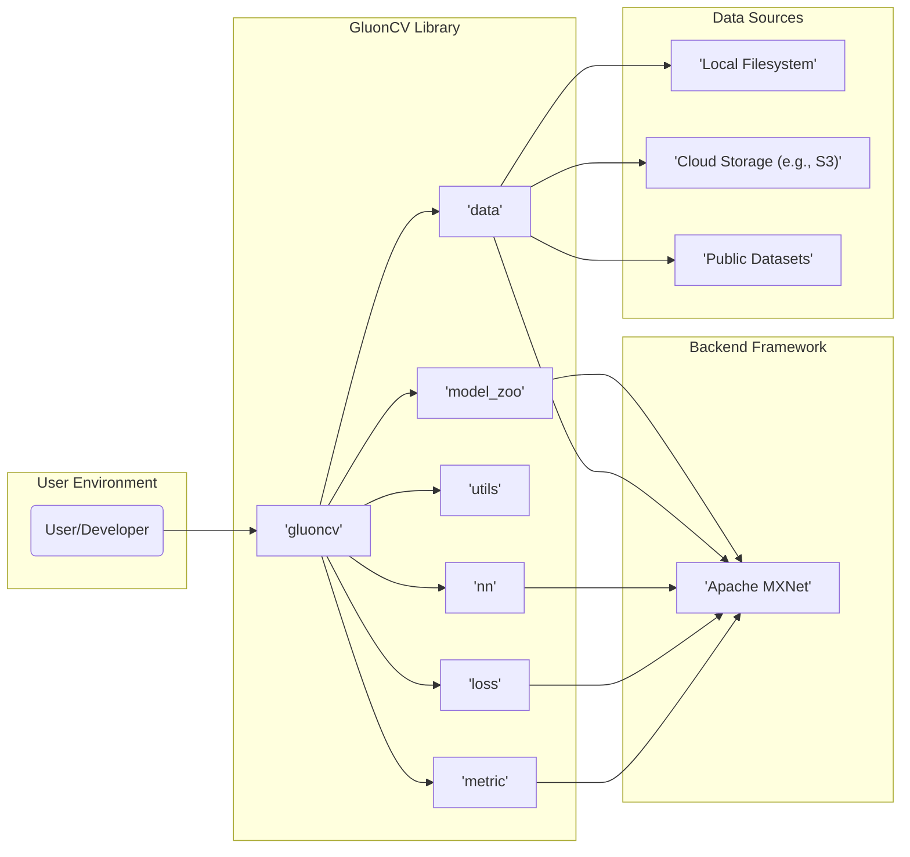
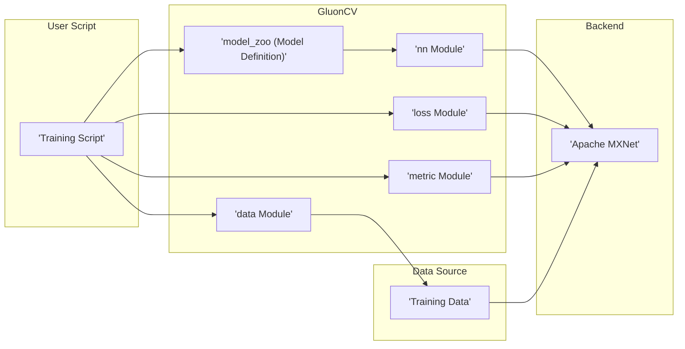
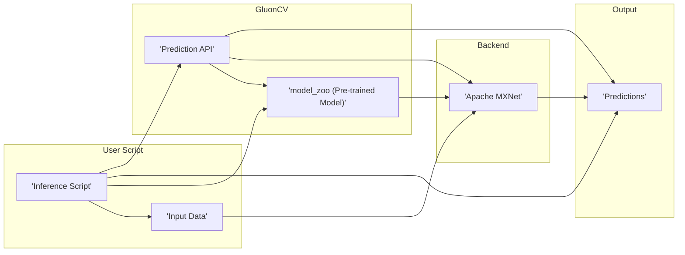

## Project Design Document: GluonCV

**1. Introduction**

This document provides a detailed design overview of the GluonCV project, an open-source toolkit for deep learning in computer vision. Built on top of Apache MXNet, GluonCV aims to provide state-of-the-art (SOTA) pre-trained models, easy-to-use APIs, and flexible tools for various computer vision tasks. This document will serve as a foundation for subsequent threat modeling activities.

**2. Goals and Objectives**

*   Provide a comprehensive library of pre-trained computer vision models, covering tasks like image classification, object detection, semantic segmentation, instance segmentation, and pose estimation.
*   Simplify the process of using pre-trained models through intuitive high-level APIs for model loading, prediction, and fine-tuning with minimal code.
*   Enable efficient model training by offering utilities for training custom models on diverse datasets, including distributed training capabilities.
*   Offer a modular and extensible architecture, allowing users to easily integrate custom layers, models, datasets, and evaluation metrics.
*   Maintain good performance and scalability by leveraging the efficient execution capabilities of Apache MXNet on various hardware (CPU, GPU).
*   Foster an active and collaborative community by encouraging contributions, providing comprehensive documentation, and offering support to users.

**3. High-Level Architecture**

**Description:**

*   **User/Developer:** Interacts with the GluonCV library through Python scripts or interactive environments (e.g., Jupyter notebooks) to perform computer vision tasks.
*   **GluonCV Library:** The core of the project, organized into several key modules:
    *   **`gluoncv`:** The main entry point and top-level package, providing convenient access to various functionalities.
    *   **`model_zoo`:** A repository of pre-trained models with readily available weights and configurations for various tasks and architectures.
    *   **`data`:**  Provides tools and abstractions for loading, preprocessing, and managing diverse computer vision datasets, including handling common formats and data augmentation.
    *   **`utils`:** Offers a collection of general-purpose utility functions and helper classes used across the library, such as logging, visualization, and parameter management.
    *   **`nn`:** Contains neural network building blocks, layers, and predefined network blocks, extending MXNet's neural network capabilities.
    *   **`loss`:** Implements a variety of commonly used loss functions for training computer vision models.
    *   **`metric`:** Provides implementations of various evaluation metrics to assess model performance on different tasks.
*   **Apache MXNet:** The underlying deep learning framework that provides the core tensor operations, automatic differentiation, and execution engine for GluonCV.
*   **Data Sources:**  Represents the various locations where the data used by GluonCV resides:
    *   **Local Filesystem:** Data stored directly on the user's machine or accessible storage.
    *   **Cloud Storage (e.g., S3):** Data stored in cloud-based object storage services.
    *   **Public Datasets:**  Well-known computer vision datasets that can be downloaded and used with GluonCV.

**4. Component Details**

*   **`gluoncv.model_zoo`:**
    *   **Purpose:** To provide a central repository of pre-trained models, making it easy for users to leverage state-of-the-art architectures without training from scratch.
    *   **Functionality:**
        *   Easy loading of pre-trained models with a single function call, specifying the model name and optionally pre-trained status.
        *   Listing of available models and their corresponding architectures.
        *   Automatic downloading of pre-trained model weights from remote sources (e.g., AWS S3).
        *   Providing model definitions and architectures that can be customized or fine-tuned.
    *   **Key Components:**
        *   Python scripts defining various model architectures (e.g., `resnet.py`, `yolo.py`).
        *   Pre-trained weight files (typically `.params` files in MXNet) stored remotely.
        *   Configuration options within the model definitions to control architecture variations.

*   **`gluoncv.data`:**
    *   **Purpose:** To simplify the process of loading and preparing data for training and inference, handling various data formats and preprocessing steps.
    *   **Functionality:**
        *   Support for common image and video dataset formats (e.g., ImageFolder, RecordIO, COCO, Pascal VOC, ADE20K).
        *   Implementation of various data augmentation techniques (e.g., random cropping, flipping, rotation, color jittering) to improve model generalization.
        *   Data loading utilities (e.g., `DataLoader`) that efficiently load data in batches for training.
        *   Functions for downloading and managing public datasets, simplifying access to benchmark datasets.
    *   **Key Components:**
        *   Dataset classes for different data formats, inheriting from MXNet's `gluon.data.Dataset`.
        *   Transformation functions (using MXNet's `gluon.data.vision.transforms`) for data augmentation and preprocessing.
        *   Data loader implementations that handle batching, shuffling, and parallel data loading.

*   **`gluoncv.utils`:**
    *   **Purpose:** To provide a collection of helpful utilities that simplify common tasks in computer vision and deep learning workflows.
    *   **Functionality:**
        *   Logging utilities for tracking training progress and debugging.
        *   Visualization tools for displaying images, bounding boxes, segmentation masks, and other visual outputs.
        *   Parameter management utilities for saving and loading model parameters (checkpoints).
        *   Evaluation utilities for calculating metrics on validation and test sets.
    *   **Key Components:**
        *   Logging handlers and formatters.
        *   Image drawing and display functions using libraries like Matplotlib or OpenCV.
        *   Checkpoint saving and loading functions leveraging MXNet's model saving capabilities.

*   **`gluoncv.nn`:**
    *   **Purpose:** To extend MXNet's neural network capabilities by providing commonly used layers, blocks, and network architectures specific to computer vision.
    *   **Functionality:**
        *   Implementation of standard neural network layers (e.g., Convolutional layers, Dense layers, Pooling layers, Activation functions).
        *   Predefined network blocks (e.g., ResNet basic blocks, Bottleneck blocks, Inception modules) that can be easily assembled into larger networks.
        *   Higher-level network components for specific tasks (e.g., detection heads, segmentation heads).
    *   **Key Components:**
        *   Layer classes inheriting from MXNet's `gluon.nn.Block`.
        *   Predefined block implementations as reusable components.

*   **`gluoncv.loss`:**
    *   **Purpose:** To provide implementations of various loss functions commonly used in training computer vision models for different tasks.
    *   **Functionality:**
        *   Implementations of classification losses (e.g., Softmax Cross-Entropy Loss, Focal Loss).
        *   Implementations of regression losses (e.g., L1 Loss, Smooth L1 Loss, IoU Loss).
        *   Implementations of segmentation losses (e.g., Softmax Cross-Entropy Loss, Dice Loss).
    *   **Key Components:**
        *   Loss function classes inheriting from MXNet's loss modules (e.g., `gluon.loss`).

*   **`gluoncv.metric`:**
    *   **Purpose:** To provide implementations of various evaluation metrics for assessing the performance of computer vision models on different tasks.
    *   **Functionality:**
        *   Implementations of classification metrics (e.g., Accuracy, Top-K Accuracy).
        *   Implementations of object detection metrics (e.g., Mean Average Precision (mAP)).
        *   Implementations of segmentation metrics (e.g., Intersection over Union (IoU), Pixel Accuracy).
    *   **Key Components:**
        *   Metric classes inheriting from MXNet's metric modules (e.g., `gluon.metric`).

**5. Data Flow**

The typical data flow within GluonCV involves two primary scenarios: **Model Training** and **Inference**.

**5.1. Model Training Data Flow:**

**Description:**

1. **Training Script:** The user writes a Python script to define the training process.
2. **`data` Module:** The script utilizes the `data` module to load and preprocess the training data from the specified **Data Source**. This includes applying data augmentations.
3. **`model_zoo` (Model Definition) / `nn` Module:** The script either loads a pre-defined model architecture from `model_zoo` or defines a custom architecture using building blocks from the `nn` module.
4. **`loss` Module:** The script selects an appropriate loss function from the `loss` module to guide the training process.
5. **`metric` Module:** The script selects evaluation metrics from the `metric` module to monitor the model's performance during training.
6. **Apache MXNet:** The loaded data, model definition, loss function, and metrics are used by MXNet to perform the core training computations, including forward and backward passes, and parameter updates.

**5.2. Inference Data Flow:**

**Description:**

1. **Inference Script:** The user writes a Python script to perform inference on new data.
2. **Input Data:** The user provides the input data (e.g., an image) for which predictions are needed.
3. **`model_zoo` (Pre-trained Model):** The script loads a pre-trained model (or a trained model from a checkpoint) from the `model_zoo`.
4. **Prediction API:** GluonCV provides a high-level API (often through the loaded model object) for making predictions on the input data.
5. **Apache MXNet:** The input data is fed into the loaded model, and MXNet performs the forward pass to generate predictions.
6. **Predictions:** The model outputs the predictions, which could be class labels, bounding boxes, segmentation masks, etc., depending on the task.

**6. Security Considerations**

This section outlines potential security considerations for the GluonCV project, which will be further explored during threat modeling.

*   **Dependency Management:**
    *   **Risk:** Vulnerabilities in Apache MXNet or other third-party dependencies (e.g., `numpy`, `requests`) could be exploited, potentially leading to remote code execution or other security breaches.
    *   **Considerations:** Implement a robust dependency management strategy, including regular updates of dependencies to their latest secure versions, utilizing dependency scanning tools to identify known vulnerabilities, and potentially pinning dependency versions to ensure consistency and prevent unexpected updates.
*   **Pre-trained Model Security:**
    *   **Risk:** Maliciously crafted pre-trained models could be introduced, potentially containing backdoors, biases, or triggers that could lead to unexpected behavior, data exfiltration, or model poisoning.
    *   **Considerations:** Implement mechanisms for verifying the integrity and authenticity of pre-trained models, such as using checksums or digital signatures. Consider providing guidance to users on sourcing models from trusted repositories and potentially offering tools for analyzing model behavior.
*   **Data Security:**
    *   **Risk:** Sensitive training data could be exposed or compromised during loading, processing, or storage, especially if users are working with proprietary or private datasets.
    *   **Considerations:** Encourage users to follow secure data handling practices, including access controls for data sources, encryption of sensitive data at rest and in transit, and anonymization techniques where applicable. GluonCV itself should avoid storing or transmitting user data unnecessarily.
*   **User Input Handling:**
    *   **Risk:** If users can provide arbitrary inputs (e.g., file paths, model names, URLs), there's a risk of path traversal vulnerabilities, arbitrary file reads, or server-side request forgery (SSRF) attacks.
    *   **Considerations:** Implement robust input validation and sanitization techniques to prevent malicious inputs from being processed. Use parameterized queries or safe file handling mechanisms.
*   **Code Injection:**
    *   **Risk:** Vulnerabilities in the GluonCV codebase could potentially allow for code injection, enabling attackers to execute arbitrary code on the user's machine.
    *   **Considerations:** Adhere to secure coding practices, conduct regular code reviews, and utilize static and dynamic analysis tools to identify potential vulnerabilities.
*   **Supply Chain Security:**
    *   **Risk:** Compromised packages or dependencies could be introduced into the project's supply chain, potentially injecting malicious code or vulnerabilities.
    *   **Considerations:** Verify the integrity of downloaded packages using checksums or signatures. Use trusted package repositories and consider using tools like software bill of materials (SBOM) to track dependencies.
*   **Remote Code Execution:**
    *   **Risk:** If vulnerabilities exist in GluonCV or its dependencies, attackers might be able to execute arbitrary code remotely on a user's system.
    *   **Considerations:** Prioritize addressing identified vulnerabilities promptly through patching and updates. Encourage users to keep their GluonCV installations up-to-date.
*   **Denial of Service (DoS):**
    *   **Risk:** Malicious actors could attempt to overload the system or resources used by GluonCV, potentially by submitting large or malformed inputs, leading to a denial of service.
    *   **Considerations:** Implement rate limiting or input size restrictions where appropriate. Ensure efficient resource management within GluonCV to prevent resource exhaustion.

**7. Deployment Considerations**

GluonCV can be used in various deployment scenarios, each with its own security implications:

*   **Local Development:** Users install GluonCV on their personal machines for development and experimentation. Security risks are primarily related to local system security and the integrity of downloaded packages.
*   **Cloud Environments:** GluonCV can be deployed on cloud platforms (e.g., AWS, Azure, GCP) using virtual machines, containers (e.g., Docker), or managed services. Security considerations include securing cloud infrastructure, managing access controls, and protecting data in the cloud.
*   **Edge Devices:** With appropriate optimization, GluonCV models can be deployed on edge devices for real-time inference. Security risks here include physical security of the devices, securing communication channels, and protecting models and data on the device.

**Security Considerations Specific to Deployment:**

*   **Access Control:** Properly configure access controls at the operating system, network, and application levels to restrict access to GluonCV deployments and sensitive data.
*   **Network Security:** Implement secure network configurations, including firewalls and intrusion detection/prevention systems, to protect GluonCV deployments from unauthorized access and network-based attacks.
*   **Container Security:** If using containers, ensure that container images are built securely, regularly scanned for vulnerabilities, and properly configured with appropriate resource limits and security policies.
*   **Secrets Management:** Securely manage API keys, credentials, and other sensitive information used by GluonCV deployments, avoiding hardcoding secrets in code or configuration files.

**8. Future Considerations**

*   **Enhanced Security Features:** Explore and implement additional security features, such as model signing and verification mechanisms, to further enhance the security of pre-trained models.
*   **Improved Robustness and Error Handling:** Strengthen the library against unexpected inputs and errors to prevent potential vulnerabilities or unexpected behavior.
*   **Regular Security Audits:** Conduct periodic security audits and penetration testing to identify and address potential security weaknesses in the codebase and infrastructure.
*   **Community Security Engagement:** Encourage security researchers and the community to report vulnerabilities through a responsible disclosure process.

This design document provides a comprehensive overview of the GluonCV project and serves as a crucial input for the subsequent threat modeling process. By understanding the architecture, components, data flow, and potential security considerations, we can effectively identify and mitigate potential threats to the project and its users.