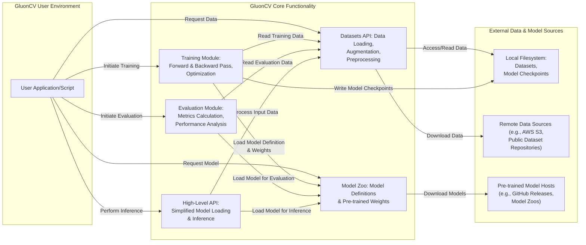

# Project Design Document: GluonCV

**Version:** 1.1
**Date:** October 26, 2023
**Author:** AI Architecture Expert

## 1. Introduction

This document provides an enhanced architectural design of the GluonCV project, an open-source toolkit for deep learning in computer vision, primarily built on top of the Apache MXNet framework. The primary purpose of this document is to serve as a robust foundation for subsequent threat modeling activities. It offers a more granular view of the key components, data flows, and interactions within the GluonCV ecosystem, explicitly focusing on aspects relevant to security analysis. This document is intended for security engineers, developers, and anyone involved in assessing the security posture of systems utilizing GluonCV.

## 2. Project Overview

GluonCV aims to provide state-of-the-art (SOTA) pre-trained deep learning models, high-level APIs, and user-friendly tools for various computer vision tasks. It significantly simplifies the processes of training, evaluating, and deploying computer vision models. The project encompasses a rich collection of models for diverse tasks such as image classification, object detection, semantic segmentation, instance segmentation, pose estimation, and more. Furthermore, it includes comprehensive utilities for efficient data loading, sophisticated model manipulation, and rigorous performance evaluation. The library is designed to be accessible to both researchers and practitioners.

## 3. System Architecture

The GluonCV project exhibits a layered architecture, with clear dependencies on underlying frameworks and interactions with external resources. Understanding these layers and dependencies is critical for identifying potential security vulnerabilities.

### 3.1. Core Components

- **Model Zoo:** A meticulously curated central repository of pre-trained deep learning models for a wide array of computer vision tasks. These models are typically trained on massive, publicly available datasets (e.g., ImageNet, COCO, Pascal VOC). The zoo facilitates downloading model definitions and pre-trained weights.
- **Datasets API:** Provides a set of well-defined interfaces for loading, processing, and managing common computer vision datasets. This includes functionalities for:
    - Automatic downloading of datasets.
    - Applying various data augmentation techniques (e.g., random cropping, flipping, rotation).
    - Performing data preprocessing steps (e.g., normalization, resizing).
    - Efficiently creating data loaders for batching data during training and evaluation.
- **Training and Evaluation Modules:** Contains a suite of scripts, classes, and utility functions designed for training new models from scratch or fine-tuning existing pre-trained models. Key aspects include:
    - Implementation of various loss functions (e.g., cross-entropy, focal loss).
    - Integration with different optimization algorithms (e.g., SGD, Adam).
    - Tools for monitoring training progress and logging metrics.
    - Functionality for saving and loading model checkpoints.
    - Metrics for evaluating model performance on various tasks (e.g., accuracy, mAP, IoU).
- **High-Level API:** Offers intuitive and user-friendly interfaces built upon the underlying MXNet Gluon API. This abstraction layer simplifies common computer vision tasks, enabling users to:
    - Easily load and utilize pre-trained models.
    - Define and train custom models with less boilerplate code.
    - Perform inference on new data with minimal effort.
- **Utilities:** A diverse collection of helper functions and modules for various tasks, such as:
    - Visualization of images, bounding boxes, and segmentation masks.
    - Conversion of models between different formats.
    - Analysis of model performance and complexity.
    - Tools for working with different data formats.
- **Documentation and Examples:** Provides comprehensive documentation, tutorials, and practical examples illustrating how to effectively use GluonCV for solving diverse computer vision problems. This includes code snippets and best practices.

### 3.2. Dependencies

- **Apache MXNet:** The foundational deep learning framework upon which GluonCV is built. GluonCV heavily leverages MXNet's NDArray API for efficient numerical computation and the flexible Gluon API for defining, training, and deploying neural networks. Specific versions of MXNet are typically required.
- **NumPy:** A fundamental library for numerical operations in Python, used extensively for array manipulation and mathematical computations within GluonCV.
- **SciPy:** Provides a collection of scientific computing tools and algorithms, utilized for various tasks within GluonCV.
- **Pillow (PIL):** The Python Imaging Library, used for image manipulation tasks such as loading, saving, and processing image data.
- **Requests:** A widely used library for making HTTP requests, primarily used by GluonCV for downloading pre-trained models and datasets from remote sources.
- **Contrib Packages (within MXNet):** GluonCV often utilizes contributed modules within MXNet for specialized functionalities.
- **Operating System Libraries:**  Dependencies on underlying operating system libraries for file system access, networking, etc.
- **Potentially other supporting libraries:** Depending on specific functionalities used, other libraries like OpenCV (for advanced image/video processing) or libraries for handling specific data formats might be dependencies.

### 3.3. Deployment Scenarios

GluonCV models and tools are versatile and can be employed in a wide range of deployment scenarios, each with its own security considerations:

- **Local Development and Research Environments:** Researchers and developers commonly use GluonCV on their personal machines or local servers for prototyping, experimentation, and model development.
- **Cloud-based Training Platforms:** GluonCV can be seamlessly integrated with cloud computing platforms (e.g., AWS SageMaker, Azure Machine Learning, Google Cloud AI Platform) for large-scale, distributed model training leveraging cloud resources.
- **Edge Deployment on Devices:** Trained GluonCV models, often optimized for performance and size, can be deployed on edge devices (e.g., embedded systems, mobile phones, IoT devices) for real-time inference at the data source.
- **Integration into Backend Applications:** GluonCV models can be incorporated into the backend of web applications or services to provide computer vision capabilities, such as image recognition, object detection in uploaded images, or video analysis.
- **Desktop Applications:**  GluonCV can be used within desktop applications to provide features like image processing, video analysis, or augmented reality experiences.

## 4. Data Flow

The typical data flow within GluonCV involves a series of interconnected stages, each representing a potential point of interaction and thus a potential area of security concern.

**Detailed Data Flow Description:**

- **Data Loading and Preprocessing:** A user application or script interacts with the `Datasets API` to load image or video data. This involves:
    - Accessing data from the `Local Filesystem` or downloading it from `Remote Data Sources`.
    - Applying data augmentation techniques (handled within the `Datasets API`).
    - Performing preprocessing steps like resizing, normalization (also within the `Datasets API`).
- **Model Loading:** Users can load pre-trained model architectures and weights from the `Model Zoo`. This process typically involves:
    - Downloading model definition files and pre-trained weight files from `Pre-trained Model Hosts`.
    - Loading these files into memory using GluonCV or MXNet functions.
- **Training Process:** The `Training Module` orchestrates the model training:
    - Reading batches of training data from the `Datasets API`.
    - Loading the model definition and potentially pre-trained weights from the `Model Zoo`.
    - Performing the forward and backward passes through the neural network.
    - Updating model weights using an optimization algorithm.
    - Periodically saving model checkpoints to the `Local Filesystem`.
- **Evaluation Process:** The `Evaluation Module` assesses the trained model's performance:
    - Reading batches of evaluation data from the `Datasets API`.
    - Loading the model to be evaluated (either from the `Model Zoo` or a locally trained checkpoint).
    - Making predictions on the evaluation data.
    - Calculating performance metrics based on the predictions and ground truth labels.
- **Inference:** The `High-Level API` simplifies the process of using trained models for prediction:
    - Loading a trained model (either pre-trained or user-trained) from the `Model Zoo` or the `Local Filesystem`.
    - Processing new input data (often using the `Datasets API` for preprocessing).
    - Feeding the processed data to the loaded model to obtain predictions.

## 5. External Interfaces

GluonCV interacts with several external entities, each representing a boundary where security measures are crucial:

- **Local Filesystem:**  Used for persistent storage of:
    - Downloaded datasets.
    - Pre-trained models (after they are downloaded).
    - Trained model checkpoints and logs.
    - Temporary files generated during training or processing.
    - **Security Implication:**  Unauthorized access to the filesystem could lead to data breaches, model theft, or manipulation of training data and models.
- **Remote Data Sources:** Datasets are frequently loaded from cloud storage services and public repositories:
    - Examples include AWS S3 buckets, Google Cloud Storage buckets, and publicly accessible dataset archives.
    - **Security Implication:**  Compromised remote data sources could introduce poisoned data, leading to biased or vulnerable models. Insecure connections could lead to data interception.
- **Pre-trained Model Hosts:** Pre-trained models are downloaded from various online locations:
    - These can include GitHub releases of model repositories, dedicated model zoos hosted by research institutions, or other online storage platforms.
    - **Security Implication:** Downloading models from untrusted or compromised hosts can introduce malicious models into the system. Lack of integrity checks can lead to the use of tampered models.
- **Package Managers (pip, conda):** Used for installing GluonCV and its software dependencies:
    - **Security Implication:**  Compromised package repositories or man-in-the-middle attacks during package installation could introduce malicious dependencies.
- **GPU Drivers (e.g., NVIDIA CUDA):** Required for leveraging GPU acceleration, a common practice in deep learning:
    - **Security Implication:** While less direct, vulnerabilities in GPU drivers could potentially be exploited.
- **Cloud Computing Platforms (AWS, Azure, GCP):** When used in the cloud, GluonCV interacts with various cloud services:
    - Storage services (S3, Azure Blob Storage, Google Cloud Storage).
    - Compute instances (EC2, Azure VMs, Compute Engine).
    - Machine learning services (SageMaker, Azure ML, AI Platform).
    - **Security Implication:** Cloud misconfigurations, compromised credentials, or vulnerabilities in cloud services can impact the security of GluonCV deployments.

## 6. Security Considerations (Detailed)

This section expands on potential security considerations, providing more specific examples of threats and potential impacts. This detailed analysis is crucial for effective threat modeling.

- **Dependency Vulnerabilities:** GluonCV's reliance on external libraries creates a potential attack surface:
    - **Threat:** Known vulnerabilities in MXNet, NumPy, SciPy, Pillow, Requests, or other dependencies could be exploited.
    - **Impact:**  Remote code execution, denial of service, or information disclosure.
    - **Mitigation:** Regularly update dependencies, use vulnerability scanning tools.
- **Model Poisoning:** The integrity of pre-trained models is paramount:
    - **Threat:** Malicious actors could upload backdoored or intentionally flawed pre-trained models to public repositories. Users downloading these models would unknowingly use compromised models.
    - **Impact:**  Models performing tasks incorrectly, leaking sensitive information, or even being used for malicious purposes.
    - **Mitigation:**  Verify model sources, use checksums or cryptographic signatures for model integrity checks.
- **Data Poisoning:** The integrity of training data is crucial for model reliability:
    - **Threat:** If datasets used for training are compromised (e.g., through compromised remote sources or local file system access), malicious data could be injected.
    - **Impact:** Trained models exhibiting biased behavior, making incorrect predictions, or even being specifically designed to fail under certain conditions.
    - **Mitigation:**  Use trusted data sources, implement data validation and sanitization techniques.
- **Code Injection:** Improper handling of user input can lead to vulnerabilities:
    - **Threat:** If user-provided input (e.g., file paths, data loading parameters) is not properly sanitized, it could be used to inject malicious code that is then executed by the GluonCV environment.
    - **Impact:**  Remote code execution, unauthorized file access, or system compromise.
    - **Mitigation:**  Thoroughly sanitize user inputs, avoid using `eval()` or similar functions on untrusted input.
- **Unauthorized Access:** Protecting access to resources is essential:
    - **Threat:** Unauthorized access to local files (datasets, models, checkpoints) or cloud storage containing these resources could lead to data breaches or model theft.
    - **Impact:** Loss of sensitive data, intellectual property theft, or the use of proprietary models for unauthorized purposes.
    - **Mitigation:** Implement strong access control mechanisms, use encryption for sensitive data at rest and in transit.
- **Man-in-the-Middle Attacks:** Secure communication is vital during downloads:
    - **Threat:** When downloading pre-trained models or datasets over insecure connections (HTTP instead of HTTPS), attackers could intercept the traffic and inject malicious files.
    - **Impact:**  Installation of compromised models or datasets, leading to similar impacts as model and data poisoning.
    - **Mitigation:**  Enforce HTTPS for all downloads, verify the authenticity of download sources.
- **Supply Chain Security:** Maintaining the integrity of the GluonCV codebase itself is critical:
    - **Threat:**  If the GluonCV repository or its build/release process is compromised, malicious code could be injected directly into the library.
    - **Impact:**  Widespread distribution of compromised software affecting all users of GluonCV.
    - **Mitigation:**  Strict access control for code contributions, code reviews, and secure build pipelines.

## 7. Future Considerations

- **Enhanced Security Features:**  Actively developing and integrating security features directly into GluonCV:
    - Implementing cryptographic verification of downloaded models and datasets.
    - Providing tools for vulnerability scanning of dependencies.
    - Offering secure data loading options.
- **Integration with Security Tools:**  Improving interoperability with existing security tools and frameworks.
- **Federated Learning and Privacy-Preserving Techniques:** Exploring methods for training models collaboratively without directly sharing sensitive data.
- **Improved Explainability and Interpretability:**  While not directly a security feature, better understanding model decisions can help identify potential biases or vulnerabilities.

## 8. Conclusion

This enhanced design document provides a more detailed and security-focused view of the GluonCV project architecture. By elaborating on the core components, data flows, external interfaces, and potential security considerations, this document serves as a significantly improved foundation for conducting a comprehensive threat model. The specific threats and impacts outlined here will be further analyzed and mitigated in subsequent security assessments.
