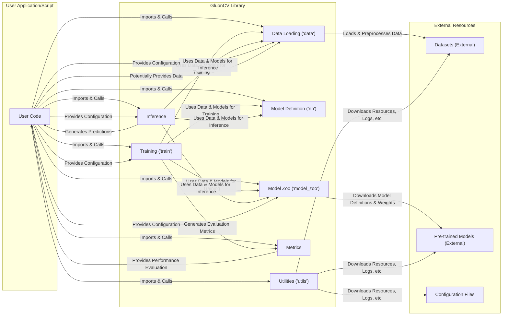

# Project Design Document: GluonCV for Threat Modeling

**Version:** 1.1
**Date:** October 26, 2023
**Author:** AI Architecture Expert

## 1. Introduction

This document provides an enhanced and more detailed design overview of the GluonCV project, specifically tailored for use in subsequent threat modeling activities. It aims to provide a clearer and more comprehensive understanding of the system's architecture, data flows, and potential security implications.

### 1.1. Purpose

The primary purpose of this document is to serve as an improved and more robust reference for security professionals and developers involved in threat modeling the GluonCV project. It aims to provide a clear, structured, and security-focused understanding of the system's architecture and functionality.

### 1.2. Scope

This document covers the core components and functionalities of the GluonCV library as represented in the provided GitHub repository: [https://github.com/dmlc/gluon-cv](https://github.com/dmlc/gluon-cv). It focuses on aspects directly relevant to potential security threats, including detailed data handling procedures, external dependencies with specific examples, and various user interaction points.

### 1.3. Target Audience

This document is intended for:

* Security engineers and architects leading and participating in threat modeling exercises.
* Developers actively contributing to or utilizing the GluonCV library.
* Auditors and compliance officers assessing the security posture of systems incorporating GluonCV.
* Anyone requiring an in-depth understanding of GluonCV's architecture with a strong emphasis on security considerations.

## 2. Overview of GluonCV

GluonCV is a widely adopted open-source toolkit providing state-of-the-art (SOTA) deep learning algorithms specifically for computer vision tasks. Its goal is to empower engineers, researchers, and students to rapidly prototype, experiment with, and deploy practical computer vision applications. Key features include:

* **Comprehensive Model Zoo:** An extensive collection of pre-trained models covering a wide range of computer vision tasks such as image classification (e.g., ResNet, MobileNet), object detection (e.g., YOLO, SSD), and semantic segmentation (e.g., FCN, DeepLab). These models often have different architectures and pre-training datasets.
* **Highly Modular Design:** Components are meticulously designed for reusability and composability, allowing users to easily integrate and extend functionalities. This modularity extends to data loaders, model blocks, and training utilities.
* **Framework Flexibility:** While primarily built upon Apache MXNet, GluonCV's design allows for potential integration with other deep learning frameworks, enhancing its adaptability.
* **Robust Dataset Integration:** Provides a rich set of utilities for seamless loading, preprocessing, and management of common computer vision datasets (e.g., ImageNet, COCO, Pascal VOC). It handles various data formats and offers tools for data augmentation.
* **Versatile Training and Inference Tools:** Offers a comprehensive suite of functionalities for training new models from scratch, fine-tuning existing pre-trained models, and performing efficient inference with trained models. This includes support for distributed training.

## 3. System Architecture

GluonCV, as a library, operates within the context of a user's application or script. Its architecture is defined by its internal components and their interactions within this environment. Understanding these interactions is crucial for identifying potential threat vectors.

### 3.1. Key Components

* **`model_zoo`:**
    * Contains Python code defining the architecture of various deep learning models (e.g., `resnet.py`, `yolo.py`).
    * Includes functions to automatically download pre-trained weights for these models from external sources (e.g., AWS S3 buckets managed by the project or potentially other hosting platforms).
    * Allows users to load these pre-trained models or instantiate model architectures for training.
    * Users can also contribute and potentially add new models to this zoo.
* **`data`:**
    * Provides Python classes and functions for loading and preprocessing diverse computer vision datasets (e.g., `imagenet.py`, `coco.py`).
    * Supports various dataset formats (e.g., image files, annotation files in different formats).
    * Offers utilities for common data augmentation techniques (e.g., random cropping, flipping, color jittering).
    * May involve downloading datasets from external repositories or user-specified locations.
* **`nn`:**
    * Implements fundamental neural network building blocks and layers as Gluon `Block` objects (e.g., `Conv2D`, `BatchNorm`, `Dense`).
    * Provides high-level APIs for defining and manipulating complex neural network architectures by composing these blocks.
    * Forms the foundation for building custom models or modifying existing ones.
* **`utils`:**
    * Contains a collection of utility functions for various tasks, including:
        * Downloading files from URLs (`download.py`).
        * Logging and debugging (`logger.py`).
        * Visualization of images and model outputs (`viz.py`).
        * Handling configuration files.
* **`metrics`:**
    * Implements a range of evaluation metrics commonly used in computer vision tasks (e.g., accuracy, precision, recall, mAP).
    * Allows users to evaluate the performance of their models during training and inference.
* **`loss`:**
    * Defines common loss functions used to guide the training process of deep learning models (e.g., `SoftmaxCrossEntropyLoss`, `SigmoidBinaryCrossEntropyLoss`).
* **`train`:**
    * Provides high-level APIs and example scripts for training deep learning models (e.g., `train_imagenet.py`, `train_ssd.py`).
    * Handles crucial aspects of the training loop, such as optimizer configuration (e.g., SGD, Adam), learning rate scheduling, and model checkpointing (saving and loading model weights).
* **`auto` (Experimental):**
    * Includes features for automated model architecture search (NAS) and hyperparameter optimization (HPO).
    * May involve interaction with external optimization services or libraries. This component is less mature and might have evolving security considerations.

### 3.2. Data Flow

The data flow within GluonCV typically involves several distinct stages, often orchestrated by the user's application or script. Understanding this flow is critical for identifying potential data manipulation or access points.

**Detailed Data Flow Scenarios:**

* **Training a Model from Scratch or Fine-tuning:**
    * User code initiates the training process, often using scripts within the `train` module.
    * The `data` module loads and preprocesses the training dataset, potentially downloading it from external sources specified in configuration or code.
    * A model architecture is either defined programmatically using the `nn` module or loaded as a blueprint from the `model_zoo`. Pre-trained weights might be optionally loaded from the `model_zoo`.
    * The `train` module orchestrates the training loop, feeding batches of data to the model, calculating the loss using functions from the `loss` module, and updating model weights based on the chosen optimizer.
    * Evaluation metrics are calculated periodically using the `metrics` module to monitor training progress. Model checkpoints (saved weights) are written to disk using utility functions.
* **Performing Inference with a Pre-trained or Trained Model:**
    * User code loads a pre-trained model (architecture and weights) from the `model_zoo` or loads weights from a previously trained model checkpoint.
    * The `data` module loads and preprocesses the input data for inference, ensuring it matches the format expected by the model.
    * The model performs inference on the input data, generating predictions.
    * Results are returned to the user code for further processing or display.

### 3.3. Interactions with External Systems

GluonCV's functionality inherently involves interactions with various external systems, which represent potential attack surfaces:

* **Downloading Datasets from Remote URLs:** The `data` module, through utilities in `utils`, may download datasets from publicly accessible or private URLs. This poses a risk if these sources are compromised or serve malicious data.
* **Downloading Pre-trained Models from External Sources:** The `model_zoo` downloads pre-trained model weights, often from cloud storage buckets. The integrity and authenticity of these models are crucial.
* **Dependency Management via `pip`:** GluonCV relies on other Python packages specified in `requirements.txt` or `setup.py`. Vulnerabilities in these dependencies can be exploited.
* **Hardware Acceleration Libraries (e.g., CUDA, cuDNN):**  Interactions with these libraries, while generally low-level, can introduce vulnerabilities if the libraries themselves are compromised or improperly configured.
* **Potential Integration with Cloud Services (User-Driven):** Users might integrate GluonCV with cloud storage (e.g., AWS S3, Google Cloud Storage) for accessing large datasets or storing trained models. This integration requires careful management of cloud credentials and permissions.
* **User-Provided Data Sources:** The primary input to GluonCV is data provided by the user, which can originate from various sources (local files, databases, network streams). The security of these sources is paramount.
* **Logging and Monitoring Systems:** GluonCV might integrate with logging frameworks, potentially sending sensitive information to external logging services.
* **External Optimization Services (for `auto` module):** The experimental `auto` module might interact with external services for NAS or HPO, introducing new trust boundaries.

## 4. Security Considerations

Given GluonCV's architecture and interactions, several critical security considerations must be addressed:

* **Supply Chain Security - A Significant Concern:**
    * **Dependencies:** Vulnerabilities in direct and transitive dependencies (e.g., MXNet, NumPy, Pillow, requests) can be exploited to compromise GluonCV's functionality or the user's environment. Regular security scanning and updates are essential.
    * **Pre-trained Models:** Downloading pre-trained models from potentially untrusted external sources introduces the risk of malicious models containing backdoors, adversarial triggers, or biases that could be exploited. Model provenance and integrity verification are crucial.
    * **Datasets:** Downloaded datasets could be corrupted, contain adversarial examples designed to fool models, or even include malware disguised as data files. Dataset validation and integrity checks are necessary.
* **Input Validation and Sanitization:**
    * User-provided data (images, annotations, configuration parameters) needs rigorous validation to prevent injection attacks (e.g., path traversal, command injection) or unexpected behavior that could lead to crashes or security breaches.
    * Model inputs should be sanitized to prevent adversarial attacks that exploit model vulnerabilities.
* **Code Injection Vulnerabilities:**
    * If GluonCV allows execution of user-provided code snippets or deserialization of untrusted data (e.g., through pickle), there's a significant risk of arbitrary code execution.
* **Data Security and Privacy Implications:**
    * Handling sensitive image or video data requires adherence to privacy regulations (e.g., GDPR, CCPA). Secure storage, access control, and anonymization techniques might be necessary when using GluonCV with such data.
    * Data downloaded or processed by GluonCV might temporarily reside in insecure locations if not handled carefully.
* **Denial of Service (DoS) Potential:**
    * Resource-intensive operations like training large models or processing high-resolution images could be exploited for DoS attacks if input sizes or training parameters are not properly limited or validated.
* **Authentication and Authorization (Context-Dependent):**
    * While GluonCV itself doesn't inherently handle authentication, its integration with cloud services or internal systems for data access might require robust authentication and authorization mechanisms. Misconfigured credentials or permissions can lead to security breaches.
* **Configuration Security Risks:**
    * Misconfigured training parameters, API keys, or access tokens stored in configuration files can expose sensitive information or create vulnerabilities. Secure storage and management of configuration data are vital.
* **Insecure Deserialization:** If GluonCV uses deserialization (e.g., `pickle`) to load model weights or other data, vulnerabilities in the deserialization process could allow for arbitrary code execution if the serialized data is malicious.

## 5. Deployment Considerations

The security implications of GluonCV are heavily influenced by its deployment environment:

* **Local Machine (Developer Environment):** Risks are generally lower but still include potential exposure to malware through downloaded dependencies or data.
* **Server Environment (On-Premise or Cloud):** Requires careful consideration of network security, access controls, and secure storage for data and models. Vulnerabilities in the server operating system or other installed software can be exploited.
* **Cloud Environments (e.g., AWS SageMaker, Google Cloud AI Platform):** Introduces cloud-specific security considerations, such as IAM roles and permissions, network configurations (VPCs, security groups), and the security of cloud storage services. Misconfigurations in these areas are common attack vectors.
* **Edge Devices:** Deploying GluonCV on edge devices with limited resources and potentially insecure network connections presents unique challenges. Physical security of the device and secure communication protocols are important.
* **Containers (Docker):** While containers provide isolation, vulnerabilities in the container image or misconfigurations in the container runtime can still lead to security issues. Regularly scanning container images for vulnerabilities is crucial.

## 6. Data Handling

A deeper understanding of GluonCV's data handling practices is essential for threat modeling:

* **Data Types:** GluonCV processes a wide range of data types, including:
    * **Raw Image Data:** In various formats (JPEG, PNG, etc.).
    * **Raw Video Data:** In various formats (MP4, AVI, etc.).
    * **Annotation Data:** Bounding boxes, segmentation masks, class labels, often in formats like COCO JSON or Pascal VOC XML.
    * **Model Weights:** Numerical data representing the learned parameters of the models, typically stored in binary formats.
    * **Configuration Data:** Parameters for model training, data loading, and other settings, often in JSON or YAML files.
* **Data Loading Mechanisms:** Data is loaded from various sources:
    * **Local File System:** Direct access to files and directories.
    * **Remote URLs (HTTP/HTTPS):** Downloading datasets and models.
    * **Cloud Storage APIs (e.g., boto3 for AWS S3):** Accessing data stored in the cloud.
    * **In-Memory Data:**  Data might be generated or provided directly within the user's code.
* **Data Processing Steps:** Common data processing steps include:
    * **Decoding:** Converting image and video files into numerical representations.
    * **Resizing and Cropping:** Adjusting image dimensions.
    * **Normalization:** Scaling pixel values to a specific range.
    * **Data Augmentation:** Applying transformations to increase data variability.
    * **Batching:** Grouping data samples for efficient processing.
* **Data Storage (Temporary):** During processing, data might be temporarily stored in memory or on disk. Secure handling of these temporary files is important.

## 7. External Interfaces

GluonCV interacts with the external world through several interfaces:

* **Python API:** The primary interface for users to interact with GluonCV's functionalities. This API needs to be designed to prevent misuse or exploitation.
* **Command-Line Interface (CLI):** Some utility scripts or training launchers might be accessible via the command line, potentially exposing parameters to command injection vulnerabilities if not handled carefully.
* **Integration with Deep Learning Frameworks (Primarily MXNet):** Relies heavily on the underlying framework's APIs. Security vulnerabilities in MXNet can directly impact GluonCV.
* **File System Interactions:** Reads and writes data, model weights, and configuration files to the file system. Improper file permissions or insecure file handling can be exploited.
* **Network Interactions:** Downloads data and models from remote servers. These network connections should ideally be over HTTPS to ensure data integrity and confidentiality.

## 8. Threat Modeling Focus Areas

Based on the detailed architecture and security considerations, the following areas should be the primary focus during threat modeling exercises:

* **Deep Dive into Model Zoo Security:**
    * **Source Verification:** How is the authenticity and integrity of pre-trained models verified before download and use? Are cryptographic signatures used?
    * **Malicious Model Detection:** What mechanisms are in place to prevent the inclusion or use of models containing backdoors or adversarial triggers?
    * **Dependency on External Hosting:** Analyze the security posture of the platforms hosting the pre-trained models.
* **In-Depth Analysis of Dataset Security:**
    * **Source Trustworthiness:** How is the trustworthiness of external dataset sources evaluated?
    * **Data Integrity Checks:** Are checksums or other mechanisms used to verify the integrity of downloaded datasets?
    * **Adversarial Example Risks:** How does GluonCV mitigate the risk of models being trained or evaluated on adversarial examples?
    * **Malware in Datasets:**  Assess the potential for malicious files disguised as data within downloaded datasets.
* **Comprehensive Dependency Management Assessment:**
    * **Vulnerability Scanning:** Implement regular scanning of GluonCV's dependencies for known vulnerabilities.
    * **Supply Chain Attack Mitigation:**  Strategies to mitigate supply chain attacks targeting dependencies.
    * **Dependency Pinning:**  The practice of specifying exact versions of dependencies to ensure consistency and reduce the risk of unexpected updates introducing vulnerabilities.
* **Rigorous Input Validation Examination:**
    * **Identify all input points:**  Map all locations where user-provided data or configurations are accepted.
    * **Validation Techniques:** Analyze the validation techniques used for each input type (e.g., data type checks, range checks, regular expressions).
    * **Sanitization Methods:**  Determine how user inputs are sanitized to prevent injection attacks.
* **Scrutinize Potential Code Execution Risks:**
    * **Deserialization Practices:**  Thoroughly review any use of deserialization and implement secure deserialization techniques.
    * **Dynamic Code Evaluation:** Identify any instances where user-provided code snippets are evaluated or executed.
* **Address Data Privacy Concerns Proactively:**
    * **Data Minimization:**  Strategies to minimize the amount of sensitive data processed by GluonCV.
    * **Anonymization Techniques:**  Explore options for anonymizing or de-identifying sensitive data before processing.
    * **Secure Data Storage:**  Ensure that any temporary data storage is secure.
* **Evaluate Resilience to Denial of Service:**
    * **Resource Limits:**  Implement mechanisms to limit resource consumption for computationally intensive tasks.
    * **Input Size Validation:**  Validate the size and dimensions of input data to prevent excessive resource usage.

## 9. Future Considerations

As GluonCV continues to evolve, anticipating future security challenges is crucial:

* **Expanding Framework Integrations:** Integrating with new deep learning frameworks might introduce new dependencies and associated security risks that need careful evaluation.
* **Increased Cloud-Native Functionality:** Deeper integration with cloud services will necessitate addressing cloud-specific security best practices and potential vulnerabilities.
* **Emerging Model Architectures and Algorithms:** Novel model architectures might have unforeseen security vulnerabilities that require research and mitigation strategies.
* **Advancements in AutoML:** As the `auto` module matures, the security implications of automated model design and hyperparameter tuning need thorough investigation, especially regarding interactions with external services.
* **Federated Learning Integration:** If GluonCV incorporates federated learning capabilities, new security challenges related to data privacy and model poisoning will need to be addressed.

## Appendix: Diagrams

**(Diagrams are included inline within the relevant sections above using Mermaid syntax.)**