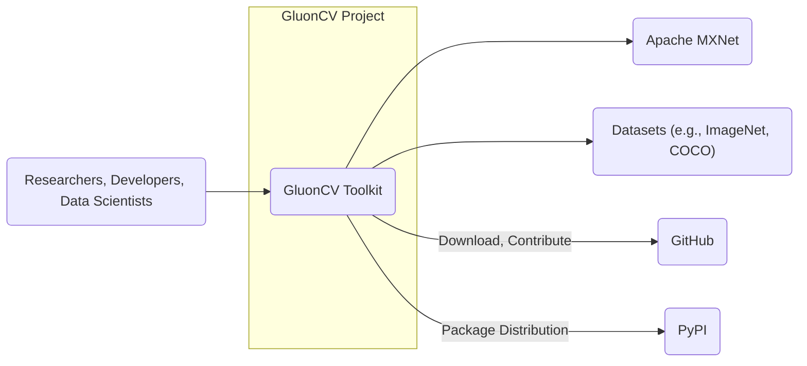
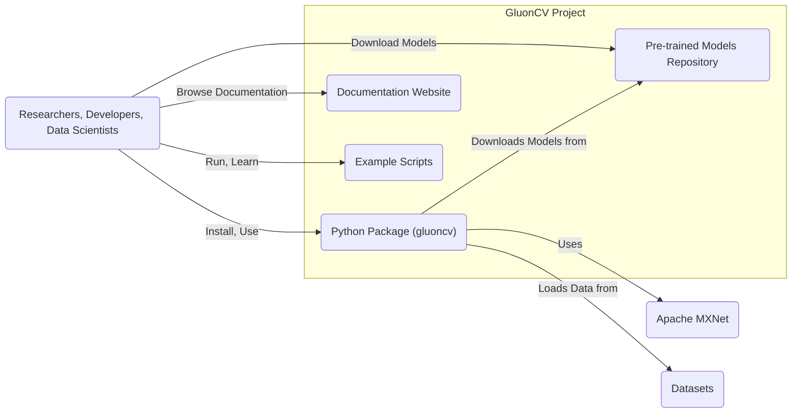
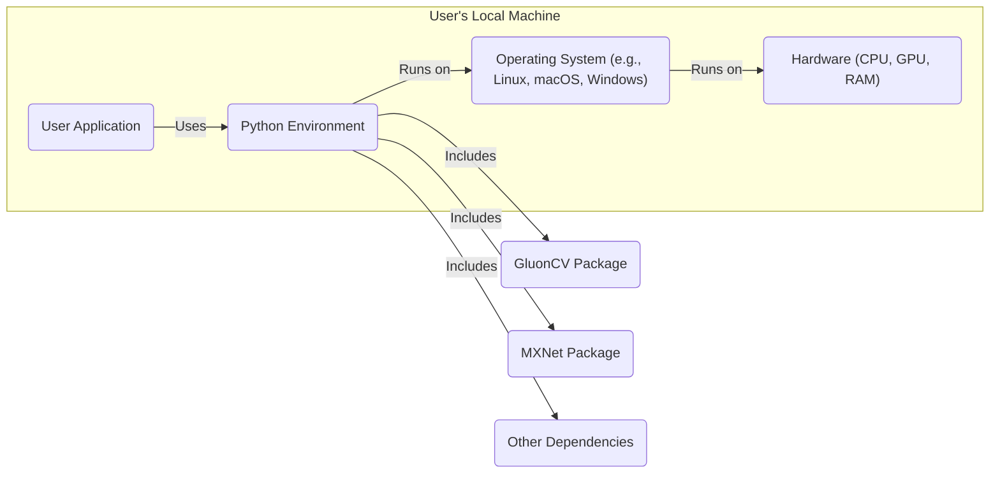

# BUSINESS POSTURE

- Business Priorities and Goals:
  - Provide a comprehensive, high-performance, and user-friendly open-source toolkit for computer vision tasks.
  - Facilitate research and development in computer vision by offering readily available and reproducible implementations of state-of-the-art algorithms.
  - Foster a collaborative community around computer vision and deep learning.
- Business Risks:
  - Reputational damage due to security vulnerabilities or instability in the toolkit, leading to decreased user trust and adoption.
  - Reduced community contribution and slower development if the project is perceived as insecure or difficult to contribute to.
  - Supply chain risks arising from compromised dependencies, potentially introducing vulnerabilities into the toolkit and user environments.
  - Legal and compliance risks if the toolkit or its components violate licensing terms or data privacy regulations (though less relevant for the toolkit itself, more for its applications).

# SECURITY POSTURE

- Existing Security Controls:
  - security control: Open Source Review - The project is open source, allowing for community review of the code, which can help identify potential vulnerabilities. Implemented through GitHub repository visibility and contribution model.
  - security control: GitHub Security Features - GitHub provides automated security scanning features, such as dependency vulnerability scanning, which are likely enabled for the repository. Implemented by GitHub platform.
  - security control: Software Composition Analysis (SCA) -  Likely performed implicitly by the community and maintainers through dependency management and awareness of known vulnerabilities in used libraries. Implemented by community and maintainers.
- Accepted Risks:
  - accepted risk: Reliance on Community Security Contributions - Security fixes and vulnerability identification largely depend on the efforts of the open-source community, which can lead to delays in addressing security issues.
  - accepted risk: Vulnerabilities in Dependencies - The project relies on external libraries (dependencies) which may contain vulnerabilities that are not immediately known or patched.
  - accepted risk: Lack of Formal Security Audits - As an open-source project, dedicated and frequent professional security audits might not be performed due to resource constraints.
- Recommended Security Controls:
  - security control: Implement Automated Security Scanning in CI/CD - Integrate SAST (Static Application Security Testing) and DAST (Dynamic Application Security Testing) tools into the CI/CD pipeline to automatically detect potential vulnerabilities in code changes.
  - security control: Dependency Vulnerability Scanning and Management - Implement a robust dependency management process that includes regular scanning for known vulnerabilities and automated updates to patched versions. Tools like Dependabot or similar can be used.
  - security control: Security Code Review Guidelines for Contributors - Establish and document security best practices and guidelines for code contributions to educate contributors and improve the overall security posture of the codebase.
  - security control: Security Incident Response Plan - Define a basic security incident response plan to handle reported vulnerabilities, including disclosure process and patching strategy.
- Security Requirements:
  - Authentication: Not directly applicable to the toolkit itself as it is a library. However, if the project includes associated web services (e.g., documentation website, model repository), authentication would be required for administrative access.
  - Authorization: Similar to authentication, not directly applicable to the toolkit. Authorization would be relevant for managing access to associated infrastructure and resources.
  - Input Validation: Crucial for the toolkit, especially in model loading and data processing components. Implement robust input validation to prevent vulnerabilities like adversarial attacks, data poisoning, or unexpected behavior due to malformed inputs. This should be applied to data formats, model parameters, and any user-provided input that influences toolkit behavior.
  - Cryptography: May be relevant for secure storage or distribution of pre-trained models, especially if there are concerns about integrity or confidentiality. Consider using cryptographic signatures to ensure model integrity and potentially encryption for sensitive model data if applicable.

# DESIGN

## C4 CONTEXT



- Context Diagram Elements:
  - Element:
    - Name: GluonCV Toolkit
    - Type: Software System
    - Description: An open-source deep learning toolkit for computer vision, providing pre-trained models and implementations of various computer vision algorithms.
    - Responsibilities:
      - Provide reusable and efficient implementations of computer vision models and algorithms.
      - Offer pre-trained models for various computer vision tasks.
      - Enable researchers and developers to build and experiment with computer vision applications.
    - Security controls:
      - security control: Input validation in model loading and data processing.
      - security control: Dependency management to mitigate vulnerabilities in used libraries.
  - Element:
    - Name: Researchers, Developers, Data Scientists
    - Type: Person
    - Description: Users of the GluonCV Toolkit who utilize it for research, development, and deployment of computer vision applications.
    - Responsibilities:
      - Utilize the toolkit to build and train computer vision models.
      - Contribute to the toolkit by reporting issues, suggesting features, and submitting code.
      - Deploy applications built using the toolkit.
    - Security controls:
      - security control: Secure coding practices when using the toolkit in their applications.
      - security control: Responsible use of pre-trained models and awareness of potential biases or vulnerabilities.
  - Element:
    - Name: Apache MXNet
    - Type: Software System
    - Description: The deep learning framework upon which GluonCV is built. Provides the underlying computational engine and infrastructure.
    - Responsibilities:
      - Provide core deep learning functionalities like tensor operations, automatic differentiation, and neural network building blocks.
      - Manage execution of deep learning models.
    - Security controls:
      - security control: MXNet's own security controls and vulnerability management processes.
      - security control: GluonCV's dependency management ensures compatible and secure MXNet versions.
  - Element:
    - Name: Datasets (e.g., ImageNet, COCO)
    - Type: External Data Source
    - Description: Publicly available datasets used for training and evaluating computer vision models within GluonCV.
    - Responsibilities:
      - Provide benchmark datasets for computer vision research.
      - Serve as input data for training and testing models in GluonCV.
    - Security controls:
      - security control: Data integrity checks when downloading and using datasets.
      - security control: Awareness of potential biases or adversarial examples within datasets.
  - Element:
    - Name: GitHub
    - Type: Platform
    - Description: A web-based platform for version control and collaboration, hosting the GluonCV project repository.
    - Responsibilities:
      - Host the source code of GluonCV.
      - Facilitate collaboration among developers and contributors.
      - Provide issue tracking and project management features.
    - Security controls:
      - security control: GitHub's platform security controls, including access management and vulnerability scanning.
      - security control: GluonCV project's repository access controls and branch protection rules.
  - Element:
    - Name: PyPI
    - Type: Package Registry
    - Description: The Python Package Index, used for distributing the GluonCV toolkit as a Python package.
    - Responsibilities:
      - Host and distribute the GluonCV Python package.
      - Provide package installation and management tools (pip).
    - Security controls:
      - security control: PyPI's platform security controls to prevent malicious package uploads.
      - security control: GluonCV's build and release process ensures package integrity and authenticity (e.g., signing).

## C4 CONTAINER



- Container Diagram Elements:
  - Element:
    - Name: Python Package (gluoncv)
    - Type: Application
    - Description: The core component of GluonCV, distributed as a Python package. Contains the implementations of computer vision algorithms, model definitions, and utilities.
    - Responsibilities:
      - Provide the API for using GluonCV functionalities.
      - Implement computer vision algorithms and models.
      - Manage model loading, data processing, and training workflows.
    - Security controls:
      - security control: Input validation within the package to handle user inputs and data safely.
      - security control: Dependency management to ensure secure and updated dependencies.
      - security control: Code reviews and static analysis to identify potential vulnerabilities.
  - Element:
    - Name: Documentation Website
    - Type: Web Application
    - Description: A website hosting the documentation for GluonCV, including API references, tutorials, and examples.
    - Responsibilities:
      - Provide comprehensive documentation for users to understand and use GluonCV.
      - Offer tutorials and examples to guide users in applying GluonCV.
      - Serve as a central resource for information about the project.
    - Security controls:
      - security control: HTTPS to ensure secure communication between users and the website.
      - security control: Content Security Policy (CSP) to mitigate XSS attacks.
      - security control: Regular security updates and patching of the website platform.
  - Element:
    - Name: Pre-trained Models Repository
    - Type: Data Store
    - Description: A repository (likely cloud storage or a dedicated server) storing pre-trained models for various computer vision tasks.
    - Responsibilities:
      - Store and serve pre-trained model files.
      - Ensure availability and integrity of model files.
      - Potentially manage versions of pre-trained models.
    - Security controls:
      - security control: Access control to manage who can upload or modify models.
      - security control: Integrity checks (e.g., checksums, signatures) to ensure model files are not tampered with.
      - security control: Secure storage and transfer of model files (e.g., encryption at rest and in transit).
  - Element:
    - Name: Example Scripts
    - Type: Application
    - Description: A collection of example Python scripts demonstrating how to use GluonCV for various computer vision tasks.
    - Responsibilities:
      - Provide practical examples for users to learn and get started with GluonCV.
      - Showcase different functionalities and use cases of the toolkit.
    - Security controls:
      - security control: Code review of example scripts to avoid introducing vulnerabilities.
      - security control: Clear documentation and warnings about potential security implications when running untrusted code or models.

## DEPLOYMENT

- Deployment Options:
  - Local Machine Deployment: Users typically install GluonCV and its dependencies on their local machines (desktops, laptops) for development and experimentation.
  - Cloud Deployment: GluonCV can be deployed in cloud environments (AWS, GCP, Azure) for training models on larger datasets or deploying applications at scale. This could involve using cloud VMs, containers (Docker, Kubernetes), or serverless functions.
  - HPC Clusters: For large-scale training, GluonCV can be deployed on High-Performance Computing (HPC) clusters, leveraging distributed computing capabilities.

- Detailed Deployment (Local Machine - Common Scenario):



- Deployment Diagram Elements (Local Machine):
  - Element:
    - Name: User Application
    - Type: Application
    - Description: The computer vision application developed by a user, utilizing the GluonCV toolkit.
    - Responsibilities:
      - Implement specific computer vision tasks using GluonCV.
      - Handle application-specific logic and data processing.
    - Security controls:
      - security control: Application-level security controls implemented by the user (authentication, authorization, input validation, etc.).
      - security control: Secure coding practices in the user application to prevent vulnerabilities.
  - Element:
    - Name: Python Environment
    - Type: Runtime Environment
    - Description: A Python environment (e.g., virtual environment, Conda environment) where GluonCV and its dependencies are installed.
    - Responsibilities:
      - Provide the runtime environment for executing Python code, including GluonCV.
      - Manage installed Python packages and dependencies.
    - Security controls:
      - security control: Keeping the Python environment and packages updated to patch vulnerabilities.
      - security control: Using virtual environments to isolate project dependencies and reduce conflicts.
  - Element:
    - Name: Operating System (e.g., Linux, macOS, Windows)
    - Type: Operating System
    - Description: The operating system running on the user's local machine.
    - Responsibilities:
      - Provide system-level resources and services for running applications.
      - Manage hardware resources.
    - Security controls:
      - security control: Operating system security features (firewall, user access control, etc.).
      - security control: Regular OS updates and security patching.
  - Element:
    - Name: Hardware (CPU, GPU, RAM)
    - Type: Infrastructure
    - Description: The physical hardware resources of the user's local machine.
    - Responsibilities:
      - Provide computational resources for running applications.
    - Security controls:
      - security control: Physical security of the hardware.
      - security control: Firmware and driver updates for hardware components.
  - Element:
    - Name: GluonCV Package
    - Type: Software Library
    - Description: The installed GluonCV Python package within the Python environment.
    - Responsibilities:
      - Provide computer vision functionalities to the User Application.
    - Security controls:
      - security control: Security controls inherited from the GluonCV project (input validation, dependency management, etc.).
  - Element:
    - Name: MXNet Package
    - Type: Software Library
    - Description: The installed Apache MXNet Python package within the Python environment.
    - Responsibilities:
      - Provide deep learning framework functionalities to GluonCV.
    - Security controls:
      - security control: Security controls inherited from the MXNet project.
  - Element:
    - Name: Other Dependencies
    - Type: Software Libraries
    - Description: Other Python packages required by GluonCV and MXNet, installed in the Python environment.
    - Responsibilities:
      - Provide supporting functionalities for GluonCV and MXNet.
    - Security controls:
      - security control: Keeping dependencies updated to patch vulnerabilities.

## BUILD

```mermaid
graph LR
    Developer("Developer") --> CodeChanges["Code Changes"]
    CodeChanges --> GitHubRepo["GitHub Repository"]
    GitHubRepo -- "Pull Request" --> CodeReview["Code Review"]
    CodeReview -- "Merge" --> MainBranch["Main Branch"]
    MainBranch --> CI["CI System (GitHub Actions)"]
    CI -- "Build, Test, Scan" --> BuildArtifacts["Build Artifacts (Python Package)"]
    BuildArtifacts -- "Publish" --> PyPI["PyPI"]
    PyPI -- "Download" --> User("User")
    subgraph "CI System (GitHub Actions)"
        direction down
        Build["Build Stage"]
        Test["Test Stage"]
        SecurityScan["Security Scan Stage (SAST, Dependency Check)"]
        Build --> Test
        Test --> SecurityScan
    end
    style CI fill:#f9f,stroke:#333,stroke-width:2px
```

- Build Process Elements:
  - Element:
    - Name: Developer
    - Type: Person
    - Description: A software developer contributing to the GluonCV project.
    - Responsibilities:
      - Write and modify code for GluonCV.
      - Submit code changes through pull requests.
    - Security controls:
      - security control: Secure development practices.
      - security control: Code review participation.
  - Element:
    - Name: GitHub Repository
    - Type: Code Repository
    - Description: The GitHub repository hosting the GluonCV source code.
    - Responsibilities:
      - Store and manage the project's codebase.
      - Facilitate version control and collaboration.
    - Security controls:
      - security control: Access control to the repository.
      - security control: Branch protection rules.
  - Element:
    - Name: Code Review
    - Type: Process
    - Description: The process of reviewing code changes submitted by developers before merging them into the main branch.
    - Responsibilities:
      - Identify potential bugs, vulnerabilities, and code quality issues.
      - Ensure code adheres to project standards and security guidelines.
    - Security controls:
      - security control: Peer review by experienced developers.
      - security control: Security-focused code review practices.
  - Element:
    - Name: CI System (GitHub Actions)
    - Type: Automation System
    - Description: A Continuous Integration system (likely GitHub Actions) that automates the build, test, and security scanning processes.
    - Responsibilities:
      - Automatically build the project upon code changes.
      - Run automated tests to ensure code quality and functionality.
      - Perform security scans (SAST, dependency checks) to identify vulnerabilities.
    - Security controls:
      - security control: Secure configuration of CI pipelines.
      - security control: Use of trusted CI environment.
      - security control: Integration of security scanning tools.
  - Element:
    - Name: Build Artifacts (Python Package)
    - Type: Software Artifact
    - Description: The packaged software produced by the build process, typically a Python package (wheel or sdist).
    - Responsibilities:
      - Contain the compiled and packaged GluonCV toolkit.
      - Be ready for distribution and installation.
    - Security controls:
      - security control: Integrity checks during the build process.
      - security control: Signing of build artifacts to ensure authenticity.
  - Element:
    - Name: PyPI
    - Type: Package Registry
    - Description: The Python Package Index, where the build artifacts are published for distribution.
    - Responsibilities:
      - Host and distribute the GluonCV Python package.
      - Make the package available for users to download and install.
    - Security controls:
      - security control: PyPI's platform security controls.
      - security control: GluonCV project's package publishing process with security considerations.

# RISK ASSESSMENT

- Critical Business Processes:
  - Maintaining the integrity and availability of the GluonCV toolkit.
  - Ensuring the security and reliability of the toolkit for users.
  - Sustaining community trust and contribution to the project.
- Data to Protect:
  - Source Code: Sensitivity - Public, but integrity is critical to prevent malicious modifications.
  - Pre-trained Models: Sensitivity - Public, but integrity is important to ensure models are not tampered with and perform as expected.
  - Documentation: Sensitivity - Public, but integrity and availability are important for user guidance.
  - Build Artifacts (Python Packages): Sensitivity - Public, but integrity and authenticity are crucial to prevent supply chain attacks.
  - Project Infrastructure (GitHub Repository, CI/CD Pipelines, Website): Sensitivity - Confidentiality and Integrity are important to maintain project control and security.

# QUESTIONS & ASSUMPTIONS

- Questions:
  - What are the specific security concerns or priorities of the GluonCV project maintainers?
  - Are there any plans for formal security audits or penetration testing of the toolkit or its infrastructure?
  - What is the process for reporting and handling security vulnerabilities in GluonCV?
  - Are there any specific compliance requirements or industry standards that GluonCV aims to adhere to?
  - What is the intended deployment environment for GluonCV in production scenarios (if any, beyond research and development)?
- Assumptions:
  - The GluonCV project is primarily focused on research and development in computer vision.
  - Security is a concern for the project, but resources for dedicated security efforts may be limited due to its open-source nature.
  - The project relies heavily on community contributions for development and security improvements.
  - The primary distribution channel for GluonCV is PyPI.
  - The project uses GitHub for source code management, collaboration, and CI/CD.