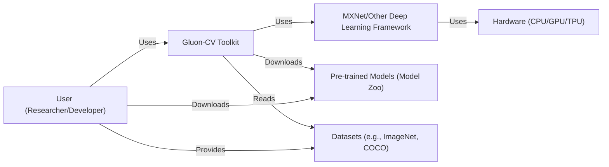
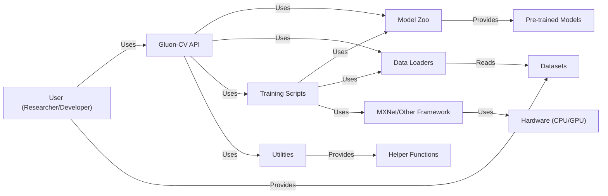
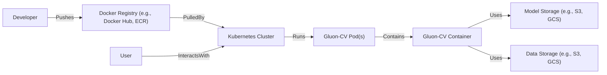
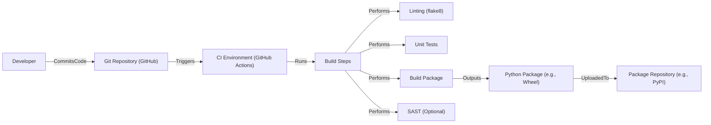

Okay, let's create a design document for the Gluon-CV project.

# BUSINESS POSTURE

Gluon-CV is an open-source project aiming to provide a comprehensive and easy-to-use toolkit for computer vision research and development. It democratizes access to state-of-the-art pre-trained models and training scripts, fostering innovation and accelerating development in the field.

Priorities:

-   Ease of use and accessibility for researchers and developers.
-   Reproducibility of research results.
-   Providing high-quality, state-of-the-art models.
-   Community engagement and contribution.
-   Maintainability and extensibility of the codebase.

Goals:

-   Become a leading toolkit for computer vision research.
-   Enable faster prototyping and development of computer vision applications.
-   Facilitate the sharing and dissemination of research findings.
-   Lower the barrier to entry for newcomers to the field.

Business Risks:

-   Model misuse: Pre-trained models could be used for malicious purposes (e.g., deepfakes, surveillance).
-   Bias in models: Models trained on biased datasets could perpetuate and amplify societal biases.
-   Lack of adoption: The project might fail to gain traction within the community.
-   Maintenance burden: Maintaining a large and complex codebase can be challenging.
-   Competition: Other computer vision toolkits might offer superior features or performance.
-   Security vulnerabilities in dependencies: Vulnerabilities in third-party libraries could expose users to risks.

# SECURITY POSTURE

Existing Security Controls:

-   security control: Code reviews: The project uses GitHub's pull request system, which inherently includes code review before merging changes. (Described in contribution guidelines).
-   security control: Issue tracking: Security vulnerabilities can be reported and tracked using GitHub's issue tracker. (Described in contribution guidelines).
-   security control: Basic input validation: The library likely performs some basic input validation to prevent crashes or unexpected behavior, although this is not explicitly documented as a security feature. (Implied in the code).
-   security control: Use of a linter: The project uses a linter (flake8) to enforce code style and identify potential errors. (Described in contribution guidelines).

Accepted Risks:

-   accepted risk: Model misuse: The project acknowledges the potential for misuse of pre-trained models but relies on users to act responsibly.
-   accepted risk: Reliance on external dependencies: The project depends on several external libraries (e.g., MXNet, NumPy, OpenCV), and vulnerabilities in these dependencies could affect Gluon-CV.

Recommended Security Controls:

-   security control: Implement a Software Bill of Materials (SBOM) to track all dependencies and their versions.
-   security control: Integrate Static Application Security Testing (SAST) tools into the build process to automatically identify potential vulnerabilities.
-   security control: Perform regular security audits of the codebase and dependencies.
-   security control: Develop a clear security policy and vulnerability disclosure process.
-   security control: Consider implementing runtime checks to detect and mitigate potential attacks, such as adversarial examples.
-   security control: Provide guidance to users on how to securely deploy and use Gluon-CV models.

Security Requirements:

-   Authentication: Not directly applicable, as Gluon-CV is a library, not a service. Authentication would be handled by the application using the library.
-   Authorization: Not directly applicable, as Gluon-CV is a library. Authorization would be handled by the application using the library.
-   Input Validation:
    -   The library should validate the shape and type of input tensors to prevent crashes and unexpected behavior.
    -   The library should handle potentially malicious input gracefully, without crashing or exposing sensitive information.
-   Cryptography:
    -   If the library handles sensitive data (e.g., API keys, user credentials), it should use appropriate cryptographic techniques to protect this data. This is not apparent in the current scope.
-   Data handling:
    -   If loading models from external sources (URLs), verify the integrity and authenticity of the downloaded data, for example, by checking hashes.

# DESIGN

## C4 CONTEXT

Element Description:

-   Element:
    -   Name: User (Researcher/Developer)
    -   Type: Person
    -   Description: A researcher or developer who uses Gluon-CV to build and train computer vision models.
    -   Responsibilities: Provides data, configures models, trains models, evaluates results, deploys models.
    -   Security controls: Responsible for securing their own environment and data.

-   Element:
    -   Name: Gluon-CV Toolkit
    -   Type: Software System
    -   Description: The Gluon-CV library itself, providing APIs for model building, training, and evaluation.
    -   Responsibilities: Provides pre-trained models, training scripts, data loaders, and utility functions.
    -   Security controls: Input validation, dependency management, code reviews.

-   Element:
    -   Name: MXNet/Other Deep Learning Framework
    -   Type: Software System
    -   Description: The underlying deep learning framework used by Gluon-CV (primarily MXNet, but potentially others).
    -   Responsibilities: Provides low-level operations for tensor manipulation and automatic differentiation.
    -   Security controls: Relies on the security of the chosen framework.

-   Element:
    -   Name: Pre-trained Models (Model Zoo)
    -   Type: Data
    -   Description: A collection of pre-trained models that can be downloaded and used with Gluon-CV.
    -   Responsibilities: Provides starting points for training or fine-tuning models.
    -   Security controls: Model integrity checks (e.g., hash verification) are recommended.

-   Element:
    -   Name: Datasets (e.g., ImageNet, COCO)
    -   Type: Data
    -   Description: Standard computer vision datasets used for training and evaluating models.
    -   Responsibilities: Provides labeled data for training and evaluation.
    -   Security controls: Data integrity and provenance should be considered.

-   Element:
    -   Name: Hardware (CPU/GPU/TPU)
    -   Type: Infrastructure
    -   Description: The hardware on which the models are trained and executed.
    -   Responsibilities: Provides computational resources.
    -   Security controls: Hardware-level security features (e.g., secure boot, trusted execution environments) may be relevant.

## C4 CONTAINER

Element Description:

-   Element:
    -   Name: Gluon-CV API
    -   Type: API
    -   Description: The main interface for interacting with the Gluon-CV library.
    -   Responsibilities: Provides a high-level, user-friendly API for common computer vision tasks.
    -   Security controls: Input validation.

-   Element:
    -   Name: Model Zoo
    -   Type: Container
    -   Description: A collection of pre-trained models.
    -   Responsibilities: Provides access to pre-trained models for various tasks.
    -   Security controls: Model integrity checks (recommended).

-   Element:
    -   Name: Data Loaders
    -   Type: Container
    -   Description: Components for loading and pre-processing data.
    -   Responsibilities: Efficiently loads and pre-processes data for training and evaluation.
    -   Security controls: Input validation, handling of corrupted data.

-   Element:
    -   Name: Training Scripts
    -   Type: Container
    -   Description: Scripts for training and evaluating models.
    -   Responsibilities: Provides examples and templates for training models.
    -   Security controls: Secure coding practices.

-   Element:
    -   Name: Utilities
    -   Type: Container
    -   Description: Helper functions and utilities.
    -   Responsibilities: Provides common functionality used throughout the library.
    -   Security controls: Secure coding practices.

-   Element:
    -   Name: Pre-trained Models
    -   Type: Data
    -   Description: The actual pre-trained model weights and architectures.
    -   Responsibilities: Provides the learned parameters for the models.
    -   Security controls: Integrity checks (recommended).

-   Element:
    -   Name: Datasets
    -   Type: Data
    -   Description: The data used for training and evaluation.
    -   Responsibilities: Provides the input data for the models.
    -   Security controls: Data integrity and provenance.

-   Element:
    -   Name: MXNet/Other Framework
    -   Type: Software System
    -   Description: The underlying deep learning framework.
    -   Responsibilities: Performs the low-level computations.
    -   Security controls: Relies on the security of the framework.

-   Element:
    -   Name: Hardware (CPU/GPU)
    -   Type: Infrastructure
    -   Description: The hardware used for computation.
    -   Responsibilities: Executes the computations.
    -   Security controls: Hardware-level security.

-   Element:
    -   Name: Helper Functions
    -   Type: Code
    -   Description: Utility functions used by other components.
    -   Responsibilities: Provides reusable code.
    -   Security controls: Secure coding practices.

-   Element:
    -   Name: User (Researcher/Developer)
    -   Type: Person
    -   Description: A researcher or developer using the library.
    -   Responsibilities: Uses the library to build and train models.
    -   Security controls: Responsible for their own environment.

## DEPLOYMENT

Gluon-CV, being a library, can be deployed in various ways depending on the user's application. Here are a few possibilities, with one described in detail:

Possible Deployment Solutions:

1.  Local Machine: For research and development, users often run Gluon-CV directly on their local machines (CPU or GPU).
2.  Cloud VMs: Users can deploy Gluon-CV on cloud virtual machines (e.g., AWS EC2, Google Compute Engine, Azure VMs).
3.  Containerized Environments: Gluon-CV can be packaged into Docker containers and deployed on container orchestration platforms like Kubernetes.
4.  Serverless Functions: Parts of the inference pipeline could be deployed as serverless functions (e.g., AWS Lambda, Google Cloud Functions).

Chosen Deployment Solution (Containerized Environment - Kubernetes):

Element Description:

-   Element:
    -   Name: Developer
    -   Type: Person
    -   Description: The person building and deploying the Gluon-CV application.
    -   Responsibilities: Creates the Docker image, configures the Kubernetes deployment.
    -   Security controls: Secure coding practices, access control to the Docker registry and Kubernetes cluster.

-   Element:
    -   Name: Docker Registry (e.g., Docker Hub, ECR)
    -   Type: System
    -   Description: A registry for storing Docker images.
    -   Responsibilities: Stores the Gluon-CV Docker image.
    -   Security controls: Access control, image scanning.

-   Element:
    -   Name: Kubernetes Cluster
    -   Type: System
    -   Description: A cluster of machines managed by Kubernetes.
    -   Responsibilities: Orchestrates the deployment and scaling of the Gluon-CV application.
    -   Security controls: Network policies, role-based access control (RBAC), pod security policies.

-   Element:
    -   Name: Gluon-CV Pod(s)
    -   Type: Container Group
    -   Description: One or more instances of the Gluon-CV application running in the Kubernetes cluster.
    -   Responsibilities: Runs the Gluon-CV code.
    -   Security controls: Resource limits, security context.

-   Element:
    -   Name: Gluon-CV Container
    -   Type: Container
    -   Description: The Docker container containing the Gluon-CV library and its dependencies.
    -   Responsibilities: Provides the runtime environment for the Gluon-CV application.
    -   Security controls: Minimal base image, regular updates.

-   Element:
    -   Name: Model Storage (e.g., S3, GCS)
    -   Type: System
    -   Description: Storage for pre-trained models.
    -   Responsibilities: Provides persistent storage for models.
    -   Security controls: Access control, encryption at rest and in transit.

-   Element:
    -   Name: Data Storage (e.g., S3, GCS)
    -   Type: System
    -   Description: Storage for datasets.
    -   Responsibilities: Provides persistent storage for data.
    -   Security controls: Access control, encryption at rest and in transit.

-   Element:
    -   Name: User
    -   Type: Person
    -   Description: The person interacting with the deployed application.
    -   Responsibilities: Sends requests to the application.
    -   Security controls: Authentication and authorization (handled by the application).

## BUILD

Build Process Description:

1.  Developer commits code to the Git repository (GitHub).
2.  The commit triggers the CI environment (GitHub Actions, based on the .github/workflows directory).
3.  The CI environment runs a series of build steps:
    -   Linting: Code style checks using flake8.
    -   Unit Tests: Runs unit tests to verify the correctness of the code.
    -   Build Package: Builds the Python package (e.g., a wheel file).
    -   SAST (Optional/Recommended): Integrates Static Application Security Testing tools to scan for vulnerabilities.
4.  The built package is then uploaded to a package repository (e.g., PyPI) for distribution.

Security Controls in Build Process:

-   security control: Code Reviews: Enforced through the pull request system on GitHub.
-   security control: Linting: Identifies potential code quality and style issues.
-   security control: Unit Tests: Helps ensure the correctness of the code and prevent regressions.
-   security control: SAST (Recommended): Automatically scans for vulnerabilities in the code.
-   security control: Dependency Management: Using requirements.txt or similar to manage dependencies.  Regular updates are crucial.
-   security control: CI/CD Pipeline Security:  Securing the CI/CD environment itself (e.g., access control, secrets management).

# RISK ASSESSMENT

Critical Business Processes:

-   Model Training: The ability to train new computer vision models efficiently and accurately.
-   Model Deployment: The ability to deploy trained models for inference in various environments.
-   Research Reproducibility: Ensuring that research results can be easily reproduced by others.
-   Community Engagement: Maintaining an active and engaged community of users and contributors.

Data Sensitivity:

-   Pre-trained Models: The model weights themselves are not typically considered sensitive data, but their misuse can have significant consequences.
-   Datasets: Datasets used for training may contain sensitive information, depending on their content (e.g., images of people, medical data). Gluon-CV itself doesn't *store* these datasets, but users must be aware of the sensitivity of the data they use.
-   User Data: If Gluon-CV is integrated into an application that collects user data, that data would be considered sensitive. This is outside the scope of Gluon-CV as a library.

# QUESTIONS & ASSUMPTIONS

Questions:

-   Are there any specific compliance requirements (e.g., GDPR, HIPAA) that need to be considered? (Assumption: No specific compliance requirements beyond general best practices.)
-   What is the expected scale of deployment? (Assumption: Deployments will range from small-scale research projects to larger-scale applications.)
-   What are the specific threat models that the project is most concerned about? (Assumption: The primary concerns are model misuse, bias, and vulnerabilities in dependencies.)
-   What level of security expertise is expected from users of the library? (Assumption: Users have a basic understanding of security concepts, but may not be security experts.)
-   Are there plans to integrate with specific cloud providers or services? (Assumption: The library should be cloud-agnostic, but may provide examples for specific cloud platforms.)

Assumptions:

-   BUSINESS POSTURE: The primary goal is to provide a research and development toolkit, not a production-ready service.
-   SECURITY POSTURE: The project relies on community contributions and best practices for security, rather than formal security certifications.
-   DESIGN: The library is designed to be flexible and extensible, allowing users to customize it for their specific needs.
-   The main deep learning framework used is MXNet, but other frameworks may be supported.
-   Users are responsible for securing their own deployment environments.
-   The project will follow semantic versioning.
-   The project will use GitHub for issue tracking and code management.