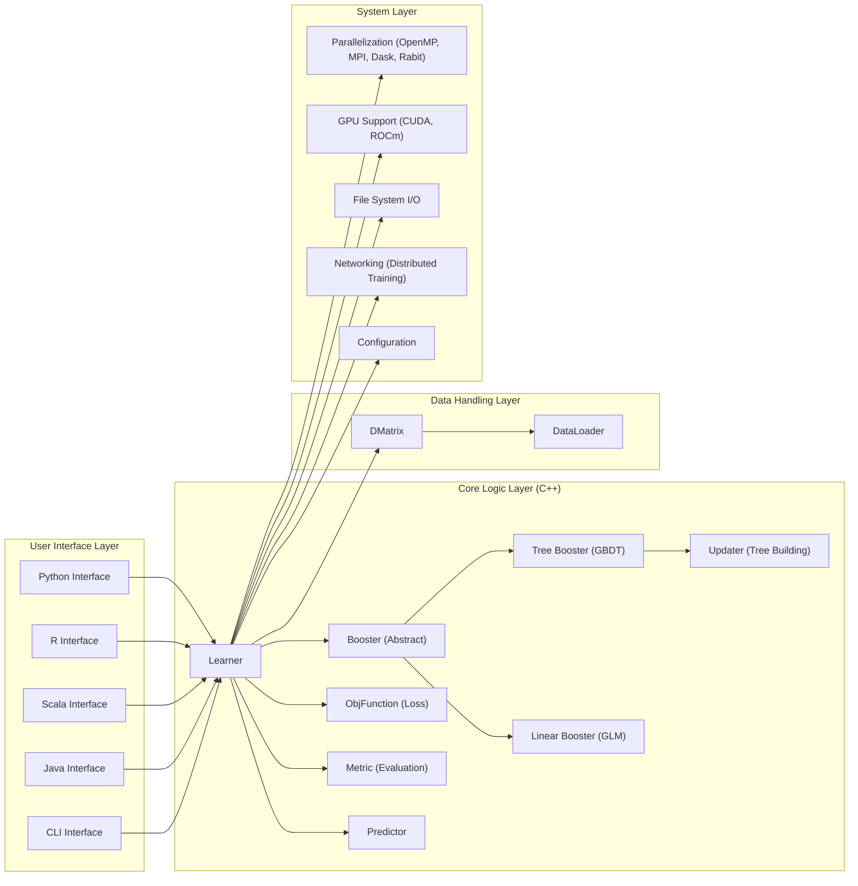

## Project Design Document: XGBoost (Improved)

**1. Introduction**

This document provides an enhanced architectural design of the XGBoost (eXtreme Gradient Boosting) project, an optimized distributed gradient boosting library. This detailed design serves as a robust foundation for subsequent threat modeling activities, offering a comprehensive understanding of the system's components, their interactions, and the flow of data. The goal is to provide sufficient detail for security analysis and risk assessment.

**2. Project Overview**

*   **Project Name:** XGBoost (eXtreme Gradient Boosting)
*   **Project Repository:** [https://github.com/dmlc/xgboost](https://github.com/dmlc/xgboost)
*   **Project Goal:** To provide a scalable, portable, and accurate gradient boosting library for machine learning tasks.
*   **Key Features:**
    *   High-performance implementation of the gradient boosting algorithm.
    *   Support for a wide range of machine learning tasks, including regression, classification, and ranking.
    *   Advanced regularization techniques (L1, L2) to mitigate overfitting.
    *   Built-in handling for missing values in datasets.
    *   Efficient parallel and distributed computing capabilities leveraging multiple CPU cores and distributed computing frameworks.
    *   Hardware acceleration through GPU support (CUDA and ROCm).
    *   Flexible integration with popular programming languages (Python, R, Scala, Java, and a C++ interface).
    *   Extensible architecture allowing for custom objective functions and evaluation metrics.

**3. Architecture Overview**

XGBoost's architecture is layered, with a core C++ implementation and language-specific wrappers. This design promotes performance and allows integration into various ecosystems.



**4. Component Details**

*   **User Interface Layer:**
    *   Provides language-specific APIs for users to interact with XGBoost functionalities.
    *   Handles user input, parameter parsing, and validation before passing requests to the core layer.
    *   Includes a command-line interface (CLI) for basic training and prediction tasks.

*   **Core Logic Layer (C++):**
    *   **Learner:** The central orchestrator of the training process. It manages the data (`DMatrix`), the chosen booster, objective function, and evaluation metrics. It also handles training iterations and model updates.
    *   **Booster (Abstract):** An abstract class defining the interface for boosting algorithms.
    *   **Tree Booster (GBDT):** Implements the Gradient Boosted Decision Tree algorithm. It iteratively builds an ensemble of decision trees, correcting the errors of previous trees.
    *   **Linear Booster (GLM):** Implements regularized linear models as an alternative boosting strategy.
    *   **ObjFunction (Loss):** Defines the objective function (loss function) to be minimized during the training process. Examples include `reg:squarederror`, `binary:logistic`, and `multi:softmax`.
    *   **Metric (Evaluation):** Defines the metrics used to evaluate the model's performance during training and testing. Examples include `rmse`, `auc`, and `merror`.
    *   **Updater (Tree Building):** Responsible for the construction of individual decision trees within the `Tree Booster`. This involves:
        *   **Split Finding:** Determining the optimal split points for each feature.
        *   **Gain Calculation:** Evaluating the improvement in the objective function for potential splits.
        *   **Tree Structure Management:** Building and managing the tree structure.
    *   **Predictor:**  Responsible for generating predictions using a trained XGBoost model. It traverses the trees or applies the linear model to the input data.

*   **Data Handling Layer:**
    *   **DMatrix:** XGBoost's optimized in-memory data structure. Key features include:
        *   Efficient storage of numerical and categorical data.
        *   Support for sparse data representations.
        *   Native handling of missing values.
        *   Integration with various data sources through `DataLoader`.
    *   **DataLoader:**  Provides mechanisms to load data from various sources into `DMatrix`. This includes:
        *   Reading from local files (e.g., CSV, LIBSVM format).
        *   Loading data from distributed file systems (e.g., HDFS, S3).
        *   Accepting data from in-memory arrays or dataframes.

*   **System Layer:**
    *   **Parallelization:** Enables parallel execution of computationally intensive tasks:
        *   **OpenMP:** For shared-memory parallelism on a single machine.
        *   **MPI (Message Passing Interface):** For distributed training across multiple machines.
        *   **Dask:** Integration with the Dask library for scalable parallel computing.
        *   **Rabit (Reliable Allreduce and Broadcast Interface):** A fault-tolerant communication library used for distributed training.
    *   **GPU Support:** Offloads computations to GPUs for significant speedups:
        *   **CUDA:** Support for NVIDIA GPUs.
        *   **ROCm:** Support for AMD GPUs.
    *   **File System I/O:** Used for reading training data, saving trained models, and potentially storing intermediate results. Access control to these files is crucial.
    *   **Networking:** Essential for communication between worker nodes in distributed training setups. This includes data transfer and synchronization.
    *   **Configuration:** Handles the parsing and management of training parameters and configurations.

**5. Data Flow (Detailed)**

*   **Training Data Flow:**
    *   The user provides training data through a chosen interface (Python, R, etc.).
    *   The interface utilizes the `DataLoader` to load the data and create a `DMatrix`.
    *   The `DMatrix` is passed to the `Learner`.
    *   The `Learner` initializes the chosen `Booster` (e.g., `Tree Booster`).
    *   For each boosting iteration:
        *   The `Learner` instructs the `Booster` to build a new model (e.g., a decision tree).
        *   The `Updater` within the `Tree Booster` iterates through the features and data points in the `DMatrix` to find the best splits, leveraging `ObjFunction` to calculate the loss and `Metric` for evaluation.
        *   `Parallelization` and `GPU Support` are utilized to accelerate the tree building process.
        *   The newly built model is added to the ensemble.
    *   The training process continues until a stopping criterion is met.
    *   The trained model is stored within the `Learner` and can be serialized to a file using `File System I/O`.

    ```mermaid
    graph LR
        A["Training Data"] --> B["Interface (Python/R/...)"];
        B --> C["DataLoader"];
        C --> D["DMatrix"];
        D --> E["Learner"];
        E --> F{"Booster (Tree/Linear)"};
        F --> G["Updater"];
        G --> H["ObjFunction (Loss)"];
        G --> I["Metric (Evaluation)"];
        D --> G;
        E --> P["Parallelization/GPU"];
        P --> F;
        F --> E;
        E --> J["Trained Model"];
        J --> K["File System I/O (Save Model)"];
    ```

*   **Prediction Data Flow:**
    *   The user provides new data for prediction through an interface.
    *   The interface loads the trained model from `File System I/O`.
    *   The interface uses the `DataLoader` to create a `DMatrix` from the prediction data.
    *   The `DMatrix` and the loaded model are passed to the `Learner`.
    *   The `Learner` utilizes the `Predictor` to generate predictions based on the input data and the trained model.
    *   The `Predictor` traverses the decision trees or applies the linear model.
    *   The predictions are returned to the user through the interface.

    ```mermaid
    graph LR
        A["Prediction Data"] --> B["Interface (Python/R/...)"];
        C["Trained Model (File System)"] --> B;
        B --> D["DataLoader"];
        D --> E["DMatrix"];
        E --> F["Learner"];
        F --> G["Predictor"];
        G --> H["Prediction Output"];
    ```

**6. Security Considerations (Expanded)**

This section details potential security considerations based on the architecture, providing a basis for comprehensive threat modeling.

*   **Data Handling Vulnerabilities:**
    *   **Malicious Data Injection:** Exploiting vulnerabilities in the `DataLoader` or `DMatrix` parsing logic to inject malicious data. This could lead to crashes, incorrect model training, or even remote code execution if parsing libraries have vulnerabilities.
    *   **Data Confidentiality Breaches:** Unauthorized access to training data, especially if it contains sensitive personal or business information. This could occur through insecure file storage, inadequate access controls, or vulnerabilities in data loading mechanisms.
    *   **Data Integrity Attacks:** Tampering with training data to influence the model's behavior, leading to biased or inaccurate predictions.

*   **Model Security Risks:**
    *   **Model Poisoning:** Attackers manipulating training data or the training process to create a model that performs poorly on specific inputs or exhibits unintended behavior. This can have significant consequences in critical applications.
    *   **Model Stealing/Extraction:** Unauthorized copying or reverse engineering of trained models. This is a concern for proprietary models and can be mitigated through access controls and potentially model obfuscation techniques.
    *   **Adversarial Attacks:** Crafting specific input data to fool the trained model into making incorrect predictions. This is a well-known vulnerability in machine learning models.
    *   **Serialization/Deserialization Vulnerabilities:** Exploiting vulnerabilities in the model serialization format or the deserialization process to execute arbitrary code or gain unauthorized access.

*   **Dependency Management Security:**
    *   **Vulnerable Dependencies:** XGBoost relies on external libraries. Security vulnerabilities in these dependencies (e.g., Boost, language runtimes, MPI implementations) can directly impact XGBoost's security. Regular dependency scanning and updates are crucial.
    *   **Supply Chain Attacks:** Compromised dependencies could introduce malicious code into XGBoost.

*   **Distributed Training Security Concerns:**
    *   **Insecure Communication:** Lack of encryption or authentication in communication between nodes during distributed training can expose sensitive data and allow for man-in-the-middle attacks.
    *   **Unauthorized Node Participation:** Ensuring only authorized nodes can join the distributed training cluster is vital to prevent malicious actors from injecting data or disrupting the process.
    *   **Data Skew and Poisoning in Distributed Settings:**  Malicious nodes could introduce biased or poisoned data, impacting the global model.

*   **File System and I/O Security:**
    *   **Unauthorized Access:** Insufficient access controls on files containing training data or trained models can lead to data breaches or model theft.
    *   **Path Traversal Vulnerabilities:**  Exploiting vulnerabilities in file path handling to access or modify files outside of intended directories.

*   **Interface Security:**
    *   **API Vulnerabilities:**  Security flaws in the language-specific interfaces could be exploited to bypass security measures or execute arbitrary code.
    *   **Injection Attacks:**  Vulnerabilities in how user input is handled in the interfaces could lead to command injection or other injection attacks.

*   **GPU Security:**
    *   **GPU Driver Vulnerabilities:**  Exploiting vulnerabilities in GPU drivers could potentially impact XGBoost's security when using GPU acceleration.
    *   **Memory Corruption:**  Issues in how XGBoost interacts with GPU memory could lead to vulnerabilities.

**7. Deployment Considerations (Security Focused)**

The security implications of XGBoost deployment vary depending on the environment:

*   **Local Machine:** Security relies heavily on the user's machine security. Risks include unauthorized access to data and models stored locally.
*   **Cloud Environments:** Security becomes a shared responsibility. Considerations include:
    *   **Cloud Provider Security:** Relying on the cloud provider's security measures for infrastructure.
    *   **Access Control:** Implementing robust access controls to data and model storage (e.g., using IAM roles in AWS, Azure RBAC in Azure).
    *   **Network Security:** Configuring secure network settings and firewalls.
    *   **Encryption:** Encrypting data at rest and in transit.
    *   **Container Security:** If deployed in containers (e.g., Docker), ensuring the container images are secure and regularly updated.
*   **On-Premise Servers:** Organizations are fully responsible for security. This includes physical security, network security, server hardening, and access controls.
*   **Edge Devices:** Security can be challenging due to resource constraints and potentially less secure environments. Considerations include:
    *   **Physical Security:** Protecting the physical device.
    *   **Limited Resources:**  Security measures need to be lightweight.
    *   **Remote Management Security:** Securing remote access and management interfaces.

**8. Dependencies (Comprehensive)**

XGBoost depends on the following libraries and tools:

*   **Core Dependencies:**
    *   **C++ Standard Library:** Required for the core implementation.
    *   **Boost (Headers Only):** Used for various utilities and data structures.
    *   **CMake:**  Used for building the library.
*   **Optional Dependencies (for specific features):**
    *   **libomp:** For OpenMP-based parallelization.
    *   **MPI:** For distributed training capabilities. Specific MPI implementations (e.g., MPICH, Open MPI) may be used.
    *   **CUDA Toolkit:** For GPU acceleration on NVIDIA GPUs. Includes the CUDA driver and libraries.
    *   **ROCm:** For GPU acceleration on AMD GPUs.
    *   **Dask:** For distributed training using the Dask framework. Requires the Dask library in the Python environment.
    *   **Rabit:**  Fault-tolerant communication library for distributed training.
    *   **Language-Specific Runtimes and Libraries:**
        *   **Python:** Requires Python interpreter and potentially libraries like NumPy and SciPy.
        *   **R:** Requires the R runtime environment.
        *   **Scala:** Requires the Scala runtime environment and potentially Apache Spark.
        *   **Java:** Requires the Java Development Kit (JDK).
*   **Build Dependencies:**
    *   A suitable C++ compiler (e.g., GCC, Clang, MSVC).

**9. Future Considerations (Security Perspective)**

*   **Federated Learning Integration:**  If XGBoost integrates with federated learning frameworks, new security considerations related to secure aggregation and privacy-preserving techniques will arise.
*   **Differential Privacy Implementation:**  Incorporating differential privacy mechanisms to protect the privacy of training data.
*   **Homomorphic Encryption Support:** Exploring the use of homomorphic encryption to perform computations on encrypted data.
*   **Improved Model Security Features:**  Developing built-in mechanisms for model hardening and defense against adversarial attacks.
*   **Formal Security Audits:**  Regular security audits and penetration testing to identify and address potential vulnerabilities.
*   **Standardized Security Benchmarks:** Adhering to and implementing relevant security benchmarks and best practices for machine learning systems.

This improved design document provides a more detailed and security-focused overview of the XGBoost project architecture, serving as a valuable resource for threat modeling and security analysis.