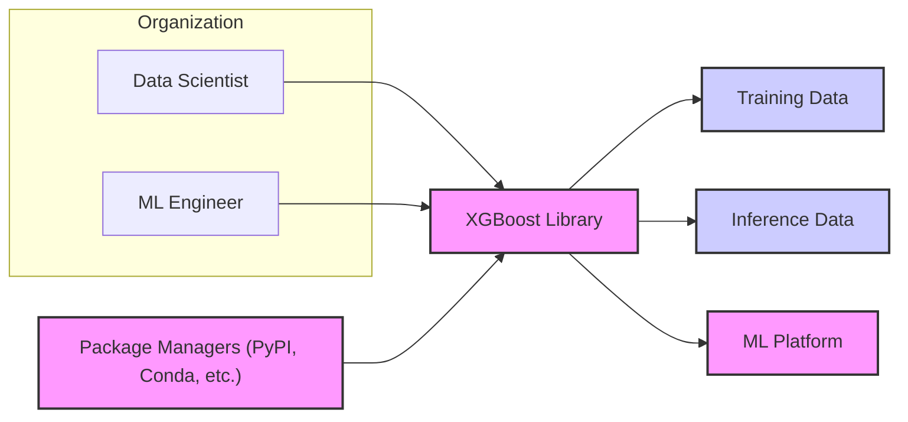
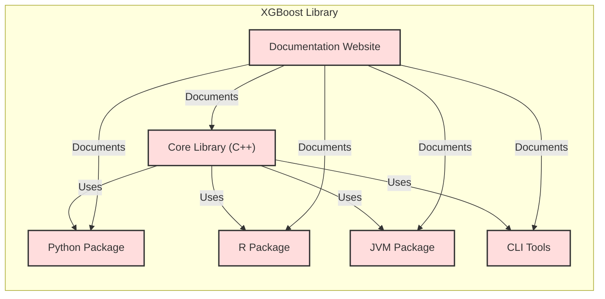
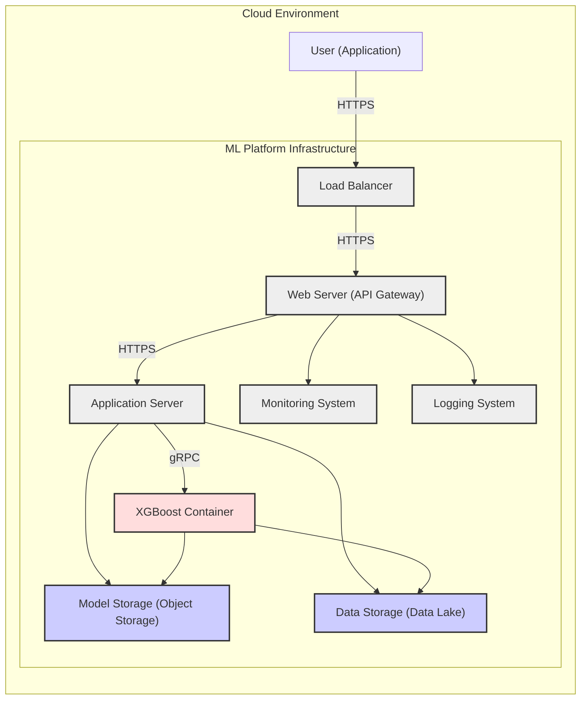
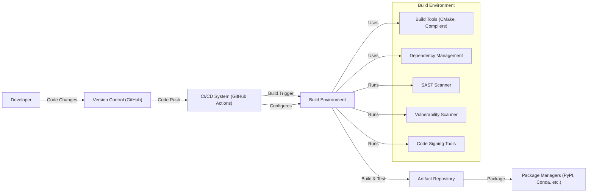

# BUSINESS POSTURE

This project, XGBoost, provides a high-performance, open-source gradient boosting framework. It is designed to be efficient, flexible, and portable, making it suitable for a wide range of machine learning tasks. The primary business goal is to empower data scientists and machine learning engineers with a robust and scalable tool for developing and deploying accurate predictive models.

Key business priorities for XGBoost include:
- Performance: Deliver state-of-the-art speed and efficiency in gradient boosting algorithms.
- Scalability: Support large datasets and distributed computing environments.
- Flexibility: Offer a wide range of functionalities and customizable parameters.
- Portability: Ensure compatibility across various operating systems, hardware architectures, and programming languages.
- Community: Foster a vibrant and active open-source community for contributions and support.

Most important business risks that need to be addressed:
- Reputational damage due to security vulnerabilities in the library, leading to loss of user trust and adoption.
- Supply chain attacks compromising the library's distribution channels, resulting in malicious code being delivered to users.
- Data breaches or model manipulation in applications using XGBoost due to vulnerabilities in the library or its usage.
- Performance degradation or instability caused by undiscovered bugs or security patches impacting core functionality.
- Lack of community support or slow response to security issues due to insufficient resources or developer attention.

# SECURITY POSTURE

Existing security controls:
- security control: GitHub repository access control to manage contributors and code changes. Implemented in GitHub repository settings.
- security control: Issue tracking system for reporting and managing bugs and feature requests, including potential security vulnerabilities. Implemented in GitHub Issues.
- security control: Code review process for pull requests to ensure code quality and identify potential issues before merging. Implemented via GitHub Pull Requests.
- accepted risk: Reliance on community contributions, which may introduce vulnerabilities if not thoroughly vetted.
- accepted risk: Open-source nature of the project, making the codebase publicly accessible to both security researchers and malicious actors.

Recommended security controls:
- security control: Implement automated dependency scanning to identify and address vulnerabilities in third-party libraries used by XGBoost.
- security control: Integrate static application security testing (SAST) tools into the build process to automatically detect potential security flaws in the codebase.
- security control: Conduct regular security audits and penetration testing to proactively identify and remediate vulnerabilities.
- security control: Establish a clear vulnerability disclosure policy and incident response plan to handle security issues effectively.
- security control: Implement a secure release process, including code signing and checksum verification, to ensure the integrity and authenticity of distributed packages.

Security requirements:
- Authentication: Not directly applicable to the XGBoost library itself, as it is a software component and not a user-facing application. However, authentication is relevant for systems that utilize XGBoost, such as ML platforms or applications that manage access to models and data.
- Authorization: Similar to authentication, authorization is primarily relevant for systems using XGBoost. Access control mechanisms are needed to manage who can train models, deploy models, and access sensitive data used with XGBoost.
- Input validation: Crucial for XGBoost to prevent vulnerabilities such as denial-of-service or unexpected behavior due to malformed input data. Input validation should be implemented in the library to handle various data formats and potential anomalies gracefully.
- Cryptography: XGBoost itself may not directly implement extensive cryptography. However, applications using XGBoost might require cryptographic measures to protect sensitive training data, model artifacts, or predictions, both in transit and at rest. This could involve using encryption for data storage, secure communication protocols, or homomorphic encryption for privacy-preserving machine learning.

# DESIGN

## C4 CONTEXT

Context Diagram Elements:

- 1. Name: Data Scientist
   2. Type: User
   3. Description: Professionals who use XGBoost to build and train machine learning models.
   4. Responsibilities: Utilize XGBoost library to develop predictive models, analyze data, and improve model performance.
   5. Security controls: Access control to development environments and data, secure coding practices when using XGBoost API.

- 1. Name: ML Engineer
   2. Type: User
   3. Description: Professionals responsible for deploying, managing, and scaling machine learning models built with XGBoost.
   4. Responsibilities: Integrate XGBoost models into production systems, optimize performance, and ensure reliability and security of ML infrastructure.
   5. Security controls: Access control to deployment environments, secure configuration management, monitoring and logging of ML systems.

- 1. Name: XGBoost Library
   2. Type: Software System
   3. Description: The core gradient boosting library, providing algorithms and functionalities for machine learning tasks.
   4. Responsibilities: Provide efficient and accurate gradient boosting algorithms, handle various data formats, and offer a flexible API for users.
   5. Security controls: Input validation, secure coding practices, dependency management, vulnerability scanning, secure build and release process.

- 1. Name: Training Data
   2. Type: Database
   3. Description: Datasets used to train machine learning models with XGBoost.
   4. Responsibilities: Provide data for model training, ensure data quality and integrity.
   5. Security controls: Data encryption at rest and in transit, access control to data storage, data masking or anonymization where applicable.

- 1. Name: Inference Data
   2. Type: Database
   3. Description: Datasets used to generate predictions using trained XGBoost models.
   4. Responsibilities: Provide data for model inference, ensure data availability and accuracy.
   5. Security controls: Access control to data storage, data validation to prevent injection attacks, monitoring of data access patterns.

- 1. Name: ML Platform
   2. Type: Software System
   3. Description: A platform that integrates XGBoost and provides infrastructure for model training, deployment, and management. Examples include cloud ML services or on-premise ML platforms.
   4. Responsibilities: Provide a managed environment for using XGBoost, handle scalability, security, and operational aspects of ML workflows.
   5. Security controls: Authentication and authorization for platform access, secure API endpoints, network security, monitoring and logging, compliance with security standards.

- 1. Name: Package Managers (PyPI, Conda, etc.)
   2. Type: Software System
   3. Description: Distribution channels for XGBoost library, allowing users to easily install and update the software.
   4. Responsibilities: Host and distribute XGBoost packages, ensure package integrity and availability.
   5. Security controls: Package signing, vulnerability scanning of hosted packages, infrastructure security of package repositories.

## C4 CONTAINER

Container Diagram Elements:

- 1. Name: Core Library (C++)
   2. Type: Container - Native Library
   3. Description: The foundational C++ library that implements the core gradient boosting algorithms and functionalities of XGBoost.
   4. Responsibilities: High-performance computation, core algorithm implementation, data handling, and providing APIs for other language wrappers.
   5. Security controls: Secure coding practices in C++, input validation in core algorithms, memory safety checks, vulnerability scanning of C++ code and dependencies.

- 1. Name: Python Package
   2. Type: Container - Language-Specific Library
   3. Description: Python wrapper for the Core Library, providing a Python API for using XGBoost. Widely used in data science and machine learning workflows.
   4. Responsibilities: Expose XGBoost functionalities to Python users, provide user-friendly API, integrate with Python data science ecosystem (NumPy, Pandas, Scikit-learn).
   5. Security controls: Secure coding practices in Python, input validation in Python API, dependency management for Python packages, vulnerability scanning of Python code and dependencies.

- 1. Name: R Package
   2. Type: Container - Language-Specific Library
   3. Description: R wrapper for the Core Library, providing an R API for using XGBoost. Used in statistical computing and data analysis with R.
   4. Responsibilities: Expose XGBoost functionalities to R users, provide R-friendly API, integrate with R statistical ecosystem.
   5. Security controls: Secure coding practices in R, input validation in R API, dependency management for R packages, vulnerability scanning of R code and dependencies.

- 1. Name: JVM Package
   2. Type: Container - Language-Specific Library
   3. Description: Java and Scala wrapper for the Core Library, allowing XGBoost to be used in JVM-based environments.
   4. Responsibilities: Expose XGBoost functionalities to JVM languages, provide Java and Scala APIs, integrate with JVM ecosystems (Spark, Hadoop).
   5. Security controls: Secure coding practices in Java/Scala, input validation in JVM API, dependency management for JVM packages, vulnerability scanning of JVM code and dependencies.

- 1. Name: CLI Tools
   2. Type: Container - Command-Line Interface
   3. Description: Command-line interface tools for interacting with XGBoost, such as training models, making predictions, and model conversion.
   4. Responsibilities: Provide command-line access to XGBoost functionalities, enable scripting and automation of ML tasks.
   5. Security controls: Input validation for command-line arguments, secure handling of file paths and configurations, protection against command injection vulnerabilities.

- 1. Name: Documentation Website
   2. Type: Container - Web Application
   3. Description: Website hosting documentation, tutorials, examples, and API references for XGBoost.
   4. Responsibilities: Provide comprehensive documentation for users, facilitate learning and adoption of XGBoost, community forum (potentially).
   5. Security controls: Web application security best practices, protection against common web vulnerabilities (XSS, CSRF), secure hosting infrastructure, access control for website administration.

## DEPLOYMENT

Deployment Scenario: Cloud-based Machine Learning Platform

Deployment Diagram Elements:

- 1. Name: Load Balancer
   2. Type: Infrastructure - Network Component
   3. Description: Distributes incoming user requests across multiple Web Servers for scalability and high availability.
   4. Responsibilities: Traffic distribution, health checks, SSL termination.
   5. Security controls: DDoS protection, SSL/TLS configuration, access control lists, rate limiting.

- 1. Name: Web Server (API Gateway)
   2. Type: Infrastructure - Server
   3. Description: Handles user API requests, performs authentication and authorization, and routes requests to Application Servers.
   4. Responsibilities: API request handling, authentication, authorization, request routing, rate limiting, input validation.
   5. Security controls: HTTPS enforcement, authentication mechanisms (e.g., API keys, OAuth), authorization policies, input validation, web application firewall (WAF).

- 1. Name: Application Server
   2. Type: Infrastructure - Server
   3. Description: Runs the application logic that utilizes XGBoost for model inference and interacts with other backend services.
   4. Responsibilities: Application logic execution, model loading, data retrieval, prediction generation using XGBoost Container.
   5. Security controls: Secure coding practices in application code, input validation, output encoding, access control to backend services, regular security patching.

- 1. Name: XGBoost Container
   2. Type: Container - Application Container
   3. Description: Containerized instance of the XGBoost library, responsible for performing model inference.
   4. Responsibilities: Load trained models from Model Storage, perform predictions based on input data, return prediction results.
   5. Security controls: Container image scanning for vulnerabilities, least privilege container execution, resource limits, network segmentation, secure communication with Application Server (e.g., gRPC with TLS).

- 1. Name: Model Storage (Object Storage)
   2. Type: Database - Storage Service
   3. Description: Object storage service for storing trained XGBoost models.
   4. Responsibilities: Securely store model artifacts, provide access to models for XGBoost Container.
   5. Security controls: Access control policies, encryption at rest, versioning, audit logging.

- 1. Name: Data Storage (Data Lake)
   2. Type: Database - Storage Service
   3. Description: Data lake for storing training and inference data.
   4. Responsibilities: Store large volumes of data, provide data access for model training and inference.
   5. Security controls: Access control policies, data encryption at rest, data masking or anonymization, audit logging.

- 1. Name: Monitoring System
   2. Type: Infrastructure - Monitoring Service
   3. Description: Monitors the health and performance of the ML platform components.
   4. Responsibilities: Collect metrics, detect anomalies, trigger alerts, provide dashboards for monitoring.
   5. Security controls: Secure access to monitoring data, alerting on security events, integrity protection of monitoring data.

- 1. Name: Logging System
   2. Type: Infrastructure - Logging Service
   3. Description: Collects and stores logs from all components for auditing and troubleshooting.
   4. Responsibilities: Centralized log collection, log storage, log analysis, security event logging.
   5. Security controls: Secure log storage, access control to logs, log integrity protection, log retention policies.

- 1. Name: User (Application)
   2. Type: External System
   3. Description: External application or system that consumes the ML platform API to get predictions from XGBoost models.
   4. Responsibilities: Send API requests to the ML platform, consume prediction results.
   5. Security controls: Secure API key management, secure communication with ML platform (HTTPS), proper handling of prediction results.

## BUILD

Build Process Description:

1. Developer: Developers write code, make changes, and commit them to the version control system.
2. Version Control (GitHub): GitHub repository hosting the XGBoost source code, managing code changes, and facilitating collaboration. Security controls: Access control, branch protection, audit logging.
3. CI/CD System (GitHub Actions): Automated CI/CD pipeline triggered by code changes in GitHub. Security controls: Secure pipeline configuration, access control to CI/CD system, audit logging.
4. Build Environment: Isolated and controlled environment for building and testing XGBoost. Security controls: Secure build environment configuration, access control, regular patching, hardened OS.
5. Build Tools (CMake, Compilers): Tools used to compile and build the XGBoost library from source code. Security controls: Use of trusted and updated build tools.
6. Dependency Management: Tools and processes for managing external dependencies of XGBoost. Security controls: Dependency scanning for vulnerabilities, use of dependency lock files, private dependency mirrors (optional).
7. SAST Scanner: Static Application Security Testing tool integrated into the build pipeline to automatically scan the codebase for potential security vulnerabilities. Security controls: SAST tool configuration, vulnerability reporting and remediation workflow.
8. Vulnerability Scanner: Scans build artifacts and dependencies for known vulnerabilities. Security controls: Vulnerability database updates, vulnerability reporting and remediation workflow.
9. Code Signing Tools: Tools used to sign the build artifacts (packages) to ensure integrity and authenticity. Security controls: Secure key management for code signing, verification of signatures during package installation.
10. Artifact Repository: Repository for storing build artifacts (e.g., compiled libraries, packages). Security controls: Access control to artifact repository, integrity checks, versioning.
11. Package Managers (PyPI, Conda, etc.): Distribution channels where signed XGBoost packages are published for users to download and install. Security controls: Secure package upload process, package signing verification by package managers.

# RISK ASSESSMENT

Critical business processes we are trying to protect:
- Development and maintenance of the XGBoost library itself.
- Distribution of secure and trustworthy XGBoost packages to users.
- Applications and systems relying on XGBoost for machine learning tasks.

Data we are trying to protect and their sensitivity:
- XGBoost source code: Intellectual property, needs to be protected from unauthorized access and modification. Sensitivity: High.
- Build environment and infrastructure: Critical for maintaining the integrity of the build and release process. Sensitivity: High.
- Distribution channels (package repositories): Essential for delivering secure packages to users. Sensitivity: High.
- User data processed by applications using XGBoost: Sensitivity depends on the application domain. Could range from low (public datasets) to high (sensitive personal or financial data).
- Trained machine learning models: Can contain sensitive information learned from training data. Sensitivity: Medium to High (depending on training data sensitivity).

# QUESTIONS & ASSUMPTIONS

BUSINESS POSTURE:
- Question: What is the primary target audience for XGBoost? Is it primarily for research, commercial applications, or both?
- Assumption: XGBoost targets a broad audience including researchers, academics, and industry professionals in various domains.
- Question: What are the key performance indicators (KPIs) for the success of XGBoost project?
- Assumption: Success is measured by adoption rate, performance benchmarks, community engagement, and positive user feedback.

SECURITY POSTURE:
- Question: What is the current level of security awareness and practices within the XGBoost development community?
- Assumption: Security awareness is present but may vary among contributors. Formal security training and guidelines might be beneficial.
- Question: Are there any specific compliance requirements or industry regulations that XGBoost needs to adhere to?
- Assumption: No specific compliance requirements are explicitly stated for the library itself, but applications using XGBoost might be subject to various regulations (e.g., GDPR, HIPAA).
- Question: What is the process for handling security vulnerability reports and releasing security patches?
- Assumption: A standard open-source vulnerability disclosure and patching process is in place, relying on community contributions and maintainer efforts.

DESIGN:
- Question: What are the typical deployment environments for XGBoost-based applications?
- Assumption: Deployment environments are diverse, ranging from local machines and on-premise servers to cloud platforms and embedded systems.
- Question: What are the scalability and performance requirements for XGBoost in typical use cases?
- Assumption: Scalability and performance are critical requirements, driving the design towards efficient algorithms and distributed computing capabilities.
- Question: Are there any specific integration requirements with other machine learning tools or platforms?
- Assumption: XGBoost is designed to integrate well with popular data science tools and platforms in Python, R, and JVM ecosystems.