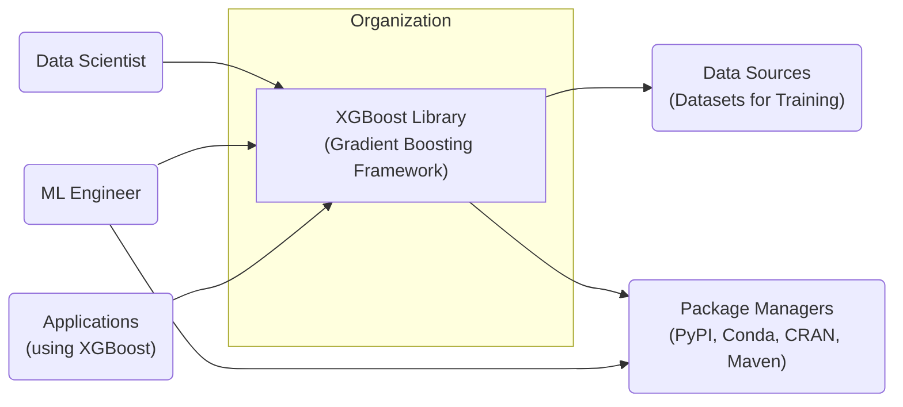
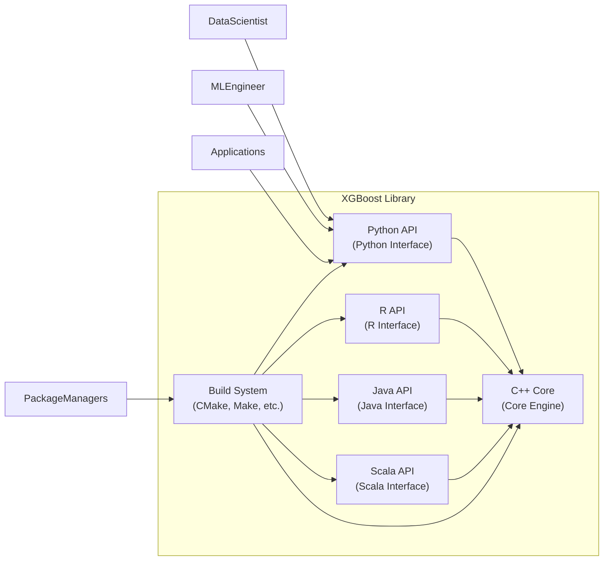
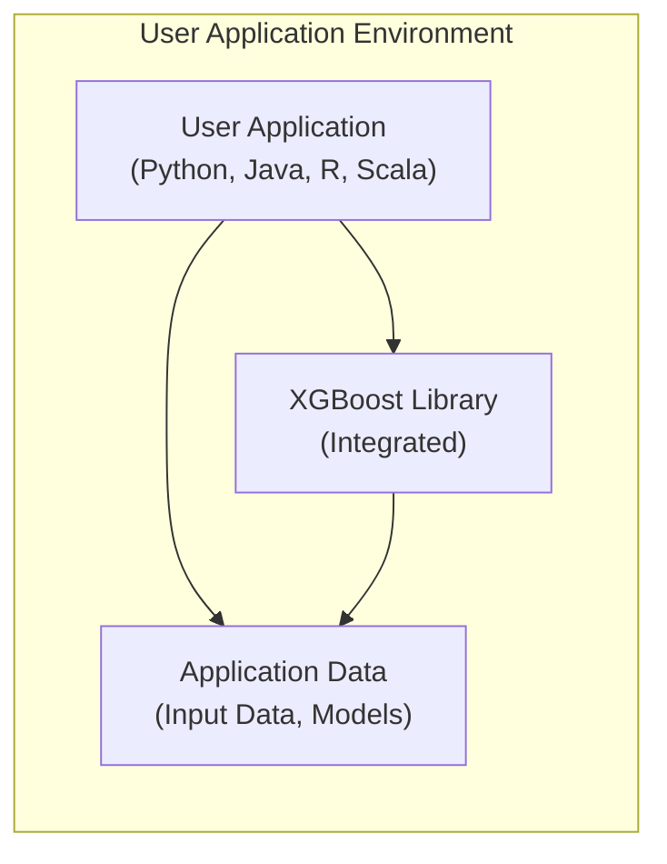
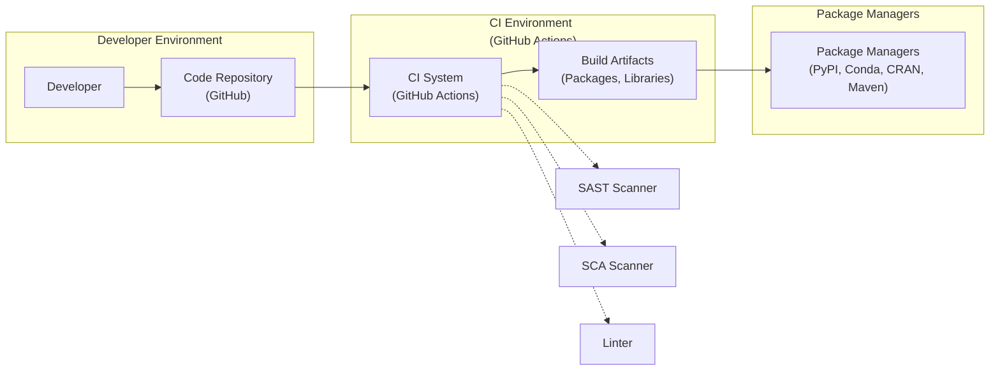

# BUSINESS POSTURE

This project, XGBoost (Extreme Gradient Boosting), is a high-performance, open-source library for gradient boosting. It is designed to be efficient, flexible, and portable, implementing machine learning algorithms under the Gradient Boosting framework.

Business Priorities and Goals:
- Provide a robust and scalable gradient boosting framework for machine learning tasks.
- Enable data scientists and machine learning engineers to build high-accuracy predictive models.
- Offer a library that is performant and can handle large datasets efficiently.
- Maintain an open-source and community-driven project to foster innovation and adoption.
- Support multiple programming languages and platforms for broad accessibility.

Business Risks:
- Data integrity risks: Incorrect or manipulated training data leading to biased or inaccurate models.
- Model security risks: Adversarial attacks on models, model extraction, or poisoning.
- Availability risks: Downtime or performance degradation impacting model training or inference pipelines.
- Intellectual property risks: Misuse or unauthorized distribution of models or algorithms if not properly licensed or controlled in specific applications.
- Supply chain risks: Vulnerabilities in dependencies or build tools compromising the library's security.

# SECURITY POSTURE

Existing Security Controls:
- security control: Open Source Community Review - The project is open source, allowing for community review of the codebase, which can help identify and address potential security vulnerabilities. Implemented through GitHub repository and public contributions.
- security control: Testing and Validation - The project includes unit tests and integration tests to ensure the correctness and stability of the code. Described in the project's testing framework and CI/CD pipelines.
- security control: Dependency Management - The project manages dependencies through standard build tools and package managers. Described in build system documentation (CMake, Make, etc.).

Accepted Risks:
- accepted risk: Vulnerabilities in Dependencies - The project relies on external libraries, which may contain security vulnerabilities. Risk is partially mitigated by dependency management but not fully eliminated.
- accepted risk: Code Injection Vulnerabilities - Potential for code injection vulnerabilities if user-supplied data is not properly validated during model training or inference. Risk is mitigated by coding best practices but requires continuous attention.
- accepted risk: Denial of Service - Resource exhaustion attacks during model training or inference if input data is maliciously crafted. Risk is mitigated by performance optimizations but might not be fully eliminated for all scenarios.

Recommended Security Controls:
- security control: Static Application Security Testing (SAST) - Implement SAST tools in the CI/CD pipeline to automatically scan the codebase for potential security vulnerabilities during development.
- security control: Software Composition Analysis (SCA) - Integrate SCA tools to continuously monitor and manage dependencies for known vulnerabilities. Generate Software Bill of Materials (SBOM) for transparency.
- security control: Fuzzing - Employ fuzzing techniques to test the robustness of the library against unexpected or malformed inputs, especially in data processing and parsing components.
- security control: Security Training for Contributors - Provide security awareness training to project contributors to promote secure coding practices and vulnerability identification.

Security Requirements:
- Authentication: Not directly applicable to the library itself, as it is not a service. However, if XGBoost is used within a larger system or service, authentication would be required for accessing and using that system.
- Authorization: Similar to authentication, authorization is relevant in the context of systems using XGBoost. Access control should be implemented at the application level to manage who can train models, deploy models, or access predictions.
- Input Validation: Crucial for XGBoost. The library must robustly validate input data during training and inference to prevent various attacks, including data poisoning, adversarial examples, and code injection. Validation should be implemented in data loading and processing modules.
- Cryptography: Depending on the application, cryptography might be needed for protecting training data, model parameters, or inference data at rest or in transit. If sensitive data is involved, encryption should be considered at the application level when using XGBoost.

# DESIGN

## C4 CONTEXT

Context Diagram Elements:

- Element:
    - Name: XGBoost Library
    - Type: Software System
    - Description: A high-performance gradient boosting library used for machine learning tasks. Provides APIs in multiple languages (Python, C++, R, Java, Scala).
    - Responsibilities:
        - Implement gradient boosting algorithms.
        - Provide APIs for model training, prediction, and evaluation.
        - Offer efficient and scalable computation.
    - Security controls:
        - security control: Input validation on training and inference data.
        - security control: Community code review.
        - security control: Testing and validation framework.

- Element:
    - Name: Data Scientist
    - Type: Person
    - Description: Users who utilize XGBoost to build and train machine learning models for various applications.
    - Responsibilities:
        - Prepare and preprocess training data.
        - Define model parameters and training configurations.
        - Evaluate model performance and iterate on model design.
    - Security controls:
        - security control: Responsible data handling practices.
        - security control: Secure storage of training data and models.

- Element:
    - Name: ML Engineer
    - Type: Person
    - Description: Users who deploy and integrate XGBoost models into production systems and manage machine learning infrastructure.
    - Responsibilities:
        - Deploy trained XGBoost models into production environments.
        - Integrate XGBoost with other systems and applications.
        - Monitor model performance and maintain infrastructure.
    - Security controls:
        - security control: Secure deployment practices.
        - security control: Access control to production environments.
        - security control: Monitoring and logging of model usage.

- Element:
    - Name: Applications
    - Type: Software System
    - Description: Various software applications that utilize XGBoost for machine learning capabilities, such as prediction services, analytical tools, and embedded systems.
    - Responsibilities:
        - Integrate XGBoost library for model inference.
        - Provide input data for predictions.
        - Utilize model outputs for application logic.
    - Security controls:
        - security control: Authentication and authorization for application access.
        - security control: Secure communication channels.
        - security control: Input validation for data passed to XGBoost.

- Element:
    - Name: Data Sources
    - Type: External System
    - Description: External repositories or systems where training datasets are stored and accessed by XGBoost for model training.
    - Responsibilities:
        - Store and provide access to training datasets.
        - Ensure data integrity and availability.
    - Security controls:
        - security control: Access control to data sources.
        - security control: Data encryption at rest and in transit.
        - security control: Data integrity checks.

- Element:
    - Name: Package Managers
    - Type: External System
    - Description: Software package managers like PyPI (Python), Conda, CRAN (R), and Maven (Java) used to distribute and install XGBoost library and its dependencies.
    - Responsibilities:
        - Host and distribute XGBoost packages.
        - Manage package dependencies.
        - Provide installation mechanisms for users.
    - Security controls:
        - security control: Package signing and verification.
        - security control: Vulnerability scanning of package repositories.

## C4 CONTAINER

Container Diagram Elements:

- Element:
    - Name: Python API
    - Type: Container - Library
    - Description: Python interface for XGBoost, providing a high-level API for data scientists and ML engineers to interact with the core engine.
    - Responsibilities:
        - Expose Python functions and classes for model training, prediction, and evaluation.
        - Handle data input and output for Python users.
        - Bridge communication with the C++ core engine.
    - Security controls:
        - security control: Input validation in Python API layer.
        - security control: Secure coding practices in Python.

- Element:
    - Name: C++ Core
    - Type: Container - Library
    - Description: The core engine of XGBoost, implemented in C++, responsible for the computationally intensive gradient boosting algorithms.
    - Responsibilities:
        - Implement efficient gradient boosting algorithms.
        - Manage memory and computational resources.
        - Provide low-level API for other language interfaces.
    - Security controls:
        - security control: Memory safety in C++ code.
        - security control: Input validation at the core engine level.
        - security control: Performance optimizations to mitigate DoS risks.

- Element:
    - Name: R API
    - Type: Container - Library
    - Description: R interface for XGBoost, providing an API for R users to utilize XGBoost functionalities.
    - Responsibilities:
        - Expose R functions for model training and prediction.
        - Handle data input and output for R users.
        - Communicate with the C++ core engine.
    - Security controls:
        - security control: Input validation in R API layer.
        - security control: Secure coding practices in R.

- Element:
    - Name: Java API
    - Type: Container - Library
    - Description: Java interface for XGBoost, providing an API for Java users, particularly for deployment in Java-based applications.
    - Responsibilities:
        - Expose Java classes and methods for model usage.
        - Handle data input and output for Java applications.
        - Interact with the C++ core engine through JNI or similar mechanisms.
    - Security controls:
        - security control: Input validation in Java API layer.
        - security control: Secure coding practices in Java.

- Element:
    - Name: Scala API
    - Type: Container - Library
    - Description: Scala interface for XGBoost, providing an API for Scala users, often used in Spark environments.
    - Responsibilities:
        - Expose Scala classes and methods for model usage.
        - Handle data input and output for Scala applications.
        - Interact with the C++ core engine, potentially optimized for Spark integration.
    - Security controls:
        - security control: Input validation in Scala API layer.
        - security control: Secure coding practices in Scala.

- Element:
    - Name: Build System
    - Type: Container - Tooling
    - Description: The build system (CMake, Make, etc.) responsible for compiling the C++ core and creating distributable packages for different languages and platforms.
    - Responsibilities:
        - Compile C++ code into libraries.
        - Generate language-specific wrappers and interfaces.
        - Create packages for distribution via package managers.
    - Security controls:
        - security control: Secure build environment.
        - security control: Dependency management during build process.
        - security control: Code signing of build artifacts.

## DEPLOYMENT

Deployment Architecture: Library Integration

XGBoost is primarily deployed as a library integrated directly into user applications. There isn't a standalone XGBoost service deployment in the typical sense. Applications link against the XGBoost library to perform model training and inference.

Deployment Diagram Elements:

- Element:
    - Name: User Application
    - Type: Software System
    - Description: The application developed by users that integrates the XGBoost library to perform machine learning tasks. This could be a Python script, a Java application, an R script, or a Scala application.
    - Responsibilities:
        - Load and preprocess data for XGBoost.
        - Call XGBoost APIs for model training and inference.
        - Manage application-specific logic and data flow.
    - Security controls:
        - security control: Application-level authentication and authorization.
        - security control: Secure data handling within the application.
        - security control: Input validation before passing data to XGBoost.

- Element:
    - Name: XGBoost Library (Integrated)
    - Type: Software Library
    - Description: The XGBoost library linked directly into the user application's process space.
    - Responsibilities:
        - Provide gradient boosting functionalities within the application.
        - Execute model training and inference requests from the application.
    - Security controls:
        - security control: Inherits security controls from the library itself (input validation, etc.).
        - security control: Operates within the security context of the user application.

- Element:
    - Name: Application Data
    - Type: Data Store
    - Description: Data used by the application, including input data for XGBoost, trained models, and any other application-specific data.
    - Responsibilities:
        - Store input data, trained models, and application data.
        - Provide data access to the user application and XGBoost library.
    - Security controls:
        - security control: Access control to application data.
        - security control: Data encryption at rest and in transit if sensitive.

## BUILD

Build Process Description:

1. Developer writes code and commits changes to the Code Repository (GitHub).
2. CI System (GitHub Actions) is triggered upon code changes.
3. CI System performs the following steps:
    - Checkout code from the Code Repository.
    - Run Linter to check code style and potential issues.
    - Execute SAST Scanner to identify potential security vulnerabilities in the code.
    - Perform Software Composition Analysis (SCA) to scan dependencies for known vulnerabilities.
    - Compile the C++ core and build language-specific APIs using the Build System (CMake, Make, etc.).
    - Run unit and integration tests.
    - Generate Build Artifacts (packages and libraries for different languages and platforms).
4. Build Artifacts are published to Package Managers (PyPI, Conda, CRAN, Maven) for distribution.

Build Diagram Elements:

- Element:
    - Name: Developer
    - Type: Person
    - Description: Software developers who contribute code to the XGBoost project.
    - Responsibilities:
        - Write and maintain code for XGBoost.
        - Fix bugs and implement new features.
        - Participate in code reviews.
    - Security controls:
        - security control: Secure coding practices.
        - security control: Code review process.
        - security control: Security training.

- Element:
    - Name: Code Repository
    - Type: Software System
    - Description: GitHub repository hosting the XGBoost source code and development history.
    - Responsibilities:
        - Version control for source code.
        - Collaboration platform for developers.
        - Trigger CI/CD pipelines.
    - Security controls:
        - security control: Access control to repository.
        - security control: Audit logging of code changes.
        - security control: Branch protection policies.

- Element:
    - Name: CI System
    - Type: Software System
    - Description: GitHub Actions used for continuous integration and continuous delivery of XGBoost.
    - Responsibilities:
        - Automate build, test, and release processes.
        - Run security scans (SAST, SCA).
        - Publish build artifacts.
    - Security controls:
        - security control: Secure CI/CD configuration.
        - security control: Access control to CI/CD pipelines.
        - security control: Secrets management for credentials.

- Element:
    - Name: Build Artifacts
    - Type: Data Store
    - Description: Packages and libraries generated by the CI system, ready for distribution.
    - Responsibilities:
        - Store compiled libraries and packages.
        - Stage artifacts for publishing to package managers.
    - Security controls:
        - security control: Secure storage of build artifacts.
        - security control: Integrity checks on build artifacts.

- Element:
    - Name: Package Managers
    - Type: Software System
    - Description: Package registries like PyPI, Conda, CRAN, and Maven that distribute XGBoost packages to end-users.
    - Responsibilities:
        - Host and distribute XGBoost packages.
        - Provide installation mechanisms for users.
    - Security controls:
        - security control: Package signing and verification.
        - security control: Vulnerability scanning of package repositories.

- Element:
    - Name: SAST Scanner
    - Type: Security Tool
    - Description: Static Application Security Testing tool integrated into the CI pipeline to scan source code for vulnerabilities.
    - Responsibilities:
        - Analyze source code for potential security flaws.
        - Report identified vulnerabilities to developers.
    - Security controls:
        - security control: Regularly updated vulnerability rules.
        - security control: Secure configuration of SAST tool.

- Element:
    - Name: SCA Scanner
    - Type: Security Tool
    - Description: Software Composition Analysis tool integrated into the CI pipeline to scan dependencies for known vulnerabilities.
    - Responsibilities:
        - Identify dependencies used by XGBoost.
        - Check dependencies against vulnerability databases.
        - Generate SBOM.
    - Security controls:
        - security control: Regularly updated vulnerability databases.
        - security control: Secure configuration of SCA tool.

- Element:
    - Name: Linter
    - Type: Code Quality Tool
    - Description: Code linting tool used in the CI pipeline to enforce code style and identify potential code quality issues.
    - Responsibilities:
        - Check code for style compliance.
        - Identify potential code defects and inconsistencies.
    - Security controls:
        - security control: Configuration to include security-related linting rules.

# RISK ASSESSMENT

Critical Business Processes:
- Machine learning model training: Ensuring the integrity and confidentiality of the training process is crucial for producing reliable and trustworthy models.
- Machine learning model inference: Protecting the inference process from manipulation and ensuring its availability is important for applications relying on XGBoost predictions.
- Distribution of XGBoost library: Maintaining the integrity and security of the library distribution process is essential to prevent supply chain attacks and ensure users are using a safe and trustworthy version.

Data Sensitivity:
- Training Data: Sensitivity depends on the application domain. Training data can contain personally identifiable information (PII), financial data, health records, or other sensitive information. The sensitivity level directly impacts the confidentiality and integrity requirements for data storage, processing, and access.
- Model Parameters: Trained models can implicitly contain information learned from the training data. If the training data is sensitive, the model parameters should also be considered sensitive and protected accordingly. Model extraction attacks are a potential concern.
- Inference Data: Input data used for prediction might also be sensitive, depending on the application. The sensitivity level dictates the need for secure handling of inference requests and responses.

# QUESTIONS & ASSUMPTIONS

Questions:
- What are the typical use cases and industries where XGBoost is most commonly used? Understanding the context will help prioritize specific security concerns.
- Are there any specific compliance requirements (e.g., GDPR, HIPAA, PCI DSS) that are relevant to projects using XGBoost?
- What is the expected deployment environment for applications using XGBoost (cloud, on-premise, edge devices)? This will influence deployment security considerations.
- Are there any known past security incidents or vulnerabilities related to XGBoost or similar libraries that should be considered?

Assumptions:
- BUSINESS POSTURE: The primary business goal is to provide a secure, reliable, and high-performance gradient boosting library for the machine learning community. Security is considered important for maintaining user trust and project reputation.
- SECURITY POSTURE: Currently, security relies heavily on open-source community review and standard software development practices. There is an opportunity to enhance security posture by implementing automated security scanning and dependency management tools in the CI/CD pipeline. Input validation is assumed to be a key security requirement.
- DESIGN: XGBoost is primarily used as a library integrated into user applications. Deployment security is largely the responsibility of the application developers using XGBoost. The build process is assumed to be automated using CI/CD, and there is potential to enhance its security by integrating security scanning tools.