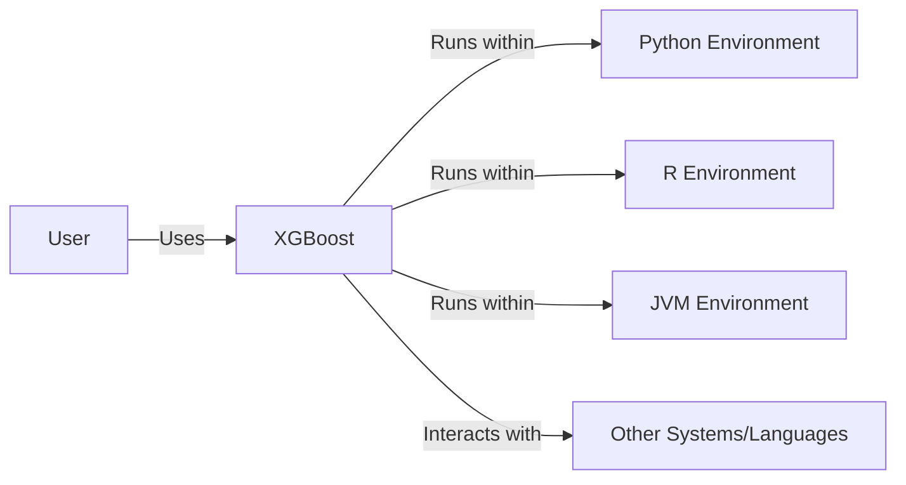
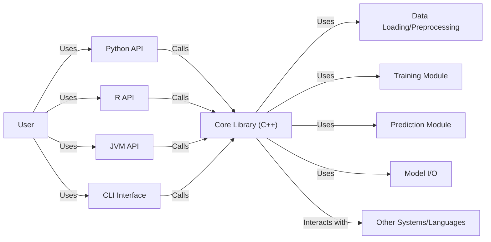
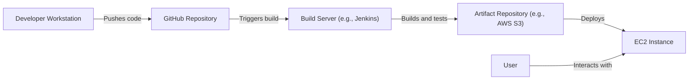
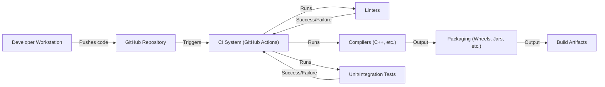

# BUSINESS POSTURE

XGBoost is a widely-used, open-source gradient boosting library. Its primary business value lies in providing a high-performance, scalable, and accurate machine learning algorithm for various tasks like classification, regression, and ranking. It's used across numerous industries and applications.

Business Priorities:

*   Maintain high accuracy and performance: XGBoost's reputation is built on its state-of-the-art results. Maintaining this is crucial.
*   Ensure scalability: The library must handle increasingly large datasets and complex models.
*   Support a wide range of platforms and interfaces (Python, R, Java, etc.): Broad compatibility is key to its widespread adoption.
*   Foster a strong community and ecosystem: Active development, user support, and contributions are vital for long-term sustainability.
*   Maintainability and extensibility: The codebase should be easy to maintain and extend with new features and algorithms.

Business Risks:

*   Competition: Other gradient boosting libraries (LightGBM, CatBoost) and machine learning frameworks pose a competitive threat.
*   Security vulnerabilities: As a widely used library, vulnerabilities could have significant consequences for users.
*   Lack of maintainers: Relying on a small group of maintainers can create a bottleneck and risk project stagnation.
*   Integration challenges: Users may face difficulties integrating XGBoost into their existing workflows or systems.
*   Incorrect usage: Users may misuse the library, leading to inaccurate results or performance issues.

# SECURITY POSTURE

Existing Security Controls:

*   security control: Code reviews: The project uses pull requests on GitHub, implying code review practices. (Described in contribution guidelines on GitHub).
*   security control: Static analysis: Some static analysis is likely used, although the specifics need confirmation. (Inferred from the presence of linters and continuous integration checks).
*   security control: Fuzz testing: XGBoost employs fuzz testing, specifically using OSS-Fuzz. (Mentioned in the repository and documentation).
*   security control: Community reporting: Vulnerabilities can be reported by users through GitHub issues or other channels. (Standard practice for open-source projects).

Accepted Risks:

*   accepted risk: Supply chain vulnerabilities: Dependencies on third-party libraries introduce potential supply chain risks.
*   accepted risk: Limited resources for security audits: As an open-source project, resources for comprehensive security audits may be limited.
*   accepted risk: User-introduced vulnerabilities: Users integrating XGBoost into their applications may introduce vulnerabilities in their own code.

Recommended Security Controls:

*   security control: Regular dynamic analysis (DAST): Implement dynamic analysis to complement static analysis and fuzzing.
*   security control: Software Composition Analysis (SCA): Integrate SCA tools to identify and manage vulnerabilities in third-party dependencies.
*   security control: Security training for contributors: Provide security training to core contributors to improve secure coding practices.
*   security control: Formal vulnerability disclosure program: Establish a clear and formal process for reporting and handling security vulnerabilities.

Security Requirements:

*   Authentication: Not directly applicable to the core library, but relevant for any associated services (e.g., model deployment platforms).
*   Authorization: Not directly applicable to the core library, but relevant for any associated services.
*   Input validation:
    *   Data type validation: Ensure that input data conforms to expected types (e.g., numerical, categorical).
    *   Range validation: Check that numerical values fall within acceptable ranges.
    *   Missing value handling: Implement robust handling of missing values.
    *   Sanitize input data to prevent injection attacks, especially in areas where user-provided input is used (e.g., model configuration).
*   Cryptography:
    *   If handling sensitive data, use appropriate encryption techniques (at rest and in transit). This is more relevant to applications built *using* XGBoost than the library itself.
    *   Use secure random number generators where needed.
*   Other:
    *   Regularly update dependencies to address known vulnerabilities.
    *   Follow secure coding best practices to minimize the risk of introducing new vulnerabilities.

# DESIGN

## C4 CONTEXT

Element Descriptions:

*   Element:
    *   Name: User
    *   Type: Person
    *   Description: A data scientist, machine learning engineer, or software developer who uses XGBoost to build and train models.
    *   Responsibilities: Provides data, configures the model, trains the model, evaluates the model, and deploys the model.
    *   Security controls: Not directly applicable, as this is an external entity. Security controls would apply to the user's environment and practices.

*   Element:
    *   Name: XGBoost
    *   Type: Software System
    *   Description: The XGBoost gradient boosting library.
    *   Responsibilities: Provides algorithms for training, prediction, and model evaluation. Handles data loading and processing. Manages model serialization and deserialization.
    *   Security controls: Input validation, fuzz testing, static analysis, code reviews.

*   Element:
    *   Name: Python Environment
    *   Type: Software System
    *   Description: The Python runtime environment, including installed packages.
    *   Responsibilities: Executes Python code, provides access to libraries (e.g., NumPy, SciPy).
    *   Security controls: Package management security, environment isolation (e.g., virtual environments).

*   Element:
    *   Name: R Environment
    *   Type: Software System
    *   Description: The R runtime environment, including installed packages.
    *   Responsibilities: Executes R code, provides access to libraries.
    *   Security controls: Package management security, environment isolation.

*   Element:
    *   Name: JVM Environment
    *   Type: Software System
    *   Description: The Java Virtual Machine environment.
    *   Responsibilities: Executes Java code, provides access to libraries.
    *   Security controls: JVM security settings, package management security.

*   Element:
    *   Name: Other Systems/Languages
    *   Type: Software System
    *   Description: Other programming languages and systems that XGBoost can interact with (e.g., Julia, CLI).
    *   Responsibilities: Varies depending on the specific system.
    *   Security controls: Varies depending on the specific system.

## C4 CONTAINER

Element Descriptions:

*   Element:
    *   Name: User
    *   Type: Person
    *   Description: (Same as in Context Diagram)
    *   Responsibilities: (Same as in Context Diagram)
    *   Security controls: (Same as in Context Diagram)

*   Element:
    *   Name: Python API
    *   Type: API
    *   Description: Python interface to the XGBoost core library.
    *   Responsibilities: Provides a user-friendly way to interact with XGBoost from Python.
    *   Security controls: Input validation, API security best practices.

*   Element:
    *   Name: R API
    *   Type: API
    *   Description: R interface to the XGBoost core library.
    *   Responsibilities: Provides a user-friendly way to interact with XGBoost from R.
    *   Security controls: Input validation, API security best practices.

*   Element:
    *   Name: JVM API
    *   Type: API
    *   Description: JVM interface to the XGBoost core library.
    *   Responsibilities: Provides a user-friendly way to interact with XGBoost from Java and other JVM languages.
    *   Security controls: Input validation, API security best practices.

*   Element:
    *   Name: CLI Interface
    *   Type: API
    *   Description: Command-line interface to XGBoost.
    *   Responsibilities: Allows users to train and use models from the command line.
    *   Security controls: Input validation, secure handling of command-line arguments.

*   Element:
    *   Name: Core Library (C++)
    *   Type: Library
    *   Description: The core XGBoost implementation, written in C++.
    *   Responsibilities: Implements the gradient boosting algorithm, handles data structures, and performs computations.
    *   Security controls: Code reviews, static analysis, fuzz testing, secure coding practices.

*   Element:
    *   Name: Data Loading/Preprocessing
    *   Type: Component
    *   Description: Module for loading and preprocessing data.
    *   Responsibilities: Reads data from various sources, handles missing values, performs feature engineering.
    *   Security controls: Input validation, data sanitization.

*   Element:
    *   Name: Training Module
    *   Type: Component
    *   Description: Module for training XGBoost models.
    *   Responsibilities: Implements the gradient boosting training algorithm.
    *   Security controls: Secure handling of training data, protection against overfitting.

*   Element:
    *   Name: Prediction Module
    *   Type: Component
    *   Description: Module for making predictions with trained models.
    *   Responsibilities: Applies the trained model to new data.
    *   Security controls: Secure handling of prediction data.

*   Element:
    *   Name: Model I/O
    *   Type: Component
    *   Description: Module for saving and loading trained models.
    *   Responsibilities: Serializes and deserializes models.
    *   Security controls: Secure storage of models, integrity checks.

*   Element:
    *   Name: Other Systems/Languages
    *   Type: Software System
    *   Description: (Same as in Context Diagram)
    *   Responsibilities: (Same as in Context Diagram)
    *   Security controls: (Same as in Context Diagram)

## DEPLOYMENT

XGBoost itself is a library, not a standalone application. Therefore, "deployment" refers to how it's integrated into a user's environment. Several deployment scenarios are possible:

1.  Local Machine: Direct installation via package managers (pip, conda, CRAN) or building from source.
2.  Cloud VMs: Installation on virtual machines (e.g., AWS EC2, Google Compute Engine, Azure VMs).
3.  Containers: Building and running XGBoost within Docker containers.
4.  Cloud ML Platforms: Using managed services like AWS SageMaker, Google AI Platform, or Azure Machine Learning, which provide built-in support for XGBoost.
5.  Serverless: Deploying XGBoost models in serverless environments (e.g., AWS Lambda, Google Cloud Functions, Azure Functions). This usually involves packaging the model and prediction code.

Chosen Deployment Scenario: Cloud VMs (e.g., AWS EC2)

Element Descriptions:

*   Element:
    *   Name: Developer Workstation
    *   Type: Node
    *   Description: The developer's local machine.
    *   Responsibilities: Code development, testing, and pushing to the repository.
    *   Security controls: Local security measures (e.g., firewall, antivirus).

*   Element:
    *   Name: GitHub Repository
    *   Type: Node
    *   Description: The source code repository hosted on GitHub.
    *   Responsibilities: Stores the source code, manages version control.
    *   Security controls: Access controls, branch protection rules.

*   Element:
    *   Name: Build Server (e.g., Jenkins)
    *   Type: Node
    *   Description: A server that automates the build process.
    *   Responsibilities: Builds the XGBoost library, runs tests, and creates deployment artifacts.
    *   Security controls: Access controls, secure build environment, vulnerability scanning.

*   Element:
    *   Name: Artifact Repository (e.g., AWS S3)
    *   Type: Node
    *   Description: A repository for storing build artifacts (e.g., compiled binaries, Python wheels).
    *   Responsibilities: Stores and versions build artifacts.
    *   Security controls: Access controls, encryption at rest, versioning.

*   Element:
    *   Name: EC2 Instance
    *   Type: Node
    *   Description: A virtual machine running on AWS EC2.
    *   Responsibilities: Hosts the XGBoost library and any associated application code.
    *   Security controls: Security groups, network ACLs, IAM roles, system hardening.

*   Element:
    *   Name: User
    *   Type: Person
    *   Description: (Same as in Context Diagram)
    *   Responsibilities: (Same as in Context Diagram)
    *   Security controls: (Same as in Context Diagram)

## BUILD

The build process for XGBoost involves compiling the C++ core and creating language-specific bindings (Python, R, JVM, etc.).

Build Process Description:

1.  Developer pushes code changes to the GitHub repository.
2.  GitHub Actions (or another CI system) is triggered.
3.  Linters (e.g., clang-format, pylint) are run to check code style and identify potential issues.
4.  Compilers (e.g., g++, CMake) are used to build the C++ core library.
5.  Unit and integration tests are executed to verify the correctness of the code.
6.  Language-specific bindings are built (e.g., Python wheels, R packages, Java JARs).
7.  Build artifacts are created and stored.

Security Controls in Build Process:

*   security control: CI/CD pipeline: Automates the build and testing process, ensuring consistency and reducing manual errors.
*   security control: Linters: Enforce code style and identify potential code quality issues.
*   security control: Static analysis: Performed as part of the CI process to detect potential vulnerabilities.
*   security control: Automated testing: Unit and integration tests help ensure code correctness and prevent regressions.
*   security control: Dependency management: Tools like CMake and package managers (pip, conda) manage dependencies, but require careful monitoring for vulnerabilities (SCA).
*   security control: Build artifact signing:  Consider signing build artifacts to ensure their integrity and authenticity. (Not currently implemented, but a recommended practice).

# RISK ASSESSMENT

Critical Business Processes:

*   Model training: The core process of training accurate and reliable machine learning models.
*   Model prediction: Generating predictions from trained models.
*   Data processing: Handling and transforming data for use with XGBoost.

Data Sensitivity:

*   XGBoost itself doesn't inherently handle sensitive data. The *data* used with XGBoost can range from non-sensitive to highly sensitive (e.g., personal information, financial data, medical records). The sensitivity depends entirely on the user's application.  XGBoost library should not store any data, it should be designed to process data in memory.

# QUESTIONS & ASSUMPTIONS

Questions:

*   What specific static analysis tools are currently used in the CI pipeline?
*   Are there any plans to implement a formal vulnerability disclosure program?
*   What are the specific procedures for handling security vulnerabilities reported by users?
*   What is the frequency of dependency updates?
*   Are there any security audits (internal or external) performed on the codebase?
*   What are the plans for addressing potential supply chain vulnerabilities?

Assumptions:

*   BUSINESS POSTURE: The primary goal is to maintain XGBoost's position as a leading gradient boosting library.
*   SECURITY POSTURE: The project follows reasonable security practices for an open-source project, but there's room for improvement.
*   DESIGN: The design is modular and allows for extensibility. The core C++ library is well-separated from the language-specific bindings. The deployment model can vary significantly depending on the user's needs.