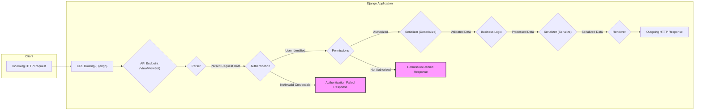
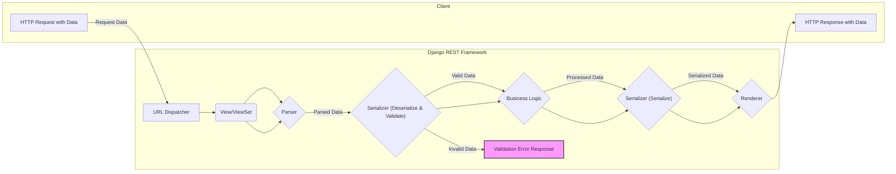

# Project Design Document: Django REST Framework

**Version:** 1.1
**Date:** October 26, 2023
**Author:** AI Software Architect

## 1. Introduction

This document provides an enhanced architectural design of the Django REST Framework (DRF), a powerful and flexible toolkit for building Web APIs in Django. This detailed description focuses on the framework's internal workings, component interactions, and data flow, specifically to facilitate comprehensive threat modeling activities.

## 2. Project Overview

Django REST Framework is a widely adopted open-source library that extends Django's capabilities for constructing robust and scalable RESTful APIs. It offers a suite of tools and abstractions that streamline common API development tasks, including data serialization, authentication, authorization, content negotiation, and request handling.

**Key Goals of Django REST Framework:**

*   To offer a structured and consistent approach to building Web APIs within the Django ecosystem.
*   To minimize boilerplate code typically associated with API development.
*   To provide highly flexible and customizable components catering to diverse API requirements.
*   To ensure seamless integration with Django's existing features, ORM, and application structure.
*   To promote and enforce best practices in API design and development.

## 3. Architectural Design

Django REST Framework's architecture is based on a set of modular and interoperable components that operate within the Django request-response cycle. Understanding these components and their interactions is crucial for identifying potential security vulnerabilities.

### 3.1. Core Components

*   **Serializers:** These components are central to DRF. They handle the bidirectional transformation of data:
    *   **Serialization:** Converting Django model instances or other Python objects into representations like JSON, XML, or other formats suitable for API responses. This process often involves defining fields, data validation, and customization of the output structure.
    *   **Deserialization:**  Converting incoming request data (e.g., JSON, form data) back into Python objects, typically for creating or updating database records. Serializers enforce validation rules during deserialization, which is a critical security point.
*   **Parsers:** Responsible for interpreting the raw request body based on the `Content-Type` header. DRF includes parsers for various formats:
    *   `JSONParser`: Handles JSON data.
    *   `MultiPartParser`: Handles form data with file uploads.
    *   `FormParser`: Handles standard HTML form data.
    *   Custom parsers can be implemented to support other formats. The choice of parser influences how input data is processed and can be a point of vulnerability if not handled correctly.
*   **Renderers:**  Take the final Python data structure prepared by the View and convert it into a specific output format for the API response. DRF provides renderers for:
    *   `JSONRenderer`: Renders data as JSON.
    *   `BrowsableAPIRenderer`: Generates an interactive HTML representation of the API, useful for development and exploration.
    *   Custom renderers can be implemented. The selected renderer affects how data is presented to the client and can have security implications if sensitive data is inadvertently exposed.
*   **ViewSets & Views:** These components contain the core business logic of the API endpoints.
    *   **ViewSets:** Provide a higher-level abstraction, grouping related views for common CRUD operations (Create, Read, Update, Delete). They simplify URL configuration using routers.
    *   **Generic Views:** Offer reusable implementations for common API patterns, reducing boilerplate code.
    *   **APIView:** Provides the most fundamental building block for creating custom API views, offering fine-grained control over the request-response cycle. Views handle authentication, permission checks, data processing using serializers, and generating the response.
*   **Authentication:** Determines the identity of the client making the request. DRF offers several built-in authentication schemes:
    *   `BasicAuthentication`: Uses HTTP Basic Auth (less secure for production).
    *   `TokenAuthentication`: Uses a simple token-based authentication.
    *   `SessionAuthentication`: Leverages Django's session framework (suitable for browser-based clients).
    *   `OAuth2Authentication`: Supports OAuth2 for more robust authorization.
    *   Custom authentication backends can be implemented. The chosen authentication method is a primary security control.
*   **Permissions:** Control access to API endpoints based on the authenticated user's identity and potentially other factors. DRF provides permission classes like:
    *   `AllowAny`: Grants access to everyone.
    *   `IsAuthenticated`: Requires the client to be authenticated.
    *   `IsAdminUser`: Restricts access to Django admin users.
    *   `IsAuthenticatedOrReadOnly`: Allows read access to everyone but write access only to authenticated users.
    *   Object-level permissions can be implemented for more granular control. Proper permission configuration is crucial for preventing unauthorized access.
*   **Throttling:**  Regulates the rate at which clients can make requests to the API. This helps prevent denial-of-service attacks and protects API resources. DRF offers various throttling mechanisms based on IP address, user ID, or custom logic.
*   **Routers:** Automatically generate URL patterns for ViewSets, simplifying the process of mapping URLs to API endpoints and ensuring consistency.
*   **Metadata:** Provides information about the API's structure and capabilities. This can be used by clients to understand how to interact with the API. The browsable API leverages metadata to dynamically generate its interface.

### 3.2. Request-Response Flow

The following diagram illustrates the detailed flow of a request through Django REST Framework, highlighting key security checkpoints:

**Detailed Breakdown of the Request-Response Flow:**

1. **Incoming HTTP Request:** A client sends an HTTP request to the Django application.
2. **URL Routing (Django):** Django's URL dispatcher matches the incoming request URL to the corresponding DRF View or ViewSet.
3. **API Endpoint (View/ViewSet):** The request is handled by the designated DRF View or ViewSet.
4. **Parser:** The appropriate DRF Parser (based on the `Content-Type` header) processes the raw request body, converting it into a usable data structure (e.g., a dictionary for JSON).
5. **Authentication:** DRF's authentication components attempt to identify the user making the request by inspecting credentials provided in the request headers (e.g., `Authorization` header).
    *   If authentication is successful, the user is identified, and the flow proceeds to the permission checks.
    *   If authentication fails (e.g., invalid or missing credentials), an "Authentication Failed" response (typically a 401 Unauthorized) is generated and returned to the client.
6. **Permissions:** DRF's permission components evaluate whether the authenticated user (or an anonymous user) has the necessary permissions to access the requested resource or perform the requested action. This is determined by the permission classes configured for the View.
    *   If the user is authorized, the flow proceeds to data deserialization.
    *   If the user is not authorized, a "Permission Denied" response (typically a 403 Forbidden) is generated and returned to the client.
7. **Serializer (Deserialize):** If the request involves data submission (e.g., POST, PUT, PATCH), the configured Serializer is used to validate and deserialize the parsed request data into Python objects. This step enforces data integrity and can prevent injection attacks.
8. **Business Logic:** The core logic of the API endpoint is executed within the View or ViewSet. This often involves interacting with Django models, performing calculations, or calling other services.
9. **Serializer (Serialize):** The Serializer is used to convert the resulting Python objects into a representation suitable for the API response. This ensures the output data is structured as expected.
10. **Renderer:** The appropriate DRF Renderer (based on content negotiation or default settings) takes the serialized data and converts it into the final response format (e.g., JSON, XML).
11. **Outgoing HTTP Response:** The rendered data, along with appropriate HTTP headers (including status codes and `Content-Type`), is sent back to the client.

### 3.3. Data Flow Diagram (Detailed)

**Explanation of Data Flow:**

1. The client sends an HTTP request, potentially including data in the request body.
2. Django's URL dispatcher routes the request to the relevant DRF View or ViewSet.
3. The **Parser** interprets the incoming request data based on the `Content-Type`.
4. The **Serializer** attempts to deserialize the parsed data into Python objects. Crucially, it also **validates** the data against the defined serializer fields and rules.
    *   If the data is valid, it's passed to the business logic.
    *   If the data is invalid, a "Validation Error" response (typically a 400 Bad Request) is generated.
5. The **Business Logic** processes the validated data.
6. The **Serializer** serializes the processed data into a format suitable for the response.
7. The **Renderer** converts the serialized data into the final response format.
8. The HTTP response, containing the formatted data, is sent back to the client.

## 4. Security Considerations

Django REST Framework offers several built-in security features, but proper configuration and usage are essential. Potential security concerns need careful consideration during threat modeling:

*   **Authentication Vulnerabilities:**
    *   **Weak Authentication Schemes:** Using `BasicAuthentication` in production without HTTPS exposes credentials.
    *   **Insecure Token Storage:** If using `TokenAuthentication`, ensure tokens are stored securely.
    *   **OAuth2 Misconfiguration:** Incorrectly configured OAuth2 flows can lead to authorization bypass or information leakage.
*   **Authorization Vulnerabilities:**
    *   **Insufficient Permission Checks:** Overly permissive permission classes (`AllowAny`) can expose sensitive data or actions.
    *   **Broken Object-Level Permissions:** Flaws in logic determining access to specific objects can lead to unauthorized access.
    *   **Bypass through API Design:** Poorly designed APIs might allow access to resources indirectly, bypassing intended restrictions.
*   **Serialization/Deserialization Vulnerabilities:**
    *   **Mass Assignment:**  Serializers not explicitly defining fields can allow clients to modify unintended model attributes.
    *   **Data Injection:** Improperly validated deserialized data can lead to SQL injection, command injection, or other vulnerabilities.
    *   **Denial of Service through Complex Data:** Processing excessively large or deeply nested data structures during deserialization can consume excessive resources.
*   **Input Validation Vulnerabilities:**
    *   **Insufficient Validation Rules:**  Lack of proper validation in serializers can allow invalid or malicious data to be processed.
    *   **Regex Vulnerabilities:** Complex regular expressions used for validation can be susceptible to ReDoS (Regular expression Denial of Service) attacks.
*   **Output Rendering Vulnerabilities:**
    *   **Exposure of Sensitive Data in Error Messages:** Verbose error messages in development environments might inadvertently reveal sensitive information if exposed in production.
    *   **Cross-Site Scripting (XSS) in Browsable API:** While helpful for development, the browsable API could be a vector for XSS if not handled carefully (though DRF generally escapes output).
*   **Rate Limiting Bypass:**
    *   **Insufficiently Restrictive Throttling:**  Throttling rules that are too lenient might not effectively prevent abuse.
    *   **IP Address Spoofing:** Throttling based solely on IP addresses can be bypassed.
*   **Dependency Vulnerabilities:**  Like any software, DRF and its dependencies can have security vulnerabilities. Regularly updating dependencies is crucial.
*   **CORS Misconfiguration:** Incorrectly configured Cross-Origin Resource Sharing (CORS) settings can expose the API to unauthorized access from different domains.

## 5. Deployment Considerations

Secure deployment practices are critical for the overall security of APIs built with Django REST Framework:

*   **HTTPS Enforcement:** Always serve APIs over HTTPS to encrypt communication and protect against eavesdropping.
*   **Secure Server Configuration:** Harden the web server (e.g., Nginx, Apache) and operating system.
*   **Regular Security Updates:** Keep Django, DRF, and all dependencies updated to patch known vulnerabilities.
*   **Network Security:** Implement firewalls and network segmentation to restrict access to the API server.
*   **Input Sanitization and Output Encoding:** While DRF provides some protection, ensure proper handling of user input and output encoding to prevent injection attacks.
*   **Monitoring and Logging:** Implement robust logging and monitoring to detect suspicious activity.
*   **Secret Management:** Securely manage API keys, database credentials, and other secrets. Avoid hardcoding secrets in the codebase.

## 6. Assumptions and Limitations

*   This document focuses on the architectural design of Django REST Framework. It assumes a basic understanding of the Django framework.
*   The security considerations section highlights potential vulnerabilities but is not an exhaustive security audit. A dedicated penetration testing exercise is recommended.
*   Deployment considerations provide a general overview. Specific deployment configurations and security best practices will vary depending on the environment.

## 7. Conclusion

This enhanced design document provides a more in-depth understanding of Django REST Framework's architecture, component interactions, and data flow, with a strong emphasis on security aspects. This detailed information is essential for conducting thorough threat modeling, identifying potential vulnerabilities, and implementing appropriate security controls to build secure and robust APIs using DRF.
