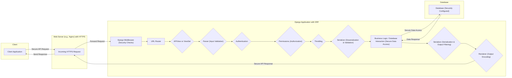
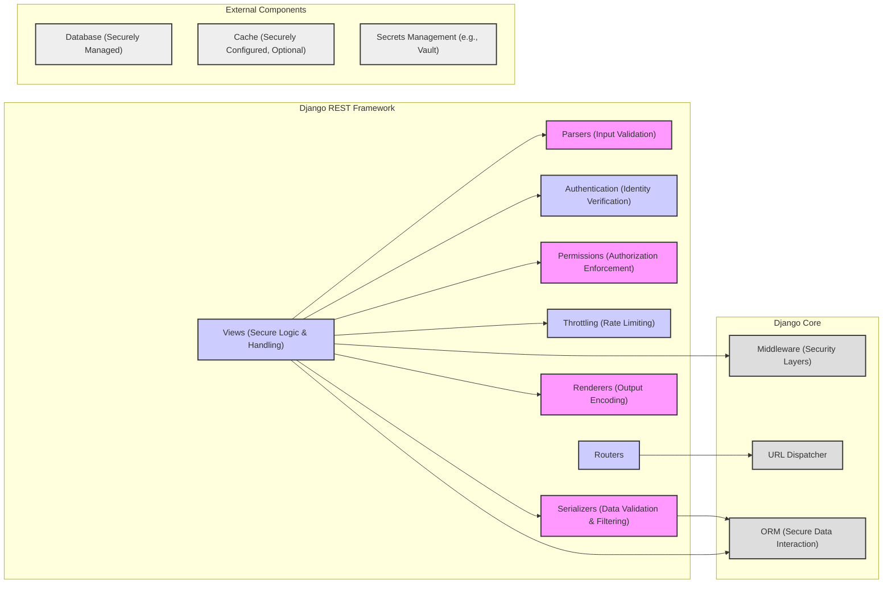

## Project Design Document: Django REST Framework (Improved)

**1. Introduction**

This document provides an enhanced architectural design of the Django REST Framework (DRF), a powerful and flexible toolkit for building Web APIs in Django. This improved document aims to provide a more detailed and security-focused foundation for subsequent threat modeling activities. It offers a clearer understanding of the system's components, their interactions, and potential security implications. The target audience includes security engineers, developers, and architects involved in the security assessment, development, and deployment of applications utilizing DRF.

**2. Project Overview**

The Django REST Framework is a widely adopted third-party library for Django that significantly simplifies the creation of robust and well-defined RESTful APIs. It offers a comprehensive set of tools and abstractions, handling common API development tasks such as request parsing, response rendering, data serialization and deserialization, authentication, authorization, and request throttling. Understanding DRF's architecture is crucial for identifying potential vulnerabilities and implementing appropriate security measures.

**3. Architectural Design**

DRF's architecture builds upon Django's Model-View-Template (MVT) pattern, extending its capabilities to address API-specific concerns. The following details the core components and their interactions, with a focus on security-relevant aspects:

*   **Request Handling and Routing:**
    *   Incoming HTTP requests are initially processed by Django's middleware stack, which can include custom security middleware.
    *   Django's `URLConf` (defined in `urls.py`) maps incoming request paths to specific DRF views (either `APIView` or `ViewSet`).
    *   DRF's request object wraps Django's `HttpRequest`, providing additional API-specific functionalities.

*   **Request Parsing:**
    *   DRF's `Parser` classes convert the raw HTTP request body into structured Python data.
        *   Examples include `JSONParser`, `FormParser`, `MultiPartParser`.
        *   The parser is selected based on the `Content-Type` header. **Security Note:** Improperly configured or vulnerable parsers can lead to denial-of-service or even remote code execution if they fail to handle malformed input securely.
    *   **Security Note:** Ensure parsers are configured to handle large payloads appropriately to prevent resource exhaustion.

*   **Authentication:**
    *   DRF provides a pluggable authentication system, allowing for various authentication methods.
        *   Common backends: `BasicAuthentication`, `TokenAuthentication`, `SessionAuthentication`, `JWTAuthentication`.
        *   Multiple authentication backends can be configured, with DRF attempting each in order.
    *   **Security Note:** The choice of authentication backend significantly impacts security. Ensure strong authentication mechanisms are used, and consider multi-factor authentication where appropriate. Properly secure the storage of authentication credentials (e.g., API tokens).

*   **Authorization (Permissions):**
    *   DRF's permission classes determine if an authenticated (or unauthenticated) user is authorized to access a specific view or perform an action.
        *   Common classes: `IsAuthenticated`, `IsAdminUser`, `AllowAny`, `IsAuthenticatedOrReadOnly`.
        *   Custom permission classes can be defined for fine-grained access control.
    *   **Security Note:** Implement a principle of least privilege. Grant only the necessary permissions to users and roles. Carefully design and test custom permission logic to avoid authorization bypass vulnerabilities.

*   **Throttling:**
    *   DRF's throttling classes control the rate at which users can make requests, mitigating brute-force attacks and preventing resource exhaustion.
        *   Throttling can be based on IP address, user ID, or other identifiers.
        *   Different throttling rates can be applied to different API endpoints.
    *   **Security Note:**  Configure appropriate throttling limits based on the expected usage patterns of the API. Consider using different throttling scopes for authenticated and unauthenticated users.

*   **Data Handling with Serializers:**
    *   `Serializer` classes are crucial for converting Python objects to API representations (serialization) and vice-versa (deserialization).
        *   Serializers define the fields included in the API and handle data validation.
        *   **Security Note:**  Robust input validation in serializers is essential to prevent injection attacks (e.g., SQL injection, cross-site scripting). Sanitize and validate all user-provided data.
        *   **Security Note:** Be mindful of exposing sensitive data in API responses. Use serializer fields and methods to control the data included in the output.

*   **Views (APIView and ViewSet):**
    *   `ViewSet` classes provide a high-level abstraction for common CRUD operations on resources.
    *   `APIView` classes offer more granular control over request handling.
    *   Views orchestrate the interaction between parsers, authentication, permissions, serializers, and renderers.
    *   **Security Note:** Secure coding practices within view logic are critical. Avoid common vulnerabilities like insecure direct object references or mass assignment issues.

*   **Response Rendering:**
    *   DRF's `Renderer` classes convert the final Python data into the desired response format.
        *   Examples: `JSONRenderer`, `BrowsableAPIRenderer`, `XMLRenderer`.
        *   The renderer is selected based on the `Accept` header.
    *   **Security Note:** Ensure renderers properly handle character encoding to prevent cross-site scripting (XSS) vulnerabilities.

*   **Routers:**
    *   `Router` classes automatically generate URL patterns for `ViewSet` classes, simplifying API endpoint definition.

**4. Deployment Considerations (Security Focused)**

Secure deployment is paramount for DRF applications. Key security considerations during deployment include:

*   **HTTPS Enforcement:**  Mandatory use of HTTPS to encrypt all communication between clients and the API, protecting sensitive data in transit.
*   **Web Server Configuration:** Secure configuration of web servers (e.g., Nginx, Apache) to prevent common attacks.
    *   Disable unnecessary HTTP methods.
    *   Configure appropriate timeouts.
    *   Implement rate limiting at the web server level as an additional layer of defense.
*   **Database Security:** Secure configuration of the database server, including strong passwords, access controls, and regular security updates.
*   **Dependency Management:** Regularly update DRF and all other dependencies to patch known vulnerabilities. Use tools like `pip check` or vulnerability scanners.
*   **CORS Configuration:** Properly configure Cross-Origin Resource Sharing (CORS) policies to restrict which origins can access the API, preventing unauthorized cross-domain requests.
*   **CSRF Protection:** Ensure Django's CSRF protection is enabled for views that handle non-idempotent requests (e.g., POST, PUT, DELETE) from web browsers.
*   **Security Headers:** Configure security-related HTTP headers (e.g., `Strict-Transport-Security`, `X-Content-Type-Options`, `X-Frame-Options`, `Content-Security-Policy`) to enhance client-side security.
*   **Secrets Management:** Securely manage API keys, database credentials, and other sensitive information. Avoid hardcoding secrets in the codebase; use environment variables or dedicated secrets management solutions.
*   **Logging and Monitoring:** Implement comprehensive logging and monitoring to detect suspicious activity and potential security breaches.

**5. Security Considerations (Detailed)**

Expanding on the high-level points, here are more detailed security considerations for DRF components:

*   **Parser Vulnerabilities:**
    *   Denial-of-service through large payloads.
    *   XML External Entity (XXE) injection if using XML parsers.
    *   Deserialization vulnerabilities if using insecure deserialization libraries.
*   **Authentication Bypass:**
    *   Weak or default credentials.
    *   Vulnerabilities in custom authentication backends.
    *   Improper handling of authentication tokens.
*   **Authorization Flaws:**
    *   Broken object-level authorization.
    *   Missing authorization checks.
    *   Circumventing permission checks through API design flaws.
*   **Throttling Evasion:**
    *   Using multiple IP addresses.
    *   Exploiting flaws in throttling logic.
*   **Serializer Vulnerabilities:**
    *   Mass assignment vulnerabilities.
    *   Injection flaws due to insufficient input validation.
    *   Exposure of sensitive data through overly permissive serializers.
*   **View Logic Vulnerabilities:**
    *   SQL injection through unsanitized input.
    *   Cross-site scripting (XSS) if rendering user-provided data without proper escaping.
    *   Insecure direct object references (IDOR).
*   **Renderer Vulnerabilities:**
    *   XSS through improper output encoding.

**6. Data Flow Diagram (Security Focused)**

**7. Component Diagram (Security Focused)**

**8. Conclusion**

This improved design document provides a more detailed and security-focused architectural overview of the Django REST Framework. By highlighting potential security considerations within each component and during deployment, this document serves as a stronger foundation for threat modeling activities. Understanding the intricacies of DRF's architecture and its security implications is crucial for building robust and secure APIs. This document should be used as a key resource for security assessments, secure development practices, and ongoing security monitoring of DRF-based projects.