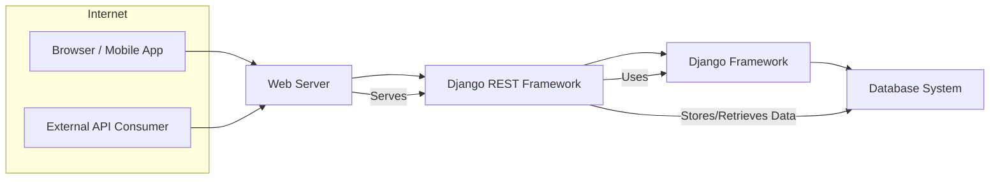
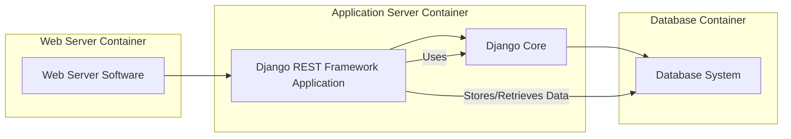

# BUSINESS POSTURE

- Business priorities:
    - Provide a flexible and powerful toolkit for building Web APIs with Django.
    - Enable rapid development of RESTful APIs.
    - Maintain a high-quality, well-documented, and actively supported framework.
    - Foster a strong community around the framework.
- Business goals:
    - Be the leading choice for building REST APIs in the Django ecosystem.
    - Expand adoption of Django REST framework across diverse industries and project types.
    - Continuously improve the framework based on community feedback and evolving web development standards.
- Business risks:
    - Security vulnerabilities in the framework could lead to data breaches in applications built with it, damaging the framework's reputation and user trust.
    - Performance bottlenecks or scalability issues could limit the framework's applicability for high-traffic APIs.
    - Lack of compatibility with future Django versions or other key technologies could fragment the community and reduce adoption.
    - Insufficient documentation or a steep learning curve could deter new users.

# SECURITY POSTURE

- Existing security controls:
    - security control: Leverages Django's built-in security features, including protection against common web vulnerabilities like Cross-Site Scripting (XSS), Cross-Site Request Forgery (CSRF), and SQL Injection. Implemented within the Django framework itself.
    - security control: Encourages secure coding practices through documentation and examples, promoting input validation, proper authentication and authorization mechanisms. Described in Django REST framework documentation and best practices guides.
    - security control: Relies on community contributions and code reviews to identify and address potential security vulnerabilities. Implemented through GitHub's pull request and issue tracking system.
    - security control: Uses HTTPS for secure communication as a general web security best practice, although this is deployment specific and not enforced by the framework itself. Described in general web security best practices.
- Accepted risks:
    - accepted risk: As an open-source project, the framework's security relies on community vigilance and timely reporting of vulnerabilities. There might be a delay between vulnerability discovery and patch availability.
    - accepted risk: Security of applications built with Django REST framework ultimately depends on the developers' secure coding practices and proper configuration of the framework and underlying infrastructure. The framework cannot prevent all security issues arising from improper usage.
- Recommended security controls:
    - security control: Implement automated security scanning tools (SAST/DAST) in the development and CI/CD pipeline to proactively identify potential vulnerabilities.
    - security control: Conduct regular security audits and penetration testing by security experts to identify and address weaknesses in the framework.
    - security control: Establish a clear vulnerability disclosure and incident response process to handle security issues efficiently.
    - security control: Provide security-focused documentation and training for developers using Django REST framework, emphasizing secure API development best practices.
    - security control: Implement dependency scanning to ensure that third-party libraries used by the framework are up-to-date and free from known vulnerabilities.
- Security requirements:
    - Authentication:
        - Requirement: Support various authentication schemes (e.g., Token authentication, OAuth 2.0, JWT) to securely identify API clients.
        - Requirement: Provide mechanisms to prevent brute-force attacks on authentication endpoints (e.g., rate limiting, account lockout).
    - Authorization:
        - Requirement: Offer flexible and granular permission control mechanisms to manage access to API endpoints and resources based on user roles or permissions.
        - Requirement: Ensure that authorization checks are consistently enforced across all API endpoints.
    - Input validation:
        - Requirement: Mandate robust input validation for all API requests to prevent injection attacks (e.g., SQL injection, command injection, XSS).
        - Requirement: Provide tools and guidance for developers to easily implement input validation and sanitization.
    - Cryptography:
        - Requirement: Encourage and facilitate the use of HTTPS for all API communication to protect data in transit.
        - Requirement: Provide guidance on securely storing sensitive data at rest, recommending encryption where appropriate.
        - Requirement: Ensure that cryptographic operations within the framework (if any) are implemented using secure and up-to-date algorithms and libraries.

# DESIGN

## C4 CONTEXT



- Context Diagram Elements:
    - - Name: Browser / Mobile App
        - Type: External System
        - Description: Represents web browsers or mobile applications that consume APIs built with Django REST Framework.
        - Responsibilities: Present user interface, make API requests to interact with data and functionality provided by the API.
        - Security controls: Implements client-side security measures, such as secure storage of API keys (if applicable), protection against client-side vulnerabilities (e.g., XSS).
    - - Name: External API Consumer
        - Type: External System
        - Description: Represents other external systems, applications, or services that consume APIs built with Django REST Framework programmatically.
        - Responsibilities: Integrate with the API to access data or functionality, automate processes, or build upon the API's capabilities.
        - Security controls: Manages API keys or credentials securely, implements proper authentication and authorization when interacting with the API.
    - - Name: Django REST Framework
        - Type: System
        - Description: The Django REST Framework itself, a toolkit for building Web APIs.
        - Responsibilities: Provides tools and libraries for developing RESTful APIs, handling requests and responses, serialization, authentication, authorization, and more.
        - Security controls: Implements security best practices for API development, leverages Django's security features, provides mechanisms for authentication and authorization, input validation, and secure communication.
    - - Name: Django Framework
        - Type: System
        - Description: The underlying Django web framework upon which Django REST Framework is built.
        - Responsibilities: Provides core web framework functionalities, including URL routing, template rendering, database ORM, and built-in security features.
        - Security controls: Implements core security features like CSRF protection, XSS prevention, SQL injection protection, user authentication and session management.
    - - Name: Database System
        - Type: External System
        - Description: A database system (e.g., PostgreSQL, MySQL) used to store and manage data for the application.
        - Responsibilities: Persistently store application data, provide data retrieval and manipulation capabilities.
        - Security controls: Implements database-level security controls, such as access control lists, encryption at rest, and regular backups.
    - - Name: Web Server
        - Type: Container
        - Description: A web server (e.g., Nginx, Apache) that serves the Django application and Django REST Framework APIs.
        - Responsibilities: Handles incoming HTTP requests, routes requests to the Django application, serves static files, and manages SSL/TLS for HTTPS.
        - Security controls: Implements web server security configurations, such as access controls, SSL/TLS configuration, and protection against common web server vulnerabilities.

## C4 CONTAINER



- Container Diagram Elements:
    - - Name: Web Server Software
        - Type: Container
        - Description: Software like Nginx or Apache that acts as the entry point for HTTP requests.
        - Responsibilities: Receive and route HTTP requests, serve static files, handle SSL/TLS termination.
        - Security controls: Web server access controls, SSL/TLS configuration, security hardening of the web server software.
    - - Name: Django REST Framework Application
        - Type: Container
        - Description: The Django application built using Django REST Framework, containing the API logic, serializers, views, and authentication/authorization components.
        - Responsibilities: Implement API endpoints, handle API requests and responses, perform business logic, interact with the database, enforce authentication and authorization.
        - Security controls: Input validation, authorization logic, secure coding practices, integration with Django's security features, implementation of authentication mechanisms.
    - - Name: Django Core
        - Type: Container
        - Description: The core Django framework components that provide the foundation for the REST framework application.
        - Responsibilities: Provide core web framework functionalities, ORM, URL routing, and base security features.
        - Security controls: Django's built-in security features (CSRF, XSS, SQL injection prevention), secure session management.
    - - Name: Database System
        - Type: Container
        - Description: The database system used to persist application data.
        - Responsibilities: Store and manage application data, provide data access and manipulation.
        - Security controls: Database access controls, encryption at rest, database auditing, regular security patching of the database system.

## DEPLOYMENT

Deployment Solution: Cloud-based Containerized Deployment (e.g., AWS ECS, Google Kubernetes Engine, Azure Kubernetes Service)

```mermaid
flowchart LR
    subgraph Cloud Provider (e.g., AWS)
        subgraph Region
            subgraph Availability Zone 1
                A[Load Balancer Instance]
                subgraph Container Cluster 1
                    B[Web Server Container Instance]
                    C[Application Container Instance]
                end
            end
            subgraph Availability Zone 2
                D[Load Balancer Instance]
                subgraph Container Cluster 2
                    E[Web Server Container Instance]
                    F[Application Container Instance]
                end
            end
            G[Database Service Instance (e.g., AWS RDS)]
        end
    end
    Internet -- HTTPS Requests --> A & D
    A -- HTTP Requests --> B
    D -- HTTP Requests --> F
    C -- Database Access --> G
    F -- Database Access --> G
```

- Deployment Diagram Elements:
    - - Name: Load Balancer Instance
        - Type: Infrastructure
        - Description: A load balancer (e.g., AWS ELB, Nginx Load Balancer) distributing incoming traffic across multiple application instances.
        - Responsibilities: Distribute traffic, provide high availability and scalability, perform health checks on application instances, SSL/TLS termination.
        - Security controls: SSL/TLS configuration, access control lists, protection against DDoS attacks, security monitoring.
    - - Name: Web Server Container Instance
        - Type: Container Instance
        - Description: Container instance running the Web Server Software (e.g., Nginx).
        - Responsibilities: Serve static files, reverse proxy requests to application containers.
        - Security controls: Container security hardening, minimal container image, network segmentation, resource limits.
    - - Name: Application Container Instance
        - Type: Container Instance
        - Description: Container instance running the Django REST Framework application.
        - Responsibilities: Execute application code, handle API requests, interact with the database.
        - Security controls: Container security hardening, minimal container image, network segmentation, resource limits, application-level firewalls.
    - - Name: Database Service Instance
        - Type: Managed Service
        - Description: A managed database service (e.g., AWS RDS, Azure SQL Database, Google Cloud SQL).
        - Responsibilities: Persist application data, manage database infrastructure, provide backups and high availability.
        - Security controls: Managed database security features, access control lists, encryption at rest and in transit, regular security patching by the cloud provider.
    - - Name: Container Cluster
        - Type: Infrastructure
        - Description: A cluster of container instances managed by a container orchestration platform (e.g., Kubernetes, ECS).
        - Responsibilities: Orchestrate container deployment, scaling, and management, provide container networking and service discovery.
        - Security controls: Container cluster security configurations, network policies, role-based access control, security monitoring of the cluster.
    - - Name: Availability Zone
        - Type: Infrastructure
        - Description: Isolated locations within cloud regions, providing fault tolerance and high availability.
        - Responsibilities: Provide physical isolation and redundancy for infrastructure components.
        - Security controls: Physical security of data centers, redundant power and network infrastructure.
    - - Name: Region
        - Type: Infrastructure
        - Description: Geographical area containing availability zones and cloud resources.
        - Responsibilities: Provide geographical location for resource deployment, data residency compliance.
        - Security controls: Regional compliance certifications, data residency controls.
    - - Name: Cloud Provider
        - Type: Infrastructure
        - Description: Cloud service provider (e.g., AWS, Azure, GCP) hosting the infrastructure.
        - Responsibilities: Provide and manage cloud infrastructure, ensure security and reliability of the cloud platform.
        - Security controls: Cloud provider's security certifications, physical security, network security, access management, compliance with industry standards.

## BUILD

```mermaid
flowchart LR
    A[Developer] --> B{Code Changes};
    B -- Push --> C[Version Control System (e.g., GitHub)];
    C --> D[CI/CD Pipeline (e.g., GitHub Actions)];
    D --> E{Build Stage};
    E --> F[Dependency Scan];
    E --> G[SAST Scan];
    E --> H[Linting & Formatting];
    E --> I[Unit Tests];
    F & G & H & I --> J{Artifact Build};
    J --> K[Container Registry];
    K --> L[Deployment Environment];
```

- Build Process Elements:
    - - Name: Developer
        - Type: Person
        - Description: Software developer contributing code to the Django REST Framework project or applications using it.
        - Responsibilities: Write code, commit changes, and push code to the version control system.
        - Security controls: Secure development environment, code review participation, security training.
    - - Name: Version Control System (e.g., GitHub)
        - Type: Tool
        - Description: System for managing and tracking changes to the codebase.
        - Responsibilities: Store source code, manage branches and versions, track code changes, facilitate collaboration.
        - Security controls: Access control to repository, branch protection rules, audit logging, vulnerability scanning of repository dependencies.
    - - Name: CI/CD Pipeline (e.g., GitHub Actions)
        - Type: Tool
        - Description: Automated pipeline for building, testing, and deploying the application.
        - Responsibilities: Automate build process, run tests, perform security checks, build artifacts, deploy to environments.
        - Security controls: Secure pipeline configuration, access control to pipeline, secret management, audit logging of pipeline activities.
    - - Name: Build Stage
        - Type: Process
        - Description: Stage within the CI/CD pipeline responsible for compiling code, running tests, and performing security checks.
        - Responsibilities: Compile code, run unit tests, perform static analysis, scan dependencies for vulnerabilities, lint code.
        - Security controls: Static Application Security Testing (SAST), Dependency Scanning, code linting, unit testing, secure build environment.
    - - Name: Dependency Scan
        - Type: Security Check
        - Description: Automated scanning of project dependencies to identify known vulnerabilities.
        - Responsibilities: Detect vulnerable dependencies, generate reports, fail build if critical vulnerabilities are found.
        - Security controls: Use of dependency scanning tools (e.g., OWASP Dependency-Check, Snyk), vulnerability database updates.
    - - Name: SAST Scan
        - Type: Security Check
        - Description: Static Application Security Testing to analyze source code for potential security vulnerabilities.
        - Responsibilities: Identify potential code-level vulnerabilities (e.g., injection flaws, insecure configurations), generate reports.
        - Security controls: Use of SAST tools (e.g., SonarQube, Bandit), configuration of SAST rules, review of SAST findings.
    - - Name: Linting & Formatting
        - Type: Code Quality Check
        - Description: Automated code linting and formatting to enforce code style and identify potential code quality issues.
        - Responsibilities: Enforce code style consistency, identify potential code quality issues, improve code readability.
        - Security controls: Use of linters (e.g., Flake8, Pylint), configuration of linting rules to catch potential security-related code patterns.
    - - Name: Unit Tests
        - Type: Testing
        - Description: Automated unit tests to verify the functionality of individual code components.
        - Responsibilities: Ensure code correctness, detect regressions, improve code reliability.
        - Security controls: Writing unit tests that cover security-relevant functionalities, testing for edge cases and error handling.
    - - Name: Artifact Build
        - Type: Process
        - Description: Process of packaging the built application and its dependencies into deployable artifacts (e.g., container images).
        - Responsibilities: Create deployable artifacts, ensure artifacts are built securely and reproducibly.
        - Security controls: Secure build process, minimal artifact size, signing of artifacts (optional), provenance tracking of artifacts.
    - - Name: Container Registry
        - Type: Tool
        - Description: Registry for storing and managing container images.
        - Responsibilities: Store container images, manage image versions, provide access control to images.
        - Security controls: Access control to container registry, vulnerability scanning of container images, image signing and verification, registry security hardening.
    - - Name: Deployment Environment
        - Type: Environment
        - Description: Target environment where the application is deployed (e.g., staging, production).
        - Responsibilities: Run the application, provide runtime environment, host application infrastructure.
        - Security controls: Deployment environment security controls as described in the DEPLOYMENT section.

# RISK ASSESSMENT

- Critical business process: Providing a secure, reliable, and efficient framework for building Web APIs. The framework's integrity is crucial for the security and functionality of applications built upon it.
- Data we are trying to protect:
    - Source code of the Django REST Framework: Confidentiality and integrity of the source code are important to prevent unauthorized modifications or exposure of vulnerabilities.
    - Framework artifacts (e.g., distribution packages, container images): Integrity of build artifacts is crucial to ensure users are using genuine and untampered versions of the framework.
    - User data in applications built with Django REST Framework: While the framework itself doesn't directly handle user data, applications built with it often do. The sensitivity of this data varies depending on the application (e.g., personal information, financial data, authentication credentials). The framework should facilitate secure handling of such data by application developers.
- Data sensitivity:
    - Source code: Confidential and sensitive. Public exposure could lead to vulnerability exploitation.
    - Framework artifacts: Integrity is critical. Tampering could lead to supply chain attacks.
    - User data in applications: Sensitivity depends on the application. Could range from low sensitivity (public data) to high sensitivity (personal health information, financial data).

# QUESTIONS & ASSUMPTIONS

- Questions:
    - What is the intended audience and use cases for this design document? (e.g., internal development team, security auditors, project stakeholders)
    - What are the specific security concerns or threats that are most relevant to Django REST Framework and its users?
    - Are there any specific compliance requirements (e.g., GDPR, HIPAA, PCI DSS) that need to be considered?
    - What is the risk appetite of the organization or community maintaining Django REST Framework?
- Assumptions:
    - BUSINESS POSTURE: The primary business goal is to provide a widely adopted and trusted framework for building secure and scalable Web APIs. Security and reliability are high priorities.
    - SECURITY POSTURE: Security is a significant concern for Django REST Framework and its users. Secure software development lifecycle practices are followed. The project benefits from community security reviews and contributions.
    - DESIGN: The framework is designed to be deployed in modern cloud environments, likely using containerization and managed services. Performance and scalability are important design considerations.