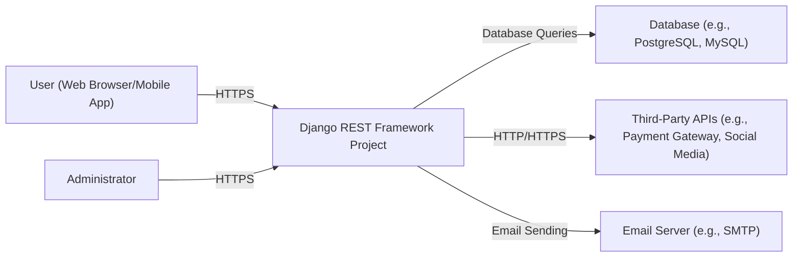
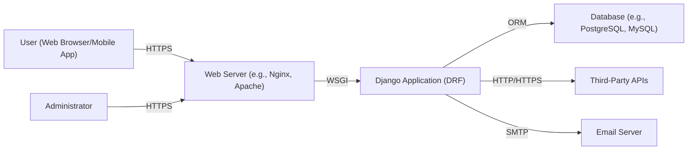
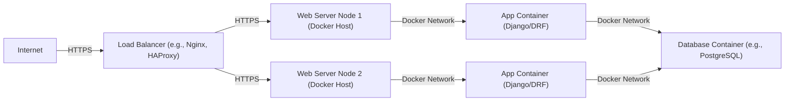
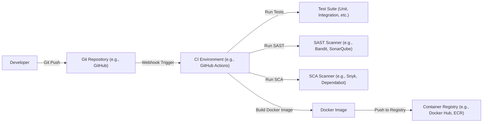

Okay, let's create a design document for the Django REST Framework (DRF) project, keeping in mind its purpose and potential security considerations.

# BUSINESS POSTURE

Business Priorities and Goals:

*   Enable rapid development of robust and scalable RESTful APIs using Python and Django.
*   Provide a flexible and customizable toolkit for building APIs that meet diverse needs.
*   Maintain a high level of quality, reliability, and security for the framework.
*   Foster a strong and active open-source community around the project.
*   Reduce development time and cost for API creation.
*   Provide clear and comprehensive documentation.

Most Important Business Risks:

*   Vulnerabilities in the framework could lead to widespread exploitation of APIs built using it.
*   Inadequate documentation or support could hinder adoption and usage.
*   Lack of compatibility with evolving web standards and technologies could limit its usefulness.
*   Competition from other API frameworks could reduce its market share.
*   Failure to address community feedback and contributions could lead to project stagnation.

# SECURITY POSTURE

Existing Security Controls:

*   security control: Authentication: Supports various authentication schemes, including Basic Auth, Session Auth, Token Auth, and OAuth2 (via third-party packages). Implemented in DRF documentation and code.
*   security control: Authorization: Provides permission classes to control access to API resources based on user roles and permissions. Implemented in DRF documentation and code.
*   security control: Throttling: Includes built-in mechanisms to limit API request rates, mitigating DoS attacks. Implemented in DRF documentation and code.
*   security control: Input Validation: Uses serializers to validate and sanitize data input, preventing common injection vulnerabilities. Implemented in DRF documentation and code.
*   security control: Output Encoding: Serializers handle data serialization, which can help prevent XSS vulnerabilities when configured correctly. Implemented in DRF documentation and code.
*   security control: CORS Handling: Supports Cross-Origin Resource Sharing (CORS) configuration to manage requests from different origins. Implemented in DRF documentation and code.
*   security control: Regular Security Audits: The project is likely subject to regular security audits and reviews by the community and maintainers, although this is not explicitly stated in the repository itself, it's a standard practice for mature open-source projects.
*   security control: Dependency Management: Uses tools like pip and requirements.txt to manage dependencies, allowing for vulnerability scanning. Implemented in project files.
*   security control: Secure by Default Settings: Encourages secure configurations and best practices in the documentation. Implemented in DRF documentation.

Accepted Risks:

*   accepted risk: Reliance on third-party packages for certain features (e.g., OAuth2) introduces potential risks if those packages have vulnerabilities.
*   accepted risk: Misconfiguration by developers using the framework can lead to security vulnerabilities in their applications.
*   accepted risk: Zero-day vulnerabilities in the framework or its dependencies may exist and could be exploited before patches are available.

Recommended Security Controls:

*   Implement a comprehensive security.txt file in the repository to provide clear instructions for reporting vulnerabilities.
*   Integrate automated security scanning tools (SAST, DAST, SCA) into the CI/CD pipeline.
*   Provide more explicit guidance and examples on secure coding practices within the documentation, particularly around handling sensitive data and preventing common web vulnerabilities.
*   Consider implementing a bug bounty program to incentivize security researchers to find and report vulnerabilities.

Security Requirements:

*   Authentication:
    *   Support for strong authentication mechanisms (e.g., multi-factor authentication).
    *   Secure storage of user credentials (e.g., hashing and salting passwords).
    *   Protection against brute-force attacks.
    *   Session management with secure cookies (HTTPOnly, Secure flags).

*   Authorization:
    *   Fine-grained access control based on user roles and permissions.
    *   Support for attribute-based access control (ABAC) or policy-based access control (PBAC).
    *   Regular review and auditing of permissions.

*   Input Validation:
    *   Strict validation of all input data using serializers.
    *   Whitelist-based validation wherever possible.
    *   Protection against common injection attacks (SQL injection, NoSQL injection, command injection).
    *   Handling of file uploads securely (e.g., virus scanning, file type validation).

*   Cryptography:
    *   Use of strong, industry-standard cryptographic algorithms.
    *   Secure key management practices.
    *   Protection of sensitive data in transit (HTTPS) and at rest (encryption).
    *   Avoidance of custom cryptographic implementations.

# DESIGN

## C4 CONTEXT

Element Descriptions:

*   Element:
    *   Name: User (Web Browser/Mobile App)
    *   Type: Person
    *   Description: A user interacting with the API through a web browser or mobile application.
    *   Responsibilities: Initiates requests to the API, views API responses.
    *   Security controls: Uses HTTPS for secure communication.

*   Element:
    *   Name: Django REST Framework Project
    *   Type: Software System
    *   Description: The core system built using the Django REST Framework.
    *   Responsibilities: Handles API requests, processes data, interacts with other systems.
    *   Security controls: Authentication, authorization, throttling, input validation, output encoding, CORS handling.

*   Element:
    *   Name: Database (e.g., PostgreSQL, MySQL)
    *   Type: Software System
    *   Description: The database used to store the application's data.
    *   Responsibilities: Stores and retrieves data.
    *   Security controls: Database access controls, encryption at rest, regular backups.

*   Element:
    *   Name: Third-Party APIs (e.g., Payment Gateway, Social Media)
    *   Type: Software System
    *   Description: External APIs that the project interacts with.
    *   Responsibilities: Provides specific functionalities (e.g., payment processing, social login).
    *   Security controls: API keys, OAuth2, secure communication (HTTPS).

*   Element:
    *   Name: Email Server (e.g., SMTP)
    *   Type: Software System
    *   Description: The server used for sending emails.
    *   Responsibilities: Sends transactional emails, notifications, etc.
    *   Security controls: Secure SMTP configuration, TLS encryption.

*   Element:
    *   Name: Administrator
    *   Type: Person
    *   Description: A user with administrative privileges.
    *   Responsibilities: Manages the application, configures settings, monitors performance.
    *   Security controls: Strong authentication, access controls.

## C4 CONTAINER

Element Descriptions:

*   Element:
    *   Name: User (Web Browser/Mobile App)
    *   Type: Person
    *   Description: A user interacting with the API.
    *   Responsibilities: Initiates requests, views responses.
    *   Security controls: Uses HTTPS.

*   Element:
    *   Name: Web Server (e.g., Nginx, Apache)
    *   Type: Container: Web Server
    *   Description: The web server that handles incoming requests.
    *   Responsibilities: Serves static content, reverse proxies requests to the Django application.
    *   Security controls: HTTPS configuration, request filtering, rate limiting.

*   Element:
    *   Name: Django Application (DRF)
    *   Type: Container: Python/Django
    *   Description: The core application built using Django and DRF.
    *   Responsibilities: Handles API logic, interacts with the database and other services.
    *   Security controls: Authentication, authorization, throttling, input validation, output encoding.

*   Element:
    *   Name: Database (e.g., PostgreSQL, MySQL)
    *   Type: Container: Database
    *   Description: The database server.
    *   Responsibilities: Stores and retrieves data.
    *   Security controls: Database access controls, encryption at rest, regular backups.

*   Element:
    *   Name: Third-Party APIs
    *   Type: Software System
    *   Description: External APIs.
    *   Responsibilities: Provides specific functionalities.
    *   Security controls: API keys, OAuth2, secure communication (HTTPS).

*   Element:
    *   Name: Email Server
    *   Type: Software System
    *   Description: The server for sending emails.
    *   Responsibilities: Sends emails.
    *   Security controls: Secure SMTP configuration, TLS encryption.

*   Element:
    *   Name: Administrator
    *   Type: Person
    *   Description: A user with administrative privileges.
    *   Responsibilities: Manages the application.
    *   Security controls: Strong authentication, access controls.

## DEPLOYMENT

Possible Deployment Solutions:

1.  Traditional Server Deployment (e.g., using a VPS with Nginx/Apache and Gunicorn/uWSGI).
2.  Containerized Deployment (e.g., using Docker and Docker Compose, or Kubernetes).
3.  Platform-as-a-Service (PaaS) Deployment (e.g., using Heroku, AWS Elastic Beanstalk, Google App Engine).
4.  Serverless Deployment (e.g., using AWS Lambda, Azure Functions, Google Cloud Functions).

Chosen Solution (for detailed description): Containerized Deployment using Docker and Docker Compose.

Element Descriptions:

*   Element:
    *   Name: Internet
    *   Type: External
    *   Description: The public internet.
    *   Responsibilities: Source of incoming requests.
    *   Security controls: N/A

*   Element:
    *   Name: Load Balancer (e.g., Nginx, HAProxy)
    *   Type: Infrastructure Node
    *   Description: Distributes incoming traffic across multiple web server nodes.
    *   Responsibilities: Load balancing, SSL termination.
    *   Security controls: HTTPS configuration, DDoS protection.

*   Element:
    *   Name: Web Server Node 1 (Docker Host)
    *   Type: Infrastructure Node
    *   Description: A server hosting Docker containers.
    *   Responsibilities: Runs the web server and application containers.
    *   Security controls: Firewall, SSH access control, regular security updates.

*   Element:
    *   Name: Web Server Node 2 (Docker Host)
    *   Type: Infrastructure Node
    *   Description: A server hosting Docker containers.
    *   Responsibilities: Runs the web server and application containers.
    *   Security controls: Firewall, SSH access control, regular security updates.

*   Element:
    *   Name: App Container 1 (Django/DRF)
    *   Type: Container Instance
    *   Description: A Docker container running the Django/DRF application.
    *   Responsibilities: Handles API requests.
    *   Security controls: Inherits security controls from the Django/DRF application.

*   Element:
    *   Name: App Container 2 (Django/DRF)
    *   Type: Container Instance
    *   Description: A Docker container running the Django/DRF application.
    *   Responsibilities: Handles API requests.
    *   Security controls: Inherits security controls from the Django/DRF application.

*   Element:
    *   Name: DB Container (e.g., PostgreSQL)
    *   Type: Container Instance
    *   Description: A Docker container running the database server.
    *   Responsibilities: Stores and retrieves data.
    *   Security controls: Database access controls, encryption at rest, regular backups.

## BUILD

Build Process Description:

1.  Developer commits and pushes code changes to a Git repository (e.g., GitHub).
2.  A webhook triggers the CI/CD pipeline in a CI environment (e.g., GitHub Actions, Jenkins).
3.  The CI environment runs a series of steps:
    *   Runs the test suite (unit tests, integration tests, etc.).
    *   Performs Static Application Security Testing (SAST) using a tool like Bandit or SonarQube.
    *   Performs Software Composition Analysis (SCA) using a tool like Snyk or Dependabot to identify vulnerabilities in dependencies.
    *   Builds a Docker image containing the application code and its dependencies.
    *   Pushes the Docker image to a container registry (e.g., Docker Hub, Amazon ECR).

Security Controls in Build Process:

*   Git Repository: Access controls, branch protection rules.
*   CI Environment: Secure configuration, limited access, audit logging.
*   Test Suite: Ensures code quality and helps prevent regressions.
*   SAST Scanner: Identifies potential security vulnerabilities in the application code.
*   SCA Scanner: Identifies vulnerabilities in third-party dependencies.
*   Container Registry: Access controls, image signing, vulnerability scanning.

# RISK ASSESSMENT

Critical Business Processes:

*   API request handling and processing.
*   Data storage and retrieval.
*   User authentication and authorization.
*   Integration with third-party services.

Data to Protect and Sensitivity:

*   User data (e.g., usernames, passwords, email addresses, personal information): High sensitivity.
*   API keys and secrets: High sensitivity.
*   Application data (depending on the specific application): Variable sensitivity, ranging from low to high.
*   Transaction data (if applicable): High sensitivity.
*   Session data: Medium sensitivity.

# QUESTIONS & ASSUMPTIONS

Questions:

*   Are there any specific compliance requirements (e.g., GDPR, HIPAA, PCI DSS) that the project needs to adhere to?
*   What is the expected scale of the API (number of users, requests per second)?
*   What are the specific third-party APIs that the project will integrate with?
*   What is the current process for handling security vulnerabilities reported by the community or discovered internally?
*   What level of logging and monitoring is currently in place?

Assumptions:

*   BUSINESS POSTURE: The project aims to be a general-purpose API framework and does not target any specific industry or compliance regime by default.
*   SECURITY POSTURE: Developers using the framework are responsible for implementing appropriate security measures in their applications. The framework provides the tools, but secure configuration is the responsibility of the user.
*   DESIGN: The deployment architecture can vary significantly depending on the specific needs of the project using DRF. The containerized deployment described above is a common and recommended approach, but other options are possible. The build process assumes a modern CI/CD pipeline with automated security checks, but this may not be the case for all projects using DRF.