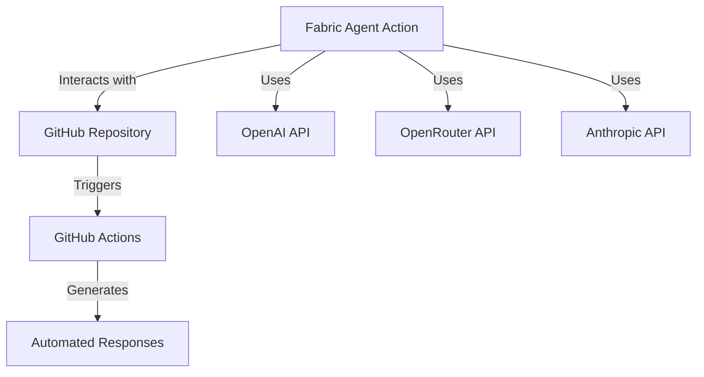
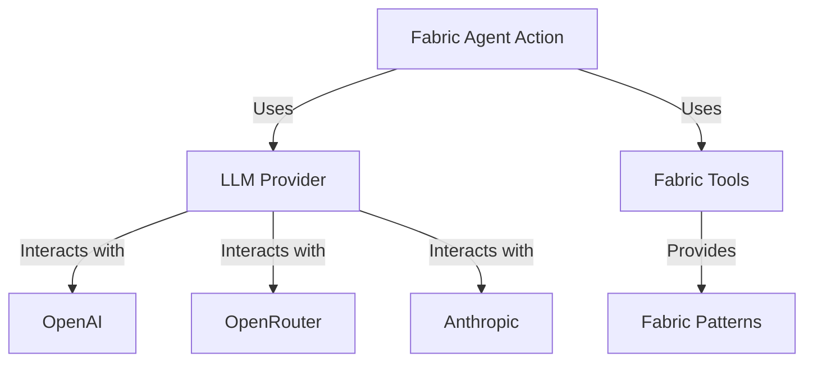
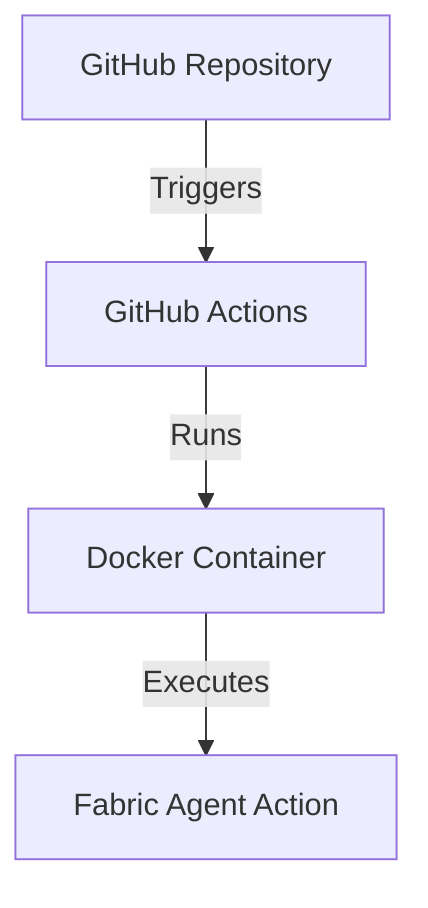
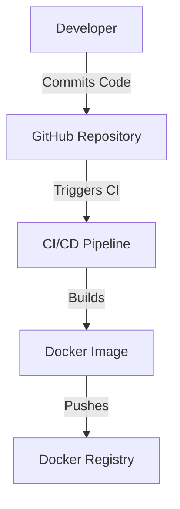

# Project Design Document for Fabric Agent Action

## BUSINESS POSTURE
The Fabric Agent Action project aims to automate complex workflows in GitHub using an agent-based approach that leverages Fabric Patterns and Large Language Models (LLMs). The primary business goals include:

- **Enhancing Workflow Efficiency**: Automating repetitive tasks in GitHub workflows to save time and reduce manual errors.
- **Improving Collaboration**: Providing tools that facilitate better communication and collaboration among team members through automated responses and insights.
- **Cost Management**: Implementing security controls to prevent unauthorized usage and manage API costs effectively.

### Business Risks
- **Unauthorized Access**: Risk of unauthorized users triggering workflows, leading to unexpected costs.
- **Operational Downtime**: Potential for system failures or bugs that could disrupt automated workflows.
- **Data Sensitivity**: Handling sensitive data in workflows without proper security measures could lead to data breaches.

## SECURITY POSTURE
### Existing Security Controls
- **Access Control Patterns**: Implemented conditions in workflows to restrict access based on user roles and repository ownership.
- **Environment Variables**: Use of secrets for API keys to prevent exposure in the codebase.

### Accepted Risks
- **Limited User Access**: While access is restricted, there is still a risk of misuse by authorized users.
- **Dependency on External APIs**: Reliance on third-party APIs for LLMs introduces risks related to availability and data handling.

### Recommended Security Controls
- **Rate Limiting**: Implement rate limiting on API calls to prevent abuse.
- **Audit Logging**: Maintain logs of all actions taken by the Fabric Agent Action for accountability and monitoring.
- **Input Validation**: Ensure all inputs to the action are validated to prevent injection attacks.

### Security Requirements
- **Authentication**: Use GitHub OAuth for user authentication.
- **Authorization**: Implement role-based access control to restrict actions based on user roles.
- **Input Validation**: Validate all inputs to prevent injection attacks.
- **Cryptography**: Use encryption for sensitive data in transit and at rest.

## DESIGN
### C4 CONTEXT

| Name                     | Type          | Description                                           | Responsibilities                                   | Security Controls                          |
|--------------------------|---------------|-------------------------------------------------------|---------------------------------------------------|--------------------------------------------|
| Fabric Agent Action      | System        | GitHub Action for automating workflows                | Execute Fabric Patterns using LLMs                | Access Control Patterns, Environment Variables |
| GitHub Repository        | External System| Repository where the action is deployed               | Store code, manage issues, and pull requests      | OAuth Authentication                       |
| OpenAI API               | External API  | API for accessing OpenAI's LLMs                       | Provide LLM capabilities for processing requests   | API Key Management                         |
| OpenRouter API           | External API  | API for accessing multiple LLMs                        | Provide alternative LLM capabilities               | API Key Management                         |
| Anthropic API            | External API  | API for accessing Anthropic's LLMs                    | Provide LLM capabilities for processing requests   | API Key Management                         |
| GitHub Actions           | External System| CI/CD tool for automating workflows                   | Trigger workflows based on repository events      | Access Control Patterns                    |
| Automated Responses       | Output        | Responses generated by the action                      | Provide insights and feedback to users             | Input Validation                           |

### C4 CONTAINER

| Name                     | Type          | Description                                           | Responsibilities                                   | Security Controls                          |
|--------------------------|---------------|-------------------------------------------------------|---------------------------------------------------|--------------------------------------------|
| Fabric Agent Action      | Container     | Main application container                             | Execute workflows and manage interactions          | Access Control Patterns, Environment Variables |
| LLM Provider             | Component     | Manages interactions with LLM APIs                    | Provide LLM instances based on configuration       | API Key Management                         |
| Fabric Tools             | Component     | Manages Fabric Patterns and their execution           | Read and invoke fabric patterns                    | Input Validation                           |
| OpenAI                   | External API  | API for accessing OpenAI's LLMs                       | Provide LLM capabilities for processing requests   | API Key Management                         |
| OpenRouter               | External API  | API for accessing multiple LLMs                        | Provide alternative LLM capabilities               | API Key Management                         |
| Anthropic                | External API  | API for accessing Anthropic's LLMs                    | Provide LLM capabilities for processing requests   | API Key Management                         |
| Fabric Patterns          | Data          | Collection of patterns used by the action              | Define workflows and processing logic              | Input Validation                           |

### DEPLOYMENT
The Fabric Agent Action is deployed as a GitHub Action within a GitHub repository. The deployment architecture includes:

- **GitHub Actions**: The action is triggered by events such as pull requests or issue comments.
- **Docker Container**: The action runs within a Docker container defined by the Dockerfile.

| Name                     | Type          | Description                                           | Responsibilities                                   | Security Controls                          |
|--------------------------|---------------|-------------------------------------------------------|---------------------------------------------------|--------------------------------------------|
| GitHub Repository        | External System| Repository where the action is deployed               | Store code, manage issues, and pull requests      | OAuth Authentication                       |
| GitHub Actions           | External System| CI/CD tool for automating workflows                   | Trigger workflows based on repository events      | Access Control Patterns                    |
| Docker Container          | Container     | Container running the Fabric Agent Action              | Execute the action in a controlled environment     | Image Security, Secrets Management         |
| Fabric Agent Action      | System        | GitHub Action for automating workflows                | Execute Fabric Patterns using LLMs                | Access Control Patterns, Environment Variables |

### BUILD
The project is built using Poetry for dependency management and Docker for containerization. The build process includes:

- **Dependency Installation**: All dependencies are installed using Poetry.
- **Docker Image Creation**: A Docker image is built using the Dockerfile, which includes the application code and dependencies.

| Name                     | Type          | Description                                           | Responsibilities                                   | Security Controls                          |
|--------------------------|---------------|-------------------------------------------------------|---------------------------------------------------|--------------------------------------------|
| Developer                | User          | Developer working on the project                      | Commit code and manage changes                    | Code Review, Access Control                |
| GitHub Repository        | External System| Repository where the action is deployed               | Store code, manage issues, and pull requests      | OAuth Authentication                       |
| CI/CD Pipeline           | System        | Continuous Integration/Continuous Deployment pipeline  | Build and test the application                     | Secrets Management                         |
| Docker Image             | Artifact      | Container image for the Fabric Agent Action           | Run the action in a controlled environment         | Image Security, Secrets Management         |
| Docker Registry          | External System| Registry for storing Docker images                     | Store and manage Docker images                     | Access Control                             |

## RISK ASSESSMENT
### Critical Business Processes
- **Workflow Automation**: The primary process that needs protection is the automation of workflows in GitHub, which directly impacts productivity and collaboration.

### Data Sensitivity
- **API Keys**: The project handles sensitive API keys for OpenAI, OpenRouter, and Anthropic, which must be protected to prevent unauthorized access.
- **User Inputs**: Inputs processed by the action may contain sensitive information, requiring careful handling and validation.

## QUESTIONS & ASSUMPTIONS
### Questions
1. What specific user roles will be allowed to trigger the action?
2. Are there any specific compliance requirements that need to be considered?
3. What is the expected volume of API calls, and how will rate limiting be managed?

### Assumptions
- The project will be deployed in a controlled environment with access restrictions.
- Users triggering the action will have appropriate permissions.
- The action will be regularly monitored for performance and security issues.