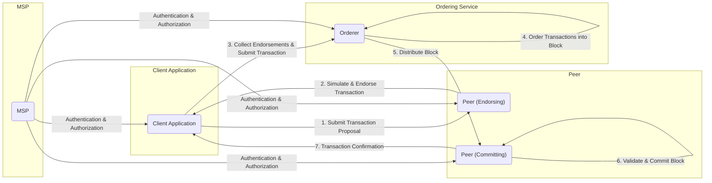

# Project Design Document: Hyperledger Fabric

**Version:** 1.1
**Date:** October 26, 2023
**Prepared By:** AI Software Architect

## 1. Introduction

This document provides a detailed design overview of the Hyperledger Fabric project, based on the information available in the provided GitHub repository (https://github.com/fabric/fabric). This document is intended to serve as a foundation for threat modeling activities, providing a comprehensive understanding of the system's architecture, components, and interactions.

### 1.1. Purpose

The primary purpose of this document is to:

*   Describe the architecture and key components of Hyperledger Fabric.
*   Outline the interactions and data flow within the system.
*   Identify potential areas of security concern for subsequent threat modeling.

### 1.2. Scope

This document covers the core architectural elements and functionalities of Hyperledger Fabric as understood from the public repository. It focuses on the logical and conceptual design rather than specific implementation details.

### 1.3. Target Audience

This document is intended for:

*   Security engineers responsible for threat modeling and security assessments.
*   Developers working with or building applications on Hyperledger Fabric.
*   System architects seeking a high-level understanding of the platform.

## 2. System Overview

Hyperledger Fabric is a modular blockchain platform designed for enterprise use. It provides a foundation for developing applications and solutions with a high degree of privacy, permissioning, and scalability. Key characteristics include:

*   Permissioned Network: Access and participation are controlled through a Membership Service Provider (MSP).
*   Channels: Private and confidential sub-networks for specific transaction sets.
*   Smart Contracts (Chaincode): Business logic executed on the network.
*   Pluggable Consensus: Supports various consensus mechanisms.
*   Modular Architecture: Allows for customization and extension of components.

## 3. Detailed Design

This section details the key components and their interactions within the Hyperledger Fabric architecture.

### 3.1. Key Components

*   **Peers:**
    *   Maintain a copy of the ledger.
    *   Execute chaincode (smart contracts).
    *   Endorse transactions based on policy.
    *   Validate transactions.
    *   **Security Consideration:** Peers are critical for maintaining ledger integrity and are potential targets for attacks aimed at disrupting consensus or manipulating data.
*   **Orderers:**
    *   Form the ordering service.
    *   Package endorsed transactions into blocks.
    *   Broadcast blocks to peers.
    *   Do not execute transactions.
    *   **Security Consideration:** The ordering service ensures transaction order and is a critical point for availability and potential denial-of-service attacks.
*   **Clients (Applications):**
    *   Submit transaction proposals to endorsing peers.
    *   Receive transaction confirmations.
    *   Interact with the network on behalf of users or systems.
    *   **Security Consideration:** Client applications are the entry point for user interactions and can be vulnerable to attacks if not properly secured (e.g., injection attacks, compromised credentials).
*   **Membership Service Provider (MSP):**
    *   Manages identities and permissions of network participants.
    *   Provides mechanisms for authentication and authorization.
    *   Defines roles and access control policies.
    *   **Security Consideration:** The MSP is fundamental for network security. Compromise of the MSP can lead to unauthorized access and control of the network.
*   **Ledger:**
    *   Consists of a blockchain (immutable, ordered records of blocks) and a state database (current value of assets).
    *   Maintained by peers.
    *   Channel-specific ledgers ensure data isolation.
    *   **Security Consideration:** The ledger stores all transaction history and current state. Protecting its integrity and confidentiality is paramount.
*   **Chaincode (Smart Contracts):**
    *   Executable code that defines the business logic and rules for interacting with the ledger.
    *   Deployed and executed on peers.
    *   Can be written in various programming languages (e.g., Go, Java, Node.js).
    *   **Security Consideration:** Chaincode vulnerabilities can lead to unauthorized access to data or manipulation of the ledger. Secure coding practices are essential.
*   **Channels:**
    *   Private and isolated communication pathways between specific sets of network members.
    *   Provide data confidentiality and transaction privacy.
    *   Each channel has its own ledger.
    *   **Security Consideration:** Channels provide privacy, but misconfiguration can lead to unintended data exposure.
*   **Certificate Authority (CA):**
    *   Issues digital certificates to network participants.
    *   Essential for identity management and secure communication.
    *   **Security Consideration:** The CA is a critical trust anchor. Compromise of the CA can undermine the entire network's security.

### 3.2. Data Flow and Interactions

The following diagram illustrates the typical transaction flow within Hyperledger Fabric:

**Detailed Steps of Transaction Flow:**

1. **Transaction Proposal:** A client application, authenticated by the MSP, submits a transaction proposal to one or more endorsing peers.
2. **Simulation and Endorsement:** Endorsing peers simulate the transaction against the current state of the ledger (without updating it) and, if the simulation is successful and the peer is authorized, digitally sign the proposal (endorsement).
3. **Collect Endorsements and Submit:** The client application collects the required number of endorsements based on the endorsement policy and submits the transaction and endorsements to the ordering service.
4. **Order Transactions:** The orderer receives transactions from multiple clients and orders them into a block. The ordering process is based on the configured consensus mechanism.
5. **Distribute Block:** The orderer distributes the newly formed block to all peers on the channel.
6. **Validate and Commit:** Committing peers validate the transactions within the block (ensuring endorsements are valid and there are no conflicts) and then commit the block to their local copy of the ledger, updating the state database.
7. **Transaction Confirmation:** The committing peers notify the client application about the successful (or failed) transaction commitment.

### 3.3. Network Topology

A typical Hyperledger Fabric network consists of:

*   One or more **organizations**, each with its own MSP.
*   **Peers** belonging to different organizations, participating in one or more channels.
*   An **ordering service**, which can be a single node (for development) or a cluster of nodes (for production).
*   **Client applications** connecting to peers to interact with the network.
*   Optionally, one or more **Certificate Authorities (CAs)** per organization.

## 4. Security Considerations

This section highlights key security aspects relevant for threat modeling.

*   **Identity and Access Management:**
    *   Reliance on the MSP for authentication and authorization.
    *   Importance of secure key management for identities.
    *   Potential vulnerabilities in the MSP implementation or configuration.
*   **Transaction Endorsement Policy:**
    *   Defines which peers must endorse a transaction for it to be valid.
    *   Misconfigured or weak endorsement policies can lead to security issues.
*   **Chaincode Security:**
    *   Vulnerabilities in chaincode logic can be exploited.
    *   Importance of secure coding practices and thorough testing.
    *   Potential for malicious chaincode to be deployed.
*   **Communication Security:**
    *   TLS is used for secure communication between components.
    *   Proper configuration and management of TLS certificates are crucial.
*   **Data Privacy and Confidentiality:**
    *   Channels provide data isolation, but access control within channels is important.
    *   Considerations for sensitive data stored on the ledger.
    *   Potential for information leakage if access controls are not properly implemented.
*   **Consensus Mechanism Security:**
    *   The security of the chosen consensus mechanism is critical for network integrity.
    *   Different consensus mechanisms have different security properties and vulnerabilities.
*   **Ordering Service Security:**
    *   The ordering service is a critical component and a potential target for attacks.
    *   Ensuring the integrity and availability of the ordering service is essential.
*   **Key Management:**
    *   Secure generation, storage, and rotation of cryptographic keys are vital.
    *   Compromised keys can lead to significant security breaches.
*   **Supply Chain Security:**
    *   Trustworthiness of the software components and dependencies used in the Fabric deployment.
*   **Physical Security:**
    *   Security of the infrastructure hosting the Fabric network components.

## 5. Deployment Architecture (Conceptual)

A typical production deployment of Hyperledger Fabric might involve:

*   Multiple organizations participating in the network.
*   Each organization hosting its own set of peers and potentially a CA.
*   A dedicated ordering service cluster, potentially managed by a consortium of organizations.
*   Load balancers to distribute traffic to peers.
*   Firewalls and network segmentation to isolate components.
*   Monitoring and logging systems for security and operational insights.

## 6. Assumptions and Constraints

*   This design document is based on the information available in the public GitHub repository. Specific implementation details might vary.
*   The focus is on the core Fabric architecture, and specific features or extensions might not be covered in detail.
*   It is assumed that the underlying infrastructure (operating systems, networking) is secured appropriately.

## 7. Future Considerations

*   Further detailed design documents for specific components (e.g., the ordering service, MSP implementation).
*   Integration with hardware security modules (HSMs) for enhanced key management.
*   Exploration of advanced privacy features like zero-knowledge proofs.
*   Formal verification of chaincode.

This document provides a comprehensive overview of the Hyperledger Fabric architecture, laying the groundwork for effective threat modeling. By understanding the components, interactions, and security considerations outlined here, security professionals can better identify potential vulnerabilities and develop appropriate mitigation strategies.
