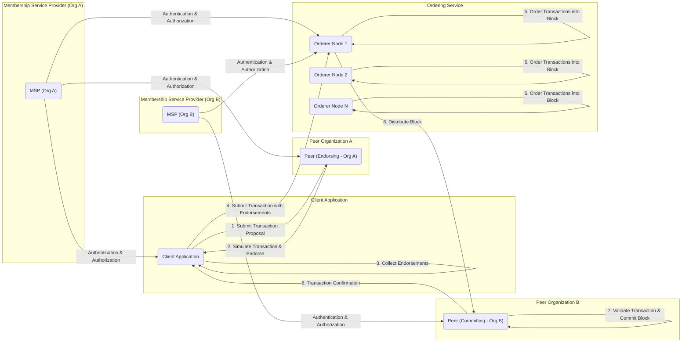

# Project Design Document: Hyperledger Fabric

**Version:** 1.1
**Date:** October 26, 2023
**Prepared By:** AI Software Architect

## 1. Introduction

This document provides an enhanced design overview of the Hyperledger Fabric project, based on the information available in the provided GitHub repository (https://github.com/fabric/fabric). This document is intended to serve as a robust foundation for threat modeling activities, offering a clear and detailed understanding of the system's architecture, components, and interactions.

### 1.1. Purpose

The primary purpose of this document is to:

*   Provide a clear and comprehensive description of the Hyperledger Fabric architecture and its core functionalities.
*   Detail the interactions and data flow between key components within the system.
*   Specifically highlight potential areas of security concern and attack surfaces for subsequent threat modeling exercises.

### 1.2. Scope

This document covers the fundamental architectural elements and functionalities of Hyperledger Fabric as understood from the public repository. It focuses on the logical and conceptual design, emphasizing aspects relevant to security analysis, rather than delving into specific implementation details or version-specific nuances.

### 1.3. Target Audience

This document is intended for a technical audience, including:

*   Security engineers responsible for conducting threat modeling, penetration testing, and security assessments.
*   Software developers building and deploying applications on the Hyperledger Fabric platform.
*   System architects and DevOps engineers involved in designing and managing Fabric networks.

## 2. System Overview

Hyperledger Fabric is a highly modular and permissioned blockchain platform designed for enterprise-grade solutions. Its architecture emphasizes privacy, scalability, and the ability to customize and extend its functionalities. Key characteristics include:

*   **Permissioned Network Model:**  Network participation and access to data are strictly controlled through a Membership Service Provider (MSP), ensuring only authorized entities can interact with the blockchain.
*   **Channel-Based Privacy:**  Channels provide private and confidential sub-networks, allowing specific sets of participants to engage in transactions without exposing them to the entire network.
*   **Smart Contracts (Chaincode) Execution:** Business logic is encapsulated in chaincode, which is executed in isolated environments on endorsing peers.
*   **Pluggable Consensus Mechanisms:**  The platform supports a variety of consensus algorithms, allowing for optimization based on specific use case requirements and trust assumptions.
*   **Modular and Extensible Architecture:**  Fabric's design allows for the replacement or customization of various components, such as the identity management system or the consensus protocol.

## 3. Detailed Design

This section provides a detailed breakdown of the key components within the Hyperledger Fabric architecture and elaborates on their interactions.

### 3.1. Key Components

*   **Peers:**
    *   **Core Function:** Maintain a copy of the channel ledger and execute chaincode.
    *   **Endorsing Peers:**  Specifically responsible for simulating and endorsing transactions based on predefined policies.
    *   **Committing Peers:** Validate transaction blocks and commit them to the ledger. All peers on a channel are committing peers.
    *   **Ledger Storage:**  Store the blockchain (transaction history) and the world state (current asset values).
*   **Orderers:**
    *   **Core Function:** Form the ordering service, responsible for the atomic broadcast of transactions.
    *   **Transaction Ordering:** Package endorsed transactions into blocks in a defined sequence.
    *   **Block Distribution:** Distribute these blocks to the peers on the channel.
    *   **No Transaction Execution:**  Orderers do not execute transactions or maintain the ledger state.
*   **Clients (Applications):**
    *   **Core Function:**  Interface with the Fabric network to invoke transactions and query the ledger.
    *   **Transaction Proposal Submission:** Submit transaction proposals to endorsing peers.
    *   **Endorsement Collection:** Gather endorsements from the required peers.
    *   **Transaction Submission to Orderer:** Submit endorsed transactions to the ordering service.
    *   **Transaction Result Reception:** Receive confirmation of transaction commitment from committing peers.
*   **Membership Service Provider (MSP):**
    *   **Core Function:** Manages identities and defines the rules that govern network participation.
    *   **Identity Management:** Provides mechanisms for authenticating and authorizing members.
    *   **Role Definition:** Defines roles and associated permissions within the network.
    *   **Certificate Management:**  Often integrated with Certificate Authorities (CAs) to manage digital certificates.
*   **Ledger:**
    *   **Core Function:**  The distributed and immutable record of all transactions within a channel.
    *   **Blockchain:**  A chain of blocks, where each block contains a batch of ordered transactions.
    *   **World State:** A database (e.g., LevelDB or CouchDB) that holds the current values of assets, derived from the transaction log in the blockchain.
    *   **Channel Specificity:** Each channel maintains its own independent ledger.
*   **Chaincode (Smart Contracts):**
    *   **Core Function:**  Executable code that defines the business logic and rules for interacting with the ledger's assets.
    *   **Transaction Logic:** Implements the functions for creating, transferring, and managing assets on the ledger.
    *   **Policy Enforcement:** Can enforce business rules and access control policies.
    *   **Language Support:** Can be written in languages like Go, Java, and Node.js.
*   **Channels:**
    *   **Core Function:** Provide private and isolated communication and transaction pathways for specific sets of network members.
    *   **Data Partitioning:** Ensure that transaction data and ledger state are only visible to authorized participants.
    *   **Confidentiality:** Enhance the privacy of transactions and data.
    *   **Independent Ledgers:** Each channel has its own separate ledger.
*   **Certificate Authority (CA):**
    *   **Core Function:** Issues digital certificates to network participants, enabling secure identification and authentication.
    *   **Identity Provisioning:**  Provides the cryptographic identities used by peers, orderers, and clients.
    *   **Certificate Revocation:**  Manages the revocation of compromised or expired certificates.

### 3.2. Data Flow and Interactions

The following diagram illustrates the detailed transaction flow within Hyperledger Fabric, highlighting the key interactions between components:

**Detailed Steps of Transaction Flow:**

1. **Transaction Proposal:** A client application, authenticated by its organization's MSP (`G` or `H`), constructs and submits a transaction proposal to selected endorsing peers (`B`). The selection of endorsing peers is based on the chaincode's endorsement policy.
2. **Simulation and Endorsement:** The endorsing peer (`B`) simulates the transaction against its local copy of the world state, without committing the changes. If the simulation is successful and the peer is authorized according to the chaincode's endorsement policy and the peer's local MSP, it digitally signs the proposed transaction (endorsement) and returns it to the client.
3. **Collect Endorsements:** The client application gathers the required number of endorsements from different endorsing peers, as specified by the endorsement policy.
4. **Submit Transaction with Endorsements:** The client application submits the transaction, along with the collected endorsements, to the ordering service (`D`, `E`, `F`).
5. **Order Transactions into Block:** The ordering service, which can consist of multiple orderer nodes, receives transactions from various clients. Based on the configured consensus mechanism, it orders these transactions into a block.
6. **Distribute Block:** The orderer nodes distribute the newly formed block to all peers on the channel, including committing peers like `C`.
7. **Validate Transaction and Commit Block:** Committing peers (`C`) validate the transactions within the received block. This involves verifying the endorsements against the endorsement policy and checking for read-write conflicts. If the validation is successful, the peer commits the block to its local copy of the ledger, updating both the blockchain and the world state.
8. **Transaction Confirmation:** The committing peers notify the client application about the successful (or failed) commitment of the transaction.

### 3.3. Network Topology

A typical Hyperledger Fabric network deployment involves:

*   **Multiple Organizations:** Each organization operates independently and manages its own resources, including peers and MSP.
*   **Peers per Organization:** Each organization contributes one or more peers to the network, participating in different channels.
*   **Ordering Service Consortium:** The ordering service is often managed by a separate consortium of organizations or a neutral entity.
*   **Client Applications:** Applications reside outside the peer and orderer nodes and connect to them to interact with the blockchain.
*   **Certificate Authorities (CAs):** Each organization typically operates its own CA to manage the identities of its members.

## 4. Security Considerations

This section details potential security considerations and attack surfaces within the Hyperledger Fabric architecture, crucial for effective threat modeling.

*   **Identity and Access Management (IAM) Vulnerabilities:**
    *   **Compromised Private Keys:**  Loss or theft of private keys associated with network identities can lead to unauthorized actions.
    *   **MSP Configuration Errors:** Misconfigured MSPs can grant excessive permissions or fail to properly restrict access.
    *   **Certificate Authority Compromise:** A compromised CA can issue fraudulent certificates, allowing unauthorized entities to join the network.
*   **Transaction Endorsement Policy Weaknesses:**
    *   **Insufficient Endorsers:**  Policies requiring too few endorsers can increase the risk of malicious transactions being committed.
    *   **Compromised Endorsing Peers:** If a sufficient number of endorsing peers are compromised, they could collude to endorse invalid transactions.
*   **Chaincode Security Risks:**
    *   **Logic Vulnerabilities:** Bugs or flaws in chaincode logic can be exploited to manipulate assets or disrupt operations.
    *   **Malicious Chaincode:**  Deployment of intentionally malicious chaincode can have severe consequences.
    *   **Data Validation Issues:**  Insufficient input validation in chaincode can lead to vulnerabilities.
*   **Communication Security Deficiencies:**
    *   **TLS Configuration Errors:** Improperly configured TLS can expose communication channels to eavesdropping or man-in-the-middle attacks.
    *   **Certificate Management Issues:** Expired or improperly managed certificates can disrupt communication.
*   **Data Privacy and Confidentiality Breaches:**
    *   **Channel Membership Issues:**  Unauthorized parties gaining access to a channel can view sensitive transaction data.
    *   **Data Leakage in Chaincode:**  Poorly designed chaincode might inadvertently expose sensitive information.
*   **Consensus Mechanism Attacks:**
    *   **Byzantine Fault Tolerance Limitations:** Understanding the limitations of the chosen consensus mechanism is crucial for assessing resilience against malicious actors.
    *   **Denial-of-Service Attacks on Orderers:** Disrupting the ordering service can halt transaction processing.
*   **Ordering Service Vulnerabilities:**
    *   **Compromised Orderer Nodes:**  Attackers gaining control of orderer nodes can disrupt the ordering process or manipulate transaction order.
    *   **Replay Attacks:**  Potential for replaying previously ordered transactions.
*   **Key Management Weaknesses:**
    *   **Insecure Key Storage:** Storing private keys in insecure locations increases the risk of compromise.
    *   **Lack of Key Rotation:** Failure to regularly rotate cryptographic keys can increase the impact of a key compromise.
*   **Supply Chain Attacks:**
    *   **Compromised Dependencies:**  Vulnerabilities in third-party libraries or components used by Fabric can be exploited.
*   **Physical Security of Infrastructure:**
    *   **Unauthorized Access to Servers:** Physical access to servers hosting Fabric components can lead to data breaches or system compromise.

## 5. Deployment Architecture (Conceptual)

A robust and secure deployment of Hyperledger Fabric typically involves:

*   **Segregated Network Zones:**  Utilizing firewalls and network segmentation to isolate different components (e.g., peers, orderers, CAs).
*   **Load Balancing:** Distributing client requests across multiple peers for improved performance and availability.
*   **High Availability (HA) for Critical Components:** Implementing redundancy for orderers and peers to ensure continuous operation.
*   **Secure Key Management Infrastructure:** Employing Hardware Security Modules (HSMs) or secure enclaves for storing and managing private keys.
*   **Comprehensive Monitoring and Logging:**  Implementing systems to monitor the health and security of the network and log relevant events for auditing and incident response.
*   **Regular Security Audits and Penetration Testing:**  Proactively identifying and addressing potential vulnerabilities.

## 6. Assumptions and Constraints

*   This design document is based on publicly available information and the general architecture of Hyperledger Fabric. Specific implementations and configurations may vary.
*   The document assumes a basic understanding of blockchain concepts and cryptographic principles.
*   The focus is on the core Fabric platform, and specific external integrations or custom extensions are not detailed.

## 7. Future Considerations

*   Detailed design specifications for specific components, such as the Raft ordering service or different MSP implementations.
*   Integration with advanced cryptographic techniques for enhanced privacy, such as zero-knowledge proofs or secure multi-party computation.
*   Formal verification of chaincode to ensure correctness and security.
*   Exploration of confidential computing technologies to further protect sensitive data during processing.

This enhanced design document provides a more detailed and security-focused overview of the Hyperledger Fabric architecture. It serves as a valuable resource for security professionals to conduct thorough threat modeling and for developers to build more secure decentralized applications on the platform.