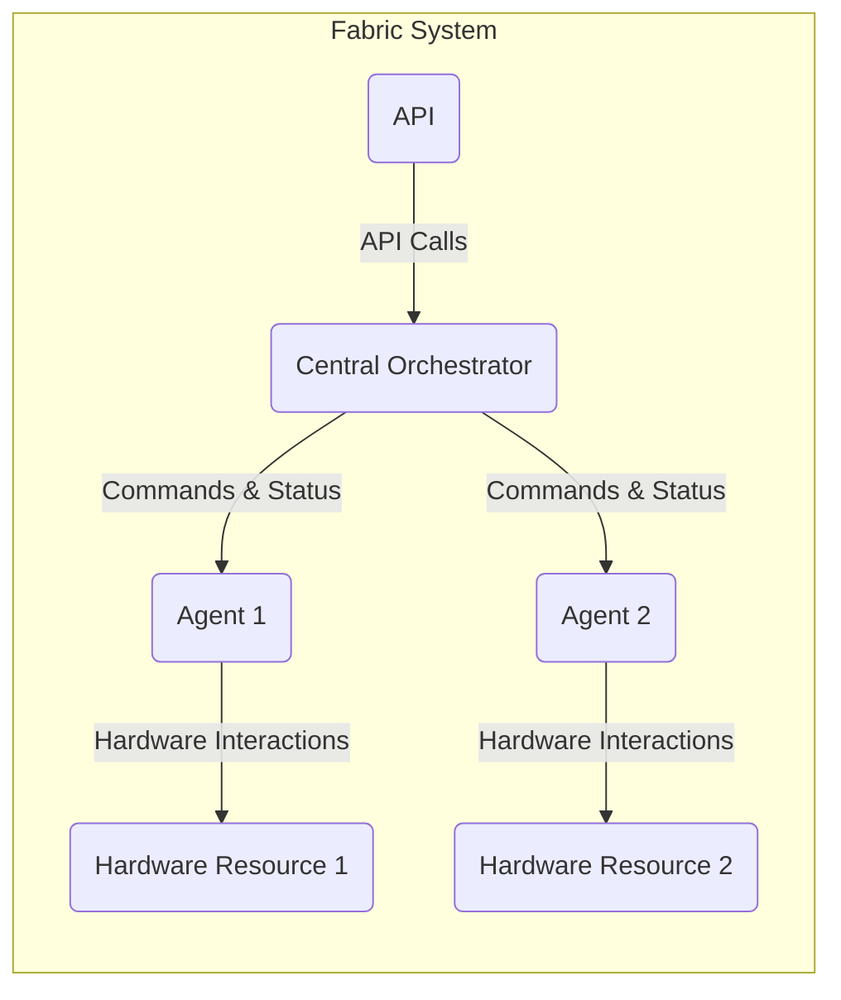
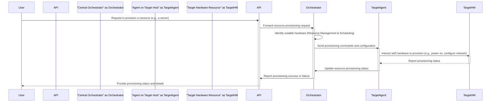

# Project Design Document: Fabric

**Version:** 1.1
**Date:** October 26, 2023
**Author:** Gemini (AI Language Model)

## 1. Introduction

This document provides an enhanced design overview of the Fabric project, an open-source initiative focused on enabling composable infrastructure. The information herein aims to deliver a more detailed and structured understanding of the system's architecture, components, and data flows. This document serves as a robust foundation for subsequent threat modeling exercises. The content is derived from the publicly available information within the project's GitHub repository: [https://github.com/fabric/fabric](https://github.com/fabric/fabric).

## 2. Goals and Objectives

The core goals of the Fabric project, as interpreted from the repository and its stated aims, are to:

*   **Enable Fine-Grained Programmable Infrastructure:** Empower users to precisely define and manage infrastructure through software-driven configurations and workflows.
*   **Provide a Robust Hardware Abstraction Layer:** Offer a standardized and consistent interface for interacting with a heterogeneous landscape of hardware resources, masking vendor-specific complexities.
*   **Support Dynamic and Composable Infrastructure:** Facilitate the on-demand assembly and management of hardware components into logical units, enabling flexible resource allocation.
*   **Establish a Centralized and Unified Management Plane:** Offer a single point of control and observability for managing distributed hardware resources, simplifying operational tasks.
*   **Foster Openness, Extensibility, and Community Engagement:** Encourage community contributions through a modular design and well-defined interfaces, allowing for the seamless integration of new hardware and software capabilities.

## 3. High-Level Architecture

The Fabric project employs a distributed architecture centered around a central orchestrator that coordinates activities across agents deployed on individual hardware resources.

*   **Central Orchestrator:** The pivotal component responsible for the overall management, coordination, and state maintenance of the entire infrastructure.
*   **Agents:** Lightweight, autonomous processes deployed on each managed hardware node, tasked with interacting directly with the local hardware and maintaining communication with the orchestrator.
*   **Hardware Resources:** The diverse range of physical or virtual hardware components under the management of Fabric, such as servers, network devices, storage arrays, and specialized accelerators.
*   **API (Application Programming Interface):** The programmatic gateway that allows users, external systems, and internal components to interact with the Fabric system, enabling automation and integration.

## 4. Component Design

This section provides a more in-depth look at the design and responsibilities of the major components within the Fabric system.

### 4.1. Central Orchestrator

*   **Purpose:** Serves as the brain of the Fabric system, providing a centralized control plane for managing and orchestrating the entire infrastructure lifecycle.
*   **Functionality:**
    *   **API Gateway & Request Handling:**  Acts as the primary entry point for all external interactions, receiving and processing API requests.
    *   **Resource Inventory and Management:** Maintains a real-time inventory of available hardware resources, tracking their status, capabilities, and allocation.
    *   **Task Scheduling and Dispatch:**  Distributes tasks, commands, and configuration updates to the appropriate agents based on defined policies and resource availability.
    *   **Infrastructure State Management:** Persistently stores the desired and current state of the infrastructure, ensuring consistency and enabling rollback capabilities.
    *   **Policy Definition and Enforcement:** Allows administrators to define and enforce policies related to resource allocation, access control, and operational constraints.
    *   **Monitoring, Logging, and Alerting:** Collects performance metrics, logs, and events from agents, providing insights into system health and enabling proactive alerting.
*   **Interfaces:**
    *   **External API:**  Likely a RESTful API over HTTPS for user and external system interaction, or a gRPC API for higher performance and code generation.
    *   **Agent Communication Interface:**  A robust and efficient protocol for bidirectional communication with agents, potentially leveraging gRPC or a similar RPC mechanism with built-in security features.
    *   **Persistent Data Store Interface:**  An interface for interacting with the underlying persistent storage mechanism (e.g., database connection pool).

### 4.2. Agents

*   **Purpose:** Function as the direct interface to the hardware, residing on individual hardware nodes to execute commands and report status to the orchestrator.
*   **Functionality:**
    *   **Direct Hardware Interaction:**  Communicates with the underlying hardware using specific protocols, APIs, system calls, or device drivers relevant to the hardware type.
    *   **Command Execution and Local Task Management:** Executes commands and tasks received from the orchestrator, managing local resource allocation and configuration.
    *   **Hardware Status Monitoring and Reporting:**  Periodically monitors the health, status, and performance of the local hardware and reports this information back to the orchestrator.
    *   **Resource Discovery and Advertisement:**  Potentially responsible for discovering locally available hardware resources and advertising their capabilities to the orchestrator.
    *   **Local Policy Enforcement:**  Enforces locally relevant policies and constraints as directed by the orchestrator.
*   **Interfaces:**
    *   **Orchestrator Communication Interface:**  Maintains a persistent connection with the central orchestrator for receiving commands and reporting status.
    *   **Hardware Abstraction Interface (Internal):**  An internal interface or set of modules responsible for interacting with the specific hardware on the node, potentially using plugins or drivers.

### 4.3. API

*   **Purpose:** Provides a well-defined and consistent programmatic interface for users and external systems to interact with the Fabric system's functionalities.
*   **Functionality:**
    *   **Resource Provisioning and Management:** Enables users to request, allocate, configure, and deallocate hardware resources.
    *   **Task Submission and Monitoring:**  Allows users to submit tasks for execution on managed hardware and monitor their progress and status.
    *   **Infrastructure State Querying and Observation:**  Provides mechanisms to query the current state of the infrastructure, including resource availability and configuration.
    *   **Policy Management and Definition:**  Offers endpoints for defining, updating, and managing policies related to resource usage and access control.
    *   **Authentication and Authorization:**  Implements security measures to verify the identity of users and systems and control their access to API functionalities.
*   **Implementation:**
    *   Likely implemented using a RESTful API architecture leveraging standard HTTP methods and JSON or YAML for data exchange. Alternatively, a gRPC API could be used for performance and efficiency.
    *   Employs standard authentication mechanisms like API keys, OAuth 2.0, or JWT for secure access.

### 4.4. Hardware Resources

*   **Purpose:** The fundamental building blocks of the infrastructure managed by Fabric, representing the physical or virtual hardware components.
*   **Examples:**
    *   Bare-metal servers
    *   Virtual machines (VMs)
    *   Network switches and routers
    *   Storage arrays and devices
    *   Graphics Processing Units (GPUs)
    *   Field-Programmable Gate Arrays (FPGAs)
*   **Interaction:**
    *   Indirectly managed through the Agents deployed on their respective nodes. The Agents translate orchestrator commands into hardware-specific actions.

## 5. Data Flow

A common data flow scenario involves a user requesting the provisioning of a specific hardware resource through the Fabric API.

**Detailed Steps in the Data Flow:**

1. **User Initiation:** A user interacts with the Fabric API, submitting a request to provision a specific hardware resource, such as a compute server with defined specifications.
2. **API Request Handling:** The API receives the provisioning request, performs authentication and authorization checks, and forwards the validated request to the Central Orchestrator.
3. **Orchestrator Resource Selection:** The Orchestrator analyzes the request and utilizes its Resource Management and Scheduling components to identify a suitable hardware resource that meets the requirements.
4. **Command Dispatch to Agent:** Once a target hardware resource is identified, the Orchestrator formulates specific provisioning commands and configuration details and sends them to the Agent residing on the target host.
5. **Agent Hardware Interaction:** The Agent receives the commands and interacts directly with the Target Hardware Resource to perform the provisioning actions. This interaction is hardware-specific and might involve actions like powering on the device, configuring network interfaces, or allocating storage.
6. **Hardware Status Update:** The Target Hardware Resource executes the provisioning commands and reports its status back to the Agent.
7. **Agent Status Reporting:** The Agent relays the provisioning status received from the hardware back to the Central Orchestrator.
8. **Orchestrator State Update:** The Orchestrator updates its internal state to reflect the current status of the provisioned hardware resource.
9. **API Response to User:** The Orchestrator informs the API about the success or failure of the provisioning request.
10. **User Notification:** The API sends a response back to the user, providing the provisioning status and any relevant details about the newly provisioned resource.

## 6. Security Considerations

A comprehensive threat model will require a deeper analysis, but initial security considerations based on the architecture include:

*   **Authentication and Authorization:**
    *   **API Security:** Securely authenticating and authorizing users and external systems accessing the API (e.g., using OAuth 2.0, API keys, mutual TLS).
    *   **Orchestrator-Agent Authentication:** Implementing strong mutual authentication between the Central Orchestrator and Agents to prevent unauthorized agents from joining the system or impersonating legitimate ones (e.g., using TLS client certificates).
    *   **Role-Based Access Control (RBAC):** Implementing granular RBAC to control access to resources and actions within the Fabric system based on user roles and permissions.
*   **Communication Security:**
    *   **Encrypted Communication Channels:** Ensuring all communication channels between components (API-Orchestrator, Orchestrator-Agent) are encrypted using TLS/SSL to protect confidentiality and integrity.
*   **Agent Security:**
    *   **Agent Integrity Verification:** Implementing mechanisms to verify the integrity and authenticity of Agents to prevent the deployment of malicious or tampered agents.
    *   **Secure Boot and Sandboxing:** Potentially leveraging secure boot mechanisms and sandboxing techniques to isolate Agents and limit the impact of potential compromises.
*   **Orchestrator Security:**
    *   **Secure Deployment and Configuration:** Hardening the Central Orchestrator's deployment environment and configuration to minimize attack surface.
    *   **Data Encryption at Rest and in Transit:** Encrypting sensitive data stored by the Orchestrator and during transmission.
*   **Data Security:**
    *   **Secure Storage of Credentials and Secrets:** Securely managing and storing sensitive information like API keys, database credentials, and hardware access credentials (e.g., using a secrets management service).
    *   **Data Validation and Sanitization:** Implementing robust input validation and sanitization to prevent injection attacks.
*   **Hardware Security:**
    *   **Secure Hardware Supply Chain:** Considering the security of the underlying hardware components and their supply chain.
    *   **Firmware Security:** Ensuring the firmware running on managed hardware is secure and up-to-date.
*   **Supply Chain Security:**
    *   **Dependency Management:** Carefully managing and auditing dependencies to mitigate risks associated with vulnerable third-party libraries.

## 7. Non-Functional Requirements

Beyond the functional aspects, the Fabric system should also consider the following non-functional requirements:

*   **Scalability:** The system should be able to scale horizontally to manage a large number of hardware resources and handle increasing API request loads.
*   **Performance:**  The system should provide low-latency communication and efficient resource management to ensure timely provisioning and operation.
*   **Reliability and Availability:** The system should be designed for high availability with fault tolerance mechanisms to minimize downtime in case of component failures.
*   **Maintainability:** The codebase should be well-structured, documented, and tested to facilitate maintenance and future development.
*   **Observability:** The system should provide comprehensive monitoring, logging, and tracing capabilities to enable effective troubleshooting and performance analysis.
*   **Extensibility:** The architecture should be modular and extensible to allow for the easy integration of new hardware types, features, and functionalities.

## 8. Deployment Model

The Fabric system is designed for flexible deployment across various infrastructure environments:

*   **On-Premise Data Centers:** Deployment of the Orchestrator and Agents on physical servers within an organization's private data center infrastructure.
*   **Cloud Environments (Public or Private):** Deployment of components within cloud provider infrastructure (e.g., AWS, Azure, GCP) or a private cloud setup.
*   **Hybrid Environments:**  A combined deployment model utilizing both on-premise and cloud resources, with Fabric managing resources across both environments.

Typical deployment steps involve:

*   **Orchestrator Deployment:** Setting up the Central Orchestrator component, potentially on a cluster of servers for high availability, using containerization technologies like Docker and orchestration platforms like Kubernetes.
*   **Agent Deployment:** Deploying Agents on each individual hardware node that will be managed by Fabric. This might involve automated deployment scripts or integration with configuration management tools.
*   **Network Configuration:** Configuring network connectivity to ensure secure communication between the Orchestrator and Agents, as well as for external API access, potentially involving firewalls, VPNs, or other network security measures.
*   **Security Configuration:** Implementing security best practices, including configuring authentication mechanisms, enabling encryption, and setting up access controls.

## 9. Technology Stack (Inferred and Potential)

Based on common practices and the project's nature, the following technologies are likely or potentially involved:

*   **Programming Languages:**
    *   **Python:** Highly probable for the Orchestrator and Agents due to its widespread use in infrastructure automation and the project's ecosystem.
    *   **Go:**  A strong candidate for performance-critical components or Agents due to its efficiency and concurrency features.
*   **Communication Protocols:**
    *   **gRPC:**  Likely for high-performance inter-service communication between the Orchestrator and Agents, offering features like bidirectional streaming and code generation.
    *   **HTTP/HTTPS:**  Standard for the external API, providing broad compatibility and ease of use.
*   **Data Storage:**
    *   **Relational Database (e.g., PostgreSQL, MySQL):**  Suitable for storing structured data like resource inventory, user information, and system state.
    *   **NoSQL Database (e.g., Cassandra, MongoDB):**  Potentially used for storing large volumes of unstructured data like logs and metrics.
*   **Message Broker (Optional):**
    *   **Kafka or RabbitMQ:**  Could be used for asynchronous communication, event handling, and decoupling components.
*   **Containerization and Orchestration:**
    *   **Docker:**  Essential for packaging and distributing components in containers.
    *   **Kubernetes:**  A likely choice for orchestrating the deployment, scaling, and management of Fabric components, especially the Orchestrator.
*   **Configuration Management:**
    *   **Ansible, Chef, or Puppet:** Potentially used for automating the deployment and configuration of Agents on hardware nodes.
*   **Monitoring and Logging:**
    *   **Prometheus and Grafana:**  Commonly used for collecting and visualizing metrics.
    *   **ELK Stack (Elasticsearch, Logstash, Kibana) or similar:** For centralized logging and analysis.

## 10. Future Considerations

Potential areas for future development and enhancement include:

*   **Expanded Hardware Ecosystem Support:** Continuously adding support for a wider range of hardware types and vendors through a plugin-based architecture.
*   **Advanced Resource Scheduling and Optimization:** Implementing more sophisticated algorithms for resource allocation, workload placement, and power management.
*   **Enhanced Fault Tolerance and Resilience:**  Further improving the system's ability to handle failures and maintain availability through techniques like distributed consensus and automated failover.
*   **Integration with Infrastructure-as-Code (IaC) Tools:**  Developing integrations with popular IaC tools like Terraform and CloudFormation to streamline infrastructure provisioning workflows.
*   **Advanced Security Features:**  Continuously enhancing security features based on ongoing threat modeling and security best practices, such as integration with security information and event management (SIEM) systems.

This improved design document provides a more detailed and structured overview of the Fabric project, offering a stronger foundation for subsequent threat modeling activities. The enhanced descriptions of components, data flows, security considerations, and the inclusion of non-functional requirements contribute to a more comprehensive understanding of the system.