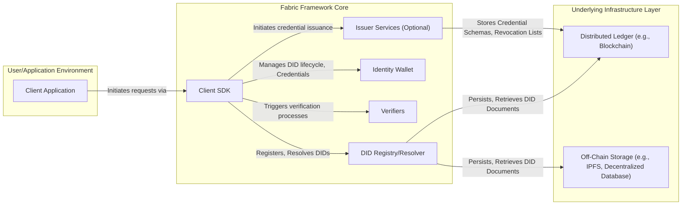
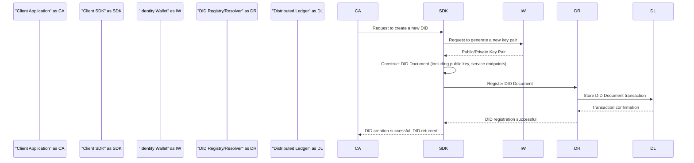
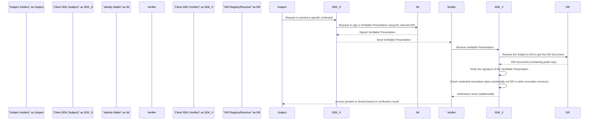

# Project Design Document: Fabric Decentralized Identity Framework

**Version:** 1.1
**Date:** October 26, 2023
**Prepared By:** AI Software Architect

## 1. Introduction

This document provides an enhanced design overview of the Fabric decentralized identity framework (as represented by the GitHub repository: [https://github.com/fabric/fabric](https://github.com/fabric/fabric)). Building upon the initial design, this version offers more granular details about the system's architecture, component interactions, and data flows. This enhanced documentation will serve as a more robust foundation for subsequent threat modeling activities.

## 2. Goals and Objectives

The primary goals of the Fabric project remain:

*   To provide a framework for the creation and management of decentralized identities (DIDs).
*   To enable secure and verifiable interactions leveraging DIDs.
*   To offer a flexible and extensible platform for constructing decentralized identity solutions.
*   To support a variety of DID methods and underlying ledger technologies.

This design document aims to:

*   Present a clear and detailed articulation of the system's architecture and its constituent components.
*   Elaborate on the interactions and dependencies between different parts of the system.
*   Thoroughly identify key data flows, transformations, and storage mechanisms.
*   Provide a level of detail sufficient for comprehensive and effective threat modeling.

## 3. High-Level Architecture

The Fabric framework comprises the following core components, working in concert:

*   **Client SDK:**  The primary interface for applications and users to interact with the Fabric framework's functionalities.
*   **DID Registry/Resolver:** The central component responsible for the persistence and retrieval of DID documents. This component interfaces with underlying storage mechanisms.
*   **Identity Wallet:** A secure, localized storage mechanism for managing sensitive information associated with DIDs, such as private keys.
*   **Verifiers:**  Specialized components dedicated to the validation of cryptographic proofs and signatures related to DIDs and verifiable credentials.
*   **Issuer Services (Optional):**  Components that facilitate the creation and issuance of verifiable credentials.

## 4. Detailed Component Descriptions

### 4.1. Client SDK

*   **Functionality:** Serves as the programmatic gateway for interacting with the Fabric framework.
*   **Responsibilities:**
    *   Orchestration of DID creation, update, and deactivation processes.
    *   Facilitation of Verifiable Credential issuance, presentation, and verification workflows.
    *   Abstraction of interactions with the DID Registry/Resolver, simplifying DID resolution.
    *   Management of the local Identity Wallet or interaction with external wallet providers.
    *   Execution of cryptographic operations, including signing and verification, on behalf of the user or application.
*   **Key Features:**
    *   Provides a consistent API across different DID methods and underlying ledger implementations.
    *   Offers multi-language support to cater to diverse development needs.
    *   Integrates with secure key management solutions and protocols.

### 4.2. DID Registry/Resolver

*   **Functionality:** Acts as the authoritative source for DID documents, enabling the resolution of DIDs to their associated metadata.
*   **Responsibilities:**
    *   Persistent storage of DID documents, ensuring their availability and integrity.
    *   Efficient resolution of DIDs to their corresponding DID documents based on the requested DID method.
    *   Management of DID document updates and revocation status, reflecting changes in identity information.
*   **Key Features:**
    *   Supports integration with various underlying storage mechanisms, allowing for flexibility in deployment.
    *   Implements logic specific to different DID methods, adhering to their respective specifications.
    *   Employs mechanisms to guarantee data consistency, availability, and tamper-evidence.

### 4.3. Identity Wallet

*   **Functionality:** Provides a secure and controlled environment for managing sensitive identity-related information.
*   **Responsibilities:**
    *   Secure generation and storage of private keys associated with DIDs.
    *   Management of multiple DIDs belonging to a single user or entity.
    *   Storage and management of Verifiable Credentials received or issued by the identity owner.
    *   Secure execution of signing operations using the stored private keys, requiring user consent.
*   **Key Features:**
    *   Employs encryption techniques to protect sensitive data at rest and in transit.
    *   Implements user authentication and authorization mechanisms to control access to the wallet's contents.
    *   May integrate with hardware security modules (HSMs) or secure enclaves for enhanced key protection.

### 4.4. Verifiers

*   **Functionality:**  Dedicated to the task of validating the authenticity and integrity of cryptographic proofs and signatures.
*   **Responsibilities:**
    *   Verification of the cryptographic signatures associated with Verifiable Presentations.
    *   Checking the revocation status of Verifiable Credentials to ensure they are still valid.
    *   Enforcement of predefined policies and rules related to credential verification, such as issuer trust and validity periods.
*   **Key Features:**
    *   Supports a range of cryptographic algorithms and signature schemes used in DIDs and Verifiable Credentials.
    *   Interacts with the DID Registry/Resolver to retrieve the public keys necessary for verification.

### 4.5. Issuer Services (Optional)

*   **Functionality:** Provides the necessary tools and processes for issuing Verifiable Credentials to subjects.
*   **Responsibilities:**
    *   Creation and signing of Verifiable Credentials based on provided attributes and schemas.
    *   Management of credential schemas, defining the structure and semantics of credentials.
    *   Management of revocation lists or mechanisms for invalidating issued credentials.
    *   Potential interaction with the DID Registry/Resolver to publish credential metadata or issuer information.
*   **Key Features:**
    *   Supports various Verifiable Credential formats and standards.
    *   Enforces policies and access controls related to credential issuance.

## 5. Data Flow Diagrams

### 5.1. Detailed DID Creation Process

### 5.2. Detailed Verifiable Credential Presentation and Verification

## 6. Key Technologies

The Fabric framework is likely to employ a combination of the following technologies:

*   **Core Programming Languages:** Go (for backend services and potentially parts of the SDK), JavaScript/TypeScript (for SDK components and web-based tools).
*   **Cryptographic Libraries:**  Libsodium, Tink, or similar libraries providing robust cryptographic primitives for signing, encryption, and hashing.
*   **Distributed Ledger Technologies:**  Hyperledger Fabric (given the project name), Ethereum, Corda, or other permissioned or public blockchains for anchoring DIDs and potentially credential schemas.
*   **Off-Chain Storage Solutions:** IPFS, Filecoin, or decentralized databases for storing DID documents and other potentially large or frequently accessed data.
*   **Database Technologies:** Relational databases (e.g., PostgreSQL) or NoSQL databases (e.g., MongoDB) for managing internal state, user metadata, and temporary data.
*   **Communication Protocols:**  HTTPS for secure communication between components, potentially gRPC for internal microservices communication.

## 7. Deployment Architecture

The deployment of the Fabric framework can be tailored to specific needs, with common architectures including:

*   **Cloud-Native Deployment:** Utilizing containerization (Docker) and orchestration (Kubernetes) on cloud platforms (AWS, Azure, GCP) for scalability and resilience.
*   **On-Premise Infrastructure:** Deployment on the organization's own servers and data centers, offering greater control over the environment.
*   **Hybrid Cloud Model:** Combining cloud-based and on-premise components, leveraging the strengths of both approaches.

The DID Registry/Resolver component's deployment is often tightly integrated with the chosen distributed ledger infrastructure. Client SDKs are typically distributed as libraries or packages for integration into various applications. Identity Wallets can be implemented as native mobile applications, browser extensions, or secure desktop applications.

## 8. Security Considerations (Enhanced)

This section expands on the initial security considerations, providing more specific examples:

*   **Key Management Vulnerabilities:**
    *   Risks associated with insecure key generation, storage in plaintext, or weak key derivation functions within the Identity Wallet.
    *   Potential for private key compromise leading to identity theft and unauthorized actions.
*   **DID Document Manipulation:**
    *   Threats related to unauthorized modification or deletion of DID documents in the registry, potentially leading to identity resolution failures or redirection.
    *   Importance of access controls and integrity checks for the DID Registry/Resolver.
*   **Verifiable Credential Forgery and Revocation Issues:**
    *   Risks of forged or tampered Verifiable Credentials being accepted by Verifiers.
    *   Importance of robust revocation mechanisms and timely updates to revocation lists.
*   **Privacy Leaks:**
    *   Potential for unintended disclosure of personal information contained within DID documents or Verifiable Credentials.
    *   Need for careful consideration of data minimization and selective disclosure techniques.
*   **Communication Channel Security:**
    *   Vulnerabilities arising from unencrypted communication between components, potentially exposing sensitive data in transit.
    *   Mandatory use of TLS/SSL for all network communication.
*   **Denial of Service Attacks:**
    *   Susceptibility of the DID Registry/Resolver and other components to resource exhaustion attacks.
    *   Implementation of rate limiting and other mitigation strategies.
*   **Smart Contract Exploits (if applicable):**
    *   Security vulnerabilities in smart contracts used for DID registration or resolution, potentially leading to unauthorized modifications or fund losses.
    *   Importance of rigorous smart contract auditing and formal verification.
*   **Wallet Security Breaches:**
    *   Risks associated with vulnerabilities in the Identity Wallet application itself, potentially allowing attackers to access private keys or credentials.
    *   Regular security audits and secure development practices for wallet implementations.

## 9. Assumptions and Constraints

*   This design document assumes a foundational understanding of decentralized identity principles and the W3C DID specification.
*   The security of the underlying distributed ledger is assumed to provide a baseline level of immutability and tamper-resistance for anchored DIDs.
*   The effectiveness of the security measures relies on the correct and secure implementation of cryptographic primitives and adherence to best practices in key management.
*   The specific implementation details and technology choices may vary based on the actual Fabric project implementation.

## 10. Future Considerations

*   **Enhanced Interoperability:**  Continued focus on achieving seamless interoperability with other DID methods, identity frameworks, and verifiable credential ecosystems.
*   **Scalability and Performance Optimization:**  Ongoing efforts to improve the system's ability to handle a growing number of DIDs, transactions, and users while maintaining optimal performance.
*   **Formal Verification and Security Audits:**  Regular independent security audits and formal verification of critical components to identify and address potential vulnerabilities.
*   **Compliance and Regulatory Alignment:**  Proactive adaptation to evolving regulatory requirements and compliance standards related to digital identity and data privacy.
*   **Advanced Features:** Exploration and integration of advanced features such as selective disclosure, zero-knowledge proofs, and decentralized authorization mechanisms.

This enhanced design document provides a more detailed and nuanced understanding of the Fabric decentralized identity framework. The added granularity in component descriptions, data flows, and security considerations will significantly benefit the subsequent threat modeling process, enabling a more thorough and effective security analysis.