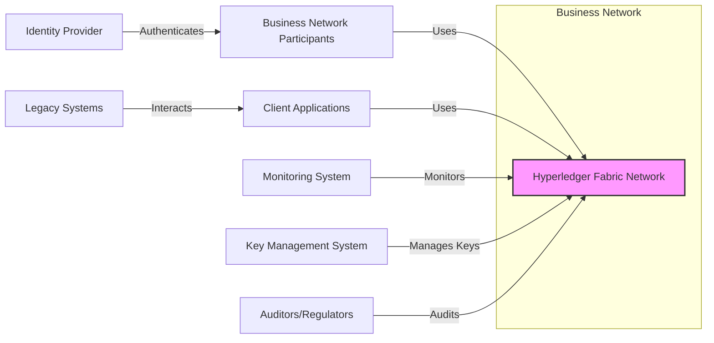
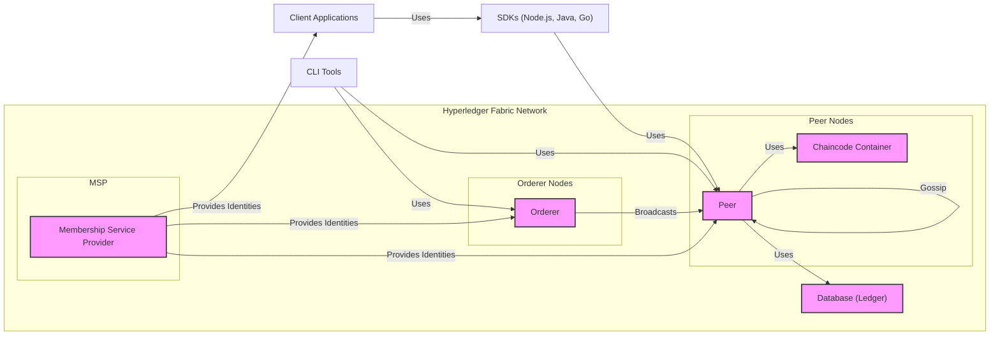
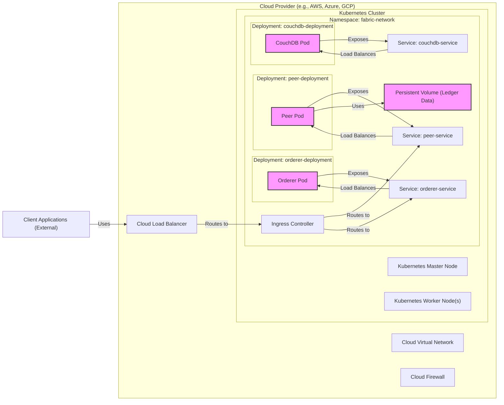
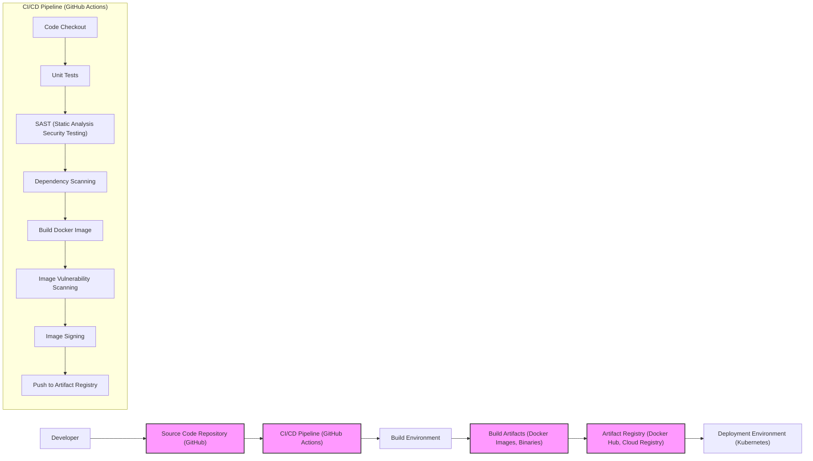

# BUSINESS POSTURE

This project, Hyperledger Fabric, aims to provide a modular and versatile platform for developing and operating enterprise-grade blockchain networks. It is designed to support a wide range of industry use cases requiring high levels of security, scalability, confidentiality, and resilience.

Business priorities and goals for Hyperledger Fabric include:

- Enabling secure and transparent transactions between business partners.
- Streamlining business processes and reducing operational costs through automation and decentralization.
- Enhancing data provenance and auditability for regulatory compliance and trust.
- Providing a flexible and extensible platform that can adapt to evolving business needs and technological advancements.
- Fostering a vibrant ecosystem of developers, solution providers, and users around the platform.

Most important business risks that need to be addressed:

- Security vulnerabilities in the platform or in deployed applications (chaincode) could lead to data breaches, financial losses, and reputational damage.
- Performance and scalability limitations could hinder adoption and limit the platform's ability to handle growing transaction volumes.
- Lack of interoperability with other blockchain platforms or legacy systems could create silos and limit the network effect.
- Governance and regulatory uncertainty surrounding blockchain technology could impact adoption and legal compliance.
- Complexity of development and deployment could increase costs and slow down time-to-market for solutions built on the platform.

# SECURITY POSTURE

Existing security controls for the Hyperledger Fabric project:

- security control: Access Control Lists (ACLs) to manage permissions for resources and operations within the network. Implemented in Fabric components and policies.
- security control: Membership Service Provider (MSP) for identity management and authentication of network participants. Implemented as a core Fabric component.
- security control: Channel architecture for data partitioning and privacy, allowing for confidential transactions within specific groups of participants. Implemented as a core Fabric component.
- security control: Cryptographic protocols for secure communication, data encryption, and digital signatures. Implemented throughout Fabric components using TLS, PKI, and cryptographic libraries.
- security control: Peer and Orderer node authorization to control access to network resources and functionalities. Implemented in Fabric components configuration and policies.
- security control: Secure chaincode lifecycle management including endorsement policies and access control. Implemented as part of Fabric chaincode management.
- security control: Vulnerability scanning and security testing as part of the development process. Described in Hyperledger Fabric documentation and development guidelines.
- security control: Supply chain security measures for dependencies and build process. Described in Hyperledger Fabric documentation and development guidelines.

Accepted risks for the Hyperledger Fabric project:

- accepted risk: Complexity of security configuration and management, potentially leading to misconfigurations and vulnerabilities if not properly handled by operators.
- accepted risk: Dependence on the security of underlying infrastructure (operating systems, hardware, cloud providers).
- accepted risk: Potential vulnerabilities in third-party chaincode developed and deployed by network participants.
- accepted risk: Evolving threat landscape and emergence of new attack vectors targeting blockchain platforms.

Recommended security controls to implement:

- security control: Automated security scanning and vulnerability management pipeline integrated into the CI/CD process.
- security control: Regular security audits and penetration testing by independent security experts.
- security control: Security Information and Event Management (SIEM) system for monitoring and alerting on security events within the network.
- security control: Incident Response plan and procedures specifically tailored for Hyperledger Fabric deployments.
- security control: Key Management System (KMS) integration for secure storage and management of cryptographic keys.

Security requirements for Hyperledger Fabric project:

- Authentication:
    - Requirement: All network participants (peers, orderers, clients, administrators) must be strongly authenticated.
    - Requirement: Mutual TLS should be enforced for all communication channels between Fabric components.
    - Requirement: Support for various authentication mechanisms, including digital certificates and potentially integration with external Identity Providers.

- Authorization:
    - Requirement: Fine-grained authorization controls must be in place to manage access to network resources and operations.
    - Requirement: Policy-based authorization should be used to define and enforce access control rules.
    - Requirement: Role-Based Access Control (RBAC) should be implemented for managing user and application permissions.

- Input Validation:
    - Requirement: All inputs to chaincode and Fabric APIs must be thoroughly validated to prevent injection attacks and other input-related vulnerabilities.
    - Requirement: Data validation should be performed at multiple layers, including client-side and server-side.
    - Requirement: Input validation rules should be clearly defined and consistently enforced.

- Cryptography:
    - Requirement: Strong cryptographic algorithms and protocols must be used for all security-sensitive operations, including encryption, digital signatures, and hashing.
    - Requirement: Cryptographic keys must be securely generated, stored, and managed throughout their lifecycle.
    - Requirement: Compliance with relevant cryptographic standards and best practices.

# DESIGN

## C4 CONTEXT

### C4 Context Elements Description

- list:
    - list:
        - Name: Business Network Participants
        - Type: Person
        - Description: Organizations or individuals participating in the business network, transacting and sharing data on the Hyperledger Fabric network.
        - Responsibilities: Initiating transactions, querying ledger data, managing their organizational identities, and participating in network governance.
        - Security controls: Authentication via MSP, authorization policies enforced by the network, secure key management for signing transactions.
    - list:
        - Name: Client Applications
        - Type: Software System
        - Description: Applications developed by business network participants or third-party providers to interact with the Hyperledger Fabric network. These applications submit transactions, query data, and manage user interfaces.
        - Responsibilities: Interacting with the Fabric network on behalf of users, implementing business logic, and presenting data to users.
        - Security controls: Authentication and authorization to interact with the Fabric network, input validation for user inputs, secure communication with Fabric components, secure storage of application secrets.
    - list:
        - Name: Hyperledger Fabric Network
        - Type: Software System
        - Description: The core Hyperledger Fabric platform providing distributed ledger, smart contract (chaincode) execution, and consensus services for the business network.
        - Responsibilities: Maintaining the distributed ledger, executing chaincode, ordering transactions, enforcing policies, managing network membership, and providing APIs for interaction.
        - Security controls: MSP for identity management, channel architecture for data privacy, ACLs and policies for authorization, cryptographic protocols for secure communication and data integrity, consensus mechanisms for fault tolerance and security.
    - list:
        - Name: Monitoring System
        - Type: Software System
        - Description: External system used to monitor the health, performance, and security of the Hyperledger Fabric network components.
        - Responsibilities: Collecting logs and metrics from Fabric components, detecting anomalies and security events, providing alerts and dashboards for network operators.
        - Security controls: Secure access to monitoring data, secure communication channels for data collection, role-based access control for monitoring dashboards.
    - list:
        - Name: Key Management System
        - Type: Software System
        - Description: External system for securely managing cryptographic keys used by Fabric components and network participants.
        - Responsibilities: Generating, storing, distributing, and rotating cryptographic keys, enforcing key access policies, and providing audit trails for key operations.
        - Security controls: Access control to key management operations, encryption of keys at rest and in transit, secure key generation and distribution processes, compliance with key management standards.
    - list:
        - Name: Identity Provider
        - Type: Software System
        - Description: External system used to manage and verify the identities of business network participants. Can be integrated with MSP for user authentication.
        - Responsibilities: User authentication, identity verification, providing identity attributes for authorization decisions.
        - Security controls: Secure authentication mechanisms (e.g., multi-factor authentication), secure storage of user credentials, compliance with identity management standards.
    - list:
        - Name: Auditors/Regulators
        - Type: Person
        - Description: External parties who need to audit the transactions and data on the Hyperledger Fabric network for compliance and regulatory purposes.
        - Responsibilities: Reviewing transaction history, verifying data integrity, assessing compliance with policies and regulations.
        - Security controls: Read-only access to audit logs and ledger data, access control policies to restrict audit access, secure audit trails.
    - list:
        - Name: Legacy Systems
        - Type: Software System
        - Description: Existing enterprise systems within business network participants' organizations that need to integrate with the Hyperledger Fabric network.
        - Responsibilities: Providing data to the Fabric network, consuming data from the Fabric network, participating in business processes involving the Fabric network.
        - Security controls: Secure integration interfaces, data sanitization and validation, access control to legacy system data, secure communication with client applications.

## C4 CONTAINER

### C4 Container Elements Description

- list:
    - list:
        - Name: Peer
        - Type: Container
        - Description: Core component of Hyperledger Fabric that maintains a copy of the ledger, executes chaincode, and endorses transactions. Peers are responsible for validating transactions and interacting with the ledger database.
        - Responsibilities: Ledger storage and maintenance, chaincode execution, transaction endorsement, transaction validation, interaction with ordering service, and data querying.
        - Security controls: Access control to ledger data, secure chaincode execution environment, endorsement policies enforcement, secure communication with other peers and orderers, input validation for transactions, role-based access control for peer operations.
    - list:
        - Name: Orderer
        - Type: Container
        - Description: Component responsible for ordering transactions into blocks and broadcasting blocks to peers. Orderers form the ordering service of the Fabric network and ensure transaction consistency.
        - Responsibilities: Transaction ordering, block creation, block broadcasting, consensus mechanism implementation, and network configuration management.
        - Security controls: Access control to ordering service operations, consensus mechanism security, secure communication with peers, fault tolerance, and leader election security.
    - list:
        - Name: Chaincode Container
        - Type: Container
        - Description: Runtime environment for executing chaincode (smart contracts). Chaincode containers are typically isolated from peer processes for security and resource management.
        - Responsibilities: Chaincode execution, interaction with peer for ledger access, and providing APIs for chaincode invocation.
        - Security controls: Containerization for isolation, resource limits, secure execution environment, input validation within chaincode, access control to chaincode APIs, and chaincode lifecycle management security.
    - list:
        - Name: Membership Service Provider (MSP)
        - Type: Container
        - Description: Provides identity management services for the Fabric network. MSP manages digital identities, authenticates participants, and defines organizational roles and permissions.
        - Responsibilities: Identity management, certificate management, authentication, authorization policy definition, and organizational unit management.
        - Security controls: Secure storage of cryptographic keys and certificates, access control to MSP configuration, secure identity issuance and revocation processes, and compliance with identity management standards.
    - list:
        - Name: Database (Ledger)
        - Type: Container
        - Description: Persistent storage for the ledger data, including blocks and world state. Fabric supports pluggable database options like CouchDB and LevelDB.
        - Responsibilities: Ledger data storage, data retrieval, transaction persistence, and data indexing.
        - Security controls: Access control to database data, data encryption at rest, data integrity checks, database security hardening, and backup and recovery mechanisms.
    - list:
        - Name: SDKs (Node.js, Java, Go)
        - Type: Library
        - Description: Software Development Kits providing libraries and APIs for client applications to interact with the Hyperledger Fabric network.
        - Responsibilities: Providing APIs for transaction submission, query execution, event handling, and network management.
        - Security controls: Secure API design, input validation in SDK libraries, secure communication with Fabric components, and secure handling of cryptographic keys within client applications.
    - list:
        - Name: CLI Tools
        - Type: Application
        - Description: Command-line interface tools for administrators and developers to manage and interact with the Hyperledger Fabric network.
        - Responsibilities: Network configuration, peer and orderer management, chaincode deployment and management, transaction monitoring, and network troubleshooting.
        - Security controls: Role-based access control for CLI commands, secure authentication for CLI access, audit logging of CLI operations, and secure storage of administrative credentials.
    - list:
        - Name: Client Applications
        - Type: Software System
        - Description: Applications that utilize SDKs to interact with the Hyperledger Fabric network.
        - Responsibilities: Business logic implementation, user interface presentation, transaction initiation, and data processing.
        - Security controls: Application-level authentication and authorization, input validation, secure data handling, secure communication with SDKs, and protection against application-specific vulnerabilities.

## DEPLOYMENT

Deployment Solution: Cloud-based Deployment using Kubernetes

### Deployment Elements Description

- list:
    - list:
        - Name: Kubernetes Cluster
        - Type: Infrastructure
        - Description: Orchestration platform for deploying, managing, and scaling containerized applications, used to host the Hyperledger Fabric network components.
        - Responsibilities: Container orchestration, resource management, service discovery, scaling, and high availability.
        - Security controls: Kubernetes RBAC, network policies, pod security policies, security audits, and vulnerability scanning of Kubernetes components.
    - list:
        - Name: Kubernetes Master Node
        - Type: Infrastructure
        - Description: Control plane of the Kubernetes cluster, managing the cluster state and scheduling workloads.
        - Responsibilities: Cluster management, API server, scheduler, controller manager, and etcd storage.
        - Security controls: Secure access to master node, API server authentication and authorization, etcd encryption, and security hardening of master node components.
    - list:
        - Name: Kubernetes Worker Node(s)
        - Type: Infrastructure
        - Description: Nodes in the Kubernetes cluster where containerized applications (pods) are deployed and executed.
        - Responsibilities: Running container workloads, container runtime environment, kubelet, and kube-proxy.
        - Security controls: Node security hardening, container runtime security, network segmentation, and monitoring of node resources.
    - list:
        - Name: Namespace: fabric-network
        - Type: Kubernetes Namespace
        - Description: Isolated environment within the Kubernetes cluster dedicated to deploying and managing Hyperledger Fabric network components.
        - Responsibilities: Resource isolation, access control within the namespace, and logical grouping of Fabric components.
        - Security controls: Kubernetes RBAC for namespace access control, network policies to isolate namespace traffic, and resource quotas for namespace.
    - list:
        - Name: Deployment: orderer-deployment
        - Type: Kubernetes Deployment
        - Description: Kubernetes deployment managing the desired state and scaling of Orderer pods.
        - Responsibilities: Orderer pod lifecycle management, scaling, rolling updates, and health checks.
        - Security controls: Pod security context, resource limits, and security configurations for Orderer containers.
    - list:
        - Name: Deployment: peer-deployment
        - Type: Kubernetes Deployment
        - Description: Kubernetes deployment managing the desired state and scaling of Peer pods.
        - Responsibilities: Peer pod lifecycle management, scaling, rolling updates, and health checks.
        - Security controls: Pod security context, resource limits, and security configurations for Peer containers.
    - list:
        - Name: Deployment: couchdb-deployment
        - Type: Kubernetes Deployment
        - Description: Kubernetes deployment managing the desired state and scaling of CouchDB pods for ledger database.
        - Responsibilities: CouchDB pod lifecycle management, scaling, rolling updates, and health checks.
        - Security controls: Pod security context, resource limits, security configurations for CouchDB containers, and database access control.
    - list:
        - Name: Service: orderer-service
        - Type: Kubernetes Service
        - Description: Kubernetes service exposing the Orderer pods within the cluster.
        - Responsibilities: Load balancing traffic to Orderer pods, service discovery, and providing a stable endpoint for accessing Orderers.
        - Security controls: Network policies to restrict access to the service, service account security, and TLS termination at the ingress controller.
    - list:
        - Name: Service: peer-service
        - Type: Kubernetes Service
        - Description: Kubernetes service exposing the Peer pods within the cluster.
        - Responsibilities: Load balancing traffic to Peer pods, service discovery, and providing a stable endpoint for accessing Peers.
        - Security controls: Network policies to restrict access to the service, service account security, and TLS termination at the ingress controller.
    - list:
        - Name: Service: couchdb-service
        - Type: Kubernetes Service
        - Description: Kubernetes service exposing the CouchDB pods within the cluster.
        - Responsibilities: Load balancing traffic to CouchDB pods, service discovery, and providing a stable endpoint for accessing CouchDB.
        - Security controls: Network policies to restrict access to the service, service account security, and internal cluster access only.
    - list:
        - Name: Persistent Volume (Ledger Data)
        - Type: Storage
        - Description: Persistent storage volume in the cloud provider for storing ledger data for Peer nodes.
        - Responsibilities: Persistent data storage, data durability, and data availability.
        - Security controls: Data encryption at rest, access control to storage volumes, backup and recovery mechanisms, and storage volume security configurations.
    - list:
        - Name: Ingress Controller
        - Type: Kubernetes Ingress
        - Description: Kubernetes Ingress controller to manage external access to services within the cluster, including TLS termination and routing.
        - Responsibilities: External access management, TLS termination, routing rules, and load balancing.
        - Security controls: TLS configuration, access control to ingress controller, and security hardening of ingress controller.
    - list:
        - Name: Cloud Load Balancer
        - Type: Infrastructure
        - Description: Cloud provider's load balancer distributing external traffic to the Kubernetes Ingress controller.
        - Responsibilities: External load balancing, traffic distribution, and high availability.
        - Security controls: Load balancer security configurations, DDoS protection, and access control policies.
    - list:
        - Name: Cloud Firewall
        - Type: Infrastructure
        - Description: Cloud provider's firewall to control network traffic in and out of the cloud virtual network.
        - Responsibilities: Network traffic filtering, security policy enforcement, and network segmentation.
        - Security controls: Firewall rules, network access control lists (ACLs), and security monitoring.
    - list:
        - Name: Cloud Virtual Network
        - Type: Infrastructure
        - Description: Isolated virtual network in the cloud provider hosting the Kubernetes cluster and related resources.
        - Responsibilities: Network isolation, network segmentation, and network connectivity.
        - Security controls: Network security groups, subnet isolation, and network monitoring.

## BUILD

### Build Elements Description

- list:
    - list:
        - Name: Developer
        - Type: Person
        - Description: Software developer contributing code to the Hyperledger Fabric project.
        - Responsibilities: Writing code, committing code to the source code repository, and participating in code reviews.
        - Security controls: Secure development practices, code review process, and access control to source code repository.
    - list:
        - Name: Source Code Repository (GitHub)
        - Type: Software System
        - Description: Version control system used to store and manage the source code of Hyperledger Fabric.
        - Responsibilities: Source code management, version control, collaboration, and code history tracking.
        - Security controls: Access control to repository, branch protection rules, audit logging of code changes, and vulnerability scanning of repository.
    - list:
        - Name: CI/CD Pipeline (GitHub Actions)
        - Type: Software System
        - Description: Automated pipeline for building, testing, and publishing Hyperledger Fabric components.
        - Responsibilities: Build automation, testing, security checks, artifact generation, and deployment automation.
        - Security controls: Secure pipeline configuration, access control to pipeline, secret management for credentials, and audit logging of pipeline execution.
    - list:
        - Name: Code Checkout
        - Type: CI/CD Pipeline Stage
        - Description: Stage in the CI/CD pipeline that retrieves the source code from the repository.
        - Responsibilities: Fetching code from repository and preparing the build environment.
        - Security controls: Secure access to source code repository and integrity checks of checked-out code.
    - list:
        - Name: Unit Tests
        - Type: CI/CD Pipeline Stage
        - Description: Stage in the CI/CD pipeline that executes unit tests to verify code functionality.
        - Responsibilities: Running unit tests and reporting test results.
        - Security controls: Secure test environment and test case security considerations.
    - list:
        - Name: SAST (Static Analysis Security Testing)
        - Type: CI/CD Pipeline Stage
        - Description: Stage in the CI/CD pipeline that performs static analysis of the source code to identify potential security vulnerabilities.
        - Responsibilities: Static code analysis and reporting of potential vulnerabilities.
        - Security controls: SAST tool configuration and vulnerability reporting and remediation process.
    - list:
        - Name: Dependency Scanning
        - Type: CI/CD Pipeline Stage
        - Description: Stage in the CI/CD pipeline that scans project dependencies for known vulnerabilities.
        - Responsibilities: Dependency vulnerability scanning and reporting of vulnerable dependencies.
        - Security controls: Dependency scanning tool configuration and vulnerability reporting and remediation process.
    - list:
        - Name: Build Image
        - Type: CI/CD Pipeline Stage
        - Description: Stage in the CI/CD pipeline that builds Docker images for Hyperledger Fabric components.
        - Responsibilities: Docker image creation and image tagging.
        - Security controls: Secure build process, minimal image design, and base image security.
    - list:
        - Name: Image Vulnerability Scanning
        - Type: CI/CD Pipeline Stage
        - Description: Stage in the CI/CD pipeline that scans Docker images for vulnerabilities.
        - Responsibilities: Docker image vulnerability scanning and reporting of image vulnerabilities.
        - Security controls: Image scanning tool configuration and vulnerability reporting and remediation process.
    - list:
        - Name: Image Signing
        - Type: CI/CD Pipeline Stage
        - Description: Stage in the CI/CD pipeline that digitally signs Docker images to ensure image integrity and authenticity.
        - Responsibilities: Docker image signing and key management for signing.
        - Security controls: Secure key management for image signing and image signature verification process.
    - list:
        - Name: Push to Artifact Registry
        - Type: CI/CD Pipeline Stage
        - Description: Stage in the CI/CD pipeline that pushes built and signed Docker images to the artifact registry.
        - Responsibilities: Pushing images to registry and artifact versioning.
        - Security controls: Secure access to artifact registry and secure image transfer.
    - list:
        - Name: Build Environment
        - Type: Infrastructure
        - Description: Environment where the build process is executed, typically a containerized or virtualized environment.
        - Responsibilities: Providing build tools, dependencies, and resources for the build process.
        - Security controls: Secure build environment configuration, access control to build environment, and isolation of build environment.
    - list:
        - Name: Build Artifacts (Docker Images, Binaries)
        - Type: Artifacts
        - Description: Output of the build process, including Docker images and binaries for Hyperledger Fabric components.
        - Responsibilities: Packaging and versioning of build outputs.
        - Security controls: Integrity checks of build artifacts and secure storage of build artifacts.
    - list:
        - Name: Artifact Registry (Docker Hub, Cloud Registry)
        - Type: Software System
        - Description: Registry for storing and managing Docker images and other build artifacts.
        - Responsibilities: Artifact storage, versioning, access control, and distribution.
        - Security controls: Access control to artifact registry, vulnerability scanning of registry, and secure artifact storage.
    - list:
        - Name: Deployment Environment (Kubernetes)
        - Type: Infrastructure
        - Description: Target environment where Hyperledger Fabric components are deployed, in this case, a Kubernetes cluster.
        - Responsibilities: Running and managing deployed applications.
        - Security controls: Deployment environment security controls as described in the Deployment section.

# RISK ASSESSMENT

Critical business processes we are trying to protect:

- Transaction processing and validation: Ensuring that transactions are processed accurately, securely, and in a timely manner is critical for the business network's operation.
- Ledger integrity and immutability: Protecting the integrity and immutability of the ledger is paramount to maintain trust and auditability in the network.
- Chaincode execution: Secure and reliable execution of chaincode is essential for automating business logic and ensuring predictable outcomes.
- Network governance and membership management: Maintaining secure and controlled network governance and membership processes is crucial for network integrity and participant trust.
- Data confidentiality and privacy: Protecting sensitive business data shared on the network is vital for maintaining confidentiality and complying with privacy regulations.

Data we are trying to protect and their sensitivity:

- Transaction data: Contains details of business transactions, which can be highly sensitive depending on the industry and use case (e.g., financial transactions, supply chain data, healthcare records). Sensitivity: High to Critical.
- Ledger data (blocks and world state): Represents the entire history of transactions and current state of the network. Contains all transaction data and system configurations. Sensitivity: Critical.
- Chaincode (smart contracts): Contains business logic and potentially sensitive algorithms or data processing rules. Sensitivity: Medium to High.
- Private data collections: Used for confidential transactions within channels, containing highly sensitive data restricted to specific organizations. Sensitivity: Critical.
- Identity and membership data (MSP configuration): Contains cryptographic keys and organizational identities, crucial for network security and access control. Sensitivity: Critical.
- Configuration data (network configuration, policies): Defines network behavior and security policies. Misconfiguration can lead to vulnerabilities. Sensitivity: Medium to High.
- Audit logs: Records of network activities and security events, essential for monitoring and compliance. Sensitivity: Medium.

# QUESTIONS & ASSUMPTIONS

Questions:

- What are the specific business use cases and industry for which this Hyperledger Fabric network is being designed? (This will help to refine the risk assessment and security requirements).
- What are the specific regulatory compliance requirements that need to be met? (e.g., GDPR, HIPAA, etc.)
- What is the expected scale and performance requirements for the network? (This will influence deployment architecture and scalability considerations).
- What are the organization's risk appetite and security maturity level? (This will help prioritize security controls and accepted risks).
- Are there any existing security tools or infrastructure that should be integrated with the Hyperledger Fabric network? (e.g., SIEM, KMS, IDP).

Assumptions:

- The Hyperledger Fabric network is intended for a permissioned blockchain use case, involving known and trusted business partners.
- Security is a high priority for this deployment, given the enterprise-grade nature of Hyperledger Fabric and the sensitivity of business data.
- The deployment environment is assumed to be a cloud-based infrastructure using Kubernetes for orchestration.
- A standard secure software development lifecycle (SSDLC) is followed for developing and maintaining Hyperledger Fabric components and chaincode.
- Network participants are expected to implement appropriate security controls within their own organizations and applications interacting with the Fabric network.