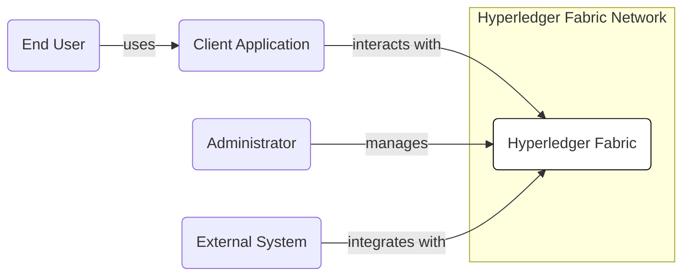
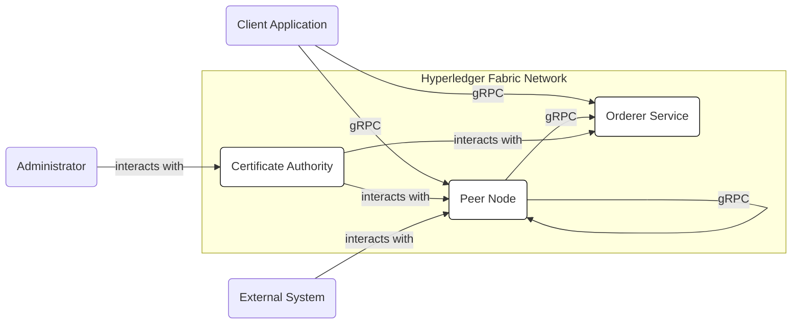
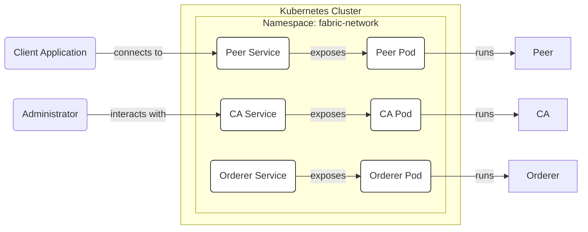
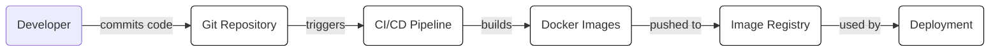

Okay, let's create a design document for the Hyperledger Fabric project, focusing on aspects relevant for threat modeling.

# BUSINESS POSTURE

Hyperledger Fabric is a permissioned, modular blockchain framework designed for enterprise use cases.  It's not a cryptocurrency platform. Its primary goals are to provide a foundation for developing blockchain solutions that require:

*   Data privacy and confidentiality:  Transactions and data can be restricted to specific participants on the network.
*   High performance and scalability:  Fabric aims to support high transaction throughput and efficient scaling for large networks.
*   Identity management:  Participants have known identities, unlike public, anonymous blockchains.
*   Pluggable architecture:  Components like consensus and membership services can be customized.
*   Compliance and auditability:  The permissioned nature and data controls facilitate regulatory compliance.

Business Priorities:

1.  Provide a secure and reliable platform for enterprise blockchain applications.
2.  Enable confidential transactions and data sharing between known participants.
3.  Support a wide range of use cases through its modularity and flexibility.
4.  Maintain high performance and scalability for demanding enterprise workloads.
5.  Facilitate compliance with relevant regulations and industry standards.

Most Important Business Risks:

1.  Unauthorized access to sensitive data:  Compromise of identities or vulnerabilities in the platform could lead to data breaches.
2.  Data tampering or manipulation:  Malicious actors could attempt to alter transaction data or smart contract code.
3.  Denial of service:  Attacks could disrupt the network and prevent legitimate transactions from being processed.
4.  Non-compliance with regulations:  Failure to meet regulatory requirements could result in legal and financial penalties.
5.  Reputational damage:  Security incidents or platform failures could erode trust in the technology and the organizations using it.
6.  Smart contract vulnerabilities:  Flaws in smart contract (chaincode) logic could be exploited to cause financial loss or data corruption.

# SECURITY POSTURE

Existing Security Controls:

*   security control: Membership Service Provider (MSP):  Manages identities and certificates for all participants (organizations, peers, orderers, clients).  This is a core component of Fabric's permissioned nature. Described in Fabric documentation and implemented in code.
*   security control:  Channel configuration:  Defines which organizations can participate in a channel and their respective permissions. Described in Fabric documentation and implemented in configuration transactions.
*   security control:  Private data collections:  Allow data to be shared only with a subset of organizations on a channel, enhancing confidentiality. Described in Fabric documentation and implemented in chaincode and peer configuration.
*   security control:  Endorsement policies:  Specify which organizations must endorse a transaction before it's considered valid, preventing unauthorized modifications. Described in Fabric documentation and implemented in chaincode and channel configuration.
*   security control:  TLS encryption:  Secures communication between nodes (peers, orderers, clients) using TLS. Described in Fabric documentation and implemented using standard TLS libraries.
*   security control:  Hardware Security Modules (HSMs):  Support for HSMs to protect private keys. Described in Fabric documentation and implemented through PKCS#11 interface.
*   security control: Chaincode (Smart Contracts) are executed in isolated Docker containers. Described in Fabric documentation.

Accepted Risks:

*   accepted risk:  Complexity of configuration:  Properly configuring Fabric's security features requires significant expertise. Misconfigurations could lead to vulnerabilities.
*   accepted risk:  Reliance on chaincode developers:  The security of applications built on Fabric heavily depends on the quality and security of the chaincode.
*   accepted risk:  Potential for vulnerabilities in underlying infrastructure:  Fabric relies on operating systems, Docker, and other infrastructure components that could have their own vulnerabilities.
*   accepted risk: Single organization controlling majority of ordering nodes can lead to censorship.

Recommended Security Controls:

*   security control:  Regular security audits of chaincode:  Independent code reviews and penetration testing are crucial.
*   security control:  Implement robust monitoring and logging:  Track all network activity and security events to detect and respond to incidents.
*   security control:  Establish a formal incident response plan:  Define procedures for handling security breaches and other incidents.
*   security control:  Implement a secure software development lifecycle (SSDLC) for chaincode development: Integrate security practices throughout the development process.
*   security control: Use static and dynamic analysis tools to scan chaincode for vulnerabilities.

Security Requirements:

*   Authentication:
    *   All participants (users, peers, orderers) must be authenticated using X.509 certificates issued by a trusted Certificate Authority (CA) managed by the MSP.
    *   Client applications must authenticate to the Fabric network using valid credentials.

*   Authorization:
    *   Access control lists (ACLs) and policies should be defined to restrict access to channels, chaincode, and data based on roles and permissions.
    *   Endorsement policies must be carefully designed to ensure that only authorized organizations can approve transactions.

*   Input Validation:
    *   Chaincode must rigorously validate all inputs to prevent injection attacks and other vulnerabilities.
    *   Data types and formats should be strictly enforced.

*   Cryptography:
    *   TLS should be used for all network communication.
    *   Strong cryptographic algorithms (e.g., ECDSA for signatures, AES for encryption) should be used throughout the system.
    *   Private keys must be securely stored and managed, preferably using HSMs.

# DESIGN

## C4 CONTEXT

C4 Context Element List:

*   Element:
    *   Name: Hyperledger Fabric
    *   Type: System
    *   Description: A permissioned blockchain framework for enterprise applications.
    *   Responsibilities:
        *   Maintaining the distributed ledger.
        *   Executing chaincode (smart contracts).
        *   Managing identities and membership.
        *   Enforcing access control and privacy policies.
        *   Providing consensus mechanisms.
    *   Security controls: MSP, channel configuration, private data collections, endorsement policies, TLS encryption, HSM support.

*   Element:
    *   Name: Client Application
    *   Type: System
    *   Description: An application that interacts with the Fabric network to submit transactions and query data.
    *   Responsibilities:
        *   Authenticating users.
        *   Preparing and submitting transactions.
        *   Displaying data to users.
    *   Security controls: Authentication, authorization, secure communication with Fabric network.

*   Element:
    *   Name: Administrator
    *   Type: Person
    *   Description: A user responsible for managing the Fabric network.
    *   Responsibilities:
        *   Configuring the network.
        *   Managing organizations and users.
        *   Deploying chaincode.
    *   Security controls: Strong authentication, access control, audit logging.

*   Element:
    *   Name: External System
    *   Type: System
    *   Description: A system outside the Fabric network that integrates with it.
    *   Responsibilities:
        *   Exchanging data with the Fabric network.
        *   Triggering actions on the Fabric network.
    *   Security controls: Secure communication, API authentication, data validation.

*   Element:
    *   Name: End User
    *   Type: Person
    *   Description: A person who interacts with the system via Client Application.
    *   Responsibilities: Using client application to interact with blockchain.
    *   Security controls: Authentication via Client Application.

## C4 CONTAINER

C4 Container Element List:

*   Element:
    *   Name: Orderer Service
    *   Type: Container
    *   Description: Provides ordering of transactions and creates blocks.
    *   Responsibilities:
        *   Receiving transactions from clients.
        *   Ordering transactions into blocks.
        *   Distributing blocks to peers.
        *   Providing consensus mechanism (e.g., Raft, Kafka).
    *   Security controls: TLS encryption, MSP, access control.

*   Element:
    *   Name: Peer Node
    *   Type: Container
    *   Description: Maintains a copy of the ledger and executes chaincode.
    *   Responsibilities:
        *   Validating transactions.
        *   Executing chaincode.
        *   Storing the ledger.
        *   Endorsing transactions.
        *   Hosting chaincode containers.
    *   Security controls: TLS encryption, MSP, endorsement policies, private data collections, chaincode isolation (Docker).

*   Element:
    *   Name: Certificate Authority (CA)
    *   Type: Container
    *   Description: Issues and manages digital certificates for network participants.
    *   Responsibilities:
        *   Generating and issuing certificates.
        *   Revoking certificates.
        *   Maintaining a certificate revocation list (CRL).
    *   Security controls: Strong authentication, access control, HSM support.

*   Element:
    *   Name: Client Application
    *   Type: System
    *   Description: An application that interacts with the Fabric network to submit transactions and query data.
    *   Responsibilities:
        *   Authenticating users.
        *   Preparing and submitting transactions.
        *   Displaying data to users.
    *   Security controls: Authentication, authorization, secure communication with Fabric network.

*   Element:
    *   Name: Administrator
    *   Type: Person
    *   Description: A user responsible for managing the Fabric network.
    *   Responsibilities:
        *   Configuring the network.
        *   Managing organizations and users.
        *   Deploying chaincode.
    *   Security controls: Strong authentication, access control, audit logging.

*   Element:
    *   Name: External System
    *   Type: System
    *   Description: A system outside the Fabric network that integrates with it.
    *   Responsibilities:
        *   Exchanging data with the Fabric network.
        *   Triggering actions on the Fabric network.
    *   Security controls: Secure communication, API authentication, data validation.

## DEPLOYMENT

Deployment Options:

1.  Kubernetes:  Fabric can be deployed on a Kubernetes cluster, leveraging Kubernetes' features for orchestration, scaling, and resilience.
2.  Docker Swarm:  Fabric can be deployed using Docker Swarm for container orchestration.
3.  Cloud Provider Managed Services:  Cloud providers like AWS, Azure, and IBM Cloud offer managed services for deploying and managing Fabric networks.
4.  Manual Deployment:  Fabric can be deployed manually on virtual machines or bare-metal servers.

Chosen Deployment Solution: Kubernetes

Deployment Element List:

*   Element:
    *   Name: Kubernetes Cluster
    *   Type: Infrastructure
    *   Description: A cluster of nodes managed by Kubernetes.
    *   Responsibilities: Providing the infrastructure for running Fabric components.
    *   Security controls: Network policies, role-based access control (RBAC), pod security policies.

*   Element:
    *   Name: Namespace: fabric-network
    *   Type: Logical Isolation
    *   Description: A Kubernetes namespace to isolate Fabric components.
    *   Responsibilities: Providing a logical boundary for Fabric resources.
    *   Security controls: Network policies, RBAC.

*   Element:
    *   Name: Orderer Pod
    *   Type: Pod
    *   Description: A Kubernetes pod running the Orderer container.
    *   Responsibilities: Running the Orderer service.
    *   Security controls:  Inherits security controls from the Orderer container and Kubernetes cluster.

*   Element:
    *   Name: Peer Pod
    *   Type: Pod
    *   Description: A Kubernetes pod running the Peer container.
    *   Responsibilities: Running the Peer service.
    *   Security controls: Inherits security controls from the Peer container and Kubernetes cluster.

*   Element:
    *   Name: CA Pod
    *   Type: Pod
    *   Description: A Kubernetes pod running the CA container.
    *   Responsibilities: Running the CA service.
    *   Security controls: Inherits security controls from the CA container and Kubernetes cluster.

*   Element:
    *   Name: Orderer Service
    *   Type: Service
    *   Description: A Kubernetes service that exposes the Orderer pod.
    *   Responsibilities: Providing a stable endpoint for accessing the Orderer.
    *   Security controls: Network policies.

*   Element:
    *   Name: Peer Service
    *   Type: Service
    *   Description: A Kubernetes service that exposes the Peer pod.
    *   Responsibilities: Providing a stable endpoint for accessing the Peer.
    *   Security controls: Network policies.

*   Element:
    *   Name: CA Service
    *   Type: Service
    *   Description: A Kubernetes service that exposes the CA pod.
    *   Responsibilities: Providing a stable endpoint for accessing the CA.
    *   Security controls: Network policies.

*   Element:
    *   Name: Client Application
    *   Type: System
    *   Description: An application that interacts with the Fabric network to submit transactions and query data.
    *   Responsibilities:
        *   Authenticating users.
        *   Preparing and submitting transactions.
        *   Displaying data to users.
    *   Security controls: Authentication, authorization, secure communication with Fabric network.

*   Element:
    *   Name: Administrator
    *   Type: Person
    *   Description: A user responsible for managing the Fabric network.
    *   Responsibilities:
        *   Configuring the network.
        *   Managing organizations and users.
        *   Deploying chaincode.
    *   Security controls: Strong authentication, access control, audit logging.

## BUILD

The build process for Hyperledger Fabric involves building the various components (peer, orderer, CA, etc.) from source code and creating Docker images.  A CI/CD pipeline is typically used.

Build Process Security Controls:

*   security control: Code Review:  All code changes should be reviewed by at least one other developer before being merged.
*   security control: Static Analysis:  Static analysis tools (e.g., linters, security scanners) should be used to identify potential vulnerabilities in the code.
*   security control: Dependency Scanning:  Dependencies should be scanned for known vulnerabilities.
*   security control: Signed Commits: Developers should sign their commits to ensure authenticity.
*   security control: Image Signing: Docker images should be signed to ensure their integrity.
*   security control: Least Privilege: Build processes should run with the least privileges necessary.
*   security control: Build Automation: GitHub Actions, Jenkins, or other CI/CD tools are used to automate the build process.

# RISK ASSESSMENT

Critical Business Processes:

*   Maintaining the integrity and confidentiality of the distributed ledger.
*   Ensuring the availability and resilience of the network.
*   Providing a secure and reliable platform for enterprise applications.
*   Facilitating secure and confidential transactions between participants.

Data Sensitivity:

*   Transaction data:  Can range from highly sensitive (e.g., financial transactions, personal data) to less sensitive (e.g., supply chain tracking). Sensitivity depends on the specific use case.
*   Chaincode:  Contains the business logic and may handle sensitive data.
*   Private data:  Data shared only with a subset of organizations on a channel.  Highly sensitive.
*   Configuration data:  Contains information about the network configuration, including access control policies.  Sensitive.
*   Identity information: Certificates and private keys. Extremely sensitive.

# QUESTIONS & ASSUMPTIONS

Questions:

*   What specific regulatory requirements apply to the intended use cases of Fabric?
*   What are the performance and scalability requirements for the network?
*   What level of expertise is available for configuring and managing Fabric?
*   What is the threat model for the specific applications that will be built on Fabric?
*   What are the specific data sensitivity levels for each use case?
*   Are there any existing security policies or guidelines that need to be followed?
*   What is the process for managing and updating chaincode?
*   What external systems will integrate with the Fabric network, and what are the security implications of those integrations?

Assumptions:

*   BUSINESS POSTURE: The organization deploying Fabric has a clear understanding of its security requirements and risk tolerance.
*   SECURITY POSTURE: The organization will implement the recommended security controls and follow best practices for secure software development.
*   DESIGN: The Fabric network will be deployed in a secure environment (e.g., a private cloud or a dedicated network segment) with appropriate access controls. The design will be reviewed and updated regularly to address emerging threats and vulnerabilities. The Kubernetes deployment will use network policies to restrict traffic between pods.