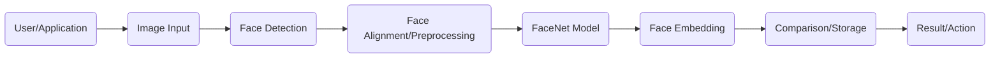

# Project Design Document: FaceNet Implementation

**Version:** 1.1
**Date:** October 26, 2023
**Author:** AI Architecture Expert

## 1. Introduction

This document provides an enhanced and more detailed design for a system implementing the FaceNet model, based on the publicly available repository: [https://github.com/davidsandberg/facenet](https://github.com/davidsandberg/facenet). This design will serve as a robust foundation for subsequent threat modeling activities. The focus remains on a clear understanding of the system's architecture, data flow, and key components to facilitate the identification of potential security vulnerabilities. This revision includes more granular detail and clarifies certain aspects for improved threat analysis.

## 2. Goals and Objectives

*   Clearly and comprehensively define the architecture of a system utilizing the FaceNet model.
*   Identify and describe the key components and their interactions within the system with greater specificity.
*   Detail the data flow through the system, highlighting potential points of interest for security analysis.
*   Provide sufficient and precise detail to facilitate a comprehensive and effective threat model.
*   Strictly adhere to the specified formatting requirements (Markdown, Mermaid, no tables).

## 3. System Architecture

The FaceNet system, in a typical inference-focused implementation, involves a series of well-defined stages. This architecture emphasizes the flow of data and processing steps.

### 3.1. High-Level Architecture

*   **User/Application:** The external entity (human user, software application, or system) initiating a face recognition request. This represents the entry point to the system.
*   **Image Input:** The mechanism or interface through which the image containing faces is provided to the system (e.g., API endpoint, file upload, camera feed).
*   **Face Detection:** The process of identifying and localizing faces within the input image. This often involves a dedicated face detection model.
*   **Face Alignment/Preprocessing:**  Standardizes the detected faces by aligning them geometrically and applying necessary preprocessing steps (e.g., resizing, normalization) to ensure optimal input for the FaceNet model.
*   **FaceNet Model:** The core component, typically a pre-trained deep learning model, responsible for transforming the preprocessed face image into a compact numerical representation (the face embedding).
*   **Face Embedding:** The output of the FaceNet model – a high-dimensional vector representing the unique features of the face.
*   **Comparison/Storage:**  This stage involves either comparing the generated embedding with a database of known embeddings for identification or storing the new embedding for future comparisons.
*   **Result/Action:** The final outcome of the face recognition process, which could be identification of an individual, verification of identity, or triggering a specific action based on the recognition result.

### 3.2. Detailed Architecture

```mermaid
graph LR
    subgraph "Image Input Module"
        IA("Image Source (e.g., Camera, File, API)")
        IB("Image Acquisition & Transmission")
    end
    subgraph "Face Processing Module"
        FC("Face Detector (e.g., MTCNN, Haar Cascade)")
        FD("Bounding Box Coordinates")
        FE("Face Cropping & Extraction")
        FF("Facial Landmark Detection (Optional)")
        FG("Face Alignment (e.g., Affine Transformation)")
        FH("Preprocessing (e.g., Grayscale Conversion, Normalization)")
    end
    subgraph "FaceNet Inference Module"
        FI("Pre-trained FaceNet Model (e.g., TensorFlow SavedModel)")
        FJ("Embedding Generation Process")
    end
    subgraph "Embedding Management Module"
        FK("Embedding Database/Storage (e.g., Vector Database, Relational Database)")
        FL("Embedding Comparison Algorithm (e.g., Cosine Similarity, Euclidean Distance)")
        FM("Similarity Threshold Configuration")
    end
    subgraph "Output/Action Module"
        FN("Identification Result & Confidence Score")
        FO("Verification Result (Match/No Match)")
        FP("Logging, Auditing & Monitoring")
        FQ("Action Trigger (e.g., Access Grant, Alert)")
    end

    IA --> IB --> FC
    FC --> FD --> FE
    FE --> FF --> FG
    FG --> FH --> FI
    FI --> FJ
    FJ --> FK
    FJ --> FL
    FL --> FM --> FN
    FL --> FM --> FO
    FJ --> FP
    FO --> FQ
    FN --> FQ
```

*   **Image Input Module:**
    *   **Image Source (e.g., Camera, File, API):**  Specifies the origin of the facial image data, including various potential sources.
    *   **Image Acquisition & Transmission:**  Details the process of capturing or retrieving the image and how it's transmitted to the next module.
*   **Face Processing Module:**
    *   **Face Detector (e.g., MTCNN, Haar Cascade):**  Explicitly names examples of face detection algorithms or models used.
    *   **Bounding Box Coordinates:** The output of the face detection stage, defining the rectangular regions containing detected faces.
    *   **Face Cropping & Extraction:** The process of isolating the facial region from the larger image based on the bounding box.
    *   **Facial Landmark Detection (Optional):**  An optional step to identify key facial features (e.g., eyes, nose, mouth) for more precise alignment.
    *   **Face Alignment (e.g., Affine Transformation):**  Specifies the type of geometric transformation used to align faces.
    *   **Preprocessing (e.g., Grayscale Conversion, Normalization):**  Provides examples of preprocessing techniques applied to the cropped and aligned face image.
*   **FaceNet Inference Module:**
    *   **Pre-trained FaceNet Model (e.g., TensorFlow SavedModel):**  Indicates the format and origin of the FaceNet model.
    *   **Embedding Generation Process:**  The computational steps involved in feeding the preprocessed image to the model and obtaining the embedding vector.
*   **Embedding Management Module:**
    *   **Embedding Database/Storage (e.g., Vector Database, Relational Database):**  Suggests different types of storage solutions for face embeddings.
    *   **Embedding Comparison Algorithm (e.g., Cosine Similarity, Euclidean Distance):**  Provides examples of algorithms used to compare embeddings.
    *   **Similarity Threshold Configuration:**  Highlights the configurable parameter used to determine a match.
*   **Output/Action Module:**
    *   **Identification Result & Confidence Score:**  Includes the confidence level associated with the identification.
    *   **Verification Result (Match/No Match):**  A binary outcome of the verification process.
    *   **Logging, Auditing & Monitoring:**  Emphasizes the importance of recording system activities.
    *   **Action Trigger (e.g., Access Grant, Alert):**  Illustrates potential actions taken based on the recognition result.

## 4. Data Flow

Understanding the data transformations at each stage is critical for identifying potential data manipulation points.

*   **Raw Image Data:** The initial input image, potentially containing multiple faces or other objects.
*   **Detected Faces (Bounding Boxes):** The output of the face detection module, indicating the location of faces within the image.
*   **Cropped Face Images:** Individual images containing only the detected facial regions.
*   **Aligned & Preprocessed Face Images:**  Standardized facial images, ready for input to the FaceNet model.
*   **Face Embedding Vector:** The numerical representation of the facial features, generated by the FaceNet model.
*   **Similarity Score:** The numerical value representing the similarity between two face embeddings.
*   **Recognition Outcome:** The final decision or result based on the similarity score and configured threshold.

## 5. Key Components

This section provides a more detailed description of the essential building blocks of the system.

*   **Face Detection Model (e.g., MTCNN, RetinaFace):**  A neural network or algorithm specifically trained to identify the presence and location of faces in an image. Different models offer varying levels of accuracy and performance.
*   **Face Alignment Algorithm (e.g., Similarity Transformation, TPS):**  A method to geometrically transform a facial image to a standard pose, reducing variations due to head pose and orientation.
*   **Image Preprocessing Module (e.g., using OpenCV, Pillow):**  A software component responsible for preparing the facial image data for the FaceNet model, including resizing, normalization, and potentially color space conversion.
*   **FaceNet Model (Pre-trained Convolutional Neural Network):** The core deep learning model, typically a Convolutional Neural Network (CNN), trained on a large dataset of facial images to generate discriminative embeddings.
*   **Embedding Comparison Algorithm (e.g., Cosine Similarity, L2 Distance):**  A mathematical function used to calculate the distance or similarity between two face embedding vectors. The choice of algorithm can impact performance and accuracy.
*   **Embedding Database (e.g., FAISS, Annoy, Weaviate):**  A specialized database or storage solution optimized for storing and efficiently searching high-dimensional vector embeddings.
*   **API/Interface (e.g., REST API, gRPC):**  If the system exposes functionality to external applications, an API defines the communication protocols and data formats for interaction.
*   **Logging and Auditing System (e.g., ELK Stack, Splunk):**  A system for recording events, actions, and errors within the FaceNet system, crucial for security monitoring and incident response.
*   **Configuration Management (e.g., Environment Variables, Configuration Files):**  Mechanisms for managing and storing system settings and parameters, including model paths, thresholds, and database connection details.

## 6. Security Considerations (Detailed)

This section expands on potential security concerns, categorizing them for better analysis during threat modeling.

*   **Data Security:**
    *   **Storage of Sensitive Data:**
        *   **Threat:** Unauthorized access to stored raw images and face embeddings.
        *   **Considerations:** Encryption at rest, access control mechanisms, secure storage locations.
    *   **Data in Transit:**
        *   **Threat:** Interception of image data or embeddings during transmission.
        *   **Considerations:** Encryption in transit (TLS/SSL), secure communication protocols.
    *   **Privacy Violations:**
        *   **Threat:** Misuse or unauthorized disclosure of biometric data.
        *   **Considerations:** Data minimization, anonymization techniques (where applicable), adherence to privacy regulations (e.g., GDPR, CCPA).
*   **Model Security:**
    *   **Model Integrity:**
        *   **Threat:** Tampering with the pre-trained FaceNet model or its weights.
        *   **Considerations:** Secure storage and verification of model integrity (e.g., checksums).
    *   **Adversarial Attacks:**
        *   **Threat:** Crafting malicious input images designed to fool the FaceNet model.
        *   **Considerations:** Input validation, adversarial training techniques, anomaly detection.
    *   **Model Extraction/Theft:**
        *   **Threat:** Unauthorized copying or reverse engineering of the FaceNet model.
        *   **Considerations:** Access control to model files, obfuscation techniques (with limitations).
*   **Infrastructure Security:**
    *   **Access Control:**
        *   **Threat:** Unauthorized access to servers and systems hosting the FaceNet application.
        *   **Considerations:** Strong authentication and authorization mechanisms, principle of least privilege.
    *   **Vulnerability Management:**
        *   **Threat:** Exploitation of known vulnerabilities in dependencies (e.g., TensorFlow, Python libraries, operating system).
        *   **Considerations:** Regular security patching, vulnerability scanning.
    *   **Network Security:**
        *   **Threat:** Unauthorized access or eavesdropping on network traffic.
        *   **Considerations:** Firewalls, intrusion detection/prevention systems, network segmentation.
*   **API Security (if exposed):**
    *   **Authentication and Authorization:**
        *   **Threat:** Unauthorized access to API endpoints.
        *   **Considerations:** API keys, OAuth 2.0, JWT.
    *   **Injection Attacks:**
        *   **Threat:** Exploiting vulnerabilities in API endpoints to execute malicious code or access sensitive data.
        *   **Considerations:** Input sanitization, parameterized queries.
    *   **Denial of Service (DoS):**
        *   **Threat:** Overwhelming the API with requests, making it unavailable.
        *   **Considerations:** Rate limiting, request throttling.
*   **Input Validation:**
    *   **Malicious Input:**
        *   **Threat:** Providing crafted images that could exploit vulnerabilities in image processing libraries or the FaceNet model.
        *   **Considerations:** Input sanitization, format validation, size limits.
*   **Output Validation:**
    *   **Result Manipulation:**
        *   **Threat:** Tampering with the recognition results before they are presented or acted upon.
        *   **Considerations:** Integrity checks, secure communication channels for output.
*   **Logging and Monitoring:**
    *   **Insufficient Logging:**
        *   **Threat:** Lack of visibility into system activities, hindering incident detection and response.
        *   **Considerations:** Comprehensive logging of relevant events, secure storage of logs.
    *   **Log Tampering:**
        *   **Threat:** Malicious modification or deletion of audit logs.
        *   **Considerations:** Log integrity checks, centralized and secure log storage.

## 7. Deployment Considerations

The chosen deployment environment significantly influences the applicable security measures.

*   **Local Deployment (On-Premise):** Security responsibilities primarily lie with the organization managing the infrastructure. Physical security, network security, and server hardening are critical.
*   **Cloud Deployment (IaaS, PaaS):** Security is a shared responsibility. The cloud provider handles the security of the underlying infrastructure, while the application owner is responsible for securing the application and data. Cloud-specific security services should be leveraged.
*   **Edge Deployment:** Security considerations include the physical security of the edge devices, secure communication channels, and potentially limited computational resources for security measures.

## 8. Future Enhancements

Anticipating future changes helps proactively address potential security implications.

*   **Integration with a User Management System:** Introduces new authentication and authorization requirements and potential vulnerabilities related to user data management.
*   **Implementation of a Retraining Pipeline for the FaceNet Model:** Requires secure data handling for training data and mechanisms to ensure the integrity of the retrained model.
*   **Addition of Liveness Detection:** Introduces a new component that needs to be secured against spoofing attacks.
*   **Improved Scalability and Performance Optimizations:** May involve architectural changes that introduce new attack surfaces or require different security controls.

This enhanced design document provides a more granular and detailed view of the FaceNet implementation, offering a stronger foundation for a comprehensive threat modeling exercise. The added specificity in component descriptions, data flow, and security considerations will facilitate a more thorough analysis of potential vulnerabilities and the development of effective mitigation strategies.
