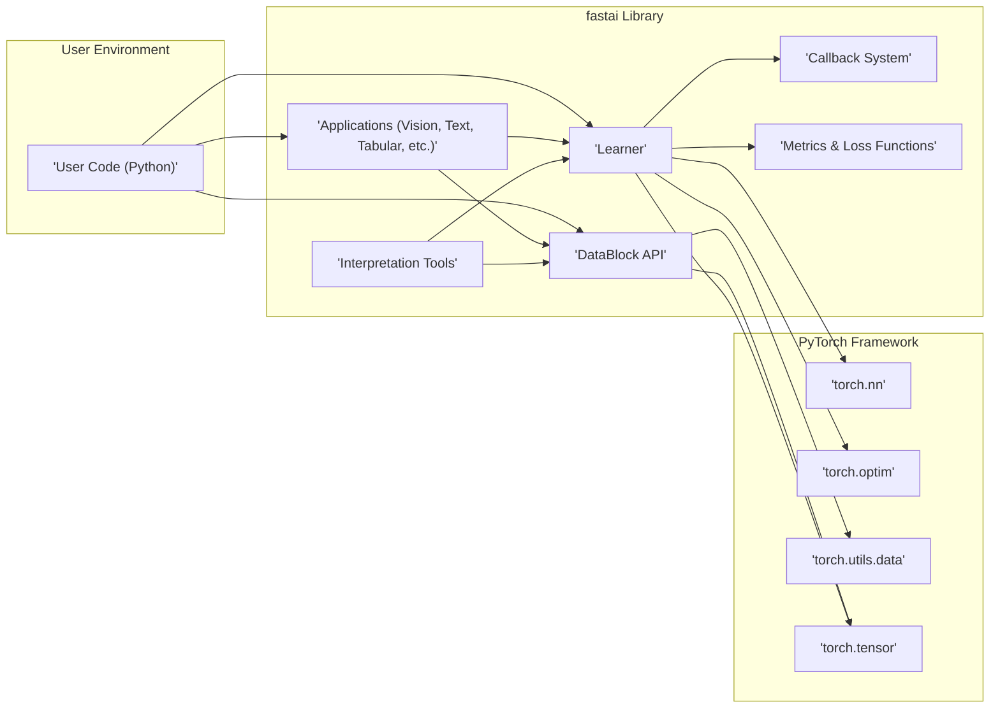

# Project Design Document: fastai Library

**Version:** 1.1
**Date:** October 26, 2023
**Author:** AI Architecture Expert

## 1. Introduction

This document provides a detailed architectural overview of the `fastai` deep learning library (as represented by the codebase at https://github.com/fastai/fastai). This document is intended to serve as a foundation for subsequent threat modeling activities. It outlines the key components, data flows, and interactions within the library, highlighting potential areas of interest for security analysis. This revision incorporates improvements for clarity and includes tabular summaries for key information.

## 2. Goals and Objectives

The primary goal of this document is to provide a clear and comprehensive understanding of the `fastai` library's architecture. The specific objectives are:

*   Identify the major components and modules within the `fastai` library.
*   Describe the interactions and dependencies between these components.
*   Illustrate the typical data flow within a `fastai` workflow.
*   Highlight potential areas where security considerations might be relevant.
*   Provide a visual representation of the system architecture and data flow using Mermaid diagrams.
*   Summarize key component details and security considerations in tabular format for easy reference.

## 3. Scope

This document focuses on the software architecture of the `fastai` library itself. It does not cover:

*   The underlying operating systems or hardware on which `fastai` is executed.
*   The security of the Python interpreter or other direct dependencies (like PyTorch) unless directly relevant to `fastai`'s design and interactions.
*   The security of user-provided data or models used with `fastai` in terms of their content, but will consider how `fastai` handles such inputs.
*   The security of external services or APIs that a user might integrate with `fastai`.
*   Specific implementation details within individual functions or classes, unless they have significant architectural implications.

## 4. High-Level Architecture

The `fastai` library is designed as a high-level API built on top of PyTorch, aiming to simplify and accelerate the development of deep learning models. The core idea is to provide a set of abstractions and best practices that make common deep learning tasks easier to implement.

**Components:**

*   **User Code (Python):** This represents the scripts and applications written by a user to interact with the `fastai` library. This is the entry point for utilizing `fastai`'s functionalities.
*   **DataBlock API:** A declarative and flexible API for defining the data pipeline, including data sources, splitting strategies, and transformations. It abstracts away the complexities of data loading and preprocessing.
*   **Learner:** The central orchestrator in `fastai`, responsible for managing the training loop, encompassing the model, data loaders, optimizer, and loss function. It provides high-level methods for fitting, validating, and predicting.
*   **Callback System:** A powerful and extensible mechanism allowing users and the library itself to inject custom logic at various stages of the training process. This enables modularity and customization without modifying core `Learner` code.
*   **Applications (Vision, Text, Tabular, etc.):**  Pre-built modules and high-level functions tailored for specific deep learning domains. These provide convenient abstractions and best practices for common tasks within these domains.
*   **Metrics & Loss Functions:** Implementations of various evaluation metrics to assess model performance and loss functions to guide the optimization process during training.
*   **Interpretation Tools:** Modules designed to provide insights into the behavior and predictions of trained models, aiding in debugging and understanding model decisions.
*   **PyTorch (torch.nn, torch.optim, torch.utils.data, torch.tensor):** The foundational deep learning framework upon which `fastai` is built. `fastai` leverages PyTorch's core functionalities for neural network building, optimization, and data handling.

## 5. Component Details

This section provides a more detailed description of the key components within the `fastai` library.

| Component                 | Description