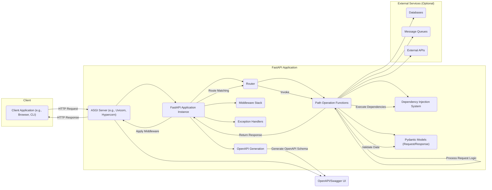
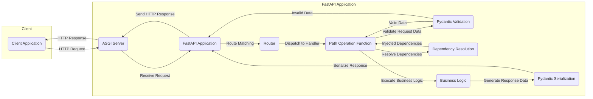

# Project Design Document: FastAPI Web Framework

**Version:** 1.1
**Date:** October 26, 2023
**Author:** AI Software Architect

## 1. Introduction

This document provides a detailed architectural design of the FastAPI web framework, based on its publicly available source code and documentation. This design document is intended to serve as a foundation for subsequent threat modeling activities. It outlines the key components, data flow, and interactions within the framework, highlighting areas that may be susceptible to security vulnerabilities.

## 2. Goals and Objectives

The primary goal of this document is to provide a comprehensive architectural overview of FastAPI. Specific objectives include:

*   Identifying the core components of the FastAPI framework.
*   Describing the interactions and data flow between these components.
*   Highlighting key dependencies and their roles.
*   Providing a foundation for identifying potential security threats and vulnerabilities.

## 3. Architectural Overview

FastAPI is a modern, high-performance, web framework for building APIs with Python 3.8+ based on standard Python type hints. It leverages Starlette for the web parts and Pydantic for data validation and serialization.

### 3.1. High-Level Architecture

### 3.2. Core Components

*   **ASGI Server (e.g., Uvicorn, Hypercorn):**
    *   Responsible for handling incoming HTTP requests and managing the application lifecycle.
    *   Acts as the entry point for all external interactions.
    *   Provides the underlying asynchronous capabilities.
*   **FastAPI Application Instance:**
    *   The central object that orchestrates the framework's functionality.
    *   Manages routing, middleware, exception handling, and dependency injection.
    *   Holds the configuration and state of the application.
*   **Router:**
    *   Responsible for mapping incoming request paths and HTTP methods to specific handler functions.
    *   Allows for organizing application logic into modular components.
*   **Path Operation Functions (View Functions):**
    *   The core logic of the API endpoints.
    *   Decorated with route definitions (e.g., `@app.get("/items/{item_id}")`).
    *   Receive validated request data and return response data.
*   **Dependency Injection System:**
    *   A powerful mechanism for managing and injecting dependencies into path operation functions.
    *   Promotes code reusability and testability.
    *   Can be used for authentication, authorization, database connections, etc.
*   **Pydantic Models (Request/Response):**
    *   Used for data validation and serialization.
    *   Define the expected structure and types of request bodies and response payloads.
    *   Automatically handles data parsing and validation.
*   **Middleware Stack:**
    *   A sequence of functions that can intercept and process requests and responses.
    *   Used for cross-cutting concerns like authentication, logging, CORS, and request modification.
    *   Executed in a specific order.
*   **Exception Handlers:**
    *   Functions that handle exceptions raised during request processing.
    *   Allow for customizing error responses and logging.
*   **OpenAPI Generation:**
    *   Automatically generates OpenAPI (Swagger) schema based on the defined routes, request/response models, and docstrings.
    *   Enables interactive API documentation and client code generation.

## 4. Data Flow

The typical data flow for a request in a FastAPI application is as follows:

**Detailed Steps:**

1. **Client sends an HTTP request:** The client application initiates a request to a specific endpoint.
2. **ASGI Server receives the request:** The ASGI server (e.g., Uvicorn) receives the incoming HTTP request.
3. **FastAPI Application processes the request:** The ASGI server passes the request to the FastAPI application instance.
4. **Route Matching:** The Router component matches the request path and HTTP method to the appropriate Path Operation Function.
5. **Dispatch to Handler:** The request is dispatched to the corresponding Path Operation Function.
6. **Validate Request Data (Pydantic):** If the Path Operation Function expects request body or query parameters, Pydantic models are used to validate the incoming data against the defined schema.
    *   If validation fails, an exception is raised, and an error response is generated (handled by exception handlers).
    *   If validation succeeds, the validated data is passed to the function.
7. **Resolve Dependencies:** The Dependency Injection system resolves and injects any declared dependencies into the Path Operation Function.
8. **Execute Business Logic:** The Path Operation Function executes its core logic, potentially interacting with databases, external services, etc.
9. **Generate Response Data:** The Path Operation Function returns data, which is typically a Python object.
10. **Serialize Response (Pydantic):** If a response model is defined, Pydantic serializes the returned data into the specified format (usually JSON).
11. **Send HTTP Response:** The FastAPI application constructs an HTTP response containing the serialized data and appropriate headers, and sends it back to the ASGI server.
12. **ASGI Server sends the response:** The ASGI server sends the HTTP response back to the client.

## 5. Security Considerations (Preliminary)

This section provides a preliminary overview of potential security considerations based on the architecture. A more detailed threat model will build upon this foundation.

*   **Input Validation:**
    *   FastAPI heavily relies on Pydantic for input validation, which is a strong defense against many common vulnerabilities like injection attacks.
    *   However, the correctness and comprehensiveness of the Pydantic models are crucial. Incorrectly defined models can lead to vulnerabilities.
    *   Custom validation logic within path operation functions also needs careful scrutiny.
*   **Authentication and Authorization:**
    *   FastAPI provides mechanisms for implementing authentication and authorization, often through dependency injection.
    *   The security of the authentication and authorization schemes depends on the implementation details (e.g., secure storage of credentials, proper token handling).
    *   Misconfigured or weak authentication/authorization can lead to unauthorized access.
*   **Dependency Injection Security:**
    *   While powerful, the dependency injection system can introduce security risks if not used carefully.
    *   Dependencies themselves might have vulnerabilities.
    *   Improperly scoped dependencies could lead to unintended data sharing or access.
*   **Middleware Security:**
    *   Middleware can be used for security purposes (e.g., CORS, security headers).
    *   However, vulnerabilities in custom middleware or misconfiguration of existing middleware can introduce security flaws.
    *   The order of middleware execution is important and can have security implications.
*   **Exception Handling:**
    *   Improperly handled exceptions can leak sensitive information in error messages.
    *   Default error pages might reveal internal application details.
*   **OpenAPI Security:**
    *   While OpenAPI documentation is beneficial, exposing it publicly might reveal information about the API's structure and endpoints, potentially aiding attackers.
    *   Consider restricting access to the OpenAPI documentation in production environments.
*   **ASGI Server Security:**
    *   The security of the underlying ASGI server (Uvicorn, Hypercorn) is also important. Ensure the server is properly configured and updated to mitigate known vulnerabilities.
*   **Dependencies Security:**
    *   FastAPI relies on several external libraries. Vulnerabilities in these dependencies can impact the security of the FastAPI application. Regular dependency updates and security audits are necessary.

## 6. Deployment Considerations

FastAPI applications are typically deployed using ASGI servers like Uvicorn or Hypercorn. Common deployment scenarios and their security considerations are outlined below:

| Deployment Scenario             | Description                                                                 | Security Considerations