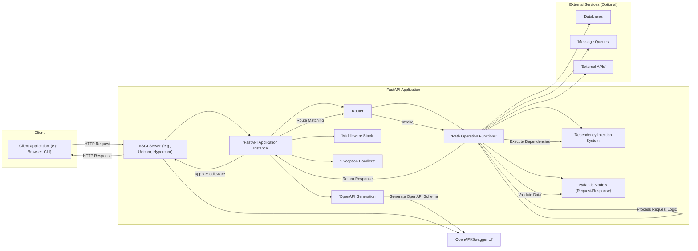
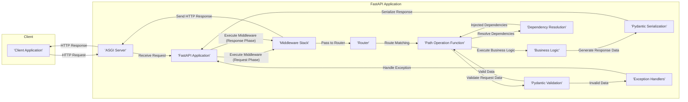

# Project Design Document: FastAPI Web Framework

**Version:** 1.1
**Date:** October 26, 2023
**Author:** AI Software Architect

## 1. Introduction

This document provides an enhanced architectural design of the FastAPI web framework, building upon the previous version with more detail and a stronger focus on security considerations relevant for threat modeling. It is based on the publicly available source code and documentation of FastAPI. This design document aims to serve as a robust foundation for subsequent threat modeling activities, offering a clear understanding of the framework's internal workings and potential attack surfaces.

## 2. Goals and Objectives

The primary goal of this document is to provide a comprehensive and security-focused architectural overview of FastAPI. Specific objectives include:

*   Clearly identifying and describing the core components of the FastAPI framework and their responsibilities.
*   Detailing the interactions and data flow between these components, emphasizing potential points of vulnerability.
*   Highlighting key dependencies and their potential security implications.
*   Providing a solid foundation for identifying and analyzing potential security threats and vulnerabilities within FastAPI applications.

## 3. Architectural Overview

FastAPI is a modern, high-performance web framework for building APIs with Python 3.8+ based on standard Python type hints. It leverages the ASGI (Asynchronous Server Gateway Interface) standard, utilizing Starlette for its core web functionalities and Pydantic for robust data validation and serialization.

### 3.1. High-Level Architecture

### 3.2. Core Components

*   **ASGI Server (e.g., Uvicorn, Hypercorn):**
    *   The entry point for all incoming HTTP requests.
    *   Manages the asynchronous execution of the application.
    *   Responsible for handling low-level network communication.
    *   Security considerations include proper configuration to prevent denial-of-service attacks and ensuring the server itself is not vulnerable.
*   **FastAPI Application Instance:**
    *   The central orchestrator of the framework.
    *   Manages routing, middleware, exception handling, and the dependency injection system.
    *   Holds the application's configuration and state.
    *   Potential vulnerabilities can arise from insecure configuration or improper handling of application state.
*   **Router:**
    *   Maps incoming request paths and HTTP methods to specific Path Operation Functions.
    *   Allows for organizing API endpoints logically.
    *   Security considerations include preventing route hijacking or unintended exposure of endpoints.
*   **Path Operation Functions (View Functions):**
    *   The core logic of individual API endpoints.
    *   Decorated with route definitions (e.g., `@app.get("/items/{item_id}")`).
    *   Responsible for processing requests and generating responses.
    *   Vulnerable to common web application attacks like injection flaws (SQL, command, etc.) if input is not handled securely.
*   **Dependency Injection System:**
    *   Manages the creation and injection of dependencies into Path Operation Functions.
    *   Promotes code reusability, testability, and separation of concerns.
    *   Security risks can arise from injecting insecure dependencies or misconfiguring dependency scopes, potentially leading to unauthorized access or data leaks.
*   **Pydantic Models (Request/Response):**
    *   Used for data validation and serialization based on type hints.
    *   Ensures that incoming and outgoing data conforms to the defined schemas.
    *   Crucial for preventing injection attacks and ensuring data integrity. However, overly permissive or incorrectly defined models can still introduce vulnerabilities.
*   **Middleware Stack:**
    *   A sequence of functions that can intercept and process requests and responses globally.
    *   Used for cross-cutting concerns like authentication, authorization, logging, CORS, and security header injection.
    *   Vulnerabilities can arise from insecurely implemented middleware or misconfiguration, potentially bypassing security checks or introducing new flaws. The order of middleware execution is critical.
*   **Exception Handlers:**
    *   Functions that handle exceptions raised during request processing.
    *   Allow for customizing error responses and logging.
    *   Improperly configured exception handlers can leak sensitive information in error messages, aiding attackers.
*   **OpenAPI Generation:**
    *   Automatically generates OpenAPI (Swagger) schema based on the defined routes and data models.
    *   Provides interactive API documentation and client code generation capabilities.
    *   While beneficial, exposing the OpenAPI schema publicly can reveal information about the API's structure and endpoints, potentially aiding reconnaissance by attackers. Access control should be considered.

## 4. Data Flow

The typical data flow for a request in a FastAPI application, with a focus on security-relevant steps, is as follows:

**Detailed Steps:**

1. **Client sends an HTTP request:** The client application initiates a request to a specific endpoint.
2. **ASGI Server receives the request:** The ASGI server (e.g., Uvicorn) receives the incoming HTTP request. This is the first point of contact and where initial security measures at the server level are applied.
3. **FastAPI Application processes the request:** The ASGI server passes the request to the FastAPI application instance.
4. **Execute Middleware (Request Phase):** The configured middleware stack processes the request in order. This is where authentication, authorization, request modification, and security header injection often occur. Vulnerabilities here can bypass later security checks.
5. **Route Matching:** The Router component matches the request path and HTTP method to the appropriate Path Operation Function. Improperly defined routes can lead to unintended access.
6. **Dispatch to Handler:** The request is dispatched to the corresponding Path Operation Function.
7. **Validate Request Data (Pydantic):** If the Path Operation Function expects request body or query parameters, Pydantic models are used to validate the incoming data against the defined schema. This is a crucial step in preventing injection attacks.
    *   If validation fails, an exception is raised, and the Exception Handlers are invoked.
    *   If validation succeeds, the validated data is passed to the function.
8. **Resolve Dependencies:** The Dependency Injection system resolves and injects any declared dependencies into the Path Operation Function. Insecure dependencies or misconfigurations can introduce vulnerabilities.
9. **Execute Business Logic:** The Path Operation Function executes its core logic, potentially interacting with databases, external services, etc. This is where application-specific vulnerabilities can be introduced if secure coding practices are not followed.
10. **Generate Response Data:** The Path Operation Function returns data, which is typically a Python object.
11. **Serialize Response (Pydantic):** If a response model is defined, Pydantic serializes the returned data into the specified format (usually JSON). Improper serialization can lead to information disclosure.
12. **Execute Middleware (Response Phase):** The middleware stack processes the response before it is sent back to the client. This is where security headers are often added.
13. **Send HTTP Response:** The FastAPI application constructs an HTTP response containing the serialized data and appropriate headers, and sends it back to the ASGI server.
14. **ASGI Server sends the response:** The ASGI server sends the HTTP response back to the client.
15. **Exception Handling:** If an exception occurs during any stage, the configured Exception Handlers are invoked to generate an appropriate error response.

## 5. Security Considerations

This section provides a more detailed overview of potential security considerations for threat modeling, categorized by component.

*   **ASGI Server (Uvicorn, Hypercorn):**
    *   **Denial of Service (DoS):**  Susceptible to slowloris attacks, SYN floods, and other resource exhaustion attacks if not properly configured with timeouts and connection limits.
    *   **HTTP Request Smuggling:**  Vulnerabilities in parsing HTTP requests can lead to request smuggling if the server and upstream proxies interpret requests differently.
    *   **TLS Configuration:**  Weak TLS configuration (e.g., outdated protocols, weak ciphers) can expose communication to eavesdropping.
*   **FastAPI Application Instance:**
    *   **Secret Management:**  Improper storage or handling of secrets (API keys, database credentials) within the application configuration can lead to exposure.
    *   **Cross-Site Request Forgery (CSRF):**  If the application handles state-changing requests without proper CSRF protection, attackers can trick users into performing unintended actions.
    *   **Server-Side Request Forgery (SSRF):**  If the application makes requests to external resources based on user input without proper validation, attackers can potentially access internal resources.
*   **Router:**
    *   **Route Hijacking:**  Careless route definitions or overly broad regular expressions can allow attackers to match unintended routes.
    *   **Information Disclosure:**  Exposing debugging endpoints or sensitive information through improperly secured routes.
*   **Path Operation Functions:**
    *   **Injection Flaws (SQL, Command, NoSQL, LDAP):**  If user-provided data is directly incorporated into database queries, system commands, or other interpreters without proper sanitization, it can lead to arbitrary code execution or data breaches.
    *   **Cross-Site Scripting (XSS):**  If user-provided data is included in HTML responses without proper encoding, attackers can inject malicious scripts that execute in the victim's browser.
    *   **Insecure Deserialization:**  If the application deserializes untrusted data, it can lead to arbitrary code execution.
    *   **Business Logic Vulnerabilities:**  Flaws in the application's logic that allow attackers to manipulate data or processes in unintended ways.
*   **Dependency Injection System:**
    *   **Injection of Malicious Dependencies:**  If the application allows external control over dependency injection, attackers might be able to inject malicious components.
    *   **Security Context Propagation:**  Ensuring that security context (e.g., user identity) is correctly propagated through injected dependencies.
*   **Pydantic Models:**
    *   **Bypass of Validation:**  Crafted input that exploits weaknesses in the validation logic or overly permissive models.
    *   **Type Confusion:**  Exploiting inconsistencies in type handling to bypass security checks.
*   **Middleware Stack:**
    *   **Authentication and Authorization Bypass:**  Vulnerabilities in authentication or authorization middleware can allow unauthorized access.
    *   **CORS Misconfiguration:**  Incorrectly configured CORS policies can allow malicious websites to access sensitive data.
    *   **Security Header Injection Issues:**  Missing or misconfigured security headers (e.g., HSTS, Content-Security-Policy) can leave the application vulnerable to various attacks.
*   **Exception Handlers:**
    *   **Information Leakage:**  Revealing sensitive information (e.g., stack traces, internal paths) in error messages.
    *   **Denial of Service:**  Triggering exceptions that consume excessive resources.
*   **OpenAPI Generation:**
    *   **Information Disclosure:**  Revealing internal API details and potential vulnerabilities through the publicly accessible OpenAPI schema. Consider access controls for production environments.

## 6. Deployment Considerations

Security considerations during deployment are crucial for protecting FastAPI applications:

*   **Containerization (Docker):**
    *   **Image Vulnerabilities:**  Ensure base images and application dependencies are regularly scanned for vulnerabilities.
    *   **Container Configuration:**  Follow security best practices for container configuration, such as running containers as non-root users and limiting resource usage.
    *   **Secrets Management:**  Securely manage secrets within the container environment, avoiding hardcoding them in the image.
*   **Cloud Platforms (AWS, Azure, GCP):**
    *   **Identity and Access Management (IAM):**  Properly configure IAM roles and permissions to restrict access to resources.
    *   **Network Security:**  Utilize security groups and network policies to control network traffic to and from the application.
    *   **Data Encryption:**  Encrypt data at rest and in transit using cloud-provided services.
*   **Reverse Proxies (Nginx, Apache):**
    *   **SSL/TLS Termination:**  Properly configure SSL/TLS certificates and protocols.
    *   **Security Headers:**  Configure the reverse proxy to add security headers (e.g., HSTS, X-Frame-Options, Content-Security-Policy).
    *   **Rate Limiting and Request Filtering:**  Implement rate limiting and request filtering to protect against DoS attacks and malicious requests.

## 7. Dependencies

Security vulnerabilities in FastAPI's dependencies can directly impact the application's security.

*   **Starlette:**  Regularly monitor Starlette for reported vulnerabilities and update accordingly.
*   **Pydantic:**  Keep Pydantic updated to benefit from bug fixes and security patches.
*   **Uvicorn/Hypercorn:**  Ensure the ASGI server is up-to-date and configured securely.
*   **Other Dependencies:**  Maintain an inventory of all dependencies and regularly scan them for vulnerabilities using tools like `pip-audit` or `safety`.

## 8. Future Considerations

*   Detailed analysis of specific authentication and authorization patterns within FastAPI.
*   Exploration of common security libraries and their integration with FastAPI.
*   Guidance on secure coding practices for FastAPI developers.
*   Integration with security testing tools (SAST, DAST) and vulnerability management platforms.

This enhanced design document provides a more detailed and security-focused understanding of the FastAPI architecture, serving as a stronger foundation for comprehensive threat modeling activities.