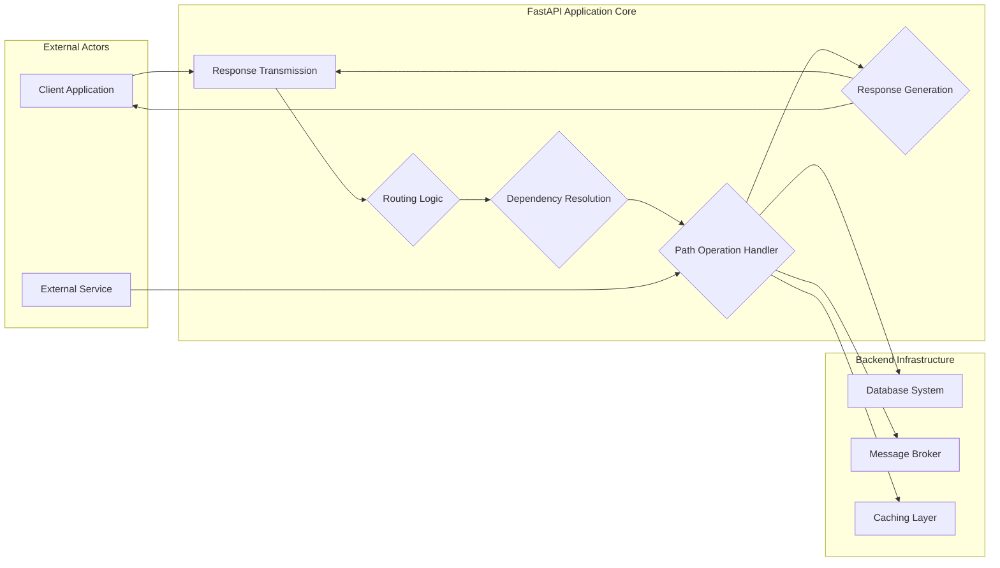
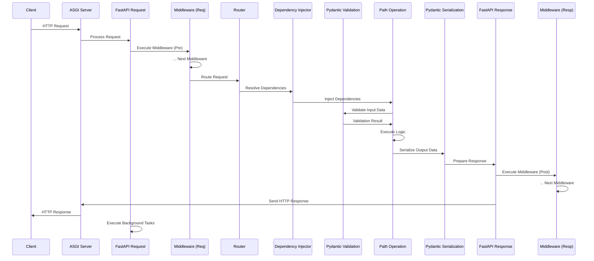

# Project Design Document: FastAPI (Improved)

**Version:** 1.1
**Date:** October 26, 2023
**Author:** Gemini (AI Language Model)

## 1. Introduction

This document provides an enhanced architectural design of the FastAPI project, an asynchronous Python web framework for building APIs. Building upon the previous version, this iteration offers more granular detail on key components, data flow, and security considerations, making it even more suitable for subsequent threat modeling activities.

## 2. Goals and Objectives

The primary goals of the FastAPI project remain:

*   To provide a high-performance web framework based on standard Python type hints.
*   To enable rapid development of APIs with less code and increased developer productivity.
*   To produce production-ready APIs with automatic data validation, serialization, and documentation.
*   To generate interactive API documentation automatically using the OpenAPI standard.
*   To leverage asynchronous programming (ASGI) for improved concurrency and performance under load.

## 3. Architectural Overview

FastAPI leverages the strengths of Starlette for its core web functionalities and Pydantic for robust data validation and settings management. Its architecture is designed for both developer ease of use and high performance.

**High-Level Components:**

*   **Client Application:** Any external entity (web browser, mobile app, script, another service) initiating requests to the FastAPI API.
*   **External Service:**  Other services that might interact with the FastAPI application, potentially triggering internal logic.
*   **Request Reception:** The initial stage where the FastAPI application receives and processes incoming HTTP requests.
*   **Routing Logic:** The component responsible for analyzing the incoming request's path and HTTP method to determine the appropriate handler.
*   **Dependency Resolution:** The system that manages and injects required dependencies into the path operation handler.
*   **Path Operation Handler:** The specific Python function defined by the developer to handle the business logic for a particular API endpoint.
*   **Response Generation:** The process of constructing and formatting the HTTP response to be sent back to the client.
*   **Response Transmission:** The final stage of sending the generated HTTP response back to the requesting client.
*   **Database System:** Persistent storage used by the application.
*   **Message Broker:**  A system for asynchronous communication and task queuing.
*   **Caching Layer:**  A mechanism for storing frequently accessed data to improve performance.

## 4. Detailed Architecture

FastAPI's architecture is built upon several interacting components:

*   **Request Handling Layer:**
    *   **Purpose:**  Receives and initially processes incoming HTTP requests.
    *   **Functionality:** Parses headers, body, query parameters, and determines the HTTP method and path.
    *   **Key Components:**  Underlying ASGI server (Uvicorn, Hypercorn), Starlette's request handling.
*   **Routing and Dispatching:**
    *   **Purpose:** Maps incoming requests to the appropriate path operation function.
    *   **Functionality:**  Maintains a registry of routes and their associated handlers, performs path matching (including path parameters).
    *   **Key Components:** `APIRouter`, path decorators (`@app.get`, `@app.post`), route matching algorithms.
*   **Dependency Injection Framework:**
    *   **Purpose:** Manages the creation, lifecycle, and injection of dependencies into path operation functions.
    *   **Functionality:** Allows for defining reusable logic and resources that can be easily injected, promoting modularity and testability. Supports synchronous and asynchronous dependencies.
    *   **Key Components:**  `Depends` function, dependency callables, dependency caching mechanisms.
*   **Path Operation Function Execution:**
    *   **Purpose:** Executes the user-defined logic for a specific API endpoint.
    *   **Functionality:** Receives validated input data, interacts with backend services, and returns data to be used for the response.
    *   **Key Components:**  User-defined Python functions, access to injected dependencies.
*   **Data Validation and Serialization (Pydantic Integration):**
    *   **Purpose:** Ensures data integrity and consistency for both incoming requests and outgoing responses.
    *   **Functionality:** Uses Pydantic models to define data structures and types, automatically validates incoming data against these models, and serializes response data into the desired format (typically JSON).
    *   **Key Components:** `pydantic.BaseModel`, field definitions, validation logic, serialization methods.
*   **Response Handling and Rendering:**
    *   **Purpose:** Constructs and formats the HTTP response to be sent back to the client.
    *   **Functionality:** Sets appropriate HTTP status codes, headers, and serializes the response body. Supports various response types and media types.
    *   **Key Components:** `Response` class, custom response classes, media type handling.
*   **OpenAPI Schema Generation:**
    *   **Purpose:** Automatically generates an OpenAPI schema describing the API endpoints, request/response structures, and other relevant information.
    *   **Functionality:**  Inspects the defined routes, Pydantic models, and dependencies to create a comprehensive API specification.
    *   **Key Components:**  OpenAPI schema generation logic, integration with Swagger UI and ReDoc for interactive documentation.
*   **Middleware Pipeline:**
    *   **Purpose:** Allows for executing code before or after the main request processing logic.
    *   **Functionality:** Enables cross-cutting concerns like authentication, authorization, logging, request/response modification, and error handling. Middleware is executed in a defined order.
    *   **Key Components:** Middleware functions, application-level middleware configuration.
*   **Exception Handling Mechanism:**
    *   **Purpose:** Provides a structured way to handle errors and exceptions that occur during request processing.
    *   **Functionality:** Allows for defining custom exception handlers to return specific error responses and log errors.
    *   **Key Components:** Exception handler functions, application-level exception handler registration.
*   **Background Tasks Management:**
    *   **Purpose:** Enables the execution of tasks after a response has been sent to the client, without blocking the request.
    *   **Functionality:** Useful for long-running operations or tasks that don't need immediate feedback to the client.
    *   **Key Components:** `BackgroundTask` class, background task queue.

## 5. Key Components (Detailed)

This section provides a more in-depth look at the core components within the FastAPI framework:

*   **`FastAPI` Class:**
    *   **Responsibility:** The central application instance. Manages routes, middleware, exception handlers, and other application-level configurations. Serves as the entry point for defining the API.
    *   **Internal Functioning:**  Holds references to routers, middleware stacks, and exception handlers. Delegates request processing to the underlying Starlette application.
*   **`APIRouter`:**
    *   **Responsibility:**  Used to organize and group related API endpoints into logical modules. Promotes code organization and reusability.
    *   **Internal Functioning:** Maintains its own set of routes and middleware, which are then integrated into the main `FastAPI` application when the router is included.
*   **Path Decorators (e.g., `@app.get()`, `@app.post()`):**
    *   **Responsibility:**  Declaratively define the HTTP method and URL path for a path operation function.
    *   **Internal Functioning:**  Register the decorated function with the router, associating it with the specified HTTP method and path pattern.
*   **Pydantic Models (`pydantic.BaseModel`):**
    *   **Responsibility:** Define the structure and data types for request and response bodies, path parameters, and query parameters. Enforce data validation rules.
    *   **Internal Functioning:**  Leverage Python's type hinting system. Pydantic uses these hints to generate validation logic and perform data serialization/deserialization.
*   **`Depends` Function:**
    *   **Responsibility:**  Marks a parameter in a path operation function or another dependency as a dependency to be resolved by the dependency injection system.
    *   **Internal Functioning:**  Instructs FastAPI to execute the dependency callable and inject its return value as the parameter's value.
*   **Middleware Functions:**
    *   **Responsibility:** Implement cross-cutting concerns that need to be executed before or after request processing.
    *   **Internal Functioning:**  Receive the request and a `call_next` function. Can modify the request or response, or execute code before or after calling `call_next` to pass control to the next middleware or the route handler.
*   **Exception Handlers:**
    *   **Responsibility:**  Define how specific types of exceptions should be handled and what response should be returned to the client.
    *   **Internal Functioning:**  Registered with the `FastAPI` application. When an exception occurs, FastAPI checks for a matching handler and executes it.
*   **`BackgroundTask` Class:**
    *   **Responsibility:**  Encapsulates a function to be executed after the response has been sent to the client.
    *   **Internal Functioning:**  The `BackgroundTask` is added to a queue and executed by the ASGI server after the response is completed.

## 6. Data Flow (Detailed)

The data flow within a FastAPI application involves several stages:

1. **Client initiates an HTTP request.**
2. **The ASGI server (e.g., Uvicorn) receives the request.**
3. **FastAPI's request handling layer processes the incoming request.**
4. **Middleware functions are executed in the order they are defined (request phase).**
5. **The Router analyzes the request path and HTTP method.**
6. **The Router identifies the matching path operation function.**
7. **The Dependency Injection system resolves and injects dependencies required by the path operation function.**
8. **Pydantic validates the incoming request data against the defined model (if applicable).**
9. **The path operation function is executed with the validated data and injected dependencies.**
10. **The path operation function returns data.**
11. **Pydantic serializes the returned data into the appropriate response format (typically JSON).**
12. **The Response Handling component constructs the HTTP response, including headers and status code.**
13. **Middleware functions are executed in reverse order (response phase).**
14. **The ASGI server sends the HTTP response back to the client.**
15. **Background tasks (if any) associated with the request are executed.**

## 7. Security Considerations (Enhanced)

This section expands on the security considerations relevant to FastAPI applications:

*   **Input Validation Vulnerabilities:**
    *   **Risk:** Insufficient or incorrect validation of input data can lead to various attacks, including injection flaws (SQL, command injection), cross-site scripting (XSS), and buffer overflows.
    *   **FastAPI's Role:** FastAPI leverages Pydantic for strong type hinting and validation. Developers must define comprehensive validation rules in their Pydantic models.
    *   **Mitigation:**  Thoroughly define Pydantic models with appropriate data types, constraints (e.g., `min_length`, `max_length`, regular expressions), and custom validators. Be mindful of nested data structures.
*   **Authentication and Authorization Weaknesses:**
    *   **Risk:**  Lack of proper authentication allows unauthorized access to API endpoints. Weak authorization can lead to users accessing resources they shouldn't.
    *   **FastAPI's Role:** FastAPI provides tools and flexibility for implementing authentication and authorization (e.g., using `Security` dependencies).
    *   **Mitigation:** Implement robust authentication mechanisms (e.g., OAuth 2.0, JWT). Enforce granular authorization checks based on user roles or permissions. Securely store and manage credentials.
*   **Dependency Injection Exploits:**
    *   **Risk:**  If not carefully designed, the dependency injection system could be exploited to inject malicious code or access unintended resources.
    *   **FastAPI's Role:** FastAPI's dependency injection is generally safe, but developers need to be cautious about the dependencies they introduce and how they are used.
    *   **Mitigation:**  Thoroughly vet dependencies. Avoid injecting dependencies that perform privileged operations directly into untrusted contexts. Be mindful of the lifecycle and scope of dependencies.
*   **OpenAPI Exposure:**
    *   **Risk:**  While beneficial for documentation, the automatically generated OpenAPI schema can reveal sensitive information about the API's structure and functionality to potential attackers.
    *   **FastAPI's Role:** FastAPI automatically generates OpenAPI.
    *   **Mitigation:**  Restrict access to the OpenAPI documentation endpoint in production environments. Consider selectively excluding sensitive endpoints or data structures from the schema.
*   **Cross-Site Scripting (XSS) via Response Data:**
    *   **Risk:** If the API returns user-generated content without proper sanitization, it can be vulnerable to XSS attacks.
    *   **FastAPI's Role:** FastAPI primarily deals with JSON APIs, reducing the direct risk of XSS. However, if the API serves HTML or allows user-controlled data in responses, sanitization is crucial.
    *   **Mitigation:**  Sanitize user-generated content before including it in responses. Use appropriate templating engines with built-in XSS protection if rendering HTML.
*   **Cross-Site Request Forgery (CSRF):**
    *   **Risk:**  Malicious websites can trick authenticated users into making unintended requests to the API.
    *   **FastAPI's Role:** FastAPI doesn't provide built-in CSRF protection.
    *   **Mitigation:** Implement CSRF protection mechanisms, such as synchronizer tokens, especially for state-changing operations initiated from web browsers.
*   **Rate Limiting and Denial of Service (DoS):**
    *   **Risk:**  APIs can be overwhelmed by excessive requests, leading to denial of service.
    *   **FastAPI's Role:** FastAPI itself doesn't have built-in rate limiting.
    *   **Mitigation:** Implement rate limiting middleware or use external services to control the number of requests from a single IP address or user.
*   **Insecure Dependencies:**
    *   **Risk:**  Vulnerabilities in third-party libraries used by the FastAPI application can be exploited.
    *   **FastAPI's Role:** FastAPI relies on several dependencies.
    *   **Mitigation:** Regularly audit and update dependencies to patch known vulnerabilities. Use tools like `pip-audit` or `safety` to identify vulnerable packages.

## 8. Deployment Considerations (Specific Examples)

FastAPI applications can be deployed in various environments:

*   **Cloud Platforms:**
    *   **AWS:**
        *   **ECS/Fargate:** Containerize the FastAPI application with Docker and deploy it on ECS or Fargate for scalable and managed container orchestration.
        *   **Lambda:** Deploy the FastAPI application as a serverless function using API Gateway to trigger the function. Requires a library like Mangum to adapt ASGI to the AWS Lambda environment.
    *   **Google Cloud Platform (GCP):**
        *   **Cloud Run:** Deploy the containerized FastAPI application on Cloud Run for a serverless container execution environment.
        *   **App Engine:** Deploy the application directly on App Engine, leveraging its managed infrastructure.
    *   **Azure:**
        *   **Azure Container Instances (ACI):** Deploy the containerized application on ACI for a serverless container offering.
        *   **Azure Functions:** Similar to AWS Lambda, deploy the FastAPI application as serverless functions using an adapter like `azure-functions-asgi`.
*   **Containerization (Docker):**
    *   Package the FastAPI application and its dependencies into a Docker image. This image can then be deployed on various container runtimes.
*   **Traditional Servers (VMs, Bare Metal):**
    *   Deploy the application directly on a virtual or physical server, typically using a process manager like `systemd` or `supervisor` to manage the ASGI server (Uvicorn/Hypercorn).

## 9. Technologies Used (Interdependencies)

*   **Python:** The core language for FastAPI development.
*   **Starlette:** Provides the foundational web framework functionalities, including request/response handling, routing, and middleware. FastAPI builds upon Starlette's ASGI implementation.
*   **Pydantic:** Used for data validation, serialization, and settings management. FastAPI deeply integrates with Pydantic for type hinting and automatic data handling.
*   **Uvicorn/Hypercorn:** Asynchronous ASGI servers used to run FastAPI applications in production. They handle concurrent requests efficiently.
*   **OpenAPI (Swagger):** The standard used for generating API documentation. FastAPI automatically creates an OpenAPI schema based on the application's code.
*   **JSON:** The primary data serialization format used for request and response bodies in most FastAPI applications.

## 10. Future Considerations

*   Detailed threat modeling sessions based on this design document.
*   Analysis of common security patterns and best practices for FastAPI applications.
*   Investigation of advanced security features and integrations (e.g., API gateways, web application firewalls).
*   Performance testing and optimization strategies for FastAPI deployments.

This improved design document provides a more detailed and comprehensive understanding of the FastAPI project's architecture, making it a more effective resource for threat modeling and security analysis.