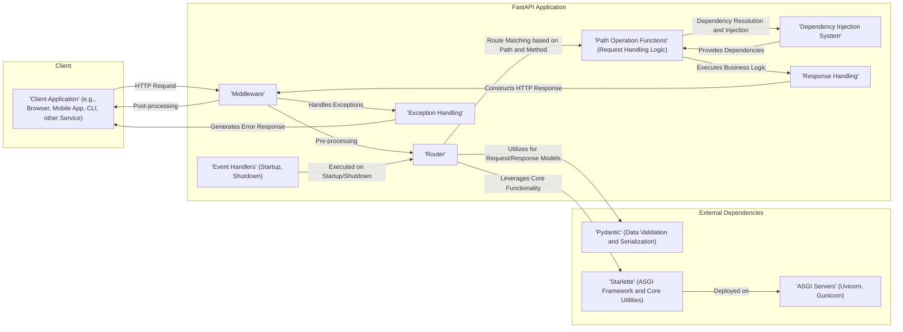

# Project Design Document: FastAPI Framework

**Version:** 1.1
**Date:** October 26, 2023
**Author:** AI Software Architect

## 1. Introduction

This document provides an enhanced design overview of the FastAPI framework, a modern, high-performance web framework for building APIs with Python 3.7+. It leverages standard Python type hints and is built upon Starlette and Pydantic. This refined document aims to provide a clearer understanding of the framework's architecture, component interactions, and security considerations, making it more effective as input for subsequent threat modeling activities. The focus is on providing the necessary context for identifying potential vulnerabilities and attack vectors.

## 2. Goals and Objectives

The core design goals of FastAPI are:

* **Developer Experience:** To offer an intuitive and efficient development process, minimizing boilerplate code and maximizing productivity.
* **High Performance:** To achieve performance comparable to Node.js and Go through the use of Starlette's ASGI implementation and efficient data handling with Pydantic.
* **Adherence to Standards:** To fully embrace and implement OpenAPI and JSON Schema standards, ensuring automatic API documentation and robust data validation.
* **Enhanced Code Quality:** To promote code readability and maintainability through the enforced use of Python type hints, enabling better static analysis and IDE support.
* **Flexibility and Extensibility:** To provide a modular architecture that allows seamless integration with other Python libraries and frameworks, catering to diverse application needs.

## 3. High-Level Architecture

FastAPI applications orchestrate several key components to process incoming requests and generate responses. The central element is the `FastAPI` class instance, acting as the application's entry point.

**Key Architectural Components:**

* **'Client Application':** Any system or application that initiates HTTP requests to interact with the FastAPI application.
* **'FastAPI Application':** The core instance of the `FastAPI` class, responsible for managing routing, middleware, and the overall request lifecycle.
* **'Router':**  The component that maps incoming HTTP requests (based on their path and method) to the appropriate 'Path Operation Functions'.
* **'Middleware':** Functions that intercept requests and responses, allowing for pre-processing (e.g., authentication, logging) and post-processing (e.g., adding headers).
* **'Dependency Injection System':**  A mechanism for automatically providing dependencies (services, resources) to 'Path Operation Functions', enhancing modularity and testability.
* **'Path Operation Functions':** Python functions decorated with HTTP methods (e.g., `@app.get()`, `@app.post()`), containing the specific logic for handling requests to particular endpoints.
* **'Response Handling':** The process of converting the output of 'Path Operation Functions' into standardized HTTP responses, often leveraging Pydantic models for structured data serialization.
* **'Exception Handling':**  Mechanisms for catching and managing errors that occur during request processing, enabling the generation of informative error responses.
* **'Event Handlers':** Functions executed at specific points in the application lifecycle, such as startup (for initialization) and shutdown (for cleanup).
* **'Pydantic':**  A crucial external library providing data validation and serialization capabilities, heavily integrated with FastAPI for request and response data handling based on type hints.
* **'Starlette':** The underlying ASGI framework that provides essential functionalities like routing, middleware support, and request/response handling, forming the foundation of FastAPI.
* **'ASGI Servers':**  Servers like Uvicorn and Gunicorn that implement the Asynchronous Server Gateway Interface (ASGI) specification, used to run and serve the FastAPI application.

## 4. Component Architecture Details

This section provides a more in-depth look at the individual components and their functionalities.

### 4.1. Routing Mechanism

* **Path-Based Mapping:** FastAPI uses decorators (e.g., `@app.get("/items/{item_id}")`) to associate specific HTTP methods and URL paths with corresponding 'Path Operation Functions'.
* **Path Parameter Extraction:**  Dynamic segments in URLs (e.g., `{item_id}`) are automatically extracted as path parameters and passed as arguments to the handler function.
* **Query Parameter Handling:** Data appended to the URL as query parameters is automatically parsed and made available within the 'Path Operation Function'.
* **Route Precedence:** The order in which routes are defined is significant; FastAPI matches the first route that satisfies the incoming request. This is important for avoiding unintended route matches.

### 4.2. Middleware Functionality

* **Request-Response Interception:** Middleware functions operate on the request object before it reaches the 'Path Operation Function' and on the response object before it's sent back to the client.
* **Ordered Execution:** Middleware is executed in the order it's added to the application instance. This order is crucial for scenarios like authentication followed by authorization.
* **Common Middleware Use Cases:**
    * **Authentication:** Verifying the identity of the client making the request.
    * **Authorization:** Determining if the authenticated client has permission to access the requested resource.
    * **CORS Handling:** Configuring Cross-Origin Resource Sharing to control which domains can access the API.
    * **Logging:** Recording request and response information for auditing and debugging.
    * **Request/Response Modification:** Altering the request or response headers or body.
* **Implementation via `app.add_middleware()`:** Middleware components are registered with the FastAPI application instance using the `app.add_middleware()` method.

### 4.3. Dependency Injection System Explained

* **Declarative Dependencies:** Dependencies are declared as parameters with type hints in the signatures of 'Path Operation Functions' or other dependency functions.
* **Automatic Resolution:** FastAPI's dependency injection system automatically resolves these dependencies by looking for providers based on the type hints.
* **Dependency Providers:** Functions or classes that provide the actual dependency instances. These can have their own dependencies, creating a dependency graph.
* **Benefits for Security:**
    * **Centralized Security Logic:**  Authentication and authorization logic can be implemented as dependencies, ensuring consistent enforcement across multiple endpoints.
    * **Improved Testability:**  Dependencies can be easily mocked or stubbed during testing.
    * **Code Reusability:** Common functionalities can be encapsulated in dependencies and reused across different parts of the application.

### 4.4. Request Handling Process

* **Automatic Data Parsing:** FastAPI automatically parses the request body based on the declared type hints in the 'Path Operation Function' parameters. It supports various content types, including JSON and form data.
* **Data Validation with Pydantic:** Incoming request data is validated against the structure and types defined in Pydantic models associated with the request parameters. This helps prevent invalid data from reaching the application logic.
* **Type Hint Enforcement:** Python type hints are fundamental for both data parsing and validation, ensuring data integrity and reducing runtime errors.

### 4.5. Response Handling Mechanism

* **Serialization using Pydantic:** By default, FastAPI uses Pydantic models to serialize response data into JSON format, ensuring a consistent and well-defined API output.
* **Flexibility in Response Types:** FastAPI supports returning various response types, including:
    * JSON responses (default)
    * Plain text responses
    * HTML responses
    * File responses
    * Streaming responses
    * Custom response objects
* **HTTP Status Code Management:** Developers can explicitly set appropriate HTTP status codes for responses to indicate the outcome of the request.

### 4.6. Exception Handling Strategies

* **Global Exception Handlers:** Functions can be registered to handle specific types of exceptions that might occur during request processing, allowing for centralized error management.
* **HTTP Exception Integration:** FastAPI provides built-in support for raising and handling HTTP exceptions (e.g., `HTTPException(status_code=404, detail="Item not found")`), simplifying the process of returning standard HTTP error responses.
* **Customizable Error Responses:** Developers can define custom exception handlers to tailor the format and content of error responses, potentially including error codes or more detailed information (with careful consideration of security implications).

### 4.7. Event Handler Utilization

* **Startup Event (`@app.on_event("startup")`):** This event handler is executed when the FastAPI application starts. Common use cases include:
    * Initializing database connections.
    * Loading configuration settings.
    * Performing background tasks initialization.
* **Shutdown Event (`@app.on_event("shutdown")`):** This event handler is executed when the FastAPI application is shutting down. Common use cases include:
    * Closing database connections.
    * Releasing resources.
    * Performing cleanup tasks.

## 5. Data Flow Through the Application

The following steps illustrate the typical flow of data when a request is processed by a FastAPI application:

1. **A client sends an HTTP request to the application.**
2. **The ASGI Server (e.g., Uvicorn) receives the incoming request.**
3. **The ASGI Server passes the request to the FastAPI application (via Starlette).**
4. **Configured 'Middleware' components are executed sequentially for pre-processing.**
5. **The 'Router' component analyzes the request path and HTTP method to find a matching 'Path Operation Function'.**
6. **The 'Dependency Injection System' resolves and injects the necessary dependencies into the identified 'Path Operation Function'.**
7. **Request data is parsed and validated against the defined Pydantic models.**
8. **The 'Path Operation Function' executes the core business logic to handle the request.**
9. **The 'Response Handling' mechanism constructs an HTTP response, often serializing data using Pydantic.**
10. **'Middleware' components are executed in reverse order for post-processing of the response.**
11. **FastAPI sends the constructed HTTP response back to the ASGI Server.**
12. **The ASGI Server transmits the response back to the originating client.**
13. **'Exception Handling' can occur at any stage, potentially interrupting the normal flow and generating an error response.**

## 6. Security Considerations for Threat Modeling

This section highlights key security aspects of FastAPI applications that are crucial for identifying potential threats and vulnerabilities during threat modeling.

* **Input Validation Vulnerabilities:**
    * **Importance of Strict Validation:**  Insufficient or improper validation of input data (via Pydantic models) can lead to various injection attacks (e.g., SQL injection, command injection) and data integrity issues.
    * **Type Coercion Risks:** Understand how Pydantic handles type coercion and potential security implications.
* **Authentication and Authorization Weaknesses:**
    * **Insecure Authentication Schemes:**  Weak or improperly implemented authentication mechanisms can allow unauthorized access.
    * **Broken Authorization Logic:** Flaws in authorization logic can lead to privilege escalation or access to sensitive resources by unauthorized users.
    * **Session Management Issues:** Vulnerabilities in session management (e.g., session fixation, insecure storage) can compromise user accounts.
* **Cross-Site Scripting (XSS):**
    * **Unsafe Output Rendering:** If the API renders user-provided data in HTML without proper sanitization or encoding, it can be vulnerable to XSS attacks.
    * **Response Header Security:**  Lack of appropriate security headers can facilitate XSS attacks.
* **Cross-Site Request Forgery (CSRF):**
    * **State-Changing Operations:** APIs performing state-changing operations without proper CSRF protection are vulnerable to malicious requests from other websites.
* **Dependency Vulnerabilities:**
    * **Third-Party Library Risks:**  Using outdated or vulnerable dependencies can introduce security flaws into the application. Regular dependency updates and vulnerability scanning are essential.
* **Rate Limiting and Denial of Service (DoS):**
    * **Lack of Rate Limiting:** APIs without rate limiting are susceptible to DoS attacks, where malicious actors can overwhelm the server with excessive requests.
* **Insecure Configuration:**
    * **Exposed Secrets:** Storing sensitive information (API keys, database credentials) in code or easily accessible configuration files poses a significant risk.
    * **Default Configurations:**  Using default configurations for security-sensitive components can leave the application vulnerable.
* **Information Disclosure:**
    * **Verbose Error Messages:**  Exposing detailed error messages in production can reveal sensitive information about the application's internal workings.
    * **Unprotected Endpoints:**  Exposing sensitive data through unprotected API endpoints can lead to unauthorized access.
* **Injection Attacks:**
    * **SQL Injection:**  Occurs when user-supplied data is directly incorporated into SQL queries without proper sanitization.
    * **Command Injection:**  Occurs when user-supplied data is used to execute system commands.
    * **Log Injection:**  Malicious data injected into logs can be used to manipulate log analysis or inject false information.
* **API Security Best Practices:**
    * **HTTPS Enforcement:**  Ensuring all communication is encrypted using HTTPS is crucial.
    * **Security Headers:**  Implementing appropriate security headers (e.g., `Strict-Transport-Security`, `X-Content-Type-Options`, `X-Frame-Options`) can enhance security.

## 7. Deployment Environment Considerations

The security posture of a FastAPI application is also influenced by its deployment environment.

* **Containerization (Docker):**
    * **Image Security:**  Using secure base images and regularly scanning container images for vulnerabilities is important.
    * **Orchestration Security (Kubernetes):** Securely configuring container orchestration platforms is crucial.
* **Cloud Platforms (AWS, Azure, GCP):**
    * **Cloud Service Configurations:**  Properly configuring cloud services (e.g., load balancers, firewalls, IAM roles) is essential for security.
    * **Shared Responsibility Model:** Understanding the security responsibilities shared between the cloud provider and the application developer is critical.
* **Reverse Proxies (Nginx, HAProxy):**
    * **SSL/TLS Termination:**  Securely configuring SSL/TLS termination at the reverse proxy level.
    * **Security Rules:** Implementing security rules (e.g., rate limiting, blocking malicious requests) at the reverse proxy.

## 8. Technology Stack Summary

* **Programming Language:** Python (3.7+)
* **Web Framework:** FastAPI
* **ASGI Framework:** Starlette
* **Data Validation and Serialization:** Pydantic
* **ASGI Servers:** Uvicorn, Gunicorn
* **Type Hinting:** `typing` module
* **API Documentation:** OpenAPI (via Swagger UI and ReDoc)

## 9. Future Architectural Directions

* **Enhanced GraphQL Integration:** Exploring more seamless integration with GraphQL for applications requiring flexible data querying.
* **Advanced WebSocket Features:**  Potentially adding more advanced features and patterns for real-time communication using WebSockets.
* **Improved Observability and Monitoring:**  Further integration with monitoring and logging tools to provide deeper insights into application performance and security.
* **Standardized Security Patterns:**  Developing and promoting standardized security patterns and best practices for FastAPI applications.

This improved design document offers a more detailed and structured understanding of the FastAPI framework, emphasizing aspects relevant to security and threat modeling. It provides a solid foundation for identifying potential vulnerabilities and designing appropriate mitigation strategies.