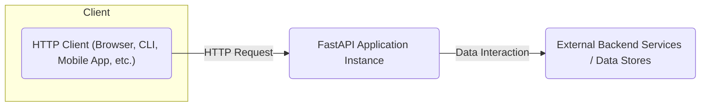
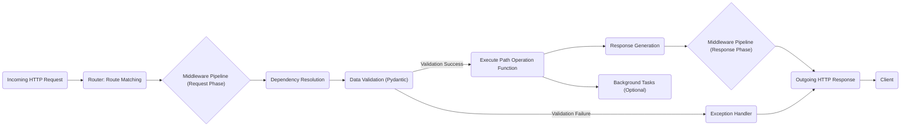
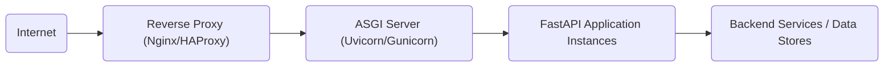

# Project Design Document: FastAPI (Improved)

**Version:** 1.1
**Date:** October 26, 2023
**Author:** AI Software Architect

## 1. Introduction

This document provides an enhanced architectural design of the FastAPI project, an asynchronous Python web framework for building APIs. It aims to offer a clear and comprehensive understanding of the framework's structure, components, and interactions, specifically tailored for effective threat modeling. This revision builds upon the previous version, incorporating more detail and clarity.

## 2. Goals and Objectives

The primary goal remains to clearly articulate the design of FastAPI to facilitate effective threat modeling. Specific objectives include:

*   Precisely identifying key components and their responsibilities within the request lifecycle.
*   Detailed mapping of data and control flow within the framework, highlighting potential interception points.
*   Clearly outlining external dependencies and interfaces, including communication protocols.
*   Providing a robust foundation for identifying potential vulnerabilities, attack vectors, and security control points.

## 3. System Architecture

### 3.1. High-Level Architecture



*   **HTTP Client:** Represents any entity initiating communication with the FastAPI application via HTTP. This includes web browsers, command-line tools, mobile applications, and other services.
*   **FastAPI Application Instance:**  A running instance of the FastAPI application, encompassing all its internal components and logic.
*   **External Backend Services / Data Stores:**  External systems the FastAPI application interacts with to fulfill requests, such as databases, other APIs, message brokers, or file storage.

### 3.2. Detailed Architecture

```mermaid
graph LR
    subgraph "FastAPI Application Instance"
        direction LR
        A("Router")
        B("Dependency Injection System")
        C("Middleware Pipeline")
        D("Path Operation Function")
        E("Response Handling")
        F("Data Validation & Serialization (Pydantic)")
        G("Exception Handling")
        H("OpenAPI Schema Generation")
    end

    style A fill:#f9f,stroke:#333,stroke-width:2px
    style B fill:#ccf,stroke:#333,stroke-width:2px
    style C fill:#ddf,stroke:#333,stroke-width:2px
    style D fill:#eef,stroke:#333,stroke-width:2px
    style E fill:#ffe,stroke:#333,stroke-width:2px
    style F fill:#efe,stroke:#333,stroke-width:2px
    style G fill:#fdd,stroke:#333,stroke-width:2px
    style H fill:#def,stroke:#333,stroke-width:2px

    "Incoming HTTP Request" --> A
    A -- "Route Matching" --> B
    B -- "Dependency Resolution" --> C
    C -- "Request Processing" --> D
    D -- "Data Input/Output" --> F
    F -- "Validation/Serialization" --> D
    D -- "Response Generation" --> E
    E --> "Outgoing HTTP Response"
    D -- "Exception Raised" --> G
    G --> E
    A -- "Schema Definition" --> H
    H --> "OpenAPI Specification (JSON/YAML)"
```

*   **Router:** The central component responsible for receiving incoming HTTP requests and directing them to the appropriate `Path Operation Function` based on the URL path and HTTP method.
*   **Dependency Injection System:** Manages the creation, lifecycle, and injection of dependencies required by `Path Operation Functions`. This promotes modularity, testability, and allows for centralized logic (e.g., authentication).
*   **Middleware Pipeline:** An ordered sequence of functions that intercept requests before they reach the `Path Operation Function` and responses before they are sent. Middleware can perform tasks like authentication, logging, request/response modification, and setting headers.
*   **Path Operation Function:** The user-defined function associated with a specific API endpoint. It contains the core business logic for handling requests and generating responses.
*   **Response Handling:**  Responsible for taking the output of the `Path Operation Function` and formatting it into a valid HTTP response, including setting status codes, headers, and the response body.
*   **Data Validation & Serialization (Pydantic):** Leverages Pydantic models to define the expected structure and data types for request and response bodies, query parameters, and path parameters. This ensures data integrity and facilitates automatic serialization and deserialization.
*   **Exception Handling:**  Provides a mechanism to gracefully handle exceptions that occur during request processing, allowing for custom error responses and logging.
*   **OpenAPI Schema Generation:** Automatically generates an OpenAPI (Swagger) specification based on the defined routes, data models, and docstrings. This documentation describes the API's endpoints, request/response formats, and parameters.

## 4. Key Components

*   **`FastAPI` Class:** The core application object, acting as the entry point for defining routes, middleware, exception handlers, and other application-level configurations.
*   **`APIRouter`:**  A class used to organize related `Path Operation Functions` into logical groups, allowing for modular API design and the application of common configurations.
*   **`Path Operation Functions`:** Decorated functions (using decorators like `@app.get()`, `@app.post()`, etc.) that define the logic for handling specific API endpoints. They receive validated input and return data to be serialized into a response.
*   **Pydantic Models:** Python classes inheriting from `pydantic.BaseModel` used to define the structure and validation rules for request and response data. They enable automatic data parsing, validation, and serialization.
*   **Dependencies:** Reusable components or functions that can be injected into `Path Operation Functions`. Dependencies can provide services like database connections, authentication checks, or configuration settings.
*   **Middleware Functions:** Asynchronous functions that are executed before or after the `Path Operation Function`. They have access to the request and response objects and can modify them or perform side effects.
*   **Exception Handlers:** Functions registered to handle specific types of exceptions raised during request processing. They receive the request and the exception object and return a custom response.
*   **Security Utilities (e.g., `OAuth2PasswordBearer`):** Built-in or third-party utilities that facilitate the implementation of common security schemes like OAuth 2.0.
*   **Background Tasks:** Allows the execution of functions after a response has been sent to the client, useful for non-blocking operations like sending emails or processing data asynchronously.
*   **CORS Middleware (`CORSMiddleware`):**  Middleware that adds necessary headers to enable or restrict Cross-Origin Resource Sharing, controlling which domains can make requests to the API.
*   **Gzip Middleware (`GZipMiddleware`):** Middleware that compresses responses using gzip to reduce bandwidth usage.
*   **Static Files Handling (`StaticFiles`):**  Allows serving static files (e.g., HTML, CSS, JavaScript) directly from specified directories.
*   **Template Engine Integration (e.g., Jinja2):**  Support for rendering dynamic HTML content using template engines.
*   **WebSocket Support:** Functionality for building real-time, bidirectional communication channels using WebSockets.

## 5. Data Flow

The typical data flow for an incoming HTTP request within a FastAPI application is as follows:

1. **Request Reception:** An HTTP request is received by the underlying ASGI server (e.g., Uvicorn).
2. **Routing:** The `Router` component analyzes the request's path and HTTP method to find a matching `Path Operation Function`.
3. **Middleware Execution (Request Phase):** Registered middleware functions are executed sequentially in the order they were added. Each middleware can process or modify the request before passing it to the next middleware or the `Path Operation Function`.
4. **Dependency Resolution:** The Dependency Injection system resolves the dependencies declared by the matched `Path Operation Function`. This involves instantiating or retrieving the required dependency instances.
5. **Data Validation:** Pydantic models validate the incoming request data (path parameters, query parameters, request body, headers) against the defined schemas. If validation fails, a validation error exception is raised.
6. **Path Operation Execution:** The matched `Path Operation Function` is invoked with the validated input data and resolved dependencies. This function contains the core business logic.
7. **Response Generation:** The `Path Operation Function` returns data, which is then processed by the Response Handling component. This involves serializing the data (typically to JSON) and setting appropriate status codes and headers.
8. **Middleware Execution (Response Phase):** Registered middleware functions are executed in reverse order. Each middleware can process or modify the response before it is sent to the client.
9. **Exception Handling:** If an exception occurred during any of the previous steps, the appropriate exception handler is invoked. The handler can generate a custom error response.
10. **Response Transmission:** The ASGI server sends the generated HTTP response back to the client.
11. **Background Tasks (Optional):** If any background tasks were initiated within the `Path Operation Function`, they are executed asynchronously after the response has been sent.



## 6. Security Considerations

FastAPI inherently incorporates several features and promotes practices that enhance security, but developers must still be vigilant:

*   **Strict Input Validation:** Pydantic's data validation acts as a crucial first line of defense against various injection attacks (e.g., SQL injection, command injection) and data manipulation attempts by ensuring that incoming data conforms to the expected schema.
*   **Type Hints and Data Integrity:** Encouraging the use of type hints improves code readability and helps prevent type-related errors that could lead to unexpected behavior or vulnerabilities.
*   **Automatic OpenAPI Documentation:** While beneficial, the generated OpenAPI documentation also reveals the API's structure and endpoints, which could be leveraged by attackers. Secure deployment and access control to this documentation are important.
*   **Built-in Security Utilities:** FastAPI provides tools for implementing authentication and authorization, but proper configuration and secure storage of credentials are paramount. Misconfiguration can lead to significant vulnerabilities.
*   **Dependency Management Security:**  FastAPI relies on external libraries. Regularly auditing and updating dependencies is crucial to patch known vulnerabilities in those libraries. Supply chain attacks targeting dependencies are a growing concern.
*   **CORS Configuration:** Incorrectly configured CORS middleware can allow malicious websites to make unauthorized requests to the API, potentially leading to data breaches or other attacks.
*   **HTTPS Enforcement:** While FastAPI doesn't enforce HTTPS directly, deploying it behind a reverse proxy that handles TLS termination is essential to protect data in transit. Lack of HTTPS exposes sensitive data to interception.
*   **Rate Limiting Implementation:** Implementing rate limiting (often via middleware) is crucial to protect against denial-of-service (DoS) and brute-force attacks.
*   **Logging and Monitoring:** Comprehensive logging of requests, responses, and errors is vital for security monitoring, incident detection, and forensic analysis. Sensitive information should be handled carefully in logs.
*   **Secure Defaults and Configuration:** While FastAPI aims for secure defaults, developers must be aware of configuration options that could introduce vulnerabilities if not properly configured (e.g., allowing overly permissive access).
*   **Exception Handling Security:**  Carefully consider the information revealed in error responses. Verbose error messages can expose internal details that attackers can exploit.
*   **Input Sanitization and Output Encoding:** While Pydantic handles validation, developers might need to implement additional sanitization for specific use cases and ensure proper output encoding to prevent cross-site scripting (XSS) attacks if rendering dynamic content.

## 7. Deployment Architecture

FastAPI applications are typically deployed using ASGI servers. Common deployment architectures include:

*   **Reverse Proxy (e.g., Nginx, HAProxy):** Handles TLS termination, load balancing across multiple application instances, request routing, and serving static files. This is a critical component for security and scalability.
*   **ASGI Server (e.g., Uvicorn, Gunicorn):** Runs one or more instances of the FastAPI application, handling incoming requests asynchronously. Uvicorn is often preferred for its speed, while Gunicorn offers more process management features.
*   **FastAPI Application Code:** The core Python code defining the API endpoints and business logic.
*   **Operating System:** The underlying operating system hosting the application and its dependencies. Security hardening of the OS is important.
*   **Containerization (e.g., Docker):** Packaging the application and its dependencies into containers provides consistency and simplifies deployment. Container security is a key consideration.
*   **Cloud Platform (e.g., AWS, Azure, GCP):** Deployment on cloud platforms introduces additional infrastructure components like load balancers, firewalls, and security groups, which need to be configured securely.



## 8. Technologies Used

*   **Python (3.7+):** The primary programming language.
*   **Starlette:** The lightweight ASGI framework upon which FastAPI is built, providing core functionalities like routing and middleware.
*   **Pydantic:** For data validation, serialization, and deserialization using Python type hints.
*   **Uvicorn:** A lightning-fast ASGI server, often used in development and production.
*   **Gunicorn:** A production-ready WSGI/ASGI server with robust process management.
*   **Jinja2 (Optional):** A popular template engine for rendering dynamic HTML.
*   **SQLAlchemy (Optional):** A powerful SQL toolkit and ORM for database interaction.
*   **Databases (e.g., PostgreSQL, MySQL, MongoDB):** For persistent data storage.
*   **Message Brokers (e.g., RabbitMQ, Kafka):** For asynchronous communication and task queuing.
*   **Redis/Memcached:** For caching and session management.

## 9. Future Considerations

*   **Enhanced Security Best Practices Documentation:** Provide more comprehensive and actionable guidance on security best practices for FastAPI applications, including common pitfalls and mitigation strategies.
*   **Built-in Rate Limiting Middleware:**  Consider including a built-in rate limiting middleware with configurable options.
*   **Improved Authentication and Authorization Integrations:**  Offer more seamless integrations with popular authentication and authorization providers and standards.
*   **Advanced Observability Features:** Enhance support for distributed tracing, metrics collection, and logging integrations for better monitoring and debugging in production environments.
*   **Security Auditing Tools and Guidelines:**  Develop or recommend tools and guidelines for performing security audits of FastAPI applications.

This improved design document provides a more detailed and nuanced understanding of the FastAPI project's architecture, specifically tailored for threat modeling activities. By carefully examining the components, data flow, and security considerations outlined here, security professionals can more effectively identify potential vulnerabilities and develop appropriate security controls.