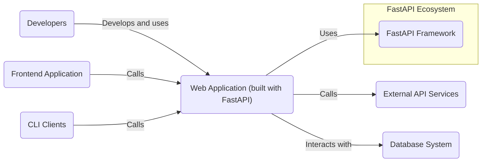
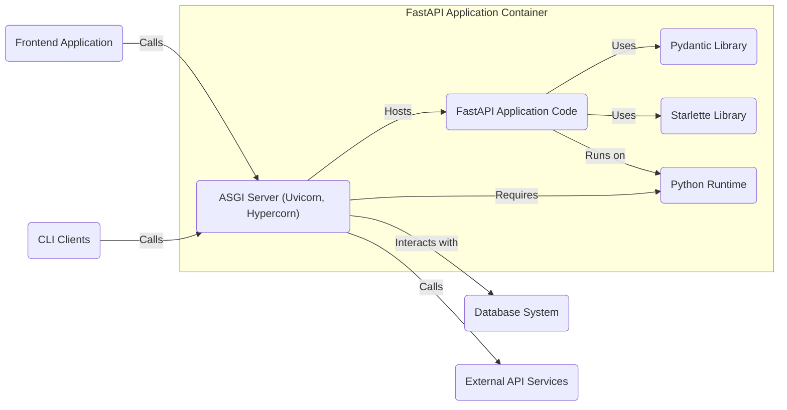
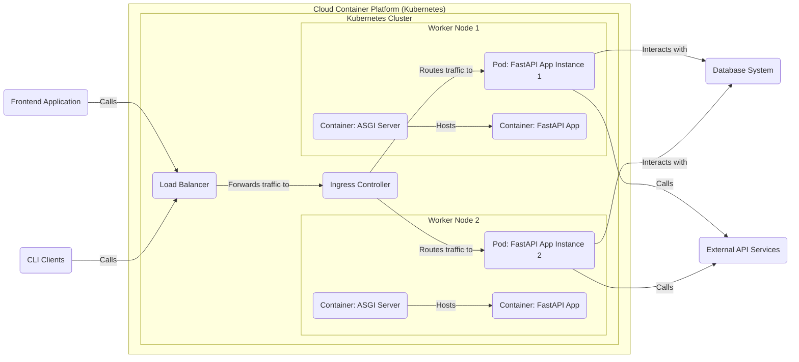
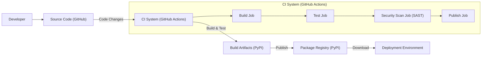

# BUSINESS POSTURE

- Business priorities and goals:
  - Provide a modern, high-performance web framework for building APIs with Python.
  - Enhance developer productivity and reduce development time.
  - Promote code quality and maintainability through type hints and automatic data validation.
  - Foster a strong and active community around the framework.
- Business risks:
  - Adoption risk: If developers do not find FastAPI compelling or easy to use, adoption may be limited.
  - Community risk: Reliance on open-source community for support, contributions, and security updates.
  - Security risk: Vulnerabilities in the framework could impact applications built with FastAPI, damaging reputation and user trust.
  - Dependency risk: Reliance on underlying libraries and frameworks (e.g., Starlette, Pydantic) for functionality and security.

# SECURITY POSTURE

- Existing security controls:
  - security control: HTTPS enforcement in deployed applications (developer responsibility, recommended in documentation).
  - security control: Input validation using Pydantic (built-in feature, described in documentation).
  - security control: Dependency management using `pip` and `requirements.txt` (standard Python practice, repository files).
  - security control: Security considerations documentation (partially covered in FastAPI documentation, e.g., CORS, HTTPS).
- Accepted risks:
  - accepted risk: Security vulnerabilities in user-provided application code built on FastAPI.
  - accepted risk: Security vulnerabilities in dependencies (addressed by dependency updates, but inherent risk).
  - accepted risk: Misconfiguration of deployed applications by users (mitigated by documentation and examples).
- Recommended security controls:
  - recommended security control: Implement automated security scanning (SAST/DAST) in FastAPI's CI/CD pipeline to detect potential vulnerabilities in the framework itself.
  - recommended security control: Provide more comprehensive security documentation, including best practices for secure API development with FastAPI, common security pitfalls, and hardening guidelines.
  - recommended security control: Establish a clear vulnerability reporting and response process for the FastAPI project.
  - recommended security control: Encourage and facilitate community security audits and contributions.
- Security requirements:
  - Authentication:
    - FastAPI provides tools and examples for implementing various authentication mechanisms (OAuth2, JWT, API keys, HTTP Basic Auth) using dependencies and security utilities.
    - Security requirement: Applications built with FastAPI must implement appropriate authentication mechanisms based on their specific needs.
  - Authorization:
    - FastAPI allows for implementing authorization logic within application code using dependencies and security utilities.
    - Security requirement: Applications built with FastAPI must implement proper authorization to control access to resources and functionalities.
  - Input validation:
    - FastAPI leverages Pydantic for automatic data validation based on type hints and schemas.
    - Security requirement: Applications built with FastAPI should define comprehensive Pydantic models to validate all user inputs and prevent injection attacks.
  - Cryptography:
    - FastAPI itself does not provide built-in cryptography primitives but relies on standard Python libraries and user-implemented cryptography.
    - Security requirement: Applications built with FastAPI should use secure cryptography practices for sensitive data handling, such as password hashing, encryption, and secure communication.

# DESIGN

## C4 CONTEXT

- Elements of context diagram:
  - - Name: FastAPI Framework
    - Type: Software System
    - Description: The FastAPI framework itself, providing the core functionalities for building APIs.
    - Responsibilities:
      - Providing routing, request handling, dependency injection, data validation, and documentation generation.
      - Ensuring performance and developer-friendly experience.
    - Security controls:
      - Security control: Input validation through Pydantic.
      - security control: Documentation and examples promoting secure development practices.
  - - Name: Developers
    - Type: Person
    - Description: Software developers who use FastAPI to build web applications and APIs.
    - Responsibilities:
      - Writing application code using FastAPI framework.
      - Implementing security measures in their applications.
      - Deploying and maintaining FastAPI applications.
    - Security controls:
      - security control: Following secure coding practices.
      - security control: Implementing authentication and authorization in applications.
      - security control: Configuring secure deployment environments.
  - - Name: Web Application (built with FastAPI)
    - Type: Software System
    - Description: Web applications and APIs built by developers using the FastAPI framework.
    - Responsibilities:
      - Implementing specific business logic and API endpoints.
      - Handling user requests and responses.
      - Interacting with databases and external services.
    - Security controls:
      - security control: Input validation (using FastAPI/Pydantic).
      - security control: Authentication and authorization mechanisms.
      - security control: Secure data handling and storage.
      - security control: HTTPS enforcement.
  - - Name: Database System
    - Type: External System
    - Description: Databases used by FastAPI applications to store and retrieve data.
    - Responsibilities:
      - Storing application data.
      - Providing data access to FastAPI applications.
      - Ensuring data integrity and availability.
    - Security controls:
      - security control: Database access control (authentication and authorization).
      - security control: Data encryption at rest and in transit.
      - security control: Regular security patching and updates.
  - - Name: External API Services
    - Type: External System
    - Description: External APIs that FastAPI applications may interact with.
    - Responsibilities:
      - Providing external data or functionalities.
      - Authenticating and authorizing requests from FastAPI applications.
    - Security controls:
      - security control: API authentication and authorization.
      - security control: Secure communication protocols (HTTPS).
      - security control: Rate limiting and input validation.
  - - Name: Frontend Application
    - Type: External System
    - Description: Frontend applications (web, mobile, etc.) that consume APIs built with FastAPI.
    - Responsibilities:
      - Presenting data to users.
      - Sending requests to FastAPI APIs.
      - Handling user authentication (in some cases).
    - Security controls:
      - security control: Secure communication with backend APIs (HTTPS).
      - security control: Input validation on the client-side.
      - security control: Protection against client-side vulnerabilities (e.g., XSS).
  - - Name: CLI Clients
    - Type: External System
    - Description: Command-line interface clients that interact with APIs built with FastAPI.
    - Responsibilities:
      - Interacting with FastAPI APIs programmatically.
      - Automating tasks using APIs.
    - Security controls:
      - security control: API authentication and authorization.
      - security control: Secure handling of API credentials.

## C4 CONTAINER

- Elements of container diagram:
  - - Name: FastAPI Application Code
    - Type: Container - Code
    - Description: The Python code written by developers using the FastAPI framework to define API endpoints, business logic, and data models.
    - Responsibilities:
      - Implementing API endpoints and business logic.
      - Defining data models using Pydantic.
      - Handling requests and responses.
    - Security controls:
      - security control: Input validation logic using Pydantic models.
      - security control: Implementation of authentication and authorization logic.
      - security control: Secure coding practices within the application code.
  - - Name: ASGI Server (Uvicorn, Hypercorn)
    - Type: Container - Application Server
    - Description: An ASGI server (e.g., Uvicorn, Hypercorn) that hosts and runs the FastAPI application. It handles incoming HTTP requests and passes them to the FastAPI application.
    - Responsibilities:
      - Receiving and processing HTTP requests.
      - Serving the FastAPI application.
      - Managing application lifecycle.
    - Security controls:
      - security control: HTTPS termination and enforcement.
      - security control: Configuration hardening of the ASGI server.
      - security control: Rate limiting and request filtering (can be implemented in ASGI server or reverse proxy).
  - - Name: Pydantic Library
    - Type: Container - Library
    - Description: A Python library used by FastAPI for data validation and serialization.
    - Responsibilities:
      - Defining data models and schemas.
      - Validating input data against schemas.
      - Serializing and deserializing data.
    - Security controls:
      - security control: Input validation enforced by Pydantic schemas.
      - security control: Regular updates to Pydantic library to address potential vulnerabilities.
  - - Name: Starlette Library
    - Type: Container - Library
    - Description: A lightweight ASGI framework upon which FastAPI is built, providing core functionalities like routing and middleware.
    - Responsibilities:
      - Providing routing and request handling mechanisms.
      - Implementing middleware functionality.
    - Security controls:
      - security control: Security features inherited from Starlette (e.g., request handling security).
      - security control: Regular updates to Starlette library to address potential vulnerabilities.
  - - Name: Python Runtime
    - Type: Container - Runtime Environment
    - Description: The Python interpreter and standard library required to run the FastAPI application and its dependencies.
    - Responsibilities:
      - Executing Python code.
      - Providing standard library functionalities.
    - Security controls:
      - security control: Regular updates to Python runtime to address potential vulnerabilities.
      - security control: Secure configuration of the Python environment.
  - - Name: Database System, External API Services, Frontend Application, CLI Clients
    - Type: External Containers
    - Description: Same as described in C4 Context diagram.
    - Responsibilities: Same as described in C4 Context diagram.
    - Security controls: Same as described in C4 Context diagram.

## DEPLOYMENT

Deployment solution: Cloud Container Platform (e.g., Kubernetes on AWS EKS, Google GKE, Azure AKS)

- Elements of deployment diagram:
  - - Name: Kubernetes Cluster
    - Type: Infrastructure
    - Description: A Kubernetes cluster providing container orchestration and management.
    - Responsibilities:
      - Managing container deployments and scaling.
      - Providing networking and service discovery.
      - Ensuring high availability and fault tolerance.
    - Security controls:
      - security control: Kubernetes RBAC (Role-Based Access Control) for cluster access.
      - security control: Network policies to control traffic within the cluster.
      - security control: Security audits and vulnerability scanning of Kubernetes components.
      - security control: Regular updates and patching of Kubernetes cluster.
  - - Name: Worker Node (Worker Node 1, Worker Node 2)
    - Type: Infrastructure - Compute Instance
    - Description: Virtual machines or physical servers that run containerized applications within the Kubernetes cluster.
    - Responsibilities:
      - Providing compute resources for containers.
      - Running Kubernetes kubelet and container runtime.
    - Security controls:
      - security control: Hardening of worker node operating system.
      - security control: Security monitoring and logging on worker nodes.
      - security control: Regular patching of worker node OS and software.
  - - Name: Pod (Pod 1, Pod 2)
    - Type: Deployment Unit
    - Description: The smallest deployable unit in Kubernetes, encapsulating one or more containers (ASGI Server and FastAPI App).
    - Responsibilities:
      - Running application containers.
      - Providing shared network namespace and storage.
    - Security controls:
      - security control: Container security context (user, group, capabilities).
      - security control: Resource limits and quotas for pods.
      - security control: Pod security policies/Pod security admission.
  - - Name: Container (ASGI Server, FastAPI App)
    - Type: Container Image Instance
    - Description: Instances of the ASGI Server and FastAPI Application containers running within pods.
    - Responsibilities:
      - Running the application code.
      - Serving API requests.
    - Security controls:
      - security control: Container image scanning for vulnerabilities.
      - security control: Principle of least privilege for container processes.
      - security control: Immutable container images.
  - - Name: Load Balancer
    - Type: Infrastructure - Network Component
    - Description: A cloud load balancer distributing incoming traffic across multiple instances of the FastAPI application.
    - Responsibilities:
      - Distributing traffic to application instances.
      - Providing high availability and scalability.
      - HTTPS termination.
    - Security controls:
      - security control: HTTPS termination and enforcement.
      - security control: DDoS protection.
      - security control: Access control lists (ACLs) or security groups.
  - - Name: Ingress Controller
    - Type: Software - Kubernetes Component
    - Description: A Kubernetes Ingress controller routing external HTTP/HTTPS traffic to the appropriate services within the cluster.
    - Responsibilities:
      - Routing traffic based on hostnames and paths.
      - Providing SSL termination and TLS routing.
    - Security controls:
      - security control: Configuration hardening of Ingress controller.
      - security control: Regular updates and patching of Ingress controller.
      - security control: Web Application Firewall (WAF) integration (optional).
  - - Name: Database System, External API Services, Frontend Application, CLI Clients
    - Type: External Systems
    - Description: Same as described in C4 Context diagram.
    - Responsibilities: Same as described in C4 Context diagram.
    - Security controls: Same as described in C4 Context diagram.

## BUILD

- Elements of build diagram:
  - - Name: Developer
    - Type: Person
    - Description: Software developers contributing to the FastAPI project.
    - Responsibilities:
      - Writing and committing code changes.
      - Reviewing code changes.
    - Security controls:
      - security control: Code review process.
      - security control: Secure development practices.
      - security control: Access control to the GitHub repository.
  - - Name: Source Code (GitHub)
    - Type: Code Repository
    - Description: The FastAPI source code repository hosted on GitHub.
    - Responsibilities:
      - Storing and versioning source code.
      - Managing code contributions.
    - Security controls:
      - security control: Access control to the repository (authentication and authorization).
      - security control: Branch protection rules.
      - security control: Audit logging of repository activities.
  - - Name: CI System (GitHub Actions)
    - Type: Automation System
    - Description: GitHub Actions used for continuous integration and continuous delivery of FastAPI.
    - Responsibilities:
      - Automating build, test, and security scanning processes.
      - Publishing build artifacts.
    - Security controls:
      - security control: Secure configuration of CI workflows.
      - security control: Access control to CI system and secrets management.
      - security control: Audit logging of CI activities.
  - - Name: Build Job
    - Type: CI Job
    - Description: CI job responsible for compiling and building the FastAPI package.
    - Responsibilities:
      - Building the Python package.
      - Running linters and code formatters.
    - Security controls:
      - security control: Dependency scanning during build.
      - security control: Build process isolation.
  - - Name: Test Job
    - Type: CI Job
    - Description: CI job responsible for running automated tests against the built package.
    - Responsibilities:
      - Running unit tests and integration tests.
      - Ensuring code quality and functionality.
    - Security controls:
      - security control: Comprehensive test suite.
      - security control: Test environment isolation.
  - - Name: Security Scan Job (SAST)
    - Type: CI Job
    - Description: CI job responsible for performing static application security testing (SAST) on the codebase.
    - Responsibilities:
      - Identifying potential security vulnerabilities in the code.
      - Enforcing security coding standards.
    - Security controls:
      - security control: SAST tool integration.
      - security control: Vulnerability reporting and remediation process.
  - - Name: Publish Job
    - Type: CI Job
    - Description: CI job responsible for publishing the built package to the package registry.
    - Responsibilities:
      - Publishing the package to PyPI.
      - Signing and verifying package integrity.
    - Security controls:
      - security control: Secure credentials management for package registry access.
      - security control: Package signing and verification.
      - security control: Two-factor authentication for publishing.
  - - Name: Build Artifacts (PyPI)
    - Type: Package Artifacts
    - Description: The built Python package artifacts (e.g., wheels, source distributions) ready for publishing.
    - Responsibilities:
      - Storing build artifacts temporarily.
    - Security controls:
      - security control: Access control to build artifact storage.
  - - Name: Package Registry (PyPI)
    - Type: Package Repository
    - Description: Python Package Index (PyPI) where FastAPI packages are published and distributed.
    - Responsibilities:
      - Hosting and distributing Python packages.
      - Providing package download and installation services.
    - Security controls:
      - security control: Package signing and verification.
      - security control: Malware scanning of uploaded packages.
      - security control: Access control and account security for maintainers.
  - - Name: Deployment Environment
    - Type: Target Environment
    - Description: Environment where FastAPI applications are deployed and run (e.g., cloud, on-premises).
    - Responsibilities:
      - Running FastAPI applications.
      - Downloading and installing FastAPI packages.
    - Security controls:
      - security control: Secure package installation process (using `pip` with HTTPS).
      - security control: Dependency verification (using package hashes).

# RISK ASSESSMENT

- Critical business process: Secure and reliable development and deployment of web applications and APIs using FastAPI framework. Maintaining developer trust and community support for FastAPI.
- Data being protected:
  - FastAPI framework source code: Sensitivity - Low to Medium (Publicly available, but integrity is important).
  - FastAPI package artifacts (on PyPI): Sensitivity - Medium (Integrity and availability are important to prevent supply chain attacks).
  - User applications built with FastAPI (code and data): Sensitivity - High (Depends on the application, can include sensitive user data, business logic, etc.).
- Data sensitivity:
  - FastAPI framework code and packages: Primarily integrity and availability are important.
  - User application data: Sensitivity varies greatly depending on the application.

# QUESTIONS & ASSUMPTIONS

- Questions:
  - What are the most critical features and functionalities of FastAPI from a business perspective?
  - What are the primary use cases and target audience for FastAPI?
  - Are there any specific compliance requirements or security standards that FastAPI needs to adhere to?
  - What is the expected level of security expertise among developers using FastAPI?
  - What are the acceptable levels of risk for security vulnerabilities in FastAPI and user applications?
- Assumptions:
  - BUSINESS POSTURE: The primary business goal is to provide a widely adopted, high-quality, and developer-friendly web framework. Security is important for maintaining trust and adoption.
  - SECURITY POSTURE: Security is considered important but is primarily addressed through standard software development practices and user responsibility. More proactive security measures could be beneficial.
  - DESIGN: FastAPI is designed as a framework/library, and its security relies heavily on how it is used and deployed by developers. The deployment environment is assumed to be a modern cloud-based container platform for detailed deployment diagram. Build process is assumed to be using GitHub Actions and PyPI for package distribution.