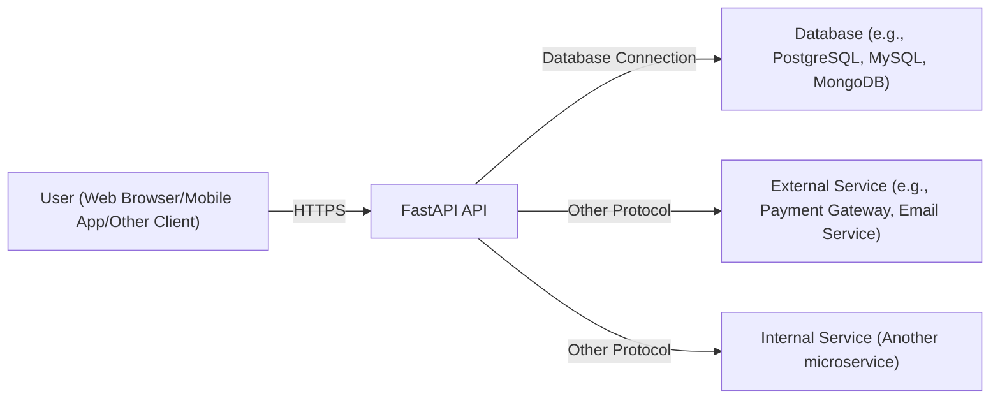
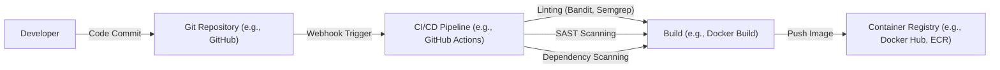

Okay, let's create a design document for the FastAPI project, focusing on aspects relevant for threat modeling.

# BUSINESS POSTURE

FastAPI is a modern, fast (high-performance), web framework for building APIs with Python 3.7+ based on standard Python type hints.  It's designed to be easy to use and learn, while also providing high performance and robust features suitable for production environments.  The project's success hinges on adoption by developers and organizations building APIs.

Priorities:

*   Developer Experience:  Ease of use, clear documentation, and a smooth development workflow are paramount.  This drives adoption.
*   Performance:  FastAPI's core value proposition is high performance.  It must maintain this to remain competitive.
*   Reliability:  APIs built with FastAPI should be stable and reliable, handling errors gracefully.
*   Security:  While not explicitly the *primary* selling point, security is crucial for any web framework.  Vulnerabilities in FastAPI could severely damage its reputation and adoption.
*   Maintainability:  The project itself must be maintainable, allowing for ongoing development, bug fixes, and security updates.
*   Community: A strong and active community is vital for support, contributions, and long-term sustainability.

Goals:

*   Become a leading Python web framework for building APIs.
*   Provide a robust and secure foundation for API development.
*   Maintain a high level of performance and efficiency.
*   Foster a thriving community of users and contributors.

Business Risks:

*   A major security vulnerability is discovered and exploited, leading to widespread compromise of APIs built with FastAPI.
*   Performance degrades significantly due to new features or changes, making it less competitive.
*   A competing framework emerges with significantly better features or performance, leading to a loss of users.
*   The project maintainer(s) become unable to continue development, leading to stagnation and security risks.
*   Poor documentation or a difficult learning curve hinders adoption.
*   Lack of support for emerging standards or technologies makes FastAPI obsolete.

# SECURITY POSTURE

Existing Security Controls:

*   security control: Type Hinting: FastAPI leverages Python's type hints extensively. This helps prevent many common errors that can lead to security vulnerabilities (e.g., type confusion, injection attacks in some cases). Implemented in the core framework design.
*   security control: Dependency Management: FastAPI relies on well-established libraries like Starlette and Pydantic.  These libraries have their own security practices.  Dependencies are managed through standard Python packaging tools (e.g., pip, poetry). Described in the documentation and managed via `pyproject.toml` or `requirements.txt`.
*   security control: Input Validation: Pydantic is used for data validation and parsing, providing a strong layer of defense against invalid or malicious input.  This helps prevent many common web vulnerabilities. Implemented through Pydantic models.
*   security control: Automatic Data Serialization/Deserialization: Pydantic handles data serialization and deserialization, reducing the risk of manual errors that could lead to vulnerabilities. Implemented through Pydantic models.
*   security control: OpenAPI (Swagger) and ReDoc Integration:  FastAPI automatically generates API documentation using OpenAPI.  This can help with security auditing and penetration testing by providing a clear view of the API surface. Implemented as part of the framework.
*   security control: Dependency Injection System: FastAPI's dependency injection system can be used to manage security-related components (e.g., authentication, authorization) in a consistent and testable way. Implemented as part of the framework.
*   security control: Testing: FastAPI has a comprehensive test suite, which helps to identify and prevent regressions, including security-related ones. Described in the documentation and implemented in the `tests/` directory.
*   security control: Documentation: The extensive documentation includes sections on security best practices, such as using HTTPS, handling authentication, and preventing common vulnerabilities. Described in the official documentation.

Accepted Risks:

*   accepted risk: Reliance on Third-Party Libraries: While FastAPI uses well-regarded libraries, vulnerabilities in these dependencies could impact FastAPI's security. This is a common risk for most software projects.
*   accepted risk: Complexity of Asynchronous Programming: Asynchronous programming (async/await) can introduce subtle concurrency bugs if not handled carefully.  While FastAPI and Starlette are designed to handle this, developers using them need to be aware of the potential risks.
*   accepted risk: Developer Error: Ultimately, the security of APIs built with FastAPI depends on the developers using it.  FastAPI provides tools and guidance, but it cannot prevent all possible security mistakes.

Recommended Security Controls:

*   security control: Security Linters: Integrate security-focused linters (e.g., Bandit, Semgrep) into the development and CI/CD pipeline to automatically detect potential security issues in the FastAPI codebase itself.
*   security control: Regular Security Audits: Conduct periodic security audits and penetration tests of the FastAPI framework itself, not just applications built with it.
*   security control: Vulnerability Disclosure Program: Establish a clear process for security researchers to report vulnerabilities in FastAPI.
*   security control: Supply Chain Security Measures: Implement measures to verify the integrity of dependencies and prevent supply chain attacks (e.g., software signing, SBOMs).

Security Requirements:

*   Authentication:
    *   FastAPI should provide clear guidance and examples for implementing various authentication mechanisms (e.g., API keys, OAuth 2.0, JWT).
    *   The framework should not dictate a specific authentication method but should be flexible enough to support different approaches.
    *   Support for secure storage and handling of credentials (e.g., not storing passwords in plain text).

*   Authorization:
    *   FastAPI should provide mechanisms for implementing authorization checks (e.g., role-based access control, attribute-based access control).
    *   The dependency injection system should be leveraged to make authorization logic reusable and testable.
    *   Clear documentation and examples for implementing authorization.

*   Input Validation:
    *   Continue to leverage Pydantic for robust input validation.
    *   Provide clear guidance on defining validation rules to prevent common web vulnerabilities (e.g., XSS, SQL injection, command injection).
    *   Consider integrating with other validation libraries or tools if needed.

*   Cryptography:
    *   FastAPI should not implement its own cryptographic primitives.
    *   Provide guidance on using established cryptographic libraries (e.g., `cryptography`) for tasks like password hashing, encryption, and digital signatures.
    *   Encourage the use of HTTPS for all communication.

# DESIGN

## C4 CONTEXT



Element Descriptions:

*   Element:
    *   Name: User
    *   Type: Person
    *   Description: Represents any user interacting with the FastAPI API, whether through a web browser, mobile application, or another client.
    *   Responsibilities: Initiates requests to the API, receives and processes responses.
    *   Security controls: Uses HTTPS for secure communication. May implement client-side security measures (e.g., input validation, secure storage of credentials).

*   Element:
    *   Name: FastAPI API
    *   Type: Software System
    *   Description: The core of the system; a web API built using the FastAPI framework.
    *   Responsibilities: Handles incoming requests, processes data, interacts with other systems (database, external services), and returns responses to the user.
    *   Security controls: Input validation (Pydantic), authentication, authorization, secure coding practices, dependency management.

*   Element:
    *   Name: Database
    *   Type: Software System
    *   Description: A database system used to store and retrieve data.
    *   Responsibilities: Stores data persistently, provides data access to the FastAPI API.
    *   Security controls: Access control, encryption at rest, encryption in transit, regular backups, auditing.

*   Element:
    *   Name: External Service
    *   Type: Software System
    *   Description: An external service that the FastAPI API interacts with (e.g., a payment gateway, email service, third-party API).
    *   Responsibilities: Provides specific functionality to the FastAPI API.
    *   Security controls: Depends on the specific service; should adhere to industry best practices for security.

*   Element:
    *   Name: Internal Service
    *   Type: Software System
    *   Description: Another internal service or microservice that the FastAPI API interacts with.
    *   Responsibilities: Provides specific functionality within the larger system.
    *   Security controls: Similar to the FastAPI API; input validation, authentication, authorization, secure coding practices.

## C4 CONTAINER

```mermaid
graph LR
    User["User (Web Browser/Mobile App/Other Client)"] -- "HTTPS" --> WebServer["Web Server (e.g., Uvicorn, Gunicorn)"]
    WebServer -- "ASGI" --> FastAPIApplication["FastAPI Application"]
    FastAPIApplication -- "Database Connection" --> Database["Database (e.g., PostgreSQL, MySQL, MongoDB)"]
    FastAPIApplication -- "Other Protocol" --> ExternalService["External Service"]
    FastAPIApplication -- "Other Protocol" --> InternalService["Internal Service"]
    FastAPIApplication -- "" --> Dependency1["Dependency (e.g., Pydantic)"]
    FastAPIApplication -- "" --> Dependency2["Dependency (e.g., Starlette)"]

```

Element Descriptions:

*   Element:
    *   Name: User
    *   Type: Person
    *   Description: Same as in the Context diagram.
    *   Responsibilities: Same as in the Context diagram.
    *   Security controls: Same as in the Context diagram.

*   Element:
    *   Name: Web Server
    *   Type: Container
    *   Description: A web server (e.g., Uvicorn, Gunicorn) that handles incoming HTTP requests and forwards them to the FastAPI application.
    *   Responsibilities: Handles HTTP request/response cycle, manages concurrency, potentially handles TLS termination.
    *   Security controls: TLS configuration, access logging, potentially Web Application Firewall (WAF) integration.

*   Element:
    *   Name: FastAPI Application
    *   Type: Container
    *   Description: The core FastAPI application code, including routes, dependencies, and business logic.
    *   Responsibilities: Processes requests, interacts with other components, returns responses.
    *   Security controls: Input validation (Pydantic), authentication, authorization, secure coding practices.

*   Element:
    *   Name: Database
    *   Type: Container
    *   Description: Same as in the Context diagram.
    *   Responsibilities: Same as in the Context diagram.
    *   Security controls: Same as in the Context diagram.

*   Element:
    *   Name: External Service
    *   Type: Container
    *   Description: Same as in the Context diagram.
    *   Responsibilities: Same as in the Context diagram.
    *   Security controls: Same as in the Context diagram.

*   Element:
    *   Name: Internal Service
    *   Type: Container
    *   Description: Same as in the Context diagram.
    *   Responsibilities: Same as in the Context diagram.
    *   Security controls: Same as in the Context diagram.

*   Element:
    *   Name: Dependency (e.g., Pydantic)
    *   Type: Container
    *   Description: External libraries used by the FastAPI application.
    *   Responsibilities: Provide specific functionality (e.g., data validation, request handling).
    *   Security controls: Relies on the security practices of the dependency itself.

*   Element:
    *   Name: Dependency (e.g., Starlette)
    *   Type: Container
    *   Description: External libraries used by the FastAPI application.
    *   Responsibilities: Provide specific functionality (e.g., data validation, request handling).
    *   Security controls: Relies on the security practices of the dependency itself.

## DEPLOYMENT

Possible Deployment Solutions:

1.  Cloud Platforms (AWS, Google Cloud, Azure): Using services like AWS Elastic Beanstalk, Google App Engine, or Azure App Service.
2.  Container Orchestration (Kubernetes, Docker Swarm): Deploying the FastAPI application as a Docker container within a Kubernetes cluster.
3.  Virtual Machines: Deploying directly onto a virtual machine (e.g., AWS EC2, Google Compute Engine).
4.  Serverless (AWS Lambda, Google Cloud Functions, Azure Functions): Deploying individual FastAPI routes as serverless functions.

Chosen Solution (for detailed description): Container Orchestration with Kubernetes

```mermaid
graph LR
    Internet["Internet"] -- "HTTPS" --> LoadBalancer["Load Balancer (e.g., Ingress Controller)"]
    LoadBalancer -- "" --> Service["Kubernetes Service"]
    Service -- "" --> Pod1["Pod (FastAPI Container)"]
    Service -- "" --> Pod2["Pod (FastAPI Container)"]
    Service -- "" --> Pod3["Pod (FastAPI Container)"]
    Pod1 -- "Database Connection" --> Database["Database (e.g., PostgreSQL)"]
    Pod2 -- "Database Connection" --> Database
    Pod3 -- "Database Connection" --> Database

```

Element Descriptions:

*   Element:
    *   Name: Internet
    *   Type: Node
    *   Description: The public internet.
    *   Responsibilities: Routes traffic to the load balancer.
    *   Security controls: Network firewalls, DDoS protection.

*   Element:
    *   Name: Load Balancer (e.g., Ingress Controller)
    *   Type: Node
    *   Description: Distributes incoming traffic across multiple instances of the FastAPI application.
    *   Responsibilities: Load balancing, TLS termination, potentially health checks.
    *   Security controls: TLS configuration, access control, potentially WAF integration.

*   Element:
    *   Name: Kubernetes Service
    *   Type: Node
    *   Description: A Kubernetes Service provides a stable IP address and DNS name for accessing the FastAPI application pods.
    *   Responsibilities: Service discovery, load balancing within the cluster.
    *   Security controls: Network policies, RBAC.

*   Element:
    *   Name: Pod (FastAPI Container)
    *   Type: Node
    *   Description: A Kubernetes Pod running a Docker container containing the FastAPI application.
    *   Responsibilities: Runs the FastAPI application.
    *   Security controls: Container image security scanning, resource limits, security context.

*   Element:
    *   Name: Database (e.g., PostgreSQL)
    *   Type: Node
    *   Description: A managed database service (e.g., AWS RDS, Google Cloud SQL) or a database deployed within the Kubernetes cluster.
    *   Responsibilities: Stores data persistently.
    *   Security controls: Access control, encryption at rest, encryption in transit, regular backups, auditing.

## BUILD



Build Process Description:

1.  Developer commits code to a Git repository (e.g., GitHub, GitLab).
2.  A webhook triggers the CI/CD pipeline (e.g., GitHub Actions, Jenkins, CircleCI).
3.  The pipeline performs security checks:
    *   Linting: Uses tools like Bandit and Semgrep to identify potential security vulnerabilities in the code.
    *   SAST Scanning: Performs Static Application Security Testing to analyze the code for vulnerabilities.
    *   Dependency Scanning: Checks for known vulnerabilities in project dependencies.
4.  If all checks pass, the pipeline builds the application (e.g., creates a Docker image).
5.  The built artifact (e.g., Docker image) is pushed to a container registry (e.g., Docker Hub, Amazon ECR, Google Container Registry).
6.  Deployment process takes image from Container Registry and deploys it.

Security Controls in Build Process:

*   security control: Code Review: All code changes should be reviewed by at least one other developer before being merged.
*   security control: Linting (Bandit, Semgrep): Automated static analysis to detect potential security issues.
*   security control: SAST Scanning: Static Application Security Testing to identify vulnerabilities.
*   security control: Dependency Scanning: Checks for known vulnerabilities in project dependencies.
*   security control: Software Composition Analysis (SCA): Identifies and analyzes all components and dependencies within the software.
*   security control: Container Image Signing: Digitally sign container images to ensure their integrity and authenticity.
*   security control: Least Privilege: Build agents and processes should run with the minimum necessary privileges.

# RISK ASSESSMENT

Critical Business Processes:

*   API Request Handling: The core process of receiving, processing, and responding to API requests.  This must be reliable, performant, and secure.
*   Data Storage and Retrieval: Interacting with the database to store and retrieve data.  Data integrity and confidentiality are critical.
*   Authentication and Authorization: Verifying user identities and controlling access to resources.  This is essential for protecting sensitive data and functionality.
*   External Service Integration: Communicating with external services (e.g., payment gateways).  This must be secure and reliable to prevent financial loss or data breaches.

Data Sensitivity:

*   User Data (PII):  If the API handles personally identifiable information (PII), such as names, email addresses, or other personal details, this data is highly sensitive and must be protected according to relevant regulations (e.g., GDPR, CCPA).
*   Financial Data:  If the API processes financial transactions or handles financial data, this is extremely sensitive and requires the highest level of protection.
*   Authentication Credentials:  Passwords, API keys, and other authentication credentials must be stored and handled securely.
*   Application Data:  The specific data handled by the API will vary depending on its purpose.  The sensitivity of this data needs to be assessed on a case-by-case basis.
*   Configuration Data: Secrets, API keys and other configuration data must be protected.

# QUESTIONS & ASSUMPTIONS

Questions:

*   What specific external services does FastAPI integrate with, and what are their security postures?
*   What are the specific regulatory requirements (e.g., GDPR, CCPA, HIPAA) that apply to APIs built with FastAPI?
*   What is the expected scale and load for APIs built with FastAPI? This will influence deployment and security considerations.
*   What level of security expertise is assumed for developers using FastAPI? This will impact the guidance and documentation provided.
*   Are there any specific security certifications or compliance standards that FastAPI aims to meet?

Assumptions:

*   BUSINESS POSTURE: The primary goal is to create a high-performance, easy-to-use, and secure web framework for building APIs. Security is a high priority, but not at the expense of performance or usability.
*   SECURITY POSTURE: Developers using FastAPI have a basic understanding of web security principles.  FastAPI provides tools and guidance, but it's the developer's responsibility to implement secure applications.  Third-party dependencies are generally trusted but are recognized as a potential source of risk.
*   DESIGN: The deployment environment will be a modern, containerized environment (e.g., Kubernetes).  The build process will include automated security checks. The database will be properly secured and managed.