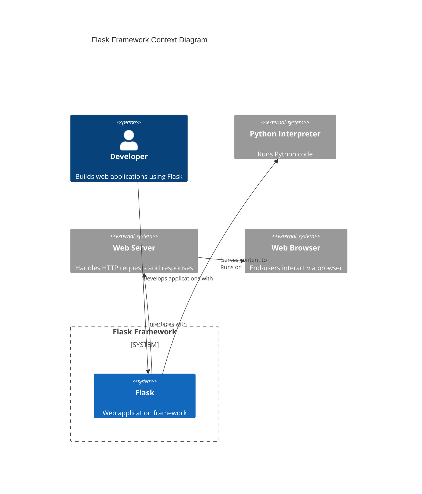
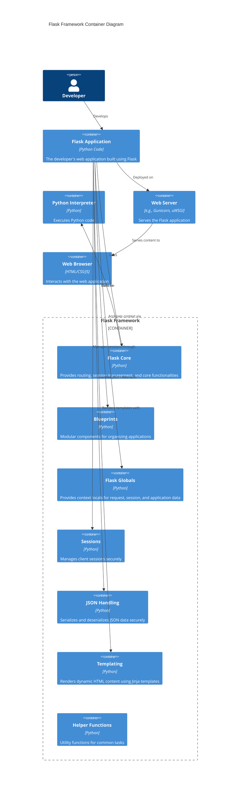
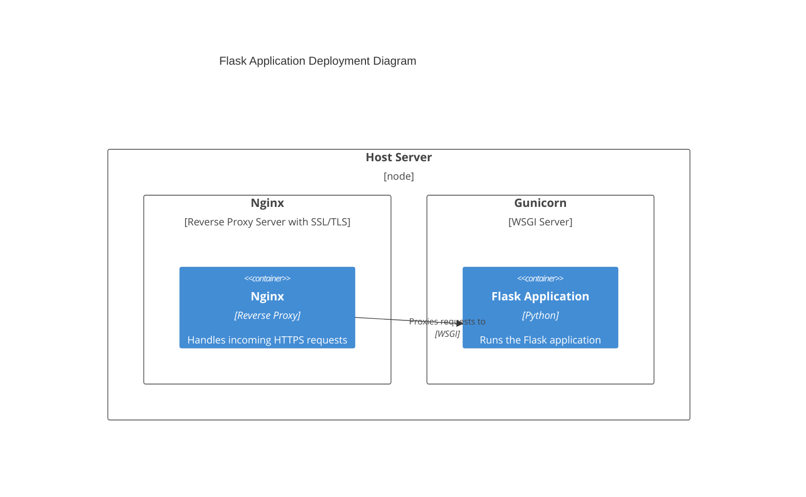
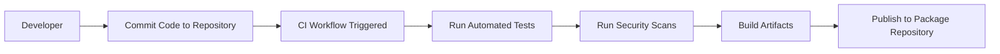

# BUSINESS POSTURE

Flask is a lightweight WSGI web application framework written in Python. It is designed to make getting started with web development quick and easy, with the ability to scale up to complex applications. Flask provides core tools and features but doesn't enforce any dependencies or project layout, giving developers the flexibility to choose the tools and libraries they want to use.

**Business Priorities and Goals:**

- **Ease of Use:** Simplify the process of building web applications for developers.
- **Flexibility:** Allow developers to customize and extend the framework as needed.
- **Scalability:** Support applications ranging from simple to complex, including modern asynchronous capabilities.
- **Extensibility:** Enable modular design through blueprints and extensions.
- **Community Driven:** Encourage community contributions to provide extensions and enhancements.

**Important Business Risks:**

- **Security Risks:** Insufficient default security measures could lead to vulnerabilities.
- **Maintenance Risks:** Keeping up with updates and community contributions requires continuous effort.
- **Compatibility Risks:** Introducing new features like async support may cause compatibility issues with existing extensions.
- **Competitive Risks:** Other frameworks might offer more features out-of-the-box, attracting developers away.
- **User Adoption Risks:** Without continued innovation, the framework might lose relevance in the developer community.

# SECURITY POSTURE

**Existing Security Controls:**

- **security control:** Utilization of **Werkzeug** and **Jinja** libraries, which are designed with security in mind.
  - Implemented in `app.py`, `templating.py`, and `globals.py`.
- **security control:** Implementation of **SecureCookieSessionInterface** for secure session management.
  - Implemented in `sessions.py`.
- **security control:** Integration with **itsdangerous** for cryptographically signing data, such as session cookies.
  - Described in `sessions.py`, `app.py`, and `helpers.py`.
- **security control:** Use of **Blueprints** to organize application components, promoting modular security and separation of concerns.
  - Implemented in `blueprints.py`.
- **security control:** Adoption of **context locals** using **Werkzeug Local** for managing request, application, and session data.
  - Implemented in `globals.py`, `ctx.py`.
- **security control:** Safe file serving utilities to prevent directory traversal attacks.
  - Implemented in `helpers.py`.
- **security control:** JSON encoding and decoding with protection against attacks, using custom JSON providers.
  - Implemented in `json/__init__.py`, `json/provider.py`, `json/tag.py`.
- **security control:** Enhanced error handling and logging mechanisms to prevent leakage of sensitive information and to facilitate debugging.
  - Implemented in `app.py`, `logging.py`, `templating.py`.
- **security control:** Support for **asynchronous views and error handlers**, allowing developers to write async code while maintaining security practices.
  - Implemented in `app.py`, `blueprints.py`.

**Accepted Risks:**

- **accepted risk:** The framework provides minimal default security features, relying on developers to implement additional security measures or use extensions.
- **accepted risk:** Lack of built-in CSRF protection may expose applications to cross-site request forgery attacks if not handled by the developer.
- **accepted risk:** Introducing **async** support may result in security concerns if developers are not familiar with secure async programming practices.

**Recommended Security Controls:**

- **security control:** Implement default CSRF protection within the core framework.
- **security control:** Provide built-in authentication and authorization mechanisms.
- **security control:** Enforce secure defaults for session cookies (e.g., `HttpOnly`, `Secure`, `SameSite` attributes).
- **security control:** Incorporate input validation utilities to prevent common vulnerabilities like XSS and SQL injection.
- **security control:** Update documentation and guidelines on secure **async** programming practices within Flask applications.

**Security Requirements:**

- **Authentication:** The framework should offer mechanisms or guidelines for secure user authentication processes.
- **Authorization:** Support for role-based access control or similar authorization methods should be included.
- **Input Validation:** Input data must be properly validated and sanitized to prevent security breaches.
- **Cryptography:** Use robust cryptographic practices for session management and data encryption.
- **Session Management:** Ensure secure handling of session data, including expiration and regeneration.
- **Error Handling:** Implement safe error handling practices that do not expose sensitive information.

# DESIGN

Flask follows a modular design, allowing developers to build web applications by leveraging its core components and extensions. The framework is built on top of Werkzeug WSGI toolkit and Jinja template engine, providing a solid foundation for web development. Recent updates include enhancements in session management, JSON handling, and the use of blueprints for better modularity.

## C4 CONTEXT

### Elements of Context Diagram

| Name             | Type     | Description                            | Responsibilities                                                                 | Security Controls                                  |
|------------------|----------|----------------------------------------|----------------------------------------------------------------------------------|----------------------------------------------------|
| Developer        | Person   | Developer using Flask to build apps    | Writes application code using Flask                                              | N/A                                                |
| Flask            | System   | Web application framework              | Provides core functionalities for web apps, including session management, routing, and templating | Secure sessions, uses Werkzeug and Jinja, context locals, blueprints |
| Python Interpreter | System | Runs Python applications               | Executes Flask application code                                                  | N/A                                                |
| Web Server       | System   | Handles HTTP requests/responses        | Serves Flask applications to clients                                             | N/A                                                |
| Web Browser      | System   | Client used by end-users               | Displays web content to users                                                    | N/A                                                |

## C4 CONTAINER

### Elements of Container Diagram

| Name              | Type       | Description                                   | Responsibilities                                                                      | Security Controls                                    |
|-------------------|------------|-----------------------------------------------|---------------------------------------------------------------------------------------|------------------------------------------------------|
| Developer         | Person     | Developer building the Flask app              | Writes and maintains application code                                                 | N/A                                                  |
| Flask Application | Container  | The web application created by the developer  | Implements business logic                                                             | Depends on implemented security measures             |
| Flask Core        | Container  | Core of the Flask framework                   | Provides routing, session management, and core features                               | Secure session management, context locals, error handling |
| Blueprints        | Container  | Modular components for organizing applications | Allows for modular design and code organization                                       | Facilitates modular security practices               |
| Flask Globals     | Container  | Provides context locals                       | Manages request, session, and application data                                        | Uses Werkzeug Local for thread safety                |
| Sessions          | Container  | Manages client sessions                       | Handles session creation, storage, and security                                        | SecureCookieSessionInterface, cryptographic signing  |
| JSON Handling     | Container  | Handles JSON serialization and deserialization | Provides secure JSON encoding and decoding                                            | Protects against JSON-based attacks                  |
| Templating        | Container  | Jinja template engine integration             | Renders dynamic HTML content                                                          | Autoescaping to prevent XSS                          |
| Helper Functions  | Container  | Utility functions for common tasks            | Provides functions like `send_file`, `send_from_directory`                            | Safe file handling to prevent directory traversal    |
| Python Interpreter | Container | Executes Python code                          | Runs Flask and application code                                                       | N/A                                                  |
| Web Server        | Container  | Serves the web application                    | Handles HTTP requests and responses                                                   | SSL/TLS termination, request handling                 |
| Web Browser       | Container  | Client interface for end-users                | Renders the web application UI                                                        | Depends on secure coding practices                    |

## DEPLOYMENT

Flask applications can be deployed in various environments. One common deployment architecture involves using a WSGI server like Gunicorn or uWSGI behind a reverse proxy server like Nginx. With the updates in session management and security controls, it's essential to ensure that the deployment environment supports these features.

Possible deployment solutions:

1. **WSGI Server with Secure Proxy:** Deploying Flask with Gunicorn/uWSGI behind Nginx or Apache with SSL/TLS configured for secure communication.
2. **Containerized Deployment:** Using Docker to containerize the Flask application and deploy it in orchestration platforms like Kubernetes, with secure configurations.
3. **Platform-as-a-Service (PaaS):** Deploying on platforms like Heroku, AWS Elastic Beanstalk, or Google App Engine, which provide built-in security features.

Selected Deployment Architecture:

**WSGI Server with Secure Proxy**

### Elements of Deployment Diagram

| Name           | Type             | Description                                     | Responsibilities                                         | Security Controls                                  |
|----------------|------------------|-------------------------------------------------|----------------------------------------------------------|----------------------------------------------------|
| Host Server    | Deployment Node  | Physical or virtual server hosting the app      | Hosts Nginx and Gunicorn                                 | Depends on server configuration                    |
| Nginx          | Deployment Node  | Reverse proxy server with SSL/TLS               | Handles incoming requests, SSL termination               | SSL/TLS encryption, request filtering               |
| Gunicorn       | Deployment Node  | WSGI server                                     | Runs the Flask application                               | N/A                                                |
| Flask Application | Container     | The deployed Flask web application              | Processes requests, generates responses                  | Secure coding practices, framework security controls |
| Web Browser    | External System  | Client used by end-users                        | Initiates requests to the application                    | Depends on user environment                         |

## BUILD

The Flask project uses standard Python packaging and can be built and published using tools like `setuptools`, `flit`, and `wheel`. Continuous Integration (CI) pipelines can be set up using platforms like GitHub Actions to automate testing, building, and publishing.

**Build Process:**

1. **Code Development:** Developers write code, including security features and best practices, and commit changes to the repository.
2. **Continuous Integration:** Upon committing, CI workflows are triggered.
3. **Testing:** Automated tests are run to ensure code quality and security.
   - **security control:** Implement linters and static code analysis tools (e.g., `flake8`, `mypy`, `pyright`).
   - **security control:** Run security scanners (e.g., `bandit`) during the build process.
4. **Build Artifacts:** If tests pass, build artifacts (e.g., wheels, source distributions) are generated.
5. **Publishing:** Artifacts are published to PyPI or other package repositories.

**Build Process Diagram:**

Additional details:

- **Dependencies Management:** Dependencies are managed using `pyproject.toml` and `requirements/*.txt` files.
- **Type Checking:** Type annotations and type checking are used to improve code quality.
- **Testing Utilities:** The `tester.py` module provides utilities for testing Flask applications, ensuring that the application behaves correctly under various conditions.

# RISK ASSESSMENT

**Critical Business Processes We Are Trying to Protect:**

- **Code Integrity:** Ensuring that the framework code is not tampered with.
- **User Trust:** Maintaining the trust of developers who rely on Flask for secure applications.
- **Session Management:** Protecting session data from unauthorized access or tampering.
- **Data Serialization:** Securely handling JSON data to prevent attacks.

**Data We Are Trying to Protect and Their Sensitivity:**

- **Source Code:** High sensitivity; unauthorized access could lead to security breaches.
- **Session Data:** High sensitivity; contains user-specific data that must remain confidential.
- **User Data (in applications built with Flask):** High sensitivity; although managed by the application, framework vulnerabilities could expose this data.
- **Logs and Error Messages:** Medium sensitivity; could contain sensitive information if not handled properly.

# QUESTIONS & ASSUMPTIONS

**Questions:**

1. Have the new session management features been thoroughly tested for security vulnerabilities?
2. Are there plans to implement default CSRF protection within the core framework?
3. How does the new JSON handling mechanism protect against known JSON attacks?
4. Are the helper functions in `helpers.py` safe against path traversal and other file-serving vulnerabilities?
5. Has the documentation been updated to guide developers on secure usage of context locals and global proxies?

**Assumptions:**

- It is assumed that the integration of context locals and global proxies is handled securely to prevent data leakage between requests.
- It is assumed that the helper functions for sending files have protections against directory traversal attacks.
- It is assumed that developers are responsible for implementing additional security measures like CSRF protection until the framework provides it by default.
- It is assumed that the JSON handling modules are designed to safely serialize and deserialize data without introducing security risks.
- It is assumed that the logging mechanisms are configured to avoid exposing sensitive information in production environments.

---

This updated design document includes new information from the provided project files, reflecting recent changes and additions to the Flask framework, particularly in session management, context handling, JSON processing, and helper utilities.
