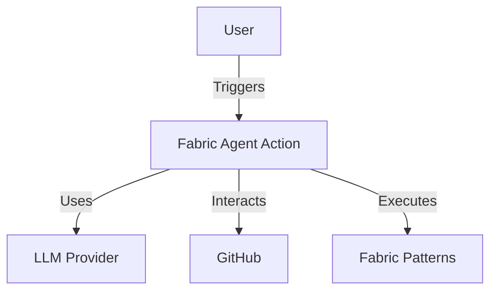
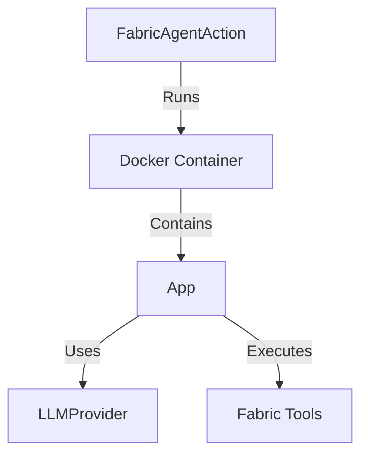
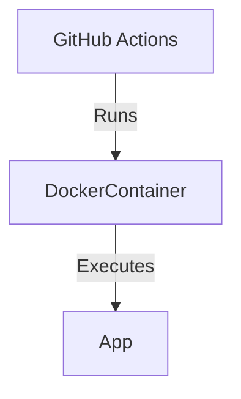
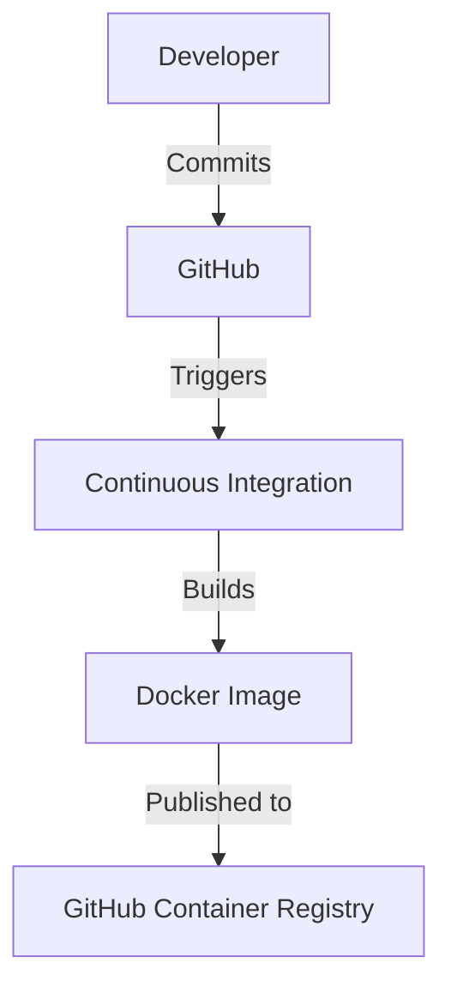

# Fabric Agent Action Design Document

## Business Posture

The Fabric Agent Action is designed to automate complex workflows using an agent-based approach, leveraging Fabric Patterns and Large Language Models (LLMs). The primary business goal is to provide seamless integration into existing workflows, supporting multiple LLM providers, and offering configurable agent behavior. The key business risks include unauthorized usage leading to increased API costs and potential misuse of the action in public repositories.

## Security Posture

### Existing Security Controls

- **Security Control**: Access control patterns are implemented to prevent unauthorized usage, as described in the README under the "Security" section.
- **Security Control**: Environment variables for API keys are required, ensuring that sensitive information is not hardcoded.
- **Security Control**: The Dockerfile and entrypoint script are configured to run with minimal permissions and ensure secure execution.

### Accepted Risks

- **Accepted Risk**: The action can be triggered by comments in public repositories, which may lead to unintended API usage if not properly controlled.

### Recommended Security Controls

- **Security Control**: Implement rate limiting to prevent excessive API calls.
- **Security Control**: Add logging and monitoring to detect and respond to unauthorized access attempts.

### Security Requirements

- **Authentication**: Use GitHub secrets for storing API keys securely.
- **Authorization**: Implement checks to ensure only authorized users can trigger the action.
- **Input Validation**: Validate inputs to the action to prevent injection attacks.
- **Cryptography**: Use secure methods for handling and storing API keys.

## Design

### C4 Context

#### Context Diagram Elements

| Name              | Type       | Description                                      | Responsibilities                                      | Security Controls                                      |
|-------------------|------------|--------------------------------------------------|-------------------------------------------------------|--------------------------------------------------------|
| User              | External   | The user who triggers the GitHub Action           | Initiates workflows                                   | N/A                                                    |
| Fabric Agent Action | System     | The GitHub Action that automates workflows       | Executes Fabric Patterns using LLMs                    | Access control patterns, environment variable usage    |
| LLM Provider      | External   | The provider of Large Language Models            | Provides LLM capabilities                             | API key authentication                                 |
| GitHub            | External   | The platform hosting the repository              | Hosts workflows and triggers actions                   | GitHub secrets for API keys                            |
| Fabric Patterns   | Component  | The patterns used by the action                  | Executes specific tasks based on patterns              | N/A                                                    |

### C4 Container

#### Container Diagram Elements

| Name            | Type       | Description                                      | Responsibilities                                      | Security Controls                                      |
|-----------------|------------|--------------------------------------------------|-------------------------------------------------------|--------------------------------------------------------|
| Docker Container| Container  | The container running the GitHub Action          | Isolates the execution environment                     | Minimal permissions, secure configuration              |
| App             | Component  | The main application logic                       | Manages execution of Fabric Patterns                   | Input validation, logging                              |
| LLM Provider    | Component  | Provides access to LLMs                          | Handles LLM interactions                               | API key authentication                                 |
| Fabric Tools    | Component  | Executes specific Fabric Patterns                | Provides pattern execution capabilities                | N/A                                                    |

### Deployment

The Fabric Agent Action is deployed as a Docker container within a GitHub Actions workflow. It can be triggered by various GitHub events such as issue comments, pull requests, and scheduled events.

#### Deployment Diagram Elements

| Name            | Type       | Description                                      | Responsibilities                                      | Security Controls                                      |
|-----------------|------------|--------------------------------------------------|-------------------------------------------------------|--------------------------------------------------------|
| GitHub Actions  | Platform   | The platform executing the workflow              | Triggers and manages workflow execution                | GitHub secrets for API keys                            |
| Docker Container| Container  | The container running the GitHub Action          | Isolates the execution environment                     | Minimal permissions, secure configuration              |
| App             | Component  | The main application logic                       | Manages execution of Fabric Patterns                   | Input validation, logging                              |

### Build

The project is built using Poetry for dependency management and is tested using pytest. The build process includes security checks with Bandit and type checking with MyPy. The Docker image is built and published to the GitHub Container Registry.

## Risk Assessment

- **Critical Business Process**: Automating workflows using Fabric Patterns and LLMs.
- **Data Sensitivity**: API keys and potentially sensitive workflow inputs.

## Questions & Assumptions

- **Questions**:
  - How are API keys rotated and managed securely?
  - What is the expected load and how will rate limiting be implemented?
- **Assumptions**:
  - The action will primarily be used in private repositories.
  - Users will configure access control patterns as recommended.