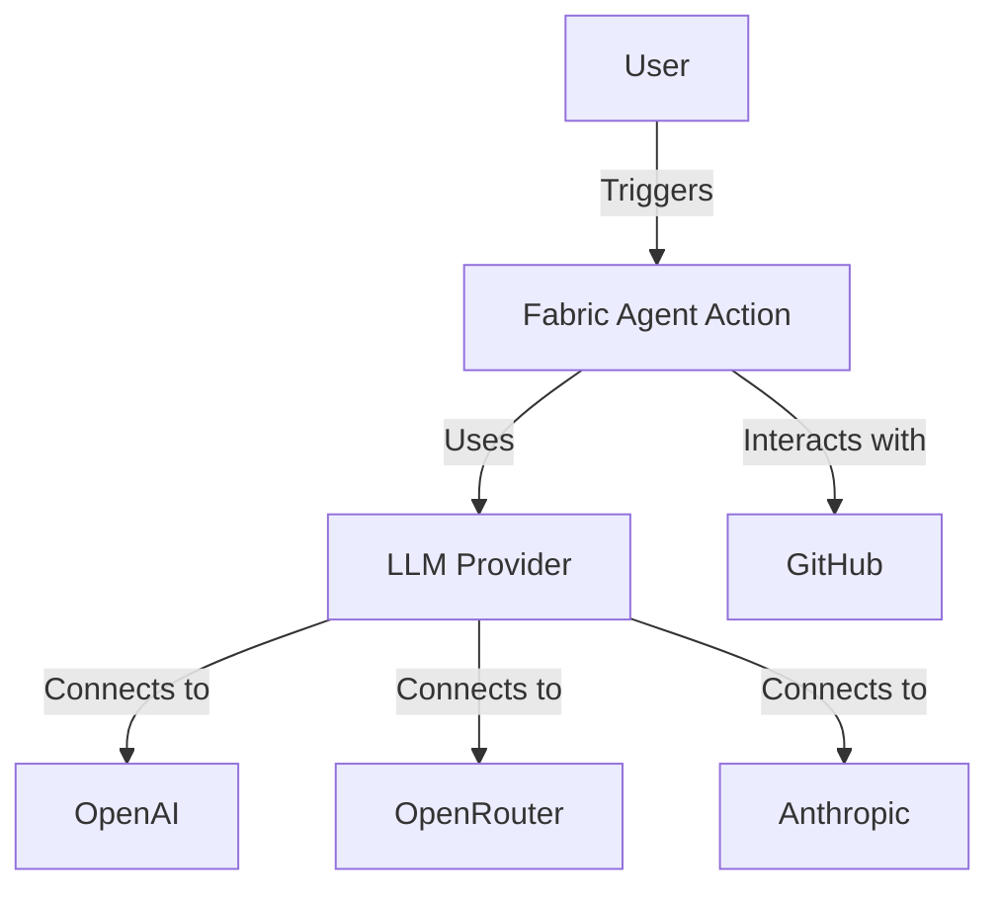
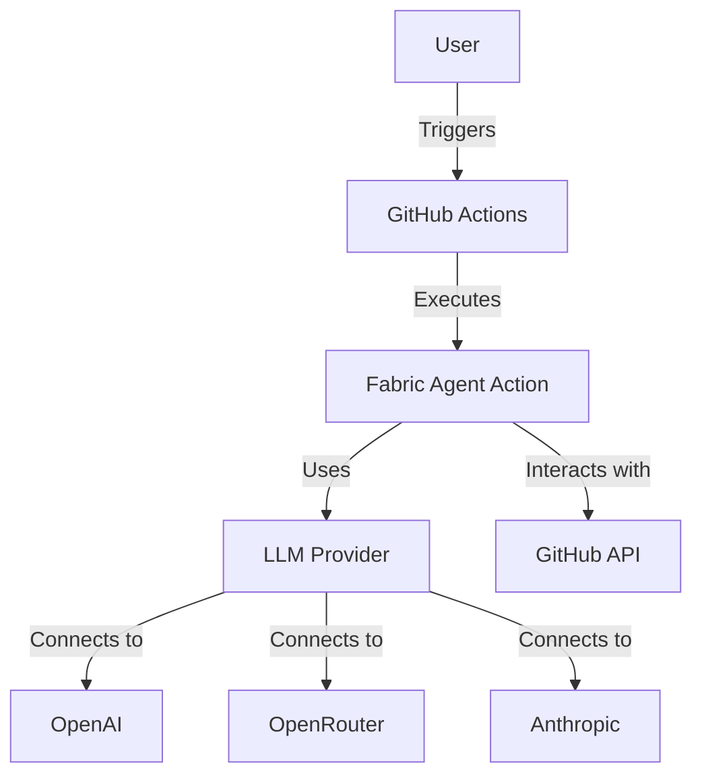
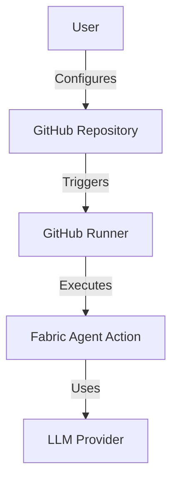
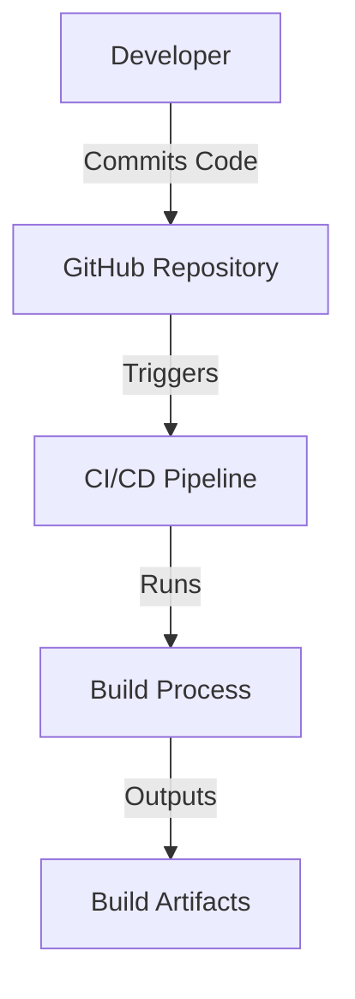

# Fabric Agent Action Design Document

## Business Posture

### Business Priorities and Goals
The Fabric Agent Action project aims to automate complex workflows using an agent-based approach by leveraging Fabric Patterns. The primary business goals include:
- Seamless integration into existing workflows.
- Support for multiple LLM providers (OpenAI, OpenRouter, Anthropic).
- Configurable agent behavior to suit various workflow needs.
- Flexible pattern management to optimize performance and comply with model limitations.

### Business Risks
- Unauthorized usage leading to increased API costs.
- Integration challenges with existing workflows.
- Dependence on third-party LLM providers for functionality.

## Security Posture

### Existing Security Controls
- **Security Control**: Access control patterns are implemented to prevent unauthorized usage, as described in the README under the "Security" section.
- **Security Control**: Environment variables for API keys are required, ensuring that sensitive information is not hardcoded.
- **Security Control**: CI/CD pipeline includes security checks using Bandit for static analysis of Python code.

### Accepted Risks
- **Accepted Risk**: Dependence on third-party LLM providers, which may have their own security vulnerabilities.
- **Accepted Risk**: Potential exposure of API keys if not properly managed in the repository's secrets.

### Recommended Security Controls
- **Security Control**: Implement rate limiting to prevent abuse of the action.
- **Security Control**: Use encryption for sensitive data in transit and at rest.

### Security Requirements
- **Authentication**: Use GitHub secrets for storing API keys securely.
- **Authorization**: Implement checks to ensure only authorized users can trigger the action.
- **Input Validation**: Validate inputs to the action to prevent injection attacks.
- **Cryptography**: Use secure methods for handling API keys and other sensitive data.

## Design

### C4 Context

| Name              | Type       | Description                                      | Responsibilities                          | Security Controls                                      |
|-------------------|------------|--------------------------------------------------|-------------------------------------------|--------------------------------------------------------|
| User              | External   | The user who triggers the GitHub Action          | Initiates workflows                       | N/A                                                    |
| FabricAgentAction | Component  | The GitHub Action leveraging Fabric Patterns     | Executes workflows using LLMs             | Access control patterns, API key management            |
| LLMProvider       | Component  | Provides access to different LLMs                | Connects to LLMs for processing requests  | API key management                                     |
| GitHub            | External   | GitHub platform where the action is hosted       | Hosts the action and manages workflows    | GitHub's built-in security features                    |
| OpenAI            | External   | LLM provider                                     | Provides LLM services                     | API key management, third-party security               |
| OpenRouter        | External   | LLM provider                                     | Provides LLM services                     | API key management, third-party security               |
| Anthropic         | External   | LLM provider                                     | Provides LLM services                     | API key management, third-party security               |

### C4 Container

| Name              | Type       | Description                                      | Responsibilities                          | Security Controls                                      |
|-------------------|------------|--------------------------------------------------|-------------------------------------------|--------------------------------------------------------|
| User              | External   | The user who triggers the GitHub Action          | Initiates workflows                       | N/A                                                    |
| GitHubActions     | Container  | GitHub Actions platform                          | Executes the Fabric Agent Action          | GitHub's built-in security features                    |
| FabricAgentAction | Container  | The GitHub Action leveraging Fabric Patterns     | Executes workflows using LLMs             | Access control patterns, API key management            |
| LLMProvider       | Container  | Provides access to different LLMs                | Connects to LLMs for processing requests  | API key management                                     |
| GitHubAPI         | Container  | GitHub API                                       | Provides API for interacting with GitHub  | GitHub's built-in security features                    |
| OpenAI            | External   | LLM provider                                     | Provides LLM services                     | API key management, third-party security               |
| OpenRouter        | External   | LLM provider                                     | Provides LLM services                     | API key management, third-party security               |
| Anthropic         | External   | LLM provider                                     | Provides LLM services                     | API key management, third-party security               |

### Deployment

The Fabric Agent Action is deployed as a GitHub Action, which can be executed in any GitHub repository. The deployment involves the following steps:

1. The user configures the action in their repository's workflow YAML file.
2. The action is triggered by events such as push, pull request, or issue comment.
3. The action runs in a GitHub-hosted runner, executing the specified workflows.

| Name              | Type       | Description                                      | Responsibilities                          | Security Controls                                      |
|-------------------|------------|--------------------------------------------------|-------------------------------------------|--------------------------------------------------------|
| User              | External   | The user who configures the GitHub Action        | Configures workflows                      | N/A                                                    |
| GitHubRepo        | Container  | GitHub repository where the action is configured | Hosts the workflow configuration          | GitHub's built-in security features                    |
| GitHubRunner      | Container  | GitHub-hosted runner                             | Executes the action                       | GitHub's built-in security features                    |
| FabricAgentAction | Container  | The GitHub Action leveraging Fabric Patterns     | Executes workflows using LLMs             | Access control patterns, API key management            |
| LLMProvider       | Container  | Provides access to different LLMs                | Connects to LLMs for processing requests  | API key management                                     |

### Build

The project uses a CI/CD pipeline configured in GitHub Actions to automate the build and testing process. The build process includes:

1. Checking out the repository code.
2. Installing dependencies using Poetry.
3. Running static analysis tools like Ruff and MyPy.
4. Running tests using Pytest.
5. Building and testing the Docker image.
6. Performing security checks using Bandit.

## Risk Assessment

### Critical Business Processes
- Automating complex workflows using Fabric Patterns.
- Integrating with multiple LLM providers to provide flexible and intelligent automation.

### Data Sensitivity
- API keys for LLM providers are sensitive and must be protected.
- Workflow configurations and inputs may contain sensitive business logic or data.

## Questions & Assumptions

### Questions
1. How are API keys managed and rotated to ensure security?
2. What are the specific use cases for each agent type (router, react, react_issue, react_pr)?

### Assumptions
1. The user has configured the necessary API keys in their GitHub repository secrets.
2. The action is primarily used in private repositories to minimize exposure to unauthorized users.
3. The LLM providers have their own security measures in place to protect data and API usage.