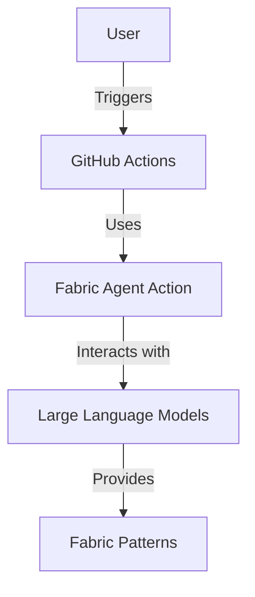
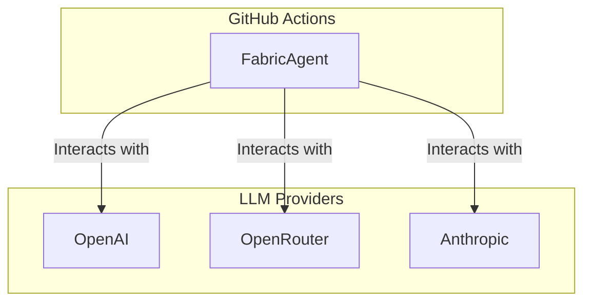
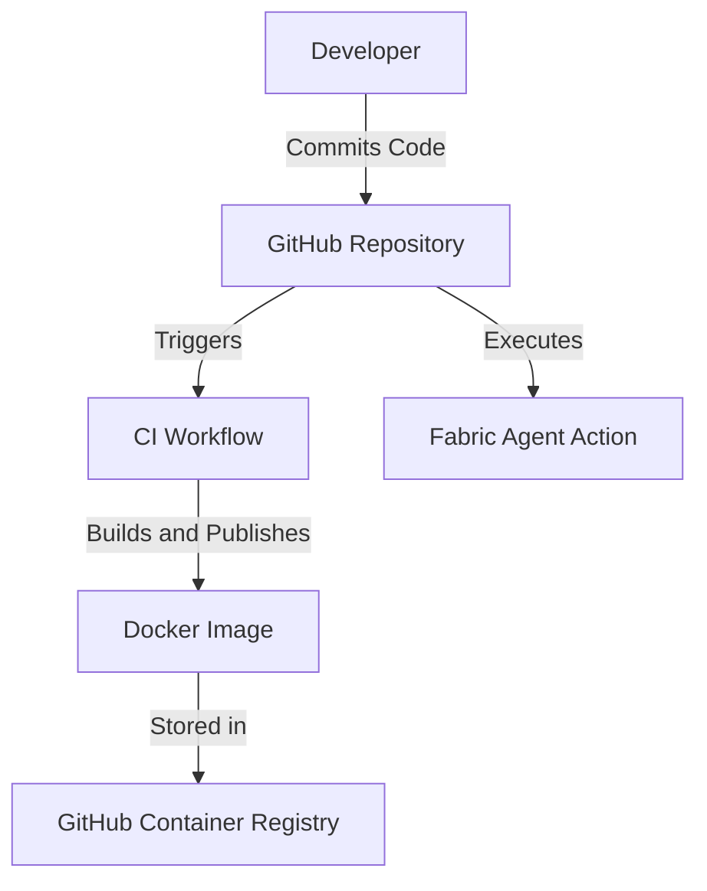
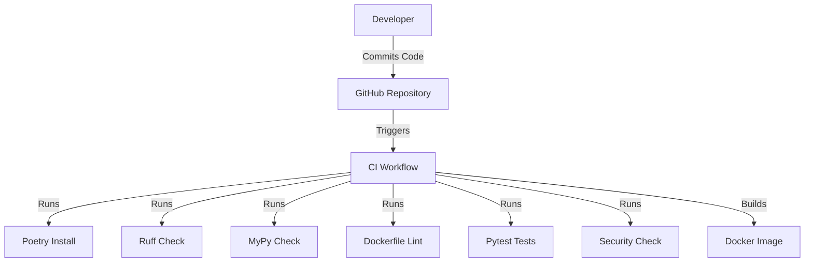

# Fabric Agent Action Design Document

## Business Posture

### Business Priorities and Goals
The Fabric Agent Action project aims to automate complex workflows using an agent-based approach within GitHub Actions. It leverages Fabric Patterns to intelligently select and execute tasks using Large Language Models (LLMs). The primary business goals include:
- Seamless integration into existing workflows.
- Support for multiple LLM providers (OpenAI, OpenRouter, Anthropic).
- Configurable agent behavior to suit various workflow needs.
- Flexible pattern management to optimize performance and comply with model limitations.

### Business Risks
- Unauthorized usage leading to increased API costs.
- Integration challenges with existing workflows.
- Dependence on third-party LLM providers for functionality.

## Security Posture

### Existing Security Controls
- **Security Control**: Access control patterns are implemented to prevent unauthorized usage, such as checking if the comment author is the repository owner.
- **Security Control**: Environment variables for API keys are required to be set in the repository's secrets to protect sensitive information.
- **Security Control**: CI workflows include security checks using Bandit for static analysis of Python code.

### Accepted Risks
- **Accepted Risk**: Dependence on third-party LLM providers, which may have their own security vulnerabilities.
- **Accepted Risk**: Potential exposure of sensitive data through LLM interactions.

### Recommended Security Controls
- **Security Control**: Implement rate limiting to prevent abuse of the GitHub Action.
- **Security Control**: Use encryption for sensitive data in transit and at rest.

### Security Requirements
- **Authentication**: Use GitHub secrets for API keys to authenticate with LLM providers.
- **Authorization**: Ensure only authorized users can trigger the GitHub Action.
- **Input Validation**: Validate inputs to the action to prevent injection attacks.
- **Cryptography**: Use secure methods for storing and transmitting API keys.

## Design

### C4 Context

#### Context Diagram Elements

| Name          | Type     | Description                                      | Responsibilities                              | Security Controls                                      |
|---------------|----------|--------------------------------------------------|-----------------------------------------------|--------------------------------------------------------|
| User          | Actor    | The person interacting with the GitHub repository | Triggers workflows                            | N/A                                                    |
| GitHub        | System   | GitHub Actions platform                          | Executes workflows                            | Uses GitHub secrets for API keys                        |
| Fabric Agent  | Component| The GitHub Action leveraging Fabric Patterns     | Executes patterns using LLMs                  | Access control patterns, environment variable secrets   |
| LLM           | System   | Large Language Models                            | Provides pattern execution capabilities       | API key authentication                                  |
| Patterns      | Data     | Fabric Patterns used for workflow automation     | Provides automation logic                     | N/A                                                    |

### C4 Container

#### Container Diagram Elements

| Name         | Type       | Description                                      | Responsibilities                              | Security Controls                                      |
|--------------|------------|--------------------------------------------------|-----------------------------------------------|--------------------------------------------------------|
| FabricAgent  | Container  | The GitHub Action leveraging Fabric Patterns     | Executes patterns using LLMs                  | Access control patterns, environment variable secrets   |
| OpenAI       | Container  | OpenAI LLM provider                              | Provides LLM capabilities                     | API key authentication                                  |
| OpenRouter   | Container  | OpenRouter LLM provider                          | Provides LLM capabilities                     | API key authentication                                  |
| Anthropic    | Container  | Anthropic LLM provider                           | Provides LLM capabilities                     | API key authentication                                  |

### Deployment

The Fabric Agent Action is deployed as a GitHub Action, which can be triggered by various GitHub events such as issue comments, pull requests, and pushes. The action is packaged as a Docker container and published to the GitHub Container Registry.

#### Deployment Diagram Elements

| Name         | Type       | Description                                      | Responsibilities                              | Security Controls                                      |
|--------------|------------|--------------------------------------------------|-----------------------------------------------|--------------------------------------------------------|
| Developer    | Actor      | The person writing and committing code           | Commits code to the repository                | N/A                                                    |
| GitHub       | System     | GitHub platform                                  | Hosts repository and triggers workflows       | Uses GitHub secrets for API keys                        |
| CI           | Process    | Continuous Integration workflow                  | Builds and tests code                         | Security checks using Bandit                            |
| Docker       | Artifact   | Docker image of the GitHub Action                | Contains the action logic                     | N/A                                                    |
| GHCR         | Registry   | GitHub Container Registry                        | Stores Docker images                          | N/A                                                    |
| FabricAgent  | Component  | The GitHub Action leveraging Fabric Patterns     | Executes patterns using LLMs                  | Access control patterns, environment variable secrets   |

### Build

The project uses Poetry for dependency management and includes a CI workflow that runs on GitHub Actions. The CI workflow performs the following steps:
- Installs dependencies using Poetry.
- Runs static analysis using Ruff and MyPy.
- Lints the Dockerfile using Hadolint.
- Runs tests using Pytest.
- Builds and tests the Docker image.
- Performs security checks using Bandit.

## Risk Assessment

### Critical Business Processes
- Automating complex workflows using Fabric Patterns and LLMs.
- Seamless integration with existing GitHub workflows.

### Data Sensitivity
- API keys for LLM providers are sensitive and must be protected.
- Workflow inputs and outputs may contain sensitive information.

## Questions & Assumptions

### Questions
1. What are the specific security requirements for each LLM provider?
2. How are API keys managed and rotated?
3. What are the performance implications of using different LLM providers?

### Assumptions
1. The GitHub Action will be used in a secure environment with access control in place.
2. Users have the necessary permissions to set up and manage GitHub secrets.
3. The LLM providers are trusted and have their own security measures in place.