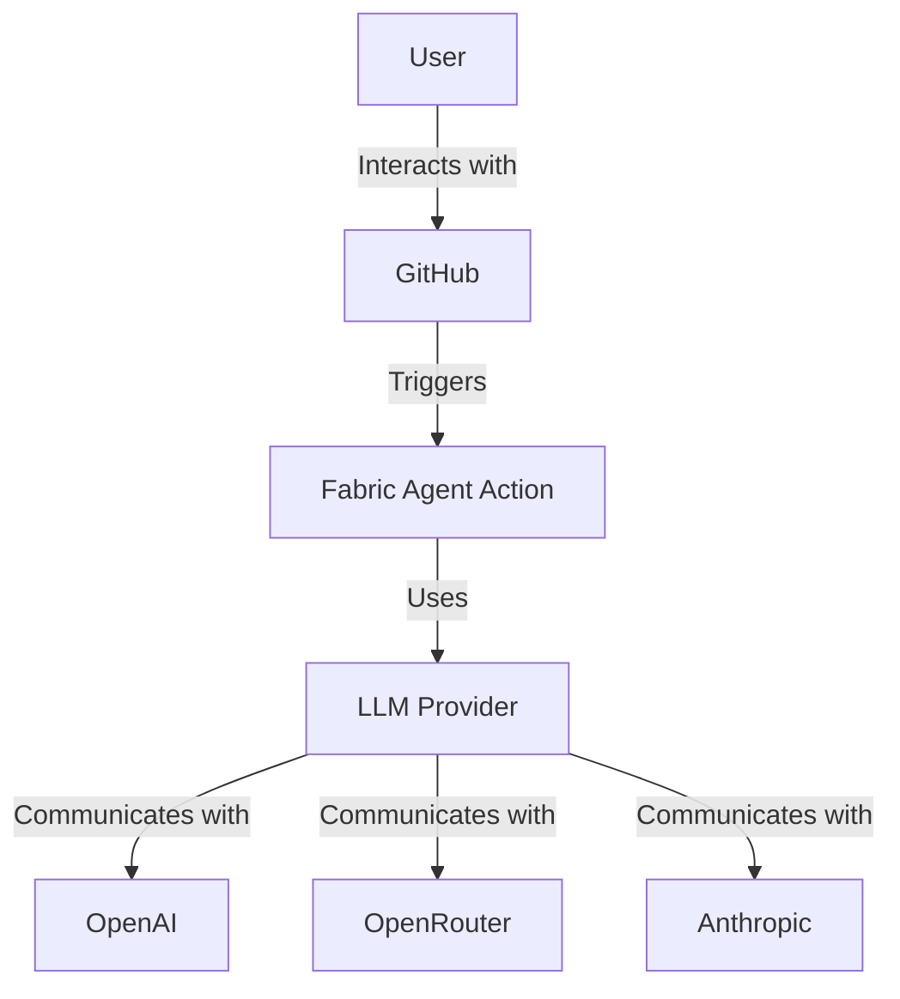
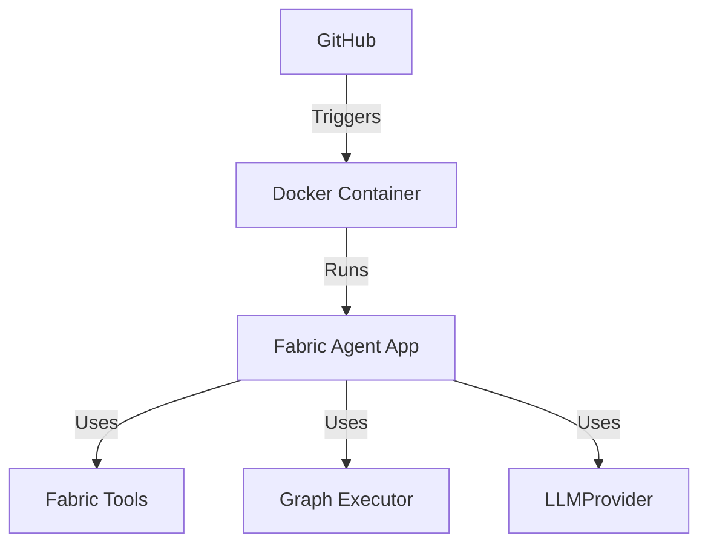
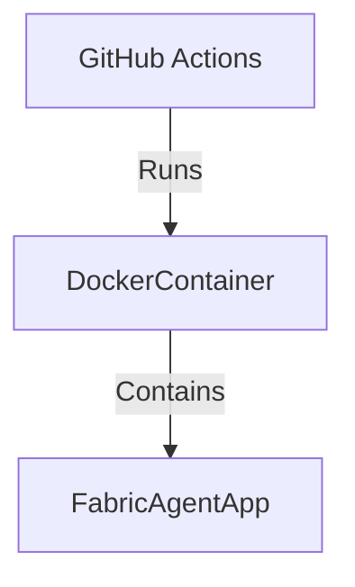
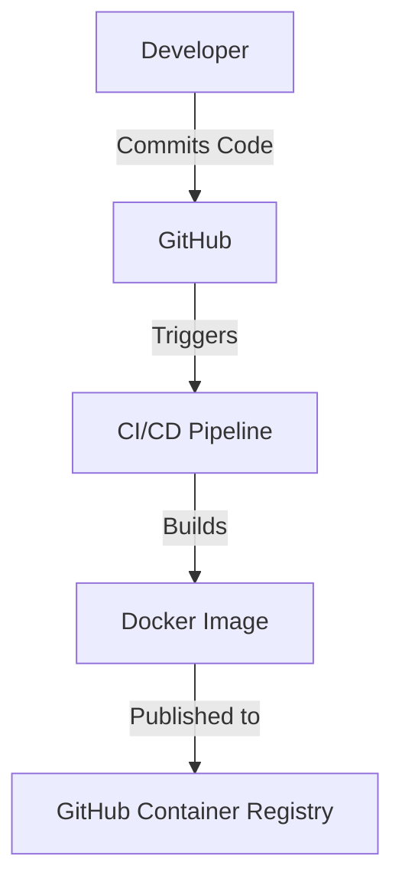

# Fabric Agent Action Design Document

## Business Posture

### Business Priorities and Goals
The Fabric Agent Action project aims to automate complex workflows using an agent-based approach within GitHub Actions. It leverages Fabric Patterns to intelligently select and execute tasks using Large Language Models (LLMs). The primary business goals include:
- Seamless integration into existing workflows.
- Support for multiple LLM providers (OpenAI, OpenRouter, Anthropic).
- Configurable agent behavior to suit various workflow needs.
- Flexible pattern management to optimize performance and comply with model limitations.

### Business Risks
- Unauthorized usage leading to increased API costs.
- Integration challenges with existing workflows.
- Dependence on third-party LLM providers, which may introduce variability in performance and cost.

## Security Posture

### Existing Security Controls
- **Security Control**: Access control patterns are implemented to prevent unauthorized usage, such as checking the comment author in GitHub workflows.
- **Security Control**: Environment variables for API keys are stored securely in GitHub secrets.
- **Security Control**: Bandit is used for security checks during the CI process.

### Accepted Risks
- **Accepted Risk**: Potential exposure to API costs due to misuse or misconfiguration.
- **Accepted Risk**: Dependence on third-party LLM providers for core functionality.

### Recommended Security Controls
- **Security Control**: Implement rate limiting to prevent excessive API usage.
- **Security Control**: Add logging and monitoring for API usage to detect anomalies.

### Security Requirements
- **Authentication**: Use GitHub secrets for storing API keys securely.
- **Authorization**: Implement checks to ensure only authorized users can trigger actions.
- **Input Validation**: Validate inputs to the action to prevent injection attacks.
- **Cryptography**: Ensure secure transmission of API keys and other sensitive data.

## Design

### C4 Context

| Name              | Type       | Description                                      | Responsibilities                                      | Security Controls                                      |
|-------------------|------------|--------------------------------------------------|-------------------------------------------------------|---------------------------------------------------------|
| User              | Actor      | The end user interacting with GitHub workflows.  | Initiates workflows and provides input.                | N/A                                                     |
| GitHub            | System     | GitHub platform hosting the repository.          | Hosts workflows and triggers actions.                  | Uses GitHub secrets for secure storage of API keys.     |
| FabricAgentAction | Component  | The GitHub Action leveraging Fabric Patterns.    | Executes workflows using LLMs and Fabric Patterns.     | Implements access control patterns in workflows.        |
| LLMProvider       | Component  | Provides access to various LLMs.                 | Facilitates communication with LLM services.           | Requires API keys stored securely in environment.       |
| OpenAI            | External   | LLM service provider.                            | Provides LLM capabilities for executing patterns.      | API key required for access.                            |
| OpenRouter        | External   | LLM service provider.                            | Provides LLM capabilities for executing patterns.      | API key required for access.                            |
| Anthropic         | External   | LLM service provider.                            | Provides LLM capabilities for executing patterns.      | API key required for access.                            |

### C4 Container

| Name              | Type       | Description                                      | Responsibilities                                      | Security Controls                                      |
|-------------------|------------|--------------------------------------------------|-------------------------------------------------------|---------------------------------------------------------|
| DockerContainer   | Container  | Docker container running the action.             | Hosts the Fabric Agent App and its dependencies.       | Uses Docker security best practices.                    |
| FabricAgentApp    | Component  | Main application logic for the action.           | Executes workflows and manages interactions with LLMs. | Implements logging and error handling.                  |
| FabricTools       | Component  | Manages Fabric Patterns and their execution.     | Provides tools for executing specific patterns.        | Validates and filters patterns based on configuration.  |
| GraphExecutor     | Component  | Executes state graphs for agent workflows.       | Manages the flow of execution for agent tasks.         | Ensures proper handling of message states.              |

### Deployment

The Fabric Agent Action is deployed as a Docker container within GitHub Actions. It can be triggered by various GitHub events such as issue comments, pull requests, and scheduled workflows.

| Name              | Type       | Description                                      | Responsibilities                                      | Security Controls                                      |
|-------------------|------------|--------------------------------------------------|-------------------------------------------------------|---------------------------------------------------------|
| GitHubActions     | Platform   | GitHub Actions platform.                         | Orchestrates the execution of workflows.               | Uses GitHub secrets for secure storage of API keys.     |
| DockerContainer   | Container  | Docker container running the action.             | Hosts the Fabric Agent App and its dependencies.       | Uses Docker security best practices.                    |
| FabricAgentApp    | Component  | Main application logic for the action.           | Executes workflows and manages interactions with LLMs. | Implements logging and error handling.                  |

### Build

The project uses GitHub Actions for CI/CD, with workflows defined for building, testing, and publishing the Docker image. Security checks are integrated into the build process using tools like Bandit.

## Risk Assessment

### Critical Business Processes
- Automating workflows using LLMs to improve efficiency and reduce manual effort.
- Ensuring secure and reliable execution of GitHub Actions.

### Data Sensitivity
- API keys for LLM providers are sensitive and must be protected.
- Workflow inputs and outputs may contain sensitive information depending on the use case.

## Questions & Assumptions

### Questions
1. What are the specific use cases and workflows that will be automated using this action?
2. How will the project handle updates to Fabric Patterns and LLM models?
3. What are the expected usage patterns and potential API costs?

### Assumptions
1. The project will primarily be used within GitHub Actions workflows.
2. Users will have the necessary API keys and permissions to access LLM providers.
3. The project will be maintained and updated to support new patterns and models as they become available.